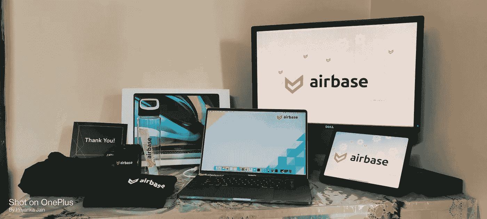

# 空军基地面试经历

> 原文：<https://medium.com/javarevisited/airbase-interview-experience-c09a0e3423e1?source=collection_archive---------2----------------------->

在本帖中，我将分享我在[空军基地](https://www.airbase.com/)的采访经历。我接受[空军基地的](https://www.airbase.com/)采访已经一个月了。我最近从 Zomato 做了一个切换，我在那里做后端的 SDE-1。在更多的麻烦之前，让我们跳到体验。

# 介绍电话

一个平常的日子，我收到了招聘人员发来的电子邮件，“ ***普里扬卡，你被邀请参加空军基地的面试！*** ”。我读了关于这家公司和 glassdoor 的评论:P 他们相当不错，肯定会吸引你到空军基地工作。所以，我预定了一个 15 分钟变焦通话的时段。这只是一个介绍电话，让你了解我、我的兴趣和我的职业期望。
这是一个基本的介绍环节，目的是检查您是否有空参加接下来的环节。

# 招聘经理回合

第二轮是 HM 回合。首先是引言和我的职业生涯。比如为什么我开始做 ML 工程师，然后转到[后端](https://javarevisited.blogspot.com/2021/05/top-10-backend-frameworks-fullstack.html)以及为什么我从 Zomato 转行。基本上，这一轮涵盖了我简历上的所有内容。这一轮预计会有一些我的简历中的技术问题，但由于职业和技术堆栈的讨论，我们没有时间了。这是我了解空军基地文化的一个好机会。他们如何工作以及他们所期望的一切。

# 编码回合

第三轮是技术轮，你需要用你喜欢的语言写代码。我选择了 [Python](/javarevisited/10-best-python-certification-courses-from-coursera-4576890eb6b3) 。这个问题不是数据结构和算法的问题。这是一个基于现实世界的问题。他们期待一个可执行的代码或接近它。面试官继续在问题陈述中做微小的改变，以检查你的代码是否足够模块化来处理所有变化的场景。

# 技术设计

这是一个[低级系统设计问题](/javarevisited/25-software-design-interview-questions-to-crack-any-programming-and-technical-interviews-4b8237942db0)回合。这里我有一个开放性的问题来设计一组特定的功能。这些问题不像设计一个 FB 新闻订阅或 dropbox。在空军基地工作时，你可以找到更多的问题陈述。

在我的例子中，面试官向我展示了一个仪表盘，并问我如何实现这个仪表盘的特定功能。在这一轮，没有正确的解决方案，你可能有不同的方法，你需要向面试官传达，为什么你认为这是正确的方法。

# 工程价值

这是最后一轮，首席执行官或工程主管将检查你是否适合这种文化。他们将讨论他们在空军基地遵循的工程价值观。并且具有所有值的文档将在该轮之前被共享。

最后，我被选中并加入了空军基地。在空军基地的面试经历真是太棒了。所有的回合都包括对我在空军基地的日常工作有用的问题或讨论。

此外，如果你想申请工作，你可以在这里申请，或者需要推荐人，你可以通过我的任何社交媒体账号联系我。

> *感谢阅读！如果你喜欢它，请鼓掌，评论(评论或质疑)并分享它😄*
> 
> *如果仍有疑问，欢迎评论或直接联系我。*
> 
> *你可以在*[*Github*](https://github.com/Priya997)*，*[*Linkedin*](https://www.linkedin.com/in/priyanka997/)*，*[*Twitter*](https://twitter.com/priyankajain997)*上和我联系😄*

更多内容，请点击下面的“给我买杯咖啡”图标支持我。

