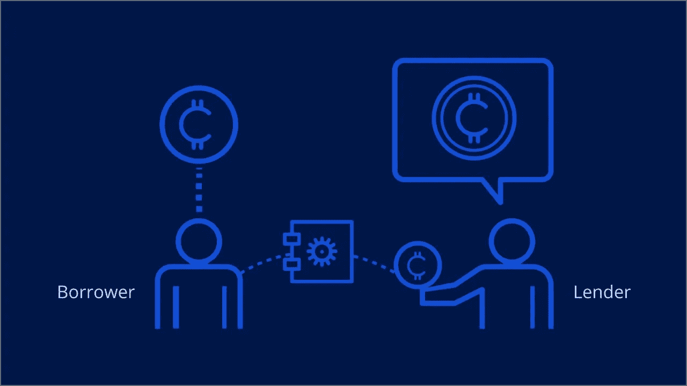

# 所有关于加密贷款

> 原文：<https://medium.com/javarevisited/all-about-crypto-loans-13d18ceb9f9c?source=collection_archive---------1----------------------->

人们有多种选择来投资、交易、借贷或持有加密货币“亲爱的生活”(HODL)。HODL 是某些加密所有者的长期战略，这意味着购买并持有加密货币，不受短期中断的影响。尽管人们 HODL 加密资产以避免丢失，但这不是一个明智的方法，因为它不能产生任何收入。投资或交易加密货币可以产生收益，但它有其风险因素。然而，借给有需要的人风险最小，是提高收入的有效途径。

## 什么是加密贷款？

顾名思义，加密贷款就是[加密货币](https://javarevisited.blogspot.com/2022/01/5-best-courses-to-learn-cryptocurrency.html)的借贷。与传统贷款不同，在加密贷款中，你可以抵押你的加密资产来换取[数字或法定货币。](https://www.leewayhertz.com/all-about-crypto-loans/)贷款人获得的利息支付被称为加密股息。如果借款人无法偿还，以[加密货币](https://www.courserevisited.com/2022/03/top-10-courses-to-learn-trade.html)形式支付的抵押品将充当证券。

一旦贷款期限开始，借款人就不能交易用作抵押品的加密货币。借款人需要在还款期限内偿还该金额作为 EMIs，并支付利息。一旦支付了总额，借款人就可以提取抵押的加密货币。

类似地，另一种选择是，客户可以借入[加密货币](https://savingsfunda.blogspot.com/2022/05/10-best-courses-to-learn-cryptocurrency.html)并将法定货币作为抵押品。

**加密贷款的好处包括:**

*   未经许可的交流
*   没有实体银行账户
*   没有地理限制
*   低交易费用和良好的利率
*   贷方的被动收入
*   多元化贷款组合
*   不需要信用检查
*   借款人不会失去他们的加密贷款的所有权

**不同类型的加密贷款**

加密贷款分为两种类型，根据谁或什么处理贷款，这是

**1。CeFi 加密贷款**

CeFi 是集中金融加密贷款的首字母缩写。当局或企业处理 CeFi [加密贷款](https://www.leewayhertz.com/all-about-crypto-loans/)。CeFi 贷款采用了 DeFi 贷款的一些优点，但更像是一种复杂程度更低的传统贷款。当客户想借钱时，管理机构实施了解你的客户(KYC)，双方交换加密资产和法定货币。客户还必须抵押他们的加密资产，直到还款期结束。

它几乎不需要任何文书工作，很容易处理。CeFi 贷款还提供有吸引力的利率和与加密贷款人的协议。

**2。DeFi 加密贷款**

分散融资或 DeFi 加密贷款没有中央授权，而是使用智能合同。智能合同是自动执行的合同，当贷方和客户满足交易的所有标准时被激活。交易细节被记录在底层技术中，即使是贷款人或借款人也不能更改。

DeFi 旨在提供一个开源、透明和无许可的金融服务环境。

【DeFi 是如何工作的？

DeFi 在没有第三方干预的情况下工作，但使用对等网络来实现交易。它由[区块链技术](/javarevisited/7-free-courses-to-learn-blockchain-in-2020-764e66b47ebe)驱动，区块链技术充当数字账本，其中计算机网络协同工作以登记交易细节。由于透明和准确，这些交易的记录被复制到网络中的所有计算机并由它们核实。

任何人都可以在 DeFi 平台上创建一个帐户并存入他们的资产后，将他们的钱或加密资产借给客户。通常几个用户会将他们的资产放在一起进行借贷。当出借人和借款人达成共识时，智能合约启动，这是[不可改变的](/javarevisited/how-to-create-an-immutable-list-list-and-map-in-java-5ac1254c128)。

借款人可以寻找利息适合他们的贷款，然后提供抵押品。

## **好处**

DeFi 贷款有以下优势，

*   **透明度**

由于 DeFi 建立在[区块链技术](/javarevisited/best-blockchain-courses-and-certification-in-2020-63729f8f04d0)之上，并由智能合约触发，所有的交易细节都由网络中的所有计算机记录、复制和验证。网络中的所有参与者都可以看到交易细节，没有保密的余地。

*   **流动性**

几个用户可以将他们的资产集中在一个 DeFi 平台上，并利用它来提供更多的贷款。

*   **民主**

在没有中央权威的情况下，用户对贷款协议的修改进行投票。许多这样的协议为用户提供金融控股公司治理令牌，赋予他们投票权。

*   **效率**

与传统贷款不同，DeFi 贷款不需要复杂的程序和文书工作。由于不需要第三方，借款速度也提高了。

*   **不变性**

[区块链](https://javarevisited.blogspot.com/2022/06/top-5-websites-to-learn-blockchain-in.html)中记录的数据库，即使是出借人和借款人也永远无法更改。

*   **无权限**

任何地方的任何人都可以在没有任何许可的情况下参与加密贷款。

*   **不可信**

贷款人在贷款时不必对借款人采取谨慎态度，因为如果发生任何违约，智能合同会采取必要的行动。

**流行的 DeFi 借贷平台/协议**

**制造者**

Maker 是一个未经许可的 [DeFi 借贷平台](https://www.leewayhertz.com/how-defi-lending-works/)，用户可以在这里借用戴代币，这是第一个建立在[以太坊](https://javarevisited.blogspot.com/2021/11/top-5-courses-to-learn-ethereum-for.html)上的分散稳定硬币。任何用户都可以通过以太网(ETH)等数字资产作为抵押，在该平台上获得贷款。开始时不需要 KYC 要求。

阿弗

Aave 是一个开源的数字交换平台。它于 2020 年推出，提供稳定和可变的利率。它使用户能够赚取存款利息和借入资产。利率是根据供求关系通过算法计算和调整的。持有代币的用户越多，利息金额就越多。

**复合**

这个 DeFi 协议使用智能合约在[以太坊区块链](https://www.courserevisited.com/2022/03/top-10-ethereum-courses-learn-trade.html)上运行。这是一个没有权限的平台，任何人只要有加密钱包和互联网连接就可以访问它。2020 年，它推出了治理令牌 COMP。每个红利令牌反映了组织中的投票权。

## **结论**

加密贷款改变了人们对贷款的看法。人们不得不等上几天甚至几个月，填写许多表格，从一个办公室到另一个办公室去申请贷款。这是一个非常令人厌倦的过程。但是加密贷款的引入，尤其是 DeFi lending，为这种金融服务带来了许多积极的结果。人们选择加密贷款不必做非常复杂的程序和文书工作，而是可以坐在舒适的家里申请贷款。

此外，DeFi 贷款更安全，更省力。假以时日，它可以改变金融业。