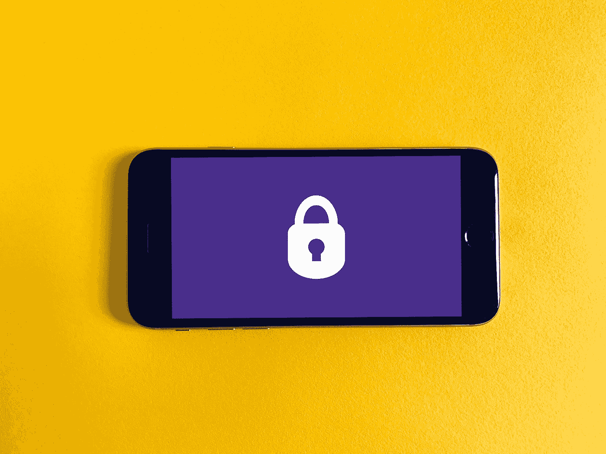

# 关于 Spring 安全基础知识，您需要知道的是

> 原文：<https://medium.com/javarevisited/all-you-need-to-know-about-spring-security-basics-aea98c680d01?source=collection_archive---------0----------------------->

如果你是第一次使用 spring security，并且觉得 spring security 很奇怪。实际上，这不是因为 spring security，而是因为您对 spring security 的了解。在本文中，我们将深入讨论 spring 安全的基本配置。

由[弗兰克](https://unsplash.com/@franckinjapan?utm_source=medium&utm_medium=referral)在 [Unsplash](https://unsplash.com?utm_source=medium&utm_medium=referral) 上拍摄

# 什么是春安？