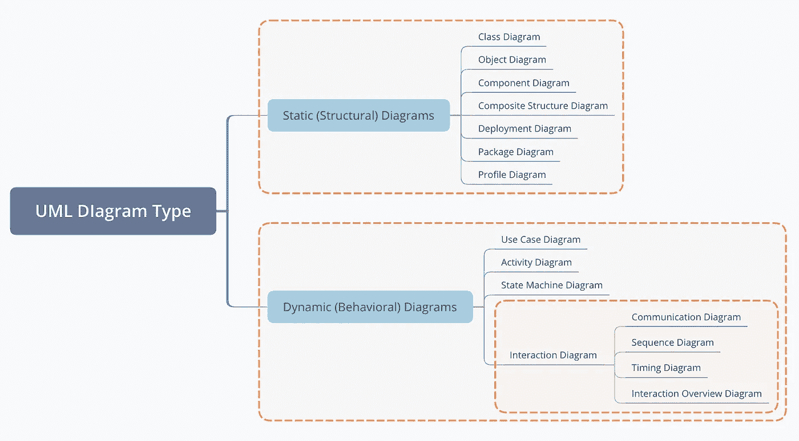
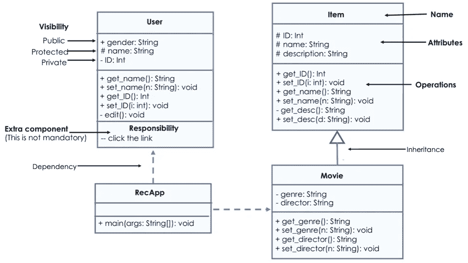
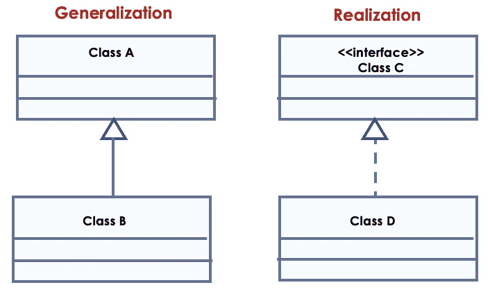
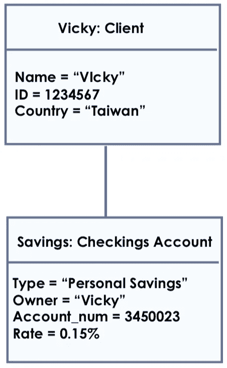
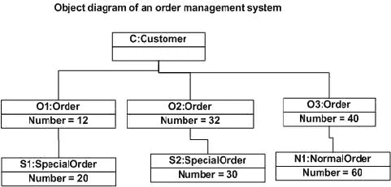
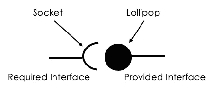
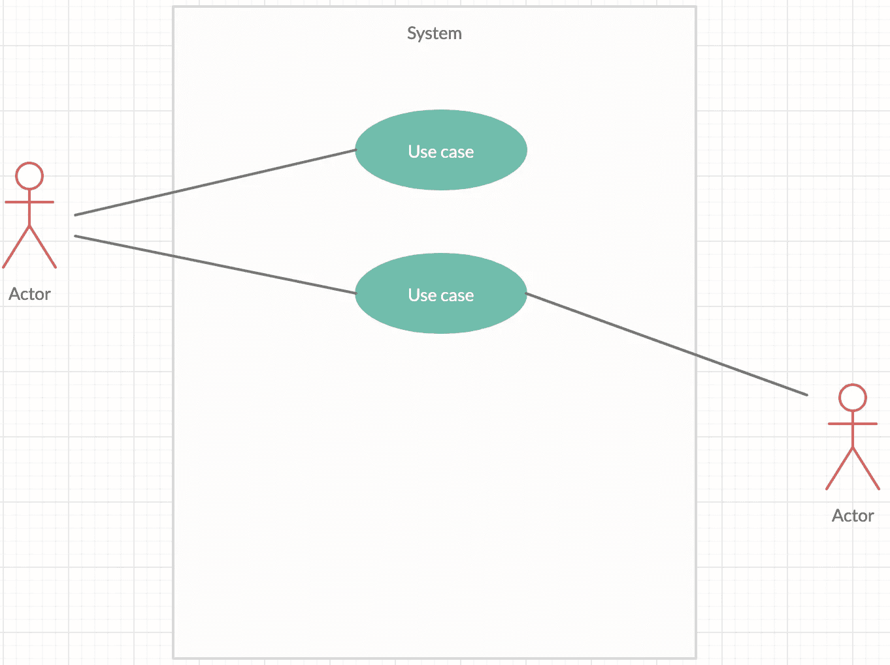
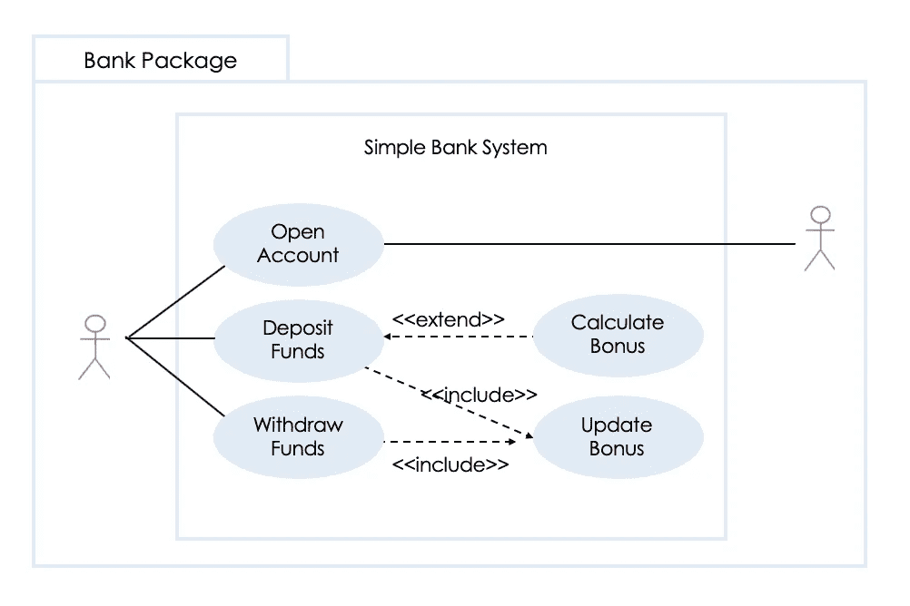
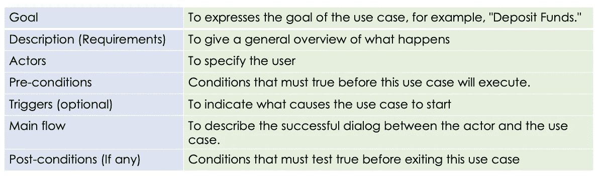

# 关于 UML 图，您所需要知道的

> 原文：<https://medium.com/javarevisited/all-you-need-to-know-about-uml-diagrams-546c9f191a9d?source=collection_archive---------0----------------------->

两种类型的数据建模技术是:

1.  **实体关系(E-R)模型**
2.  **UML(统一建模语言)**


【https://github.com/vicky-playground/resume 

这篇文章将只关注 UML。将涵盖关键领域:

```
1\. What is UML2\. What’s the Difference Between Structural Diagrams and Behavioral Diagrams3\. Class Diagram4\. Object Diagram5\. Component Diagram6\. Use Case Diagram7\. Activity Diagram
```

UML 是统一建模语言的缩写，它就像一个蓝图(或设计计划),使用一组图表来可视化软件建模。它不仅让你彻底评估整个概念，而且确保团队中的每个人都在同一页上。UML 图也是**业务流程建模**的流行技术之一。它是一个**面向对象的表示**图表，描述**角色和系统**之间的关系。UML 有不同的类型，例如用例图、序列图、通信图等等。



UML 图可以被组织成两个不同的组。

# 结构图和行为图

结构图描述了系统的静态方面，它代表了构成主结构的图的那些部分，因此是稳定的。

行为图显示了系统如何“动态”工作，即**系统如何与外部实体和用户交互，如何对输入或事件做出响应，以及在什么约束条件下运行。**

# 类图——系统的鸟瞰图

类图是用于软件应用开发的最重要的 UML 图。类图描述了系统中对象的类型以及它们之间存在的不同类型的关系。

[](https://javarevisited.blogspot.com/2017/07/top-5-books-to-learn-uml-unified-modelling-language-java.html)

类图示例 1


类图示例 2

从上面的图片可以看出，UML 类图的基本元素是:

1.  **类名(s** 应该总是用**粗体**格式 **)**
2.  **属性**
3.  **操作(方法)**



# 对象图—类图的一个实例

对象图可以被认为是类图的一个特例，类图是系统在某个时间点(T1)的详细状态的快照。它可能**在某个时间点包含结构内部对象**的数据值。因为它显示的是实例而不是类，所以它也被称为**实例图**。类图和对象图的区别在于用途，以及它们在特定时间显示的内容。



对象图示例 1



对象图示例 2

# 组件图—模型实现细节

组件图可视化了系统的**实现**视图。


组件图示例

有两种类型的组件接口:提供的接口和需要的接口。



## **提供接口**

从其他方调用并提供服务的实体。

## **所需接口**

调用和使用其他服务的实体。

## 港口

它可以用作“接入点”，将提供的接口和需要的接口连接在一起。

# 用例图——功能建模



作为行为 UML 类型中最著名的图表类型，用例图从用户的角度描述了系统的行为。用例图由四个对象组成。

1.  **参与者**:与系统用例交互的人或事物
2.  **用例**:系统功能的特定部分
3.  **系统**:定义系统中包含哪些功能
4.  **包**:可选的表示一个用例的所有权



用例图示例

## 用例规格

用例就像一个故事，讲述当用户开始使用系统时会发生什么。不提前准备一些要点是无法分享到正确的故事的。这就是用例规格说明出现的原因！这里是标准的用例模板，用于记录用例的详细信息。



用例规格。

## 扩展两个用例之间的关系

顾名思义，**扩展了基本用例，为系统增加了更多功能。**

## 包括两个用例之间的关系

主要目的是**跨多个用例重用公共动作。**

# 活动图——流程建模

活动图以图形化的方式说明了任何组件的工作流程，并描述了用例执行中的步骤，而不是实现。


活动图示例

✍️

```
Since 👏 is free of charge, I’d like to **make 👏 as one of our communication channels.😍** P.S. Holding on clicking the 👏 without lifting your finger can clap in a row.
😉If you just **like this story**, please reward me **1–3** 👏.
😉If you happen to be interested in **this kind of stories**, please reward me **4–6** 👏.
😉If you are **following me and looking forward to my visit** to your story too, please give me **10**👏 to let me know️ ❤ ️
```

[](/javarevisited/5-best-uml-books-and-courses-for-java-programmers-13c551a9235d) [## Java 程序员的 5 本最佳 UML 书籍和课程

### UML 是软件设计的重要工具之一，这些是初学者最好的 UML 书籍和课程…

medium.com](/javarevisited/5-best-uml-books-and-courses-for-java-programmers-13c551a9235d)