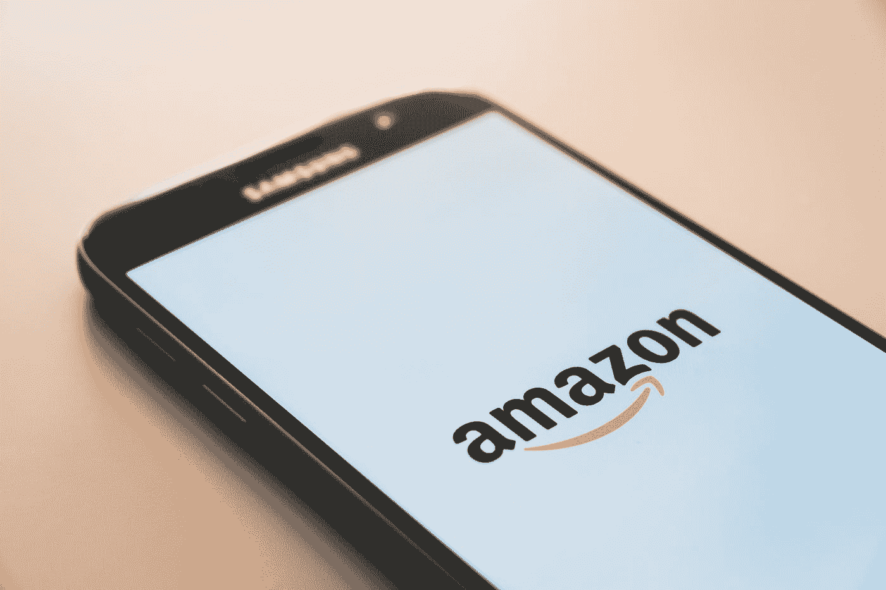
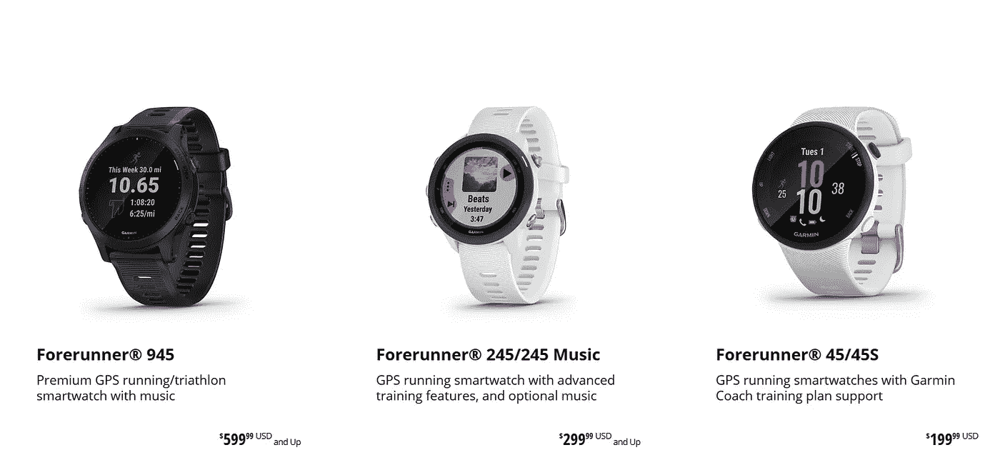
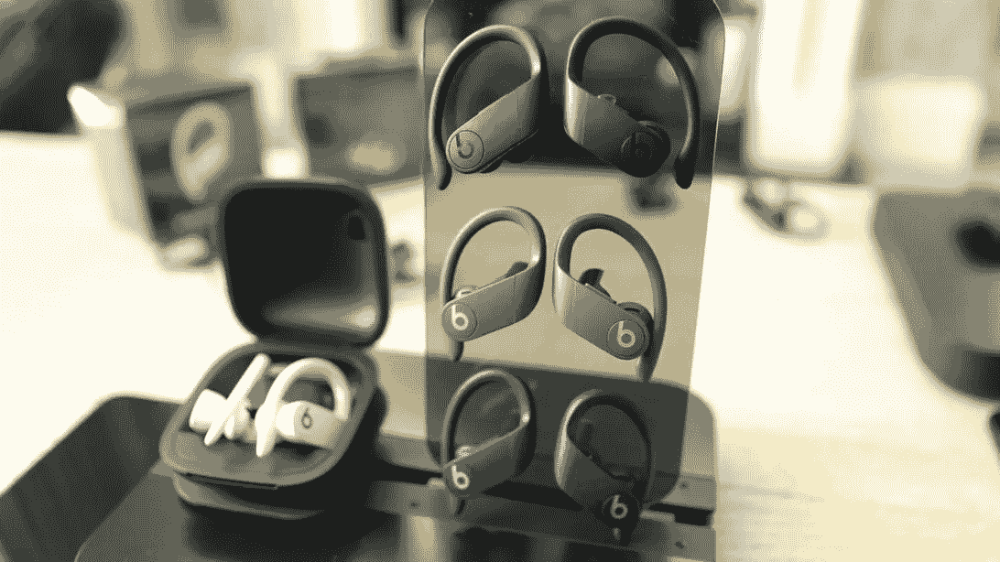
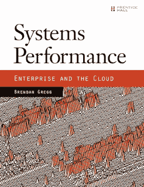
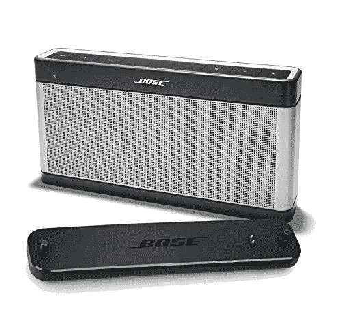

# 程序员在亚马逊 Prime Day 购买的 5 个最佳小工具和礼物

> 原文：<https://medium.com/javarevisited/amazon-prime-day-2019-5-things-programmers-and-techies-can-buy-562eab831f5a?source=collection_archive---------0----------------------->

## 这些是给程序员的最好的小工具，也是你可以在亚马逊 Prime Day 给程序员和开发者买的礼物

克里斯蒂安·威迪格在 [Unsplash](https://unsplash.com?utm_source=medium&utm_medium=referral) 上拍摄的照片

我的许多朋友和同事过去常常等到 11 月才购买书籍、小工具和其他电脑产品，以获得黑色星期五和网络星期一交易的巨大折扣，但你不需要等那么久。亚马逊通过一年一度的 Prime Day 优惠活动将黑色星期五带到了夏季。

亚马逊 Prime day 只不过是一个为期一天(确切地说是一天半，这次是整整两天)的购物盛会，在这里你将获得数千种亚马逊产品的巨大折扣，包括[书籍](https://hackernoon.com/10-data-structure-algorithms-books-every-programmer-should-read-d50487313127)、[游戏](https://javarevisited.blogspot.com/2019/04/top-5-unity-game-development-and.html)、[小工具](/swlh/top-10-java-books-for-programmers-all-time-great-82b0ee0b831a)以及其他电脑和电子产品。所以，如果你想买一台新的笔记本电脑，一部新的智能手机或者一些健身器材，那么这是一个绝佳的机会。在亚马逊 prime day，你会以便宜得多的价格买到很多这样的小玩意。唯一需要注意的是，为了获得全额折扣，**你需要成为亚马逊 prime 会员**，费用大约为每月 12.99 美元或每年 119 美元，这并不昂贵，因为 Prime 会员享有独家折扣，所以你可以节省更多。但是，即使你不是 prime 会员，只是在寻找 prime day 交易，幸运的是，你可以注册亚马逊 prime 的 30 天免费试用。这样，当 2022 年亚马逊优惠日

到来的时候，你就可以准备好第一件事了。如果你是学生，那么东西会更便宜，因为你可以注册[亚马逊优惠学生](https://www.amazon.com/dp/B00DBYBNEE?tag=javamysqlanta-20)，每年大约花费 59 美元。他们还可以免费获得数百万种商品的一日送达服务，包括书籍、CD、电脑和电子产品等。学生可以从 Prime 会员中获得更多，因为前六个月是免费的，他们可以随时取消。如果你是学生，利用你的亚马逊 Prime 学生会员资格，在亚马逊 Prime 日进行半年一次的购物更有意义。现在你知道了什么是亚马逊优惠日，以及你需要利用什么，让我们看看我列出的程序员可以在这个亚马逊优惠日购买的小工具和书籍。

# 2022 年亚马逊黄金日——程序员的最佳技术交易

这里有一些购买书籍和极客喜欢的音乐、游戏和电子产品的好的技术交易。

## **1。** [**买像 Apple Watch、Fitbits 或者 Garmins**](https://www.amazon.com/Apple-Watch-GPS-42mm-Space-Aluminium/dp/B07K387Y7K?tag=javamysqlanta-20) 这样的健身追踪器

体育锻炼对程序员来说非常重要，因为我们大部分时间都坐在电脑、笔记本电脑和电视前。

我并不是建议你一周做两次 100 个俯卧撑、100 个仰卧起坐和 10 公里跑(如果你可以的话，你当然会这样做),但作为一名程序员，你应该稍微活跃一点身体，以提高工作效率。

如果我们不注意健康，我们不会活得很久，这就是为什么我总是激励自己锻炼，拥有像苹果手表、T2、Fitbit 设计或 T4 的可穿戴设备真的很有帮助。它们也是最受欢迎的可穿戴设备，因为它们可以工作。更重要的是，他们的传感器在跟踪步数和活动方面比任何非品牌的 cheapo 健身追踪器都更准确。

> 此外，他们的应用程序更强大，公司也很关心保护你的数据。
> 
> 所以，如果你想在这个黄金日买个小玩意，**买个**[**Apple Watch**](https://www.amazon.com/Apple-Watch-GPS-42mm-Space-Aluminium/dp/B07K387Y7K?tag=javamysqlanta-20)， [**Fitbits**](https://www.amazon.com/Fitbit-Inspire-Fitness-Tracker-included/dp/B07MSYTQNM/?tag=javamysqlanta-20) **或** [**Garmin 可穿戴设备**](https://www.amazon.com/Garmin-v%C3%ADvoactive-Smartwatch-Contactless-Payments/dp/B074KHR3LZ?tag=javamysqlanta-20) **来增强你的健身活动。**

## **2。**[**【Oculus Quest(虚拟现实和游戏耳机)**](https://www.amazon.com/Oculus-Quest-All-Gaming-System-PC/dp/B07HNW68ZC?tag=javamysqlanta-20)

脸书的 Oculus Quest 是 2022 年技术人员最喜欢的设备之一，尤其是如果你像我一样是虚拟现实和游戏爱好者。这款 VR 头戴设备在我第一次尝试的时候就让我刮目相看。它将 VR 体验带到了另一个层次，因为没有电线或 PC，只有一个耳机和控制器，可以将你带到另一个世界。

它还可以让你玩一个广泛的沉浸式 VR 游戏库(像 Beatsaber 和 Super Hot)。

Oculus Quest Quest 是虚拟现实的一项重大突破，因为它不需要一台结实的 PC 或智能手机或外部传感器来跟踪你的头部和手部运动。

## **3。** [**AirPods 或者 Beats Powerbeats Pro**](https://www.amazon.com/Powerbeats3-Wireless-Earphones-Neighborhood-Collection/dp/B0765FPSQ9?tag=javamysqlanta-20)

苹果 AirPods 对几乎所有人来说都是很棒的无线耳塞，我真的很喜欢它们，但如果它们不适合你，我推荐 Beats Powerbeats Pro。

它由与 AirPods 2 相同的**苹果 H1 芯片**驱动，Powerbeats 无缝连接到 iOS 设备，并支持 iOS 和 Mac 设备之间更快的音频切换。

下面是亚马逊上购买这个的 [**链接**](https://www.amazon.com/Powerbeats3-Wireless-Earphones-Neighborhood-Collection/dp/B0765FPSQ9?tag=javamysqlanta-20) **。**

无线耳塞不像 AirPods 那么小巧，但它们确实提供了更好的贴合性、更好的声音和更长的电池寿命(长达 9 小时，而一次充电为 5 小时)。Jabra 还将对其几款流行耳机降价 30%，包括可与 AirPod 媲美的 Elite 65t 。

# **4。系统性能:企业和云—53 美元(节省 11.90 美元)**

这本书在我去年的购买清单上，但是我还不能买。现在，黄金日又给了我一次打折买这本书的机会。

这是了解系统性能并从 CPU、内存、网卡、带宽、云等方面全面了解影响应用性能的所有因素的最佳书籍之一。

这里是在亚马逊上购买这个的 [**链接**](https://www.amazon.com/Systems-Performance-Enterprise-Brendan-Gregg/dp/0133390098/?tag=javamysqlanta-20) **。**

# **5。Bose Soundlink 蓝牙音箱 III——178.01 美元(节省 50 美元)**

如果你像我一样喜欢音乐，那么你也可以看看亚马逊的音乐限量版。为了准备 Prime Day，亚马逊还以 99 便士的价格向 Prime 会员提供四个月的音乐无限量。

下面是亚马逊上买这个的 [**链接**](https://www.amazon.com/Bose-SoundLink-Color-Bluetooth-speaker/dp/B01HETFQKS?tag=javamysqlanta-20) **。**

Bose SoundLink 彩色蓝牙扬声器 II —柔和黑色

# 关于亚马逊初选日 2022 的重要细节

亚马逊 Prime Day 2022 的正式开始时间尚未公布。。这一次，它持续了两天，不像去年的一天半，我的意思是你有整整 48 小时的独家交易。

这比去年多了 6 个小时。请记住，要想在亚马逊优惠日获得任何折扣，你需要成为亚马逊优惠会员。如果你不是，那么你应该在这里注册亚马逊 Prime 的[**30 天免费试用**](http://amazon.com/primeday?tag=javamysqlanta-20) 。

关于亚马逊初选日 2022 的一些关键细节

1.  黄金日交易日期是 TBD
2.  2022 年黄金日可能持续 48 小时。
3.  Prime Day Twitch 交易和 Prime Day Whole Foods 交易已经开始。
4.  你需要亚马逊 Prime 或亚马逊学生会员才能获得这些优惠

这就是亚马逊优惠日的全部内容。这是一个很好的机会来购买你长期珍视的产品，如脸书 Oculus Quest，Garmin watch，Bose 蓝牙扬声器或一本你一直想读的书。

如果你是亚马逊 Prime 会员，那么你已经知道成为 Prime 会员的好处，但如果你不是，我建议你试试亚马逊 Prime 的 [**30 天试用期，并查看 prime day 交易。**](http://amazon.com/primeday?tag=javamysqlanta-20)

<http://amazon.com/primeday?tag=javamysqlanta-20>  

虽然你只需要小心一点，但这很容易上瘾，一旦你登录购买一件商品，你最终会购买 10 多件商品。以前我提前几个月给孩子买生日礼物和回礼的时候就发生过。

其他**文章**可以给你提供更多关于给你的程序员朋友或同事买什么的灵感:

1.  [给你的程序员朋友的礼物创意](http://javarevisited.blogspot.sg/2015/12/3-gifts-for-your-java-programmer.html)
2.  [给技术人员的 10 个绝妙礼物创意](https://hackernoon.com/10-awesome-gift-ideas-for-programmers-and-geeks-6b3f4c5e799d)
3.  [你可以给程序员朋友买的 10 样东西](https://javarevisited.blogspot.com/2017/12/10-gift-ideas-for-programmers-software.html#axzz5tWJ8Blb0)
4.  [准备编码面试的 10 本书](http://www.java67.com/2017/06/10-books-to-prepare-technical-coding-job-interviews.html)
5.  [每个程序员都应该读的 10 本算法书](http://www.java67.com/2015/09/top-10-algorithm-books-every-programmer-read-learn.html)
6.  [十大 Java 书籍——空前伟大](/swlh/top-10-java-books-for-programmers-all-time-great-82b0ee0b831a)
7.  [值得购买的 10 本编程书籍](http://www.java67.com/2015/03/10-books-every-programmer-and-software-engineer-read.html)

感谢到目前为止阅读这篇文章的人。让我知道你买了什么，如果你发现任何值得与我们分享的东西，也许是一个在**打五折的漂亮闪亮的小玩意**或者一些让你的技术朋友印象深刻的酷东西。