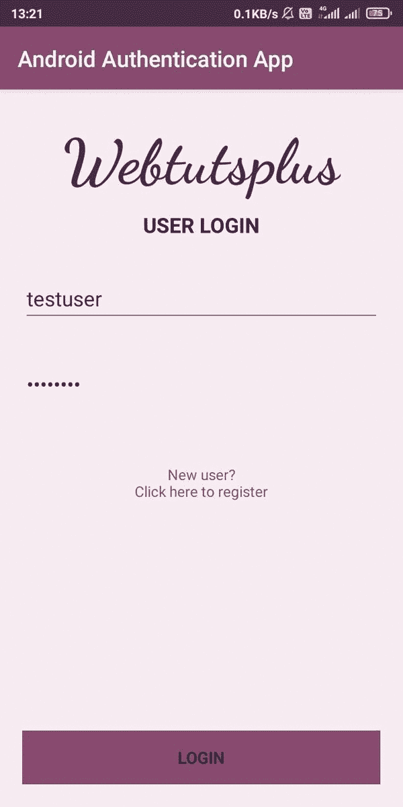

# 让我们在 Android 中构建一个登录系统

> 原文：<https://medium.com/javarevisited/android-app-for-spring-backend-68f39dca8b72?source=collection_archive---------0----------------------->

## 我们将构建一个 android 应用程序，通过使用 Java 和改进工具的 RESTful 服务来验证其用户。

Java springboot 登录后端的 android UI

# 用户认证

每当我们计划为我们的用户建立一个虚拟平台时，最基本的要求是维护用户的数据和…