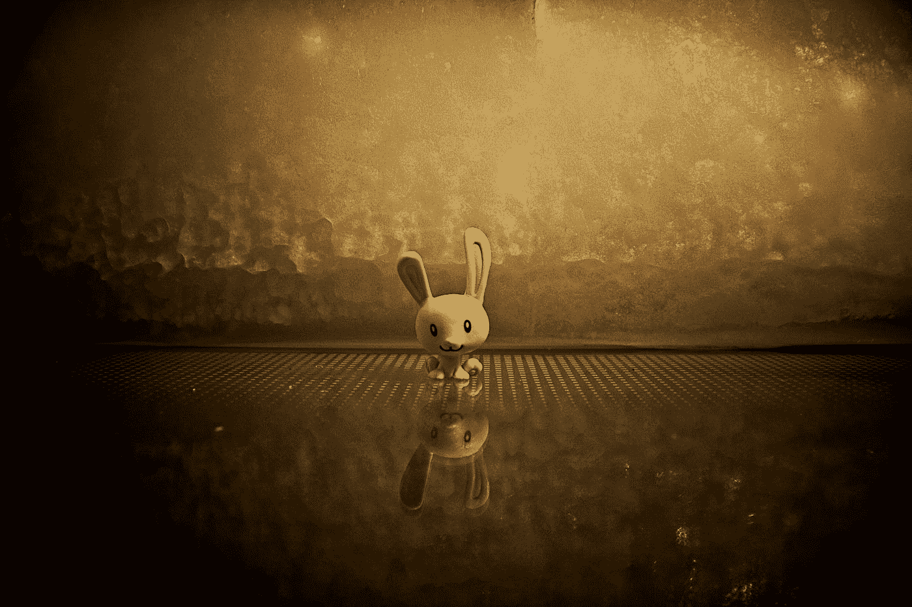

# 使用 D3 制作图表动画

> 原文：<https://medium.com/javarevisited/animating-charts-using-d3-3756ed4c0d?source=collection_archive---------1----------------------->

如果有动画的话，SVG 实现是完美的。在本文中，我们将讨论如何使用 D3 在 SVG 图像上制作动画。SVG 具有制作动画/转换的内置功能。我们可以通过 d3 增加这种能力。

由[汉斯·埃斯科宁](https://unsplash.com/@eiskonen?utm_source=medium&utm_medium=referral)在 [Unsplash](https://unsplash.com?utm_source=medium&utm_medium=referral) 上拍摄的照片

SVG 的一个很好的用例是你可以制作动画。利用 SVG 动画的优势，您可以创建简单的游戏，动画人物，图形和图表…