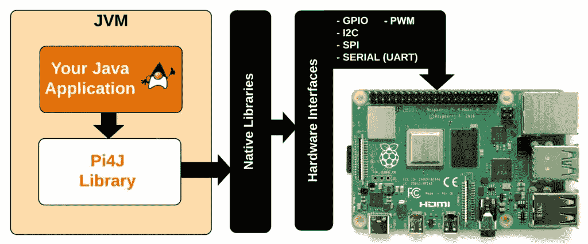
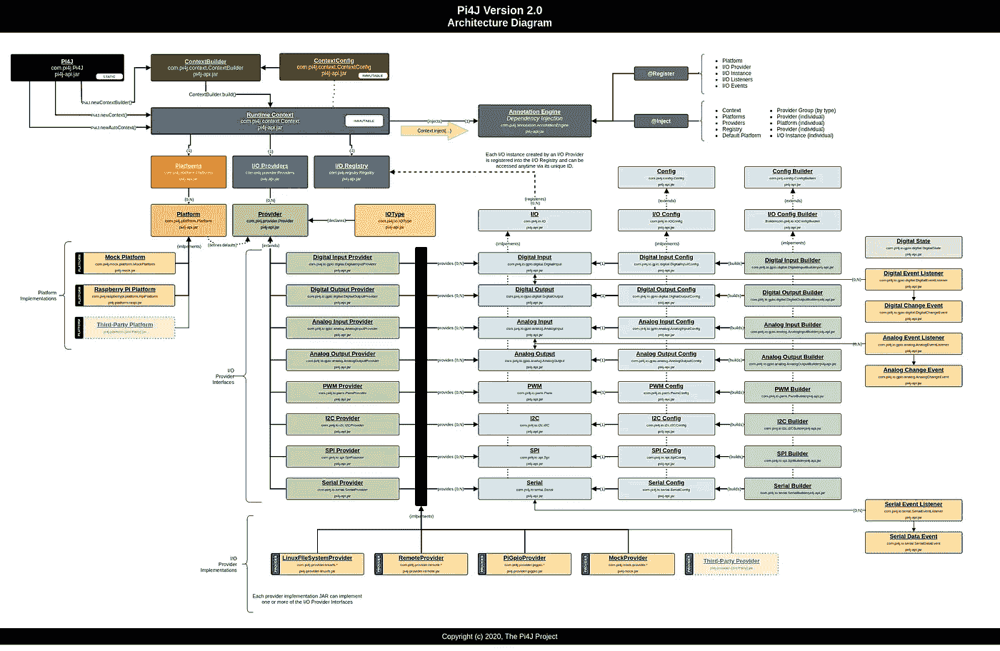

# 公告:Pi4J V.2 发布！(用于 Raspberry Pi GPIOs 的 Java 库)

> 原文：<https://medium.com/javarevisited/announcement-pi4j-v-2-released-1f82b67a8128?source=collection_archive---------5----------------------->

经过长时间的返工，Pi4J 库(**一个友好的面向对象的 I/O API 和实现库，供 Java 程序员**访问 Raspberry Pi 平台的**全部 I/O 功能)随着 V.2 的首次发布迈出了一大步**

**Pi4J 项目**由 [**Robert Savage**](https://twitter.com/savageautomate) 于 **2012** 开始，同年，树莓 Pi 作为一个工具被推出，为 Java 开发人员提供一个简单而熟悉的面向对象接口库，以访问树莓 Pi 的低级 I/O 功能，包括 **GPIO** 、 **I2C** 、 **SPI** 、 **PWM** 和【t2t】



有关所有文件和示例，请查看 https://pi4j.com/。

# 关于 V.2

Pi4J V.2 是完全重写的，并且**不保持与以前版本的 API 兼容性**。它不是 Pi4J 以前版本的替代产品。Pi4J V.2 是一个全新的设计，为 Pi4J 用户带来了现代约定、开发实践、可扩展性支持和简化的集成体验。

*   流畅的 APIs 界面
*   不可变运行时上下文
*   可扩展的提供者/平台/插件架构
*   用于创建新 I/O 实例的构建器模式
*   文档齐全的源代码
*   硬件 PWM 支持
*   Java 11



V2 Pi4J 建筑

除了上面列出的功能之外，Pi4J 版还放弃了旧的 WiringPi 引脚编号方案，转而采用更传统、更常用的 Broadcom 引脚编号方案。这种引脚编号方案多年来一直是混乱的根源，尤其是对初学者而言，而且维护起来有些麻烦，因为新的 Raspberry Pi 模型引入了不同的或添加的 GPIO 引脚。展望未来，Pi4J 将仅使用 Broadcom (BCM) pin 编号方案。

WiringPi 项目现在已经被否决了(见[wiringpi.com/wiringpi-deprecated/](http://wiringpi.com/wiringpi-deprecated/))。Pi4J 版将不再基于 WiringPi，并在内部使用 PIGPIO 库([http://abyz.me.uk/rpi/pigpio/](http://abyz.me.uk/rpi/pigpio/))进行低级集成。

# 与 V.1 相比的差异

从 Pi4J 2.0 构建开始，Pi4J 项目优先关注提供 Java 程序访问、控制和与 Raspberry Pi 平台的核心 I/O 功能的通信。Pi4J 的早期版本可能在范围上过于雄心勃勃，导致项目膨胀到不可持续的程度。下一步的目标是将范围限制在 RaspberryPi 平台的原始 I/O 功能上，并为修复的错误和新的 Raspberry Pi 模型引入提供及时的更新和发布。通过降低复杂性，缩小项目范围应该可以更好地服务于 Java 社区的基本 I/O 访问。

以下功能已从 Pi4J 库中删除:

*   **IO 扩展器** —仍然支持 IO 扩展，但是应该在核心 Pi4J 核心项目之外提供具体的实现，以便它们可以独立维护和扩展。
*   **其他平台** —其他平台如 Odroid、BananaPi、NanoPi、OrangePi 等。已被删除，不再受支持。支持这些额外平台的挑战在于，Pi4J 依赖于底层 WiringPi 项目，并且这些其他平台的 WiringPi 端口没有得到各种 SoC 供应商或社区的良好支持。这些其他平台的各种 WiringPi 端口也不一致，导致 Pi4J 的特性和功能不一致。此外，Pi4J 中的错误修复和新特性的回归测试与每个额外支持的平台相结合。
*   **组件&设备** — Pi4J 最初为组件和设备提供更高级别的接口，这些组件和设备在真实世界的设备(事物)和更低级别的 I/O 接口之间提供一个抽象层。虽然这是一个崇高的目标，但不幸的是，项目的这一部分从未得到应有的关注和时间，也从未被社区采纳。我们正在移除这些，以使 Pi4J 能够专注于由 Raspberry Pi 平台支持的原始 I/O。

# 来源

Pi4J V.2 源代码可以在这个 GitHub 资源库中获得: [Pi4J V.2 GitHub 资源库](https://github.com/Pi4J/pi4j-v2)

```
git clone [https://github.com/Pi4J/pi4j-v2](https://github.com/Pi4J/pi4j-v2)
```

别忘了分享这个帖子！

*原载于 2021 年 8 月 30 日*[*https://foojay . io*](https://foojay.io/today/pi4j-v-2-released/)*。*