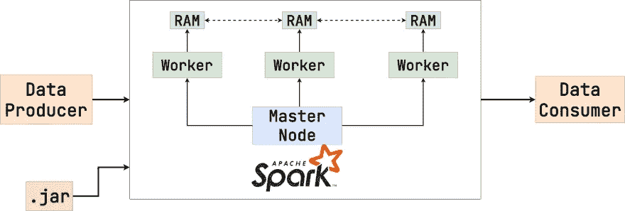
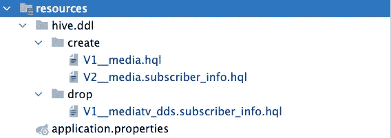

# 阿帕奇火花，蜂巢和 Spring Boot-测试指南

> 原文：<https://medium.com/javarevisited/apache-spark-hive-and-spring-boot-testing-guide-42b07f2b480e?source=collection_archive---------0----------------------->

大数据是趋势。这些公司必须处理大量的数据才能与其他人竞争。例如，这些信息用于向您显示相关广告，并向您推荐您可能感兴趣的服务。

大数据软件系统的问题在于其复杂性。测试变得艰难。当应用程序被调整为连接到 HDFS 集群时，如何在本地验证它的行为？

在本文中，我将向您展示如何创建一个 Spring Boot 应用程序，该应用程序通过 [Apache Spark](https://spark.apache.org/) 将数据从 [Apache Hive](https://hive.apache.org/) 加载到 [Aerospike 数据库](https://aerospike.com/)。不仅如此，我还将为您提供为这种场景编写集成测试的方法，这些测试可以在本地运行，也可以在 CI 管道执行期间运行。代码示例取自[这个库](https://github.com/SimonHarmonicMinor/apache-spark-integration-testing-example)。

[](https://javarevisited.blogspot.com/2018/04/top-5-hadoop-courses-to-learn-online.html)

首先，让我们了解一下我们正在使用的大数据堆栈的一些基本概念。别担心，不会太久的。但理解核心思想是必要的。

# HDFS 基础知识

[HDFS (Hadoop 分布式文件系统)](https://hadoop.apache.org/docs/r1.2.1/hdfs_design.html)是一个分布式文件系统，设计用于在许多物理服务器上运行。因此，HDFS 中的文件是一种抽象，它隐藏了在多个节点之间存储和复制数据的复杂性。我们为什么需要 HDFS？有一些原因。

## 硬件故障

硬盘驱动器崩溃。这是我们必须面对的现实。如果一个文件在多个节点之间拆分，个别故障不会影响整个数据。此外，数据在 HDFS 复制。因此，即使在磁盘崩溃后，信息也可以从其他来源恢复。

## 非常大的文件

HDFS 允许将一个不太强大的机器网络构建成一个庞大的系统。例如，如果您有 100 个节点，每个节点都有 1TB 的磁盘存储，那么您拥有 100TB 的 HDFS 空间。如果复制因子等于 3，则可以存储大小为 33TB 的单个文件。

> *更别说有些本地文件系统不支持这么大的文件，就算你有可用的磁盘空间。*

## 阅读的速度

如果你按顺序读这个文件，它将花费你`N`。但是如果文件被分割成 10 个节点之间的 10 个块，你可以在`N/10`时间内得到它的内容！因为每个节点都可以并行读取其数据块。所以，HDFS 不仅仅关乎安全。这是关于迅捷。

> 我省略了花在网络交流上的时间。但是如果文件很大，这部分就是零头。

# Apache Hive 的基础知识

Apache Hive 是运行在 HDFS 的数据库设施。它允许用 HQL(类似 SQL 的语言)查询数据。

常规数据库(例如 [PostgreSQL](/javarevisited/7-best-free-postgresql-courses-for-beginners-to-learn-in-2021-3bf369d73794) 、 [Oracle](/javarevisited/6-best-pl-sql-and-oracle-courses-for-beginners-to-learn-online-effd07d5fd2) )充当本地文件系统上的抽象层。而阿帕奇蜂巢则是 HDFS 上空的一个抽象。就是这样。

# Apache Spark 的基础知识

[Apache Spark](/javarevisited/5-best-apache-spark-courses-for-java-and-python-developers-bbd9d63eb76c) 是一个操作和转换海量数据的平台。关键思想是 Apache Spark workers 在多个节点上运行，并将中间结果存储在 RAM 中。它是用 [Scala](/javarevisited/7-best-scala-frameworks-for-concurrency-web-development-and-big-data-to-learn-fbd52dbe0a9a) 编写的，但是它也支持 [Java](/javarevisited/10-best-java-development-tools-you-can-learn-66f7d4d837e6) 和 [Python](/javarevisited/top-10-tools-python-programmers-should-learn-cb9c2535f57) 。看看下面的模式。这是 Apache Spark 批处理作业的常见表示。

[](https://javarevisited.blogspot.com/2021/11/top-5-courses-to-learn-apache-spark-in.html)

Apache Spark 架构

[Apache Spark](https://www.java67.com/2018/04/5-free-apache-spark-course-for-java-scala-python-developers.html) 从`Data Producer`加载数据，对其进行一些操作，并将结果放入`Data Consumer`(在我们的例子中，Apache Hive 是数据生产者，Aerospike 是数据消费者)。Apache Spark 应用程序是一个包含转换逻辑的常规`.jar`文件。看看下面的例子。

字数统计示例

这是一个简单的字数统计应用程序。首先，我们加载`raw_data.txt` HDFS 文件的内容。然后我们用`" "`拆分每一行，给每一个单词分配`1`，用单词减少结果，总结出整数。然后将获得的配对保存到`word_count.txt`。

流程类似于 [Java Stream API](https://www.java67.com/2014/04/java-8-stream-examples-and-tutorial.html) 。不同之处在于，每个 lambda 表达式都在 workers 上执行。因此，Spark 将代码传输到远程机器，执行计算，并返回获得的结果。如果我们拥有足够数量的工作线程，我们可以继续处理以 TB 甚至 zettabytes 计算的数据量。

> *Apache Spark*</javarevisited/5-free-courses-to-learn-apache-spark-in-2020-bdff2d60c800>**将代码交付给数据的方法有一些缺点。我们到了发展阶段再讨论。**

*另一个重要的方面是*懒惰*。就像 [Stream API 一样，](/javarevisited/7-best-java-tutorials-and-books-to-learn-lambda-expression-and-stream-api-and-other-features-3083e6038e14) Apache Spark 直到终端操作调用时才开始任何计算。在这种情况下，`reduceByKey`就是其中之一。rest 操作构建管道规则，但不触发任何东西。*

# *构建配置*

*让我们开始开发过程。首先，我们需要选择 Java 版本。在撰写本文时，最新稳定的 Apache Spark 版本是 3.2.1。它支持 Java 11。所以，我们要用它。*

> **目前 Apache Spark 不支持 Java 17。确保不要用它来运行集成测试。否则，您会得到奇怪的错误消息。**

*该项目是用 [Spring Initializr](https://start.spring.io/) 引导的。这里没什么特别的。但是应该澄清依赖列表。*

## *依赖性解析*

*build.gradle 依赖项*

***核心依赖关系***

*首先是 Apache Spark 依赖项。人工制品是根源。`spark-hive`支持从 Apache Hive 中检索数据。并且`spark-sql`依赖项使我们能够使用 [SQL](/javarevisited/8-best-resources-to-learn-sql-online-for-free-b00506d88c91) 从 Apache Hive 中查询数据。*

> **注意，所有的工件必须共享同一个版本(在我们的例子中，它是* `*3.2.1*` *)。事实上，Apache Spark 依赖项的版本应该与您公司中运行生产集群的版本相匹配。**

*所有火花依赖都必须标记为`compileOnly`。这意味着它们不会包含在汇编的`.jar`文件中。Apache Spark 将在运行时提供所需的依赖关系。如果您将它们包含在`implementation`范围内，那可能会导致在执行过程中出现难以跟踪的错误。*

*然后我们有了`aerospike-client`的依赖。您可能已经注意到`org.slf4j`组在任何地方都被排除在外，并且作为一个`compileOnly`依赖项包含在内。我们将在稍后到达 Apache Spark 日志记录设施时讨论这个问题。*

***测试依赖关系***

*最后，出现了测试范围的工件。阿帕奇 Spark ones 被收录为`testImplementation`。因为集成测试将启动本地 Spark 节点。因此，它们在运行时是必需的。`slf4j-api`也是运行时依赖项。 [Testcontainers](https://www.testcontainers.org/) 将用于运行 Aerospike 实例。Apache Spark 在作业执行期间需要`janino`。我们需要 [Apache Derby](https://db.apache.org/derby/) 来调优 Apache Hive，以便在本地运行。我们很快就会谈到这一点。*

## *日志记录配置*

*Apache Spark 将`log4j`与`slf4j`包装器一起应用。但是默认的 Spring Boot 记录器是`logback`。由于在[类路径](https://javarevisited.blogspot.com/2011/01/how-classpath-work-in-java.html)中存在多个日志记录工具，这种设置会导致 Spring 上下文初始化期间出现异常。最简单的解决方法是排除所有自动配置的 [Spring Boot 测井特性](https://www.java67.com/2021/10/how-to-set-logging-level-in-spring-boot-.html)。这没什么大不了的。无论如何，Apache Spark 在运行时提供了自己的`slf4j`实现。所以，我们只需要将这个依赖关系作为`compileOnly`包含进来。这就足够了。*

*用[grade](/javarevisited/5-best-gradle-courses-and-books-to-learn-in-2021-93f49ce8ff8e)从 Spring Boot 项目中排除`logback`很容易。看看下面的例子。*

*从 Spring Boot 自动配置中排除回退*

***可能出现的** `**application.yml**` **问题***

*`snakeyml`排除需要特别注意。Spring Boot 使用这个库来解析来自`.yml`文件的属性(例如`application.yml`)。一些 Apache Spark 版本使用相同的库进行内部操作。*

*问题是 [Spring Boot](/javarevisited/10-free-spring-boot-tutorials-and-courses-for-java-developers-53dfe084587e) 和[阿帕奇 Spark](https://javarevisited.blogspot.com/2017/12/top-5-courses-to-learn-big-data-and.html) 要求的版本不同。如果你把它从 Spring Boot 依赖中排除，而依赖 Apache Spark 提供的那个，你将面临`NoSuchMethodError` (Spring Boot 调用 Apache Spark 提供的版本中没有的方法)。所以，我建议坚持使用`.properties`格式，去掉 Spring Boot YAML 自动配置。那将帮助你避免不必要的困难。看看下面的代码示例。*

*排除 GsonAutoConfiguration*

# *胖罐子*

*结果`.jar`将要提交给 Apache Spark 集群(例如`[spark-submit](https://spark.apache.org/docs/latest/submitting-applications.html)` [命令](https://spark.apache.org/docs/latest/submitting-applications.html))。因此，它应该包含所有运行时工件。不幸的是，标准的 Spring Boot 打包并没有按照 Apache Spark 期望的方式放置依赖项。因此，我们将使用 [shadow-jar Gradle 插件](https://github.com/johnrengelman/shadow)。看看下面的例子。*

*ShadowJar 插件配置*

*现在我们可以运行所有的测试，并用`./gradlew test shadowJar`命令构建产品。*

# *开始开发*

*现在我们可以进入开发过程了。*

## *阿帕奇火花配置*

*我们需要声明`[JavaSparkContext](https://spark.apache.org/docs/3.2.1/api/java/index.html?org/apache/spark/api/java/JavaSparkContext.html)`和`[SparkSession](https://spark.apache.org/docs/3.2.1/api/java/org/apache/spark/sql/SparkSession.html)`。第一个是所有操作的核心 Apache Spark。而`SparkSession`是`spark-sql`项目的一部分。它允许我们用`SQL`查询数据(这对 Apache Hive 来说相当方便)。看看下面的弹簧配置。*

*Spring Boot 火花配置*

*`SparkConf`定义 Apache Spark 作业的配置键。正如你已经注意到的，有两种豆子用于不同的[弹簧轮廓](https://www.baeldung.com/spring-profiles)。`LOCAL`用于集成测试，`PROD`应用于生产环境。`PROD`配置没有声明任何属性，因为它们通常在`spark-submit` shell 脚本中作为命令行参数传递。*

*相反，`LOCAL`概要文件定义了正确运行所需的一组默认属性。以下是最重要的几个。*

1.  *`setMaster("local")`告诉 Apache Spark 启动单个本地节点。*
2.  *`javax.jdo.option.ConnectionURL`和`javax.jdo.option.ConnectionDriverName`声明 Apache Hive 元存储的 JDBC 连接。这就是我们添加 Apache Derby 作为项目依赖项的原因*
3.  *`spark.sql.catalogImplementation`表示本地文件应以 Apache Hive 兼容格式存储*
4.  *`spark.sql.warehouse.dir`是存储 Apache Hive 数据的目录。这里我们使用临时目录。*

*`JavaSparkContext`接受已定义的`SparkConf`作为构造函数参数。同时`SparkSession`包裹现有的`JavaSparkContext`。注意，应该手动启用 Apache Hive 支持(`enableHiveSupport`)。*

## *创建 Apache 配置单元表*

*当我们向生产 Apache Spark 集群提交应用程序时，我们可能不需要创建任何 Apache Hive 表。这些表很可能已经被其他人创建了。我们的目标是选择行并将数据传输到另一个存储。但是当我们在本地(或者在 CI 环境中)运行集成测试时，默认情况下没有表。所以，我们需要以某种方式创造它们。*

*在这个项目中，我们使用一个表— `media.subscriber_info`。它由两列组成。MSISDN(电话号码)和一些用户 ID。*

*在每次测试运行之前，我们必须删除以前的数据并添加新的行，以确保验证规则的一致性。实现这一点最简单的方法是声明创建和删除表的脚本。我们将把它们保存在`resources`目录中。看看下面的结构。*

*[](https://javarevisited.blogspot.com/2018/02/top-5-restful-web-services-with-spring-courses-for-experienced-java-programmers.html)

Apache Hive DDL 脚本* 

***V1 _ 媒体. hql***

*如果没有的话，创建`media`数据库。*

```
*create database if not exists media*
```

***V2 _ _ media . subscriber _ info . hql***

*如果不存在，则创建`subscriber_info`表。*

```
*create table if not exists media.subscriber_info (
  subscriber_id string,
  msisdn string
)
row format delimited
fields terminated by ','
lines terminated by '\n'
stored as textfile*
```

***掉 V1 _ _ mediatv _ DDS . subscriber _ info . hql***

*掉落了`subscriber_info`的桌子。*

```
*drop table if exists media.subscriber_info*
```

> *`*V[N]*` *前缀不是必须的。我放置它们是为了确保每个新的表脚本都将作为最后一个执行。让测试确定性地工作是有帮助的。**

*好了，现在我们需要一个处理程序来处理这些 HQL 查询。看看下面的例子。*

*Apache Hive DDL 脚本处理程序*

*首先要注意的是`@Profile(LOCAL)`用法。因为我们不需要在生产环境中创建或删除表。*

*`createTables`和`dropTables`方法提供了包含所需查询的资源列表。*

> *`*getResources*` *是从* [*类路径*](http://www.java67.com/2012/08/what-is-path-and-classpath-in-java-difference.html) *中读取文件的实用函数。你可以在这里* *发现* [*的实现。*](https://github.com/SimonHarmonicMinor/apache-spark-integration-testing-example/blob/master/src/main/java/com/mts/metric/spark/util/ResourceUtil.java)*

*所以，现在我们已经准备好编写业务代码了！*

# *商业代码*

## *外表*

*核心接口是`EnricherService`*

*核心接口*

*我们预计它可能有许多实现。每一个都代表整个批处理过程中一个步骤。*

*然后我们有封装了所有`EnricherService`实现的`EnricherServiceFacade`，并逐个运行它们。*

*EnricherServiceFacade*

*我们正在尝试运行每一个提供的浓缩步骤。如果其中任何一个错误失败，我们抛出异常，将所有错误合并成一个整体。*

*最后，我们需要告诉 Spring 在应用程序启动时执行`EnricherServiceFacade.proceedEnrichment`。我们可以将它直接添加到`main`方法中，但它不是*弹簧方式*。因此，这增加了测试的难度。更好的选择是`@EventListener`。*

*主监听器*

*当 [Spring context](https://javarevisited.blogspot.com/2020/05/top-20-spring-boot-interview-questions-answers.html) 启动时，调用`proceedEnrichment`方法。顺便说一下，只有激活的`PROD`配置文件才会触发作业。*

## *EnricherService 实现*

*我们将处理一个单独的`EnricherService`实现。它只是从`media.subcriber_info`表中选择所有行，并将结果放入 Aerospike 数据库。看看下面的代码片段。*

*SubscriberIdEnricherService*

*有许多问题需要澄清。*

***序列化***

*Apache Spark 应用了标准的 Java 序列化机制。因此， [lambdas](/javarevisited/8-best-lambdas-stream-and-functional-programming-courses-for-java-developers-3d1836a97a1d) ( `map`、`filter`、`groupBy`、`forEach`等)中使用的任何依赖项。)必须实现`Serializable`接口。否则，您将在运行时得到`NotSerializableException`。*

*我们在`foreachPartition`回调中引用了`AerospikeProperties`。因此，应该允许这个类和`SubscriberIdEnricherService`本身进行序列化(因为后者将`AerospikeProperties`保留为一个字段)。如果在任何 Apache Spark lambda 中没有使用依赖项，可以将其标记为`transient`。*

*最后，`serialVersionUID`手动分配至关重要。原因是 Apache Spark 可能会多次序列化和反序列化传递的对象。并且不能保证每次自动生成的`serialVersionUID`都是一样的。这可能是难以跟踪浮动错误的原因。为了防止这种情况，你应该自己申报`serialVersionUID`。*

*更好的方法是强制编译器在任何`Serializable`类上验证`serialVersionUID`字段的存在。在这种情况下，您需要将`-Xlint:serial`警告标记为错误。看看 Gradle 的例子。*

```
*tasks.withType(JavaCompile) {
    options.compilerArgs << "-Xlint:serial" << "-Werror" 
}*
```

***气塞客户端实例化***

*不幸的是，Java Aerospike 客户端没有实现`Serializable`接口。所以，我们必须在 lambda 表达式中实例化它。在这种情况下，将直接在 worker 节点上创建对象。它使得序列化变得多余。*

> **我应该承认 Aerospike 提供了*[*Aerospike Connect Framework*](https://docs.aerospike.com/connect/spark/configuration)*允许通过 Apache Spark 以声明的方式传输数据，而无需创建任何 Java 客户端。反正你要用，就得直接把打包好的库安装到 Apache Spark 集群上。不能保证你在这种情况下会有这样的机会。所以，我省略了这个场景。**

***分区***

*`Dataset`类有`foreach`方法，该方法简单地为每个当前行执行给定的 lambda。然而，如果你在回调中初始化一些繁重的资源(例如数据库连接)，新的资源将为每一行创建(在某些情况下可能有数十亿行)。不是很有效率吧？*

*`foreachPartition`方法的工作方式稍有不同。Apache Spark 在每个`Dataset`分区执行一次。它也接受`Iterator<Row>`作为参数。因此，在 lambda 中，我们可以初始化“重”资源(例如`AerospikeClient`)并将它们应用于迭代器中每个`Row`的计算。*

> **分区大小是根据输入源和 Apache Spark 集群配置自动计算的。虽然您可以通过调用* `[*repartition*](https://spark.apache.org/docs/latest/api/java/org/apache/spark/sql/Dataset.html#repartition-org.apache.spark.sql.Column...-)` *方法来手动设置它。反正不在文章范围之内。**

# *测试*

## *气塞式安装*

*好了，我们已经写了一些业务代码。我们如何测试它？首先，让我们为[测试容器](https://www.testcontainers.org/)声明 Aerospike 设置。看看下面的代码片段。*

*集成套件*

*`IntegrationSuite`类被用作所有集成测试的父类。`IntegrationSuite.Initializer`内部类被用作 Spring 上下文初始化器。当所有属性和 bean 定义都已经加载，但是还没有创建 bean 时，框架调用它。它允许我们在运行时覆盖一些属性。*

*我们将 Aerospike 容器声明为`GenericContainer`，因为该库不提供对数据库的开箱即用支持。然后在`initialize`方法中，我们检索容器的主机和端口，并将它们分配给`aerospike.hosts`属性。*

## *Apache Hive 实用程序*

*在每个测试方法之前，我们应该删除 Apache Hive 中的所有数据，并添加当前场景所需的新行。所以，测试不会互相影响。让我们为 Apache Hive 声明一个定制的测试外观。看看下面的代码片段。*

*睾丸组织*

*只有两种方法。`cleanHive`删除所有现有的并重新创建。因此，所有以前的数据都将被擦除。这个`insertInto`很棘手。它的目的是以静态类型的方式向 Apache Hive 插入新行。这是怎么做到的？首先我们来考察一下`HiveTable<T>`接口。*

*如你所见，这是一个普通的 Java 函数接口。尽管实现不是很明显。*

*订户信息*

*该类接受`SparkSession`作为构造函数依赖。`SubscriberInfo.Values`是通用参数。类表示包含要插入的值的数据结构。最后，`values`实现执行实际的新行创建。*

*关键是`subscriberInfo`静态方法。退回`Function<SparkSession, SubscriberInfo>`的理由是什么？它与`TestHiveUtils.insertInto`的结合为我们提供了静态类型化的`INSERT INTO`语句。看看下面的代码示例。*

*将数据插入 Apache 配置单元*

*一个优雅的解决方案，你不觉得吗？*

## *火花积分测试片*

*Spring 集成测试需要特定的配置。明智的做法是声明一次，重复使用。看看下面的代码片段。*

*SparkIntegrationTestSuite*

*在`[SpringBootTest](https://javarevisited.blogspot.com/2021/12/what-is-springboottest-annotation-in.html)` <https://javarevisited.blogspot.com/2021/12/what-is-springboottest-annotation-in.html>中，我们列出了测试运行期间使用的所有 beans。*

> *`*TestAerospikeFacade*` *只是 Java Aerospike 客户端的一个薄薄的包装，用于测试目的。它的实现相当简单，但是你可以通过* [*这个链接*](https://github.com/SimonHarmonicMinor/apache-spark-integration-testing-example/blob/master/src/test/java/com/mts/metric/spark/testutils/facade/TestAerospikeFacade.java) *查看源代码。**

*`EnricherServiceTestConfiguration`是 Spring 配置，声明了`EnricherService`接口的所有实现。看看下面的例子。*

*EnricherService 测试配置*

> **我想指出的是* ***所有的*** `*EnricherService*` *实现都应该列在类里面。如果我们为每个测试套件应用不同的配置，Spring 上下文将被重新加载。大多数情况下，这不是问题。但是 Apache Spark 的使用带来了障碍。你看，当* `*JavaSparkContext*` *被创建时，它启动了本地的 Apache Spark 节点。但是当我们在应用程序生命周期中实例化它两次时，就会导致一个异常。解决这个问题最简单的方法是确保* `*JavaSparkContext*` *只被创建一次。**

*现在我们可以进入测试过程了。*

## *集成测试示例*

*下面是一个简单的集成测试，它向 Apache Spark 插入两行，并检查相应的两个记录是否在 10 秒钟内在 Aerospike 中创建。请看下面的代码片段。*

*subscriberidernicherserviceintegrationtest*

*如果一切都调整正确，测试将会通过。*

> **整个测试源可通过*<https://github.com/SimonHarmonicMinor/apache-spark-integration-testing-example/blob/master/src/test/java/com/mts/metric/spark/service/SubscriberIdEnricherServiceIntegrationTest.java>**这个环节获得。***

****

# **结论**

**这就是我想告诉你的关于测试 Apache Hive、Apache Spark 和 Aerospike 与 Spring Boot 用法的集成的全部内容。如你所见，大数据世界终究没有那么复杂。所有代码示例都取自[这个库](https://github.com/SimonHarmonicMinor/apache-spark-integration-testing-example)。您可以克隆它并自己进行测试。**

**如果您有任何问题或建议，请在下面留下您的评论。感谢阅读！**

# **资源**

1.  **[带有示例的存储库](https://github.com/SimonHarmonicMinor/apache-spark-integration-testing-example)**
2.  **[HDFS (Hadoop 分布式文件系统)](https://hadoop.apache.org/docs/r1.2.1/hdfs_design.html)**
3.  **[阿帕奇蜂巢](https://hive.apache.org/)**
4.  **[阿帕奇火花](https://spark.apache.org/)**
5.  **[阿帕奇德比](https://db.apache.org/derby/)**
6.  **[气塞式气塞数据库](https://aerospike.com/)**
7.  **[气塞连接框架](https://docs.aerospike.com/connect/spark/configuration)**
8.  **[Java 流 API](https://www.baeldung.com/java-8-streams)**
9.  **[弹簧初始状态](https://start.spring.io/)**
10.  **[弹簧型材](https://www.baeldung.com/spring-profiles)**
11.  **[测试容器](https://www.testcontainers.org/)**
12.  **[Gradle 插件 shadow-jar](https://github.com/johnrengelman/shadow)**