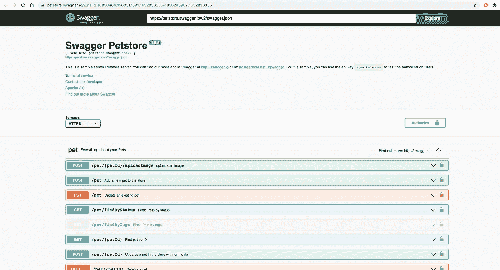

# 使用 Swagger 3 和 Spring Boot 2 + Spring Security 的 API 文档

> 原文：<https://medium.com/javarevisited/api-documentation-using-swagger-3-with-spring-boot-2-spring-security-5a0d2b0996ee?source=collection_archive---------0----------------------->

想为 spring boot 2 应用程序编写 API 文档吗？嗯，使用开放 API 规范非常简单。

# **什么是开放 API 规范？**

开放 API 规范是 Rest APIs 的标准 API 描述格式。

# 什么是霸气？

Swagger 是 SmartBear 提供的一个实现该规范的开源工具。它可以帮助你设计、构建、记录和使用你的[Rest API](/javarevisited/6-best-rest-api-tools-for-testing-design-and-development-1c5f69ed1f22)。

在本文中，我们将看看如何记录我们的 Rest APIs，并使用 Swagger UI 将其可视化。那么，让我们开始实施吧…

[](https://javarevisited.blogspot.com/2021/04/top-5-tools-to-test-rest-apis-in-java.html)

在 Spring Boot 应用程序中使用 swagger 打开 Api Spec 3.0

首先，您需要在 pom.xml 或 build.gradle 文件中添加以下依赖项:

> [*美芬*](/javarevisited/6-best-maven-courses-for-beginners-in-2020-23ea3cba89) *:*

```
<dependency>
   <groupId>io.springfox</groupId>
   <artifactId>springfox-boot-starter</artifactId>
   <version>3.0.0</version>
</dependency>
```

> </javarevisited/5-best-gradle-courses-and-books-to-learn-in-2021-93f49ce8ff8e>*:*

```
*implementation group: ‘io.springfox’, name: ‘springfox-boot-starter’, version: ‘3.0.0’*
```

*现在，您需要创建一个如下所示的 Swagger 配置 java 类:*

```
*@Configuration
public class SwaggerConfig {

    private ApiInfo apiInfo() {
        return new ApiInfo("MyApp Rest APIs",
                "APIs for MyApp.",
                "1.0",
                "Terms of service",
                new Contact("test", "www.org.com", "test@emaildomain.com"),
                "License of API",
                "API license URL",
                Collections.*emptyList*());
    }

    @Bean
    public Docket api() {
        return new Docket(DocumentationType.*OAS_30*)
                .apiInfo(apiInfo())
                .select()
                .apis(RequestHandlerSelectors.*any*())
                .paths(PathSelectors.*any*())
                .build();
    }
}*
```

*你需要用 **@Configuration** 注释来注释这个类。第一个方法 **apiInfo()** 用于添加关于 api 的定制信息，然后在 API()方法中调用。*

***api()** 方法通过方法链接使用构建器模式，并返回 spring bean Docket 来确定生成各种文档的配置。在我们的例子中，我们提供的文档类型是 Open Api Spec 3.0。*

*这里，我们通过使用 any() on `RequestHandlerSelectors` 和 PathSelectors 为所有 API 和路径创建文档，但是如果您愿意，您可以配置您希望 Swagger 为其生成文档的特定 API 或路径。*

# *具有弹簧安全性的大摇大摆配置*

*如果您在应用程序中启用了 spring 安全性，那么您需要将相同的安全性添加到您的 swagger 配置类中，这样您的 swagger APIs 将受到保护，如果您试图通过 swaggerUI 调用您的 API，它也会要求在那里提供身份验证。*

*例如，如果在您的应用程序中使用 JWT 身份验证，那么您的 Swagger 配置文件应该如下所示:*

```
*@Configuration
public class SwaggerConfiguration {
    public static final String *AUTHORIZATION_HEADER* = "Authorization";

    private ApiInfo apiInfo() {
        return new ApiInfo("MyApp Rest APIs",
                "APIs for MyApp.",
                "1.0",
                "Terms of service",
                new Contact("test", "www.org.com", "test@emaildomain.com"),
                "License of API",
                "API license URL",
                Collections.*emptyList*());
    }

    @Bean
    public Docket api() {
        return new Docket(DocumentationType.*OAS_30*)
                .apiInfo(apiInfo())
                .securityContexts(Arrays.*asList*(securityContext()))
                .securitySchemes(Arrays.*asList*(apiKey()))
                .select()
                .apis(RequestHandlerSelectors.*any*())
                .paths(PathSelectors.*any*())
                .build();
    }

    private ApiKey apiKey() {
        return new ApiKey(*AUTHORIZATION_HEADER*, "JWT", "header");
    }

    private SecurityContext securityContext() {
        return SecurityContext.*builder*()
                .securityReferences(defaultAuth())
                .build();
    }

    List<SecurityReference> defaultAuth() {
        AuthorizationScope authorizationScope
                = new AuthorizationScope("global", "accessEverything");
        AuthorizationScope[] authorizationScopes = new AuthorizationScope[1];
        authorizationScopes[0] = authorizationScope;
        return Arrays.*asList*(new SecurityReference(*AUTHORIZATION_HEADER*, authorizationScopes));
    }
}*
```

*为了增加安全性，需要添加 **apiKey()** 和[**security context()**](https://javarevisited.blogspot.com/2018/02/what-is-securitycontext-and-SecurityContextHolder-Spring-security.html#axzz6qnblZnVj)方法来使用默认的认证方法。*

*现在，您需要在您的**WebSecurityConfig.java**类中做一些更改，将认证 api(如果您启用了 spring security)和 swagger 相关 URL 列入白名单，然后在 configure()方法中默认授权来自这些白名单 URL 的请求，这样对于这些 URL 它就不会要求您授权。*

```
*private static final String[] *AUTH_WHITELIST* = {
        "/authenticate",
        "/swagger-resources/**",
        "/swagger-ui/**",
        "/v3/api-docs",
        "/webjars/**"
};@Override
 protected void configure(HttpSecurity httpSecurity) throws Exception {
     httpSecurity
             .cors()
             .and()
             .csrf()
             .disable()
             .headers()
             .frameOptions()
             .deny()
             .and()
             // dont authenticate this particular request
             **.authorizeRequests().antMatchers(*AUTH_WHITELIST*).permitAll().**
             // all other requests need to be authenticated
                     anyRequest().authenticated().and().
             // make sure we use stateless session; session won't be // used to store user's state.
                     exceptionHandling().authenticationEntryPoint(jwtAuthenticationEntryPoint).and().sessionManagement()
             .sessionCreationPolicy(SessionCreationPolicy.*STATELESS*);
     // Add a filter to validate the tokens with every request
     httpSecurity.addFilterBefore(jwtRequestFilter, UsernamePasswordAuthenticationFilter.class);
 }*
```

*完成这些更改并启动应用程序后，您应该能够看到 swagger-ui 网页，如下所示:*

****网址***:[http://<app-root>/swagger-ui/index . html](http://localhost:8080/swagger-ui/index.html#/CDRProducts%20APIs)*

*[](https://javarevisited.blogspot.com/2020/02/top-5-postman-tutorials-and-courses-for-web-developers.html)*

*现在，要在 swagger UI 上标记您的 API 或提供每个 API 的描述，您需要对 API 使用一些注释:*

*@ **Api** :在类级别使用标签或值属性，将其定义为 swagger 资源*

*@ **ApiOperation** :用在 API 方法级别，用 value 或 tag 属性来描述操作。*

*根据需要，可以在 API 上使用不同的注释。同样可以参考 [**Swagger API 文档**](https://docs.swagger.io/swagger-core/current/apidocs/) 。*

*Swagger 还配置了一个 API 端点来查看所有 API 及其详细信息，您可以通过 [postman](/javarevisited/7-best-courses-to-learn-postman-tool-for-web-service-and-api-testing-f225c138fa5a) 测试/执行这些信息。*

*API URL:**http://<app-root>/v3/API-docs***

*方法类型:**获取***

*它应该会返回如下类似的响应:*

```
*openapi: 3.0.0
info:
  version: 1.0.0
  title: Sample API
  description: A sample API to illustrate OpenAPI concepts
paths:
  /list:
    get:
      description: Returns a list of stuff              
      responses:
        '200':
          description: Successful response*
```

*希望您现在能够看到应用程序的 API 文档和 swagger ui。*

*编码快乐！！*

*您可能喜欢的其他 **REST API 教程和课程***

*</javarevisited/top-10-rest-interview-questions-for-java-and-spring-developers-1611e3b78029>  </javarevisited/10-best-java-web-services-rest-soap-and-api-courses-for-beginners-724a8f51298d>  <https://javarevisited.blogspot.com/2022/01/top-5-courses-to-learn-swagger-or-open.html>  

如果你不是媒体成员，我强烈推荐你加入媒体，阅读不同领域伟大作家的精彩故事。你可以在 这里**加入介质**</@somasharma_81597/membership>*