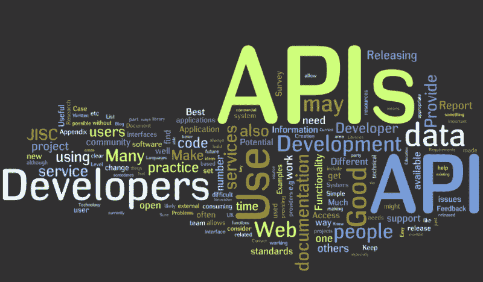
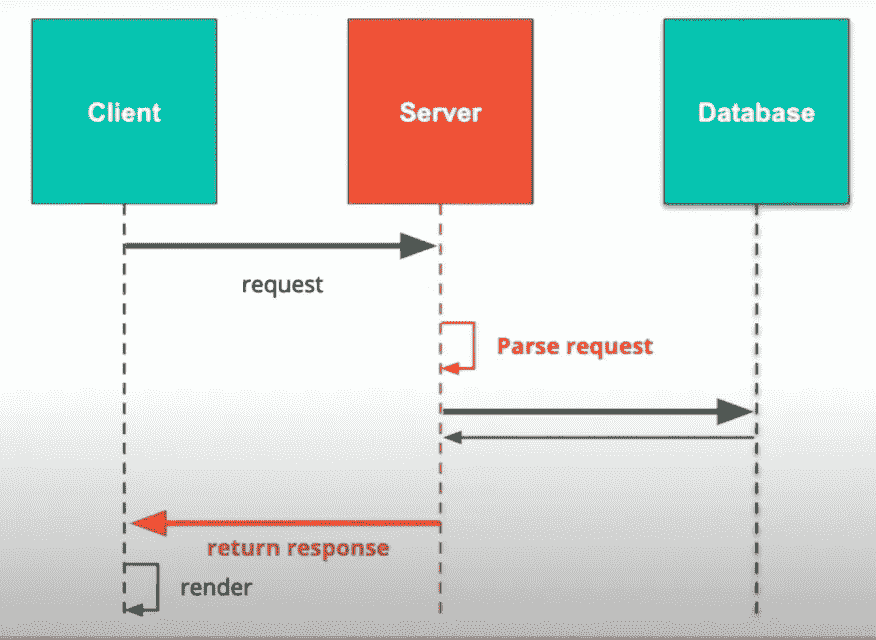
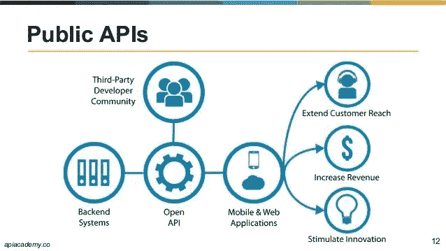
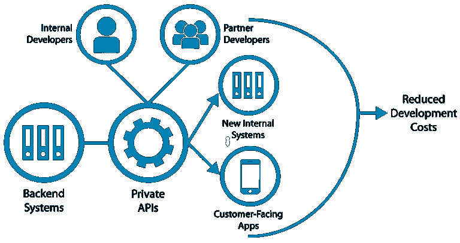
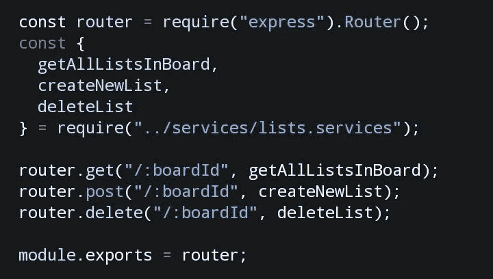

# API 及其类型

> 原文：<https://medium.com/javarevisited/api-its-types-2f810409626?source=collection_archive---------2----------------------->

API 是应用程序编程接口，用于两个不同系统之间的交互。它的功能取决于用户的实现。要使用 API，不需要事先了解如何在其他应用程序中使用它。它不会将实现暴露给那些不应该访问它的人。

这些 API 是有益的，因为它们允许开发人员向应用程序添加额外的功能，而不必自己编写适当的代码。

*API 的工作*:

1.  客户端向服务器发送了访问 API 的请求。
2.  API 服务器解析请求并向数据库查询以根据请求采取行动。
3.  服务器格式化响应并将其发送回客户机，客户机根据它们的实现呈现响应

API 使用超文本传输协议(HTTP)和文件传输协议(FTP)来接收请求和发送响应。

主要的 web APIs 有三种主要类型:

## 开放 API(公共 API)

所有开发者和其他用户都可以不受任何限制地公开获得这些服务。它需要注册或认证用户的 API 密钥来访问和控制服务。例如:微软将 Windows API 公开，易贝站点。

来源:https://images . app . goo . GL/tcx vxa 2k 85 jsqzyx 9

## 合作伙伴 API

这些是通常向商业伙伴公开的 API。这些通常向公共 API 开发者门户公开，[开发者](/javarevisited/top-10-online-courses-to-become-a-fullstack-web-developer-in-2020-d608a6b63232)可以以自助服务模式访问。使用合作伙伴 API 需要特定的验证。例如:优步

## 私有 API

那些没有明确向开发者公开的 API。这些 API 可以在将来的任何时候改变它们的访问，它充当后端数据和应用程序功能的前端接口。

来源:https://images.app.goo.gl/jcnrF1s8BtcTyiCfA

除了主 web APIs 之外，还有一些 web 服务 API:

来源:https://images . app . goo . GL/auvsne 3 xbpfoozfa

## SOAP(简单对象访问协议)API:

它是一种基于 XML 的协议，用于通过 HTTP 进行访问，并且独立于语言和平台，它需要具有中间件支持的标准工具。SOAP 的结构很难使用，许多开发人员更喜欢 REST 框架，因为它的复杂性低，并且具有内置的错误处理功能，这使它更可靠。

## [休息](/javarevisited/top-5-books-and-courses-to-learn-restful-web-services-in-java-using-spring-mvc-and-spring-boot-79ec4b351d12?source=---------17------------------)(具象状态转移):

它是一种架构风格，利用了广泛采用的技术，通常是 HTTP over XML。它提供了一种访问 web 服务的简单方法。它是最快也是最有效的方法。它只需要 URI 来进行信息交换。

流行的 API 示例:

1.  **谷歌地图 API** :帮助开发者使用 javaScript 在网页上嵌入谷歌地图。它设计用于浏览器和移动设备。
2.  **Youtube API** :它帮助开发者将 Youtube 视频及其功能整合到他们的网站和应用中。
3.  **Twitter API** :提供 *REST API* 访问 Twitter 数据，提供 *Search API* 与搜索事物&趋势新闻互动。

**结论:**

希望这篇关于 API 的文章能让你对 API 在 web 开发中的工作方式有一个清晰的认识，并鼓励你学习更多关于 web 开发的知识。

非常感谢你阅读这篇文章，也分享这篇文章。

请随意连接:

> 领英~[https://www.linkedin.com/in/priyanshsinghal/](https://www.linkedin.com/in/priyanshsinghal/)
> 
> insta gram ~[https://www.instagram.com/18_priyansh/](https://www.instagram.com/_daksh_trehan_/)
> 
> github ~[https://github.com/priyansh18](https://github.com/priyansh18)
> 
> https://www.facebook.com/priyansh18singhal*~*~ T20

关注更多…

> *干杯。*