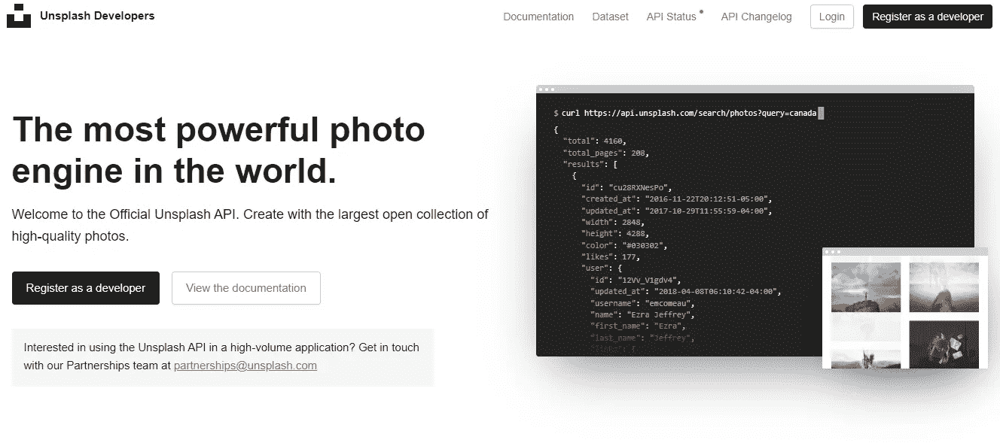
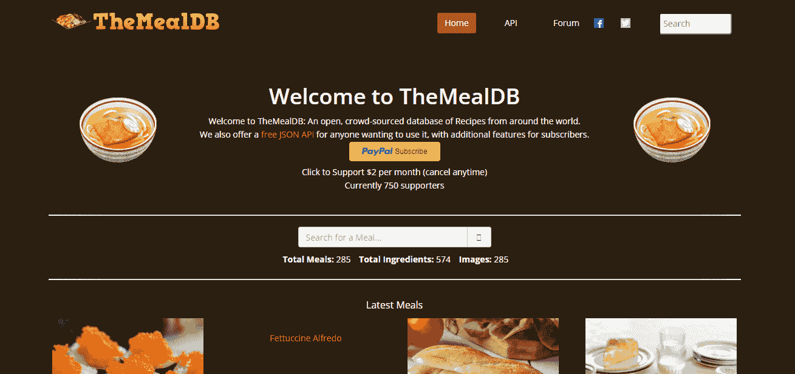
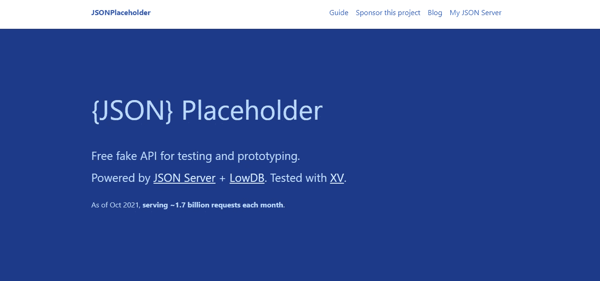
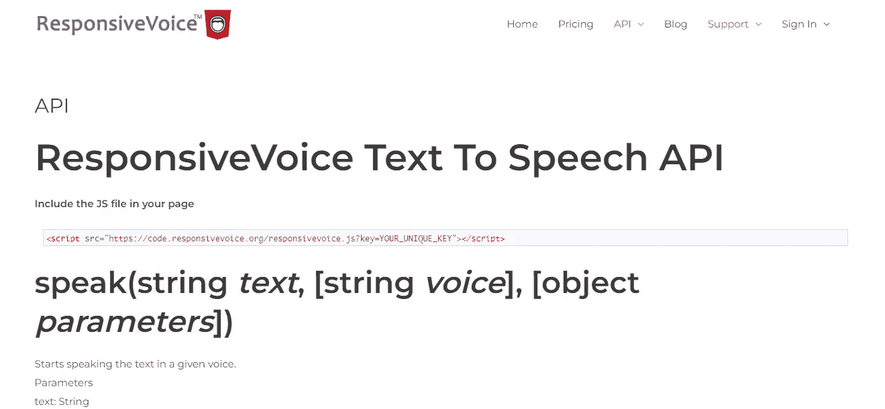
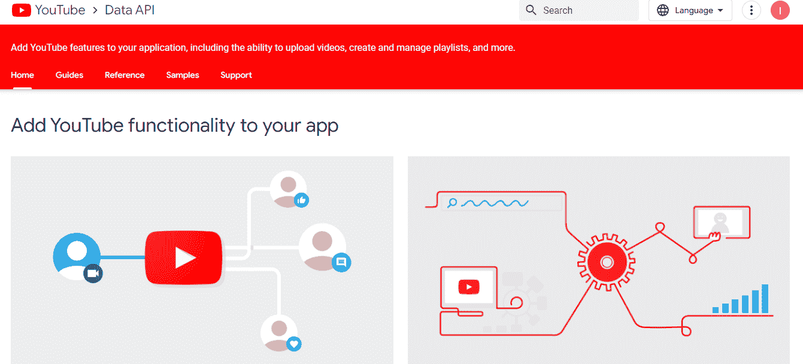
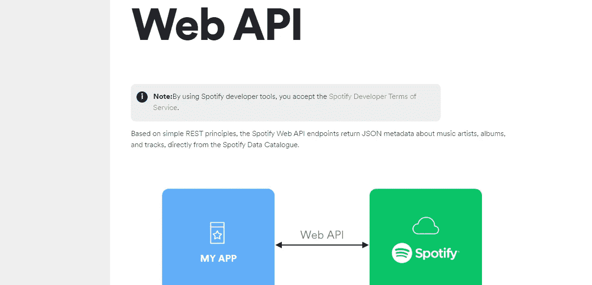
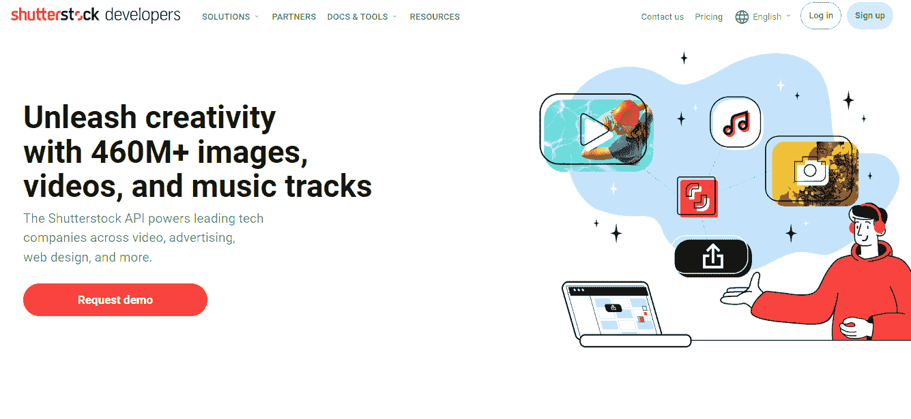

# 🚀有助于您成功完成下一个 web 项目的 API

> 原文：<https://medium.com/javarevisited/apis-that-will-help-you-make-your-next-web-project-a-success-94e4a0fa6746?source=collection_archive---------3----------------------->

## 查看即将到来的项目的顶级免费 API。

面向开发者的顶级免费 API

## [Unsplash 图像 API](https://unsplash.com/developers)

你可以在 Unsplash 上浏览世界上最好的免费、可访问的高质量图片集。您只需使用 Unsplash API 将 Unsplash 包含到您的应用程序或网站中。

> 你可以在这里找到链接 [Unsplash 图像 API](https://unsplash.com/developers)

Unsplash 图像 API

## [餐 DB](https://www.themealdb.com/)

膳食数据库 API 是查找食谱和膳食信息的极好资源。有 574 种配料，超过 285 种食谱包括你需要的一切。还有 285 张食谱图片。

> 你可以在这里找到链接[用餐数据库](https://www.themealdb.com/)

膳食数据库

## [JSON 占位符](https://jsonplaceholder.typicode.com/)

当编写堆栈溢出的代码示例、在 GitHub 上制作自述文件，甚至在本地测试时，JSON Generator API 最适合获取数据。而且，使用它是免费的！

> 你可以在这里找到链接 [JSON 占位符](https://jsonplaceholder.typicode.com/)

JSON 占位符

## [响应式语音 API](https://responsivevoice.org/)

这是最受欢迎的 HTML5 文本到语音转换 API，它可以很容易地用 51 种不同的语言为您的网站快速添加语音功能。该 API 具有可访问性兼容工具、语音消息编辑器和开发人员 API。如果你正在寻找一个 API 来为你的网站增加一个语音功能，那就去看看吧。

> 你可以在这里找到链接[响应式语音 API](https://responsivevoice.org/)

响应语音 API

## [Giphy API](https://developers.giphy.com/)

这真是太棒了。我个人认为这是最好的。Giphy API 是一个很棒的 API，可以访问剪辑、gif、表情符号、贴纸，甚至是项目的动画文本。这是必须检查的！

> 你可以在这里找到链接 [Giphy API](https://developers.giphy.com/)

Giphy API

## [YouTube 数据 API](https://developers.google.com/youtube/v3)

借助强大的 YouTube 数据 API，您可以将 YouTube 特性集成到您的应用程序中。这个 API 允许你做很多事情，包括上传视频和管理播放列表。

> 你可以在这里找到链接 [YouTube 数据 API](https://developers.google.com/youtube/v3)

YouTube 数据 API

## [Spotify Web API](https://developer.spotify.com/documentation/web-api/)

Spotify 是寻求启动音乐相关项目的开发人员的明智选择，这得益于其完善的 API。使用 Spotify Web API 时，您可以直接从 Spotify 数据目录中下载歌曲、艺术家、专辑和曲目。

> 你可以在这里找到链接 [Spotify Web API](https://developer.spotify.com/documentation/web-api/)

Spotify Web API

## [Shutterstock API](https://www.shutterstock.com/developers/)

它提供超过 4.6 亿张图片、视频和歌曲的免费访问。Shutterstock API 可以帮助你表达你的创造力，无论你是从事网页设计、视频广告还是其他完全不同的工作。

> 你可以在这里找到链接 [Shutterstock API](https://www.shutterstock.com/developers/)

Shutterstock API

## 结论

非常感谢您的阅读！我真的希望它对你有所帮助。如果你想看到更多像这样的帖子，请关注我。
如果您有任何疑问，请在下面的评论区发表，或者在 [Twitter](https://twitter.com/ishratUmar18) 上给我发短信。

快乐学习！:))