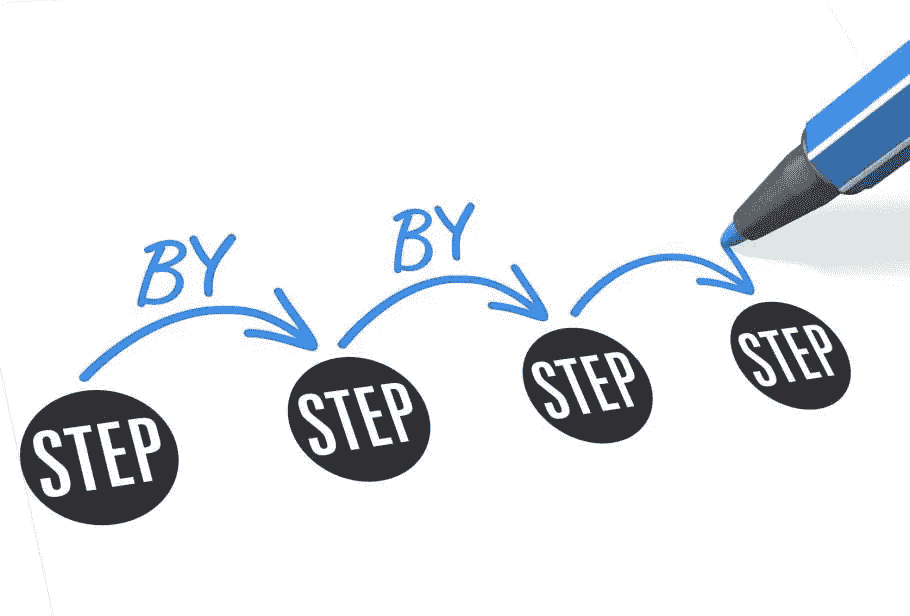

# Java 中过程编程与面向对象编程问题的解决方法

> 原文：<https://medium.com/javarevisited/approach-to-solving-problems-in-procedural-vs-object-oriented-programming-in-java-85bd92001ad4?source=collection_archive---------2----------------------->


当你开始发现 JAVA 时，你可能会从过程化编程开始学习。我知道我做了，但是我不知道我在做什么。后来，当我开始研究复杂的现实世界的问题时，我发现了这一点。

当我开始用 Java 编码时，我使用的是线性的自顶向下的方法。我有一个问题需要解决，我正在一步一步地解决它。

为了更好地理解过程式和[面向对象编程](/swlh/5-free-object-oriented-programming-online-courses-for-programmers-156afd0a3a73)解决问题的方法之间的区别，让我们看下面的例子。我们有两个数字，我们需要找到对它们执行加法、减法、乘法和除法的结果。当我们完成数学运算后，我们需要显示结果。这个计划可以归结为以下几个步骤:1 .拿到我的号码。2.进行数学运算。3.显示我的结果。

看看它在 [Java](/javarevisited/10-best-places-to-learn-java-online-for-free-ce5e713ab5b2) 中的样子:

```
**int** firstNumber = 8;
**int** secondNumber = 4;

*//performing operations* **int** sum = firstNumber + secondNumber;
**int** difference = firstNumber - secondNumber;
**int** product = firstNumber * secondNumber;
**int** quotient = firstNumber / secondNumber;

*//Displaying result* System.***out***.printf(**"%d + %d = %d\n"**, firstNumber, secondNumber, sum );
System.***out***.printf(**"%d - %d = %d\n"**, firstNumber, secondNumber, difference);
System.***out***.printf(**"%d x %d = %d\n"**, firstNumber, secondNumber, product);
System.***out***.printf(**"%d : %d = %d"**, firstNumber, secondNumber, quotient);
```

程序的输出:

8+4 = 12
8–4 = 4
8 x 4 = 32
8:4 = 2

这个项目采取一步一步的方法来解决这个问题。

[](https://www.java67.com/2021/07/recursion-programming-exercises-in-java.html)

对于这个特殊的问题，这是一个足够好的解决方案。让我们来看看，如果我们想对另外两个数进行数学运算，我们的程序是如何工作的。在您开始编码之旅时，您可能会发现自己得到了与此类似的结果:

```
*//declaring and initializing two numbers* **int** firstNumber = 8;
**int** secondNumber = 4;

*//performing operations* **int** sum = firstNumber + secondNumber;
**int** difference = firstNumber - secondNumber;
**int** product = firstNumber * secondNumber;
**int** quotient = firstNumber / secondNumber;

*//Displaying result* System.***out***.printf(**"%d + %d = %d\n"**, firstNumber, secondNumber, sum );

System.***out***.printf(**"%d - %d = %d\n"**, firstNumber, secondNumber, difference);
System.***out***.printf(**"%d x %d = %d\n"**, firstNumber, secondNumber, product);
System.***out***.printf(**"%d : %d = %d\n\n"**, firstNumber, secondNumber, quotient);

*//using previous variables to get other two numbers;* firstNumber =  10;
secondNumber = 5;

*//performing operations* sum = firstNumber + secondNumber;
difference = firstNumber - secondNumber;
product = firstNumber * secondNumber;
quotient = firstNumber / secondNumber;

*//Displaying result* System.***out***.printf(**"%d + %d = %d\n"**, firstNumber, secondNumber, sum );
System.***out***.printf(**"%d - %d = %d\n"**, firstNumber, secondNumber, difference);
System.***out***.printf(**"%d x %d = %d\n"**, firstNumber, secondNumber, product);
System.***out***.printf(**"%d : %d = %d"**, firstNumber, secondNumber, quotient);
```

输出:

8+4 = 12
8–4 = 4
8 x 4 = 32
8:4 = 2

10+5 = 15
10–5 = 5
10 x 5 = 50
10:5 = 2

我们马上注意到我们的代码增长了两倍，并且有重复。


让我们尝试使用[方法](https://javarevisited.blogspot.com/2011/11/static-keyword-method-variable-java.html)使代码更加简洁:

```
**public static void** main(String[] args) {
    **int** firstNumber = 8;
    **int** secondNumber = 4;

    *displayResult*(firstNumber,secondNumber);

    *//reuse variables* firstNumber = 10;
    secondNumber = 5;

    *displayResult*(firstNumber,secondNumber);
}

*//method for adding numbers* **static public int** sum(**int** firstNumber, **int** secondNumber){
    **return** firstNumber + secondNumber;
}

*//method for subtracting numbers* **static public int** subtract(**int** firstNumber, **int** secondNumber){
    **return** firstNumber - secondNumber;
}

*//method for multiplying numbers* **static public int** multiply(**int** firstNumber, **int** secondNumber){
    **return** firstNumber * secondNumber;
}

*//method for dividing numbers* **static public int** divide(**int** firstNumber, **int** secondNumber) {
    **return** firstNumber / secondNumber;
}

*//method for displaying results of math operations* **static public void** displayResult(**int** firstNumber, **int** secondNumber) {
    System.***out***.printf(**"%d + %d = %d\n"**, firstNumber, secondNumber, *sum*(firstNumber, secondNumber) );
    System.***out***.printf(**"%d - %d = %d\n"**, firstNumber, secondNumber, *subtract*(firstNumber, secondNumber));
    System.***out***.printf(**"%d x %d = %d\n"**, firstNumber, secondNumber, *multiply*(firstNumber, secondNumber));
    System.***out***.printf(**"%d : %d = %d\n\n"**, firstNumber, secondNumber, *divide*(firstNumber, secondNumber));
}
```

输出:

8+4 = 12
8–4 = 4
8 x 4 = 32
8:4 = 2

10+5 = 15
10–5 = 5
10 x 5 = 50
10:5 = 2

正如你所看到的，它仍然是一步一步的方法，虽然重复的代码少了，但是程序并没有短多少。

现在我们将用[面向对象编程](/javarevisited/6-best-object-oriented-programming-books-and-courses-for-beginners-d46235cbda49) (OOP)的方式来解决这个问题。不要一步一步地解决问题，让我们想想我们可以用什么现实生活中的物体来解决问题。

[](https://www.java67.com/2015/12/top-30-oops-concept-interview-questions-answers-java.html)

是啊！计算器是一个好东西——计算器将成为我们的班级。我们要加、减、乘、除的数字是实例变量。四则数学运算是我们的计算器的行为——它的方法。让我们用期望的数字实例化我们的类，并执行我们的计算。

```
**public class** Calculator {
    *//instance variables* **private int firstNumber**;
    **private int secondNumber**;

    *//constructor* **public** Calculator(**int** firstNumber, **int** secondNumber) {
        **this**.**firstNumber** = firstNumber;
        **this**.**secondNumber** = secondNumber;
    }

    **public void** add() {
       **int** sum = **this**.**firstNumber** + **this**.**secondNumber**;
       System.***out***.printf(**"%d + %d = %d\n"**, **this**.**firstNumber**, **this**.**secondNumber**, sum);
    }

    **public void** subtract() {
        **int** difference = **this**.**firstNumber** - **this**.**secondNumber**;
        System.***out***.printf(**"%d - %d = %d\n"**, **this**.**firstNumber**, **this**.**secondNumber**, difference);
    }

    **public void** multiply() {
        **int** product = **this**.**firstNumber** * **this**.**secondNumber**;
        System.***out***.printf(**"%d x %d = %d\n"**, **this**.**firstNumber**, **this**.**secondNumber**, product);
    }

    **public void** divide() {
        **int** quotient = **this**.**firstNumber** / **this**.**secondNumber**;
        System.***out***.printf(**"%d : %d = %d\n\n"**, **this**.**firstNumber**, **this**.**secondNumber**, quotient);
    }

    *//driver method* **public static void** main(String[] args) {

        *//create a calculator object* Calculator myCalculator = **new** Calculator(8,4);

        myCalculator.add();
        myCalculator.subtract();
        myCalculator.multiply();
        myCalculator.divide();

        *//create a calculator object* myCalculator = **new** Calculator(10,5);

        myCalculator.add();
        myCalculator.subtract();
        myCalculator.multiply();
        myCalculator.divide();
    }

}
```

输出:

8+4 = 12
8–4 = 4
8 x 4 = 32
8:4 = 2

10+5 = 15
10–5 = 5
10 x 5 = 50
10:5 = 2

结论:

在过程化编程中，我们是一步一步解决问题的。在[面向对象编程](https://javarevisited.blogspot.com/2020/05/object-oriented-programming-questions-answers.html)中，我们考虑现实生活中的对象，设计代表它们的类，以编程方式实例化对象，通过它们的行为获得所需的结果。


快乐编码，我的朋友们！

完整的代码可以在这里找到:

[](https://github.com/forfireonly/MediumArticlesJava/tree/master/src) [## forfireonly/MediumArticlesJava

### 在 GitHub 上创建一个帐户，为 forfireonly/MediumArticlesJava 开发做贡献。

github.com](https://github.com/forfireonly/MediumArticlesJava/tree/master/src)