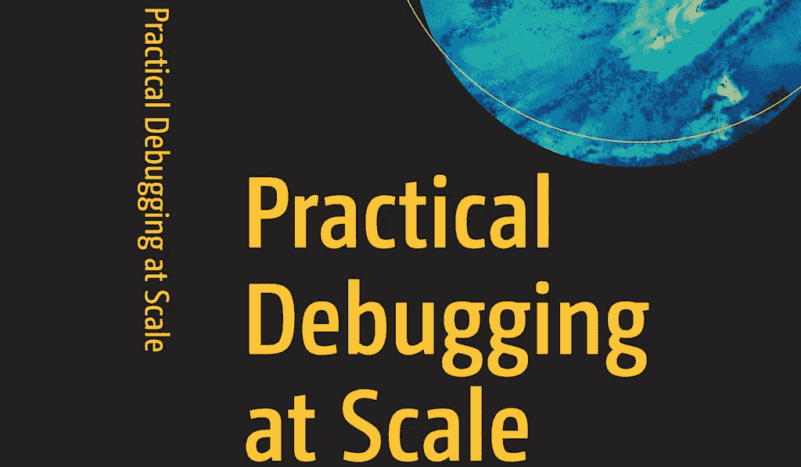

# 我们到了吗？我们什么时候搬到 GraalVM？

> 原文：<https://medium.com/javarevisited/are-we-there-yet-when-do-we-move-to-graalvm-6794b554a06f?source=collection_archive---------6----------------------->

在我进入本周文章的主题之前，我还有其他好消息。我刚刚把我即将出版的调试书的最后一章(第 14 章)寄给了出版商，书名是:“大规模实用调试”。Kubernetes 和生产中的云本机调试”。写这本书很有趣，我希望你会喜欢读它。请关注我或观看此空间的更新，并提供预购链接。它应该很快就会进来…

这是提出这一点的最佳时机。正当《春天的原生》走向前台的时候。是时候迁移到 GraalVM 了吗？剧透:看情况。是的，如果你正在构建无服务器，如果你正在构建几乎任何东西，可能没有。除了一些微服务之外。

在我开始之前，我想说明一下我所说的本机映像(SubstrateVM)是指大多数人所说的 GraalVM。这个特性接管了一个更大、更有野心的项目，其中包括一些令人惊叹的功能，比如多语言编程。GraalVM 本机映像让我们可以将 Java 项目编译成本机代码。它执行分析和删除不必要的东西，它可以大大减少二进制文件的大小和启动时间。我已经看到启动时间提高了 10-20 倍，这是很大的进步。Ram 的使用量也低得多，有时也是类似的程度，但通常不那么显著。

具有讽刺意味的是，GraalVM 甚至可能比典型的 JVM 更安全，因为它缺乏动态特性。对 GraalVM 进行对象序列化攻击可能要困难得多。希望我没有无意中挑战每个安全研究员来证明我现在是错的…

# 不利之处

我是一个性能极客。有了这些数字，我通常会匆忙地将我的应用程序编译成本机代码，然后继续前进，以获得更快的性能。但情况并不明朗。对于长时间运行的进程，JVM 在生产中可能仍然表现得更好。传统部署不太依赖启动时间，甚至不依赖 RAM。有一些微服务两者都可能有影响，但在大多数情况下，这不是唯一的考虑因素。

首先，GraalVM 的性能故事比启动时间更微妙。对于长时间运行的大型应用程序，启动时间和内存差异并不明显。运行时性能并不是一个清晰的故事，它通常会有利于其他 JVM。这是一个非常微妙的故事，因为本机映像支持概要分析来为编译器和其他有趣的工具生成优化提示。

有些库很难适应原生映像(例如 FreeMarker)，有一些技巧，比如可以在常规 JVM 上使用跟踪代理来检测动态代码。使用跟踪代理执行的结果，您可以打包本机应用程序。但是这是一个比仅仅给 maven 添加一个依赖项更复杂的项目。

在过去的几年中，GraalVM 的编译速度有了很大的提高，但是仍然比典型的 maven 编译慢得多。但这还不是最糟糕的部分。最糟糕的部分是相对贫乏的可观察性故事。

明确地说，像 JFR 这样的工具和 Java 的其他功能都是受支持的。甚至 JMX 也来了。这意味着您可以在本机可执行文件上使用 jconsole 和其他惊人的 JVM 功能。太壮观了。您甚至可以调试本机可执行文件，IntelliJ/IDEA 只是添加了对直接调试可执行文件的本机支持。又一个巨大的进步！

但是有些东西仍然不被支持。代理 API 是许多 JVM 级扩展驻留的地方。显然在[中已经做了一些工作来支持这些特性](https://twitter.com/fniephaus/status/1580897995050340352?s=20&t=lvgbWGv2FuRwoDy_l3x5vA)，但可能并不是工具中涵盖的所有内容。尽管如此，这仍将是一个巨大的推动。

# 那么我们应该使用它吗？

我上一次启动 Spring Boot 项目是在 3.0 之前，我选择了 Spring Native 的早期预览版作为 [initializr 创建向导](https://start.spring.io/)中的选项。所以我非常支持用 GraalVM 做实验，我认为这是一个惊人的选择，随着时间的推移，它会变得越来越有吸引力。事实上，对于许多 CLI 工具来说，这可能已经是最好的选择了。

我们是否应该在生产中使用它是一个不同的问题。在某些情况下，这是不切实际的。如果您构建 GUI 应用程序或者依赖于动态类加载，那么这种情况是无声的。但是，Spring Boot 3 非常令人兴奋，我渴望将项目迁移到它(和 JDK 17)。当我们迁移这些项目时，我应该以“本地优先”为目标吗？

现在，我打算在 CI 中有一个 GraalVM 本地映像构建目标。然而，我们可能会在云中部署标准的 JVM。这背后的主要原因是以上所有，但最重要的是所有的可观察性和熟悉性方面。当我们为扩展而构建时，特定节点的单个性能并不重要。这很重要，但大局和大规模解决问题的能力更重要。

想象一下，在多台服务器之间进行跟踪，查看时间并追踪问题的根本原因。这是大规模生产问题的核心。跟踪有助于我们理解性能问题或故障的根本原因。痕迹的酷之处在于它们是免费的。因为免费，我们不需要为他们写太多代码。我们的代码被无缝地插入了该功能。

追踪领域的后起之秀是 OpenTelemetry，它使用代理 API。它在那个领域不是独一无二的；代理 API 在行业中很流行。如果没有代理 API，许多对于大规模系统来说必不可少的特性(跟踪、开发人员可观察性、错误处理、APMs 等)。)都消失了。

# 什么时候天气好？

无服务器是理想的情况。虽然它也需要开发人员的可观察性工具，但它已经在这种扩展上遇到了一些问题。例如，Lambda 在某些代理配置下会失败。请注意，有针对 AWS 的跟踪解决方案，可以解决这个问题。对于无服务器，使用本机映像可以节省成本、加快速度，而且是免费的。这是一个直截了当的决定。

在其他情况下，我试图把握住脉搏，因为这些事情会在一夜之间发生变化。这就是为什么我建议现在就试用 GraalVM。这将为您将来迁移虚拟机做好准备。

我们仍然使用标准 JVM 进行部署的原因是，目前我们的部署没有看到 GraalVM 的明显优势。我们没有足够的规模和成本提升/降低来实现这一转变。

# 最后

在 twitter 上的[讨论中，](https://twitter.com/karsilz/status/1580850609594728448?s=20&t=Vswp3UTOEoEYv_Mf7f8rZg)我预测 50%的 Java 开发人员将需要 10 年时间迁移到 GraalVM，除非 Layden 突然改变动态，使标准 JVM 更加高效。Java 开发人员行动缓慢，我认为这是一个特点，而不是一个缺陷。

22 岁的 GraalVM 与仅仅 3 年前相比处于完全不同的位置。它的辅助工具和第三方支持终于都有了起色，它准备跨越鸿沟。我认为它已经为 CLI 工具做到了这一点。即使你现在没有拿起它，你也应该试一试，因为在使用它的时候有很多东西要学。

它带来的最大好处之一是关注我们应用程序中的反射代码。减少代码将提高应用程序的质量，增加更容易调试的命令性逻辑。将使故障更加清晰，也可能提高常规 JVM 的性能。供应商需要做的支持 GraalVM 的工作对我们所有人来说都很重要。

我也几乎没有涉及 GraalVM 的多语言方面，这是它最令人兴奋的特性。将 Java 和 python 代码集成到原生二进制文件中是一个强大的提议。