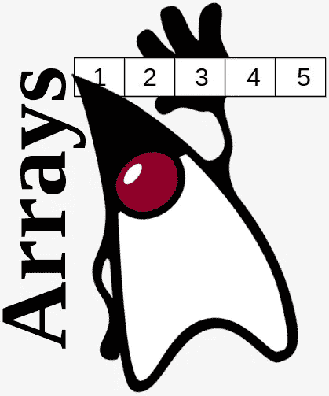

# Java 中的数组

> 原文：<https://medium.com/javarevisited/arrays-in-java-1ac38125458b?source=collection_archive---------4----------------------->

## 数组是 Java 语言的基石。这是一个简单而强大的数据结构。本教程是关于 Java 中数组的基础知识，每个开发人员都应该知道。

## 1.简介

让我们来定义什么是数组。

> 数组是一个带有…