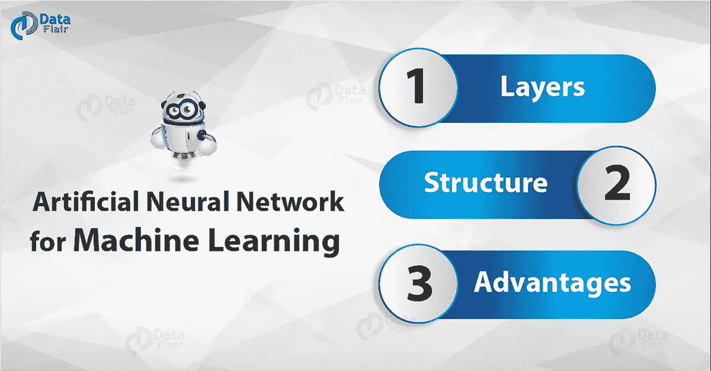
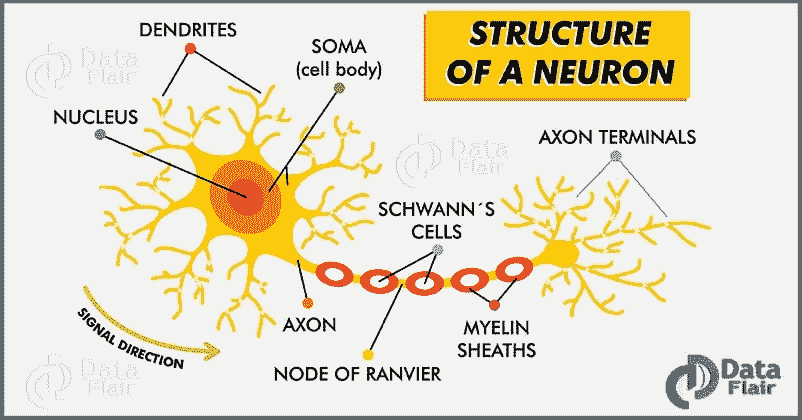
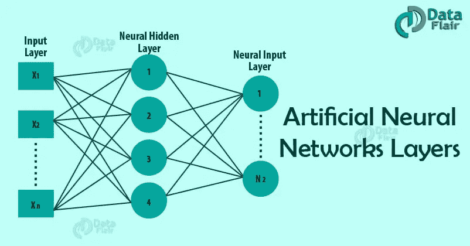

# 用于机器学习的人工神经网络——结构和层

> 原文：<https://medium.com/javarevisited/artificial-neural-network-for-machine-learning-structure-layers-a031fcb279d7?source=collection_archive---------0----------------------->

丹尼尔·沃格尔在 [Unsplash](https://unsplash.com?utm_source=medium&utm_medium=referral) 上的照片

人工神经网络(ANN)是一种计算模型。它基于生物神经网络的结构和功能。它的工作方式类似于人脑处理信息的方式。人工神经网络包括大量相互连接的处理单元，它们一起工作来处理信息。他们也从中产生有意义的结果。

所以，我们来开始一篇机器学习的人工神经网络的文章。

*用于机器学习的人工神经网络—结构&层*

# 用于机器学习的人工神经网络简介

人工神经网络(ANN)或神经网络是计算算法。

它旨在模拟由“神经元”组成的生物系统的行为。人工神经网络是受动物中枢神经系统启发的计算模型。它能够进行[机器学习](http://data-flair.training/blogs/machine-learning-tutorial/)以及模式识别。这些呈现为相互连接的“神经元”系统，可以根据输入计算值。
神经网络是一个有向图。

它由节点组成，这些节点在生物类比中代表神经元，由弧线连接。它对应于树突和突触。在每个节点处，每个弧与一个权重相关联。

应用由节点接收的作为输入的值，并沿着引入的弧定义激活函数，通过弧的权重进行调整。

生物神经网络的结构。神经网络是基于人类神经元模型的[机器学习](https://hackernoon.com/10-machine-learning-data-science-and-deep-learning-courses-for-programmers-7edc56078cde)算法。人脑由数百万个神经元组成。它以电信号和化学信号的形式发送和处理信号。这些神经元通过一种叫做突触的特殊结构连接在一起。突触允许神经元传递信号。从大量的模拟神经元神经网络形式。

人工神经网络是一种信息处理技术。它的工作方式类似于人脑处理信息的方式。人工神经网络包括大量相互连接的处理单元，它们一起工作来处理信息。他们也从中产生有意义的结果。

我们不仅可以应用[神经网络](https://data-flair.training/blogs/neural-network-algorithms/)进行分类。它也可以应用于连续目标属性的回归。

神经网络在部门数据挖掘中有很大的应用。例如经济学、法医学等，以及用于模式识别。经过精心训练，它还可以用于大量数据中的数据分类。

# 人工神经网络层

*人工神经网络层*

人工神经网络通常是分层组织的。层由许多包含“激活功能”的互连“节点”组成。神经网络可以包含以下 3 层:

# a.输入层

输入层的目的是接收每个观察值的解释属性的值作为输入。通常，输入层中输入节点的数量等于解释变量的数量。“输入层”将模式呈现给网络，网络与一个或多个“隐藏层”通信。

输入层的节点是被动的，这意味着它们不会更改数据。它们在输入端接收单个值，并将该值复制到许多输出端。从输入层，它复制每个值并发送给所有隐藏节点。

# b.隐蔽层

隐藏层将给定的变换应用于网络内部的输入值。在这种情况下，来自其他隐藏节点或连接到每个节点的输入节点的传入弧。

它与输出弧连接到输出节点或其他隐藏节点。在隐藏层中，实际的处理是通过一个加权的“连接”系统来完成的。

可能有一个或多个隐藏层。进入隐藏节点的值乘以权重，权重是存储在程序中的一组预定数字。然后将加权输入相加以产生一个数字。

# c.输出层

然后隐藏层链接到一个“输出层”。输出层接收来自隐藏层或输入层的连接。它返回对应于响应变量预测的输出值。在分类问题中，通常只有一个输出节点。输出层的活动节点组合并更改数据以产生输出值。

神经网络提供有用数据操作的能力在于正确选择权重。这不同于传统的信息处理。

# 神经网络的结构

神经网络的结构也称为其“架构”或“拓扑”。它包括层数，基本单位。它还包括相互交叉的重量调节机构。结构的选择决定了将要获得的结果。这是实现神经网络的最关键部分。

最简单的结构是单元分布在两层:输入层和输出层。输入层中的每个单元都有一个输入和一个与输入相等的输出。

输出单元将输入层的所有单元连接到其输入，具有组合函数和传递函数。可能有一个以上的输出单元。在这种情况下，产生的模型是线性或逻辑回归。这取决于传递函数是线性的还是逻辑的。网络的权重是回归系数。

通过在输入和输出层以及该层中的单元之间添加一个或多个隐藏层，神经网络的预测能力增加。但是隐藏层的数量应该尽可能小。这确保了神经网络不会存储来自学习集的所有信息，而是可以将其一般化以避免过度拟合。

可能会出现过度拟合。当权重使系统学习学习集的细节而不是发现结构时，就会发生这种情况。当学习集的大小相对于模型的复杂性来说太小时，就会发生这种情况。无论隐藏层是否存在，当有许多类要预测时，网络的输出层有时可以有许多单元。

# 神经网络的优点和缺点

让我们看看用于机器学习的人工神经网络的一些优点和缺点:

*   神经网络在处理线性和非线性数据时表现良好，但对神经网络的一个常见批评(尤其是在机器人领域)是，它们需要针对现实世界的操作进行大量不同的训练。这是因为任何学习机都需要足够多的代表性例子，以捕捉允许其推广到新情况的底层结构。
*   即使一个或几个单元不能对网络作出响应，神经网络也能工作，但是为了实现大型和有效的软件神经网络，需要投入大量的处理和存储资源。虽然大脑有专门用于通过神经元图形处理信号的硬件，但在冯·诺依曼技术上模拟即使是最简单的形式也可能迫使神经网络设计者为其连接填充数百万个数据库行——这可能会消耗大量的计算机内存和硬盘空间。
*   神经网络从分析的数据中学习，并且不需要重新编程，但是它们被称为“黑盒”模型，并且对这些模型真正做什么提供很少的洞察。用户只需要给它输入，看着它训练，等待输出。

所以，这都是关于人工神经网络的[机器学习](https://dev.to/javinpaul/10-data-science-and-machine-learning-courses-for-programmers-looking-to-switch-career-57kd)。希望你喜欢我们的解释。

# 结论

人工神经网络被认为是简单的数学模型，可以增强现有的数据分析技术。虽然它不能与人脑的能力相比，但它仍然是人工智能的基本组成部分。
如果你对机器学习的人工神经网络有任何疑问，欢迎在评论区提问。