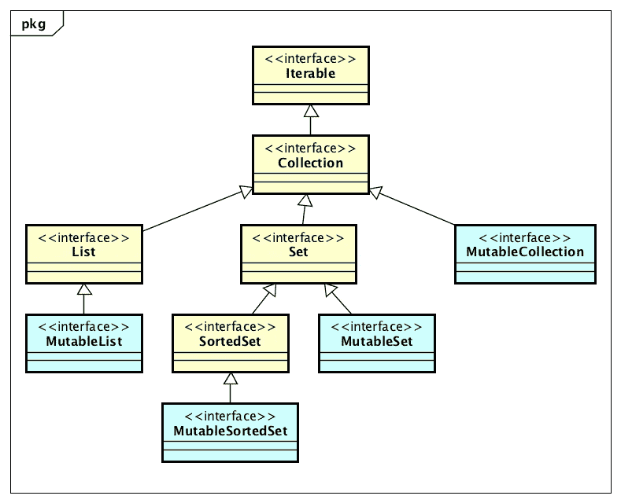

# 作为工厂事务—第 1 部分(可变)

> 原文：<https://medium.com/javarevisited/as-a-matter-of-factory-part-1-mutable-75cc2c5d72d9?source=collection_archive---------4----------------------->



黄色——JDK，蓝色——Eclipse 系列

在过去的一年里，我阅读了一些关于 Java 9 即将推出的新特性的博客、文章和推文。有些文章的标题是“Java 9 中的不可变集合”。Java 集合接口(List、Set、Map)上将有新的工厂方法，这些方法将创建**“紧凑的、不可修改的集合实例”**。该功能在 http://openjdk.java.net/jeps/269 的 JEP 269—中有描述。对于许多 Java 开发人员来说，这个特性将是一个受欢迎的新增功能，尤其是在像单元测试这样的地方，在那里创建小的集合可能是一个频繁且可能很麻烦的活动。

但是……我们在 Java 9 中没有得到“契约式”的不可变集合，JEP 269 也没有声称提供它们。如果我们在 Java 9 中获得“契约式”不可变集合，我希望看到名为`ImmutableCollection`、`ImmutableSet`、`ImmutableList`和`ImmutableMap`的新接口。然后，这些接口可以拥有“of”工厂方法来产生编译时安全的不可变集合实例。`ImmutableCollection`接口上不应该有`add` / `addAll`、`remove` / `removeAll`这样的方法，因为这些方法是不安全的，只能抛出`UnsupportedOperationException`。

如果您正在寻找 Java 的契约式不可变集合，现在有一些开源库可以提供它们。 [Eclipse Collections](https://www.eclipse.org/collections/) 提供了可变和不可变集合，并为它们提供了集合工厂。在这篇博客的第 1 部分中，我将比较 Eclipse 集合中可用的可变工厂方法和 Java 9 中将添加的新工厂方法。在第 2 部分中，我将探索可用于不可变集合的工厂。

Eclipse 集合中的所有可变容器实现都有静态工厂方法。这些方法仍然可用，因此您可以编写以下代码来使用 Eclipse 集合创建可变列表、集合和映射。

```
MutableList<String> list = 
    FastList.***newListWith***("1", "2", "3");MutableSet<String> set = 
    UnifiedSet.***newSetWith***("1", "2", "3");MutableMap<Integer, String> map = 
    UnifiedMap.***newWithKeysValues***(1, "1", 2, "2", 3, "3");
```

对于库的新开发人员来说，这些方法可能很难发现，因为开发人员首先需要知道适当的实现类的名称。

当库中引入不可变集合时，我们必须决定如何创建它们。我们需要一种一致的方法来创建可变和不可变的集合，这种方法将遵循一种一致的约定，并且易于开发人员学习。我们的解决方案是创建专用的集合工厂类。我们决定在工厂类中使用的约定是将容器类型与以“s”结尾的相应类型相匹配。所以`List`(s)`Set`(s)`Map`(s)等等。我们的目标是这里有好的[对称性](/@donraab/symmetric-sympathy-2c59d4541d60)，这样我们就能满足开发者的期望。下面是使用工厂类创建可变集合实例的等效代码。

```
MutableList<String> list = 
    Lists.***mutable***.with("1", "2", "3");MutableSet<String> set = 
    Sets.***mutable***.with("1", "2", "3");MutableMap<Integer, String> map = 
    Maps.***mutable***.with(1, "1", 2, "2");
```

如果想创建空的可变集合，只需使用`empty()`方法。

```
MutableList<String> list = 
    Lists.***mutable***.empty();MutableSet<String> set = 
    Sets.***mutable***.empty();MutableMap<Integer, String> map = 
    Maps.***mutable***.empty();
```

如果您想要一个更简洁的创建集合的选项，您可以使用带有静态导入的 [**Iterables**](https://www.eclipse.org/collections/javadoc/8.2.0/org/eclipse/collections/impl/factory/Iterables.html) 类。那你可以写下面。

```
MutableList<String> list = 
    ***mList***("1", "2", "3");MutableSet<String> set = 
    ***mSet***("1", "2", "3");MutableMap<Integer, String> map = 
    ***mMap***(1, "1", 2, "2", 3, "3");
```

**【m】**方法是**【可变】**的简称，还有**【I】**方法是**【不可变】**的简称。

Eclipse 集合中的所有可变接口都扩展了 JDK 中相应的可变接口。所以`[MutableList](https://www.eclipse.org/collections/javadoc/8.2.0/org/eclipse/collections/api/list/MutableList.html)`是一个`java.util.List`，`[MutableSet](https://www.eclipse.org/collections/javadoc/8.2.0/org/eclipse/collections/api/set/MutableSet.html)`是一个`java.util.Set`等等。


黄色——JDK，蓝色——Eclipse 系列

可变工厂将返回最具体的类型(例如`MutableList`)，但是您可以选择使用更抽象的类型(例如`java.util.List`)。

```
List<String> list = 
    Lists.***mutable***.with("1", "2", "3");Set<String> set = 
    Sets.***mutable***.with("1", "2", "3");Map<Integer, String> map = 
    Maps.***mutable***.with(1, "1", 2, "2", 3, "3");
```

Java 9 中添加的工厂方法如下所示。

```
List<String> list = 
    List.of("1", "2", "3");Set<String> set = 
    Set.of("1", "2", "3");Map<Integer, String> map = 
    Map.of(1, "1", 2, "2", 3, "3");
```

不同的是，上面的方法返回不可修改的实例，这些实例有可变的接口。

如果您希望使用 java.util.Collection 接口，并且希望返回的实例像上面的 Java 9 工厂方法一样不可修改，那么您可以使用 Eclipse 集合中所有可变集合上可用的`asUnmodifiable()`方法。

```
List<String> list = 
    Lists.***mutable***.with("1", "2", "3").**asUnmodifiable**();Set<String> set = 
    Sets.***mutable***.with("1", "2", "3").**asUnmodifiable**();Map<Integer, String> map = 
    Maps.***mutable***.with(1, "1", 2, "2", 3, "3").**asUnmodifiable**();
```

如果想让它们同步，可以用`asSynchronized()`。

```
List<String> list = 
    Lists.***mutable***.with("1", "2", "3").**asSynchronized**();Set<String> set = 
    Sets.***mutable***.with("1", "2", "3").**asSynchronized**();Map<Integer, String> map = 
    Maps.***mutable***.with(1, "1", 2, "2", 3, "3").**asSynchronized**();
```

下面显示了 Eclipse 集合中可用的可变对象集合的所有工厂。

```
MutableList<T> list = Lists.***mutable***.empty();MutableSet<T> set = Sets.***mutable***.empty();
MutableSortedSet<T> sortedSet = SortedSets.***mutable***.empty();MutableMap<K, V> map = Maps.***mutable***.empty();
MutableSortedMap<K, V> sortedMap = SortedMaps.***mutable***.empty();MutableStack<T> stack = Stacks.***mutable***.empty();MutableBag<T> bag = Bags.***mutable***.empty();
MutableSortedBag<T> sortedBag = SortedBags.***mutable***.empty();MutableBiMap<K, V> biMap = BiMaps.***mutable***.empty();MutableListMultimap<K, V> multimap = Multimaps.***mutable***.list.empty();
MutableSetMultimap<K, V> multimap = Multimaps.***mutable***.set.empty();
MutableBagMultimap<K, V> multimap = Multimaps.***mutable***.bag.empty();
```

Eclipse 集合也支持所有八种 Java 原语类型的容器。为了提供与对应对象的良好对称，所有可变原始容器类型都有[工厂类。](https://github.com/eclipse/eclipse-collections/blob/master/docs/guide.md#-creating-primitive-collections)

```
MutableIntList list = 
    IntLists.***mutable***.empty();
MutableIntSet set = 
    IntSets.***mutable***.empty();
MutableIntBag bag = 
    IntBags.***mutable***.empty();
MutableIntStack stack = 
    IntStacks.***mutable***.empty();// supports all combinations for all 8 primitives
MutableIntIntMap map = 
    IntIntMaps.***mutable***.empty();  
MutableIntObjectMap<V> map = 
    IntObjectMaps.***mutable***.empty();
MutableObjectIntMap<K> map = 
    ObjectIntMaps.***mutable***.empty();
```

所有容器类型的所有基本类型都有工厂。可变原语容器也有不可修改的和同步的版本，以提供与其对象对应物的良好对称性。

```
MutableIntList list = 
    IntLists.***mutable***.with(1, 2, 3).**asUnmodifiable**();MutableIntList list = 
    IntLists.***mutable***.with(1, 2, 3).**asSynchronized**();
```

Eclipse 集合中的集合工厂可以与所有版本的 Java 一起工作，一直到版本 5。如果您想在 Java 8 之前的 Java 版本中使用集合工厂，您需要使用 Eclipse Collections 7 . x。Eclipse Collections 8 . x 只与 Java 8+兼容。Eclipse 集合 7.x 和 8.x 都支持 [Java 8](/javarevisited/top-5-java-online-courses-for-beginners-best-of-lot-1e1e240a758) 。

**同**同*或*同

到目前为止，我展示的所有使用“**和**”的例子也可以使用“ **of** ”来编写。在“with”和“of”的命名战中，有两个赢家。所以如果你喜欢用而不是用，你可以这样写。FWIW，“with”方式更符合 Smalltalk 风格。

```
List<String> list = 
    Lists.***mutable***.of("1", "2", "3");Set<String> set = 
    Sets.***mutable***.of("1", "2", "3");Map<Integer, String> map = 
    Maps.***mutable***.of(1, "1", 2, "2", 3, "3");
```

我认为这是暂时停下来的好地方。在本博客系列的第 2 部分中，我将概述可用于 Eclipse 集合的不可变工厂。

[*月食收藏*](https://github.com/eclipse/eclipse-collections) *是开给* [*投稿*](https://github.com/eclipse/eclipse-collections/blob/master/CONTRIBUTING.md) *的。如果你喜欢这个库，你可以在 GitHub 上让我们知道。*