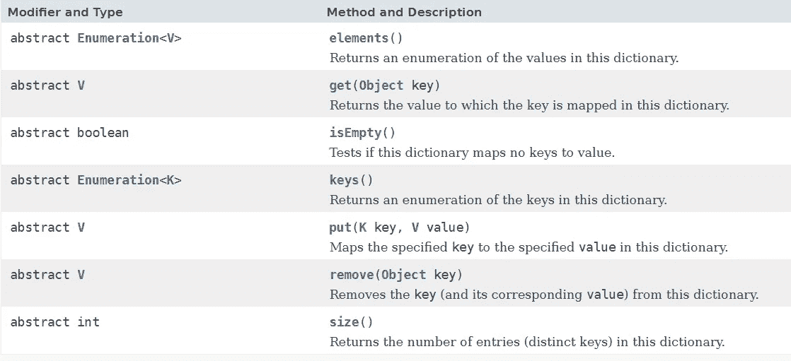

# Java 中类似关联数组的实现

> 原文：<https://medium.com/javarevisited/assocative-array-like-implementation-in-java-883997c660f5?source=collection_archive---------1----------------------->

许多编程语言支持带有命名索引的数组，例如 [C++](/@javinpaul/top-10-courses-to-learn-c-for-beginners-best-and-free-4afc262a544e) 、 [PHP](/javarevisited/top-10-free-courses-to-learn-php-and-mysql-for-web-development-e96e69982675) 、 [Python](/javarevisited/10-free-python-tutorials-and-courses-from-google-microsoft-and-coursera-for-beginners-96b9ad20b4e6) 等。Java 有一个使用映射数据结构的循环实现，但它不是一个关联数组。


命名关联键值数组

# 什么是关联数组？

带有命名索引的数组称为关联数组(或散列)。

**JavaScript 中的关联数组**

[JavaScript](/javarevisited/10-best-online-courses-to-learn-javascript-in-2020-af5ed0801645) 不**不**支持带命名索引的数组。在 JavaScript 中，**数组**总是使用**编号的索引**。

甚至 JavaScript 数组基本上也只是对象，只是属性名是数字(0，1，…)。

```
var myArray = {}; // creating a object
myArray['a'] = 20; // setting the attribute a to 20
myArray['b'] = 30; // setting the attribute b to 30
```

重要的是要理解`myArray['a'] = 20;`与`myArray.a = 20;`是相同的

**c++中的关联数组**

关联数组也被称为**映射**或**字典**。在 [C++](https://www.java67.com/2018/02/5-free-cpp-courses-to-learn-programming.html) 中。在这些数组中，索引可以是数字或任何其他数据类型，即可以是数字 0、1、2、3..或者字符 a、b、c、d…
这些索引称为 ***键*** ，存储在该位置的数据称为
***值*** 。所以在关联数组中我们有 **(key，value)** 对。

**PHP 中的关联数组**

有两种方法可以创建关联阵列:

```
$age = array(“Naruto”=>”15", “Sasuke”=>”16", “Lee”=>”17");or$age[‘Naruto’] = “15”;
$age[‘Sasuke’] = “16”;
$age[‘Lee’] = “17”;
```

**JAVA 中的关联数组**

Java 就像 JavaScript 一样**不**支持带有命名 indexes.Java 的数组**数组**总是使用**编号的索引**。但是 Java 有一个替代的字典实现，即 Map，它提供了基于{key，value}对散列的机制和快速检索、冲突处理机制。

但是由于 [Map](https://docs.oracle.com/javase/8/docs/api/java/util/Map.html) 接口有很多功能要实现，我决定使用[字典](https://docs.oracle.com/javase/8/docs/api/java/util/Dictionary.html)接口，它有一套非常基本的方法(虽然这个接口现在已经过时了，但它最适合名为基本索引的关联数组。



字典接口的基本方法

所以让我们深入研究代码:

我通过实现 Dictionary 接口创建了 ArrayDictionary 类，它具有两个通用的数组变量:key 和值(K[] keys，V[] values)，size & incrementalSize。

下面是 github 的完整实现链接:

<https://github.com/root0109/util/blob/master/src/main/java/com/zaprit/collections/ArrayDictionary.java>  

## **我在哪里使用它？**

正如我在关于序列化技术的博客中所解释的，处理大规模的开发人员倾向于通过选择[可外化](https://docs.oracle.com/en/java/javase/11/docs/api/java.base/java/io/Externalizable.html) / [可写](https://hadoop.apache.org/docs/current/api/org/apache/hadoop/io/Writable.html)接口来实现他们自己的序列化机制，并决定如何序列化/反序列化成员变量。

您可以在下面阅读有关 Java 序列化问题的更多信息:

<https://www.linqz.io/2018/03/serialization-techniques-for-highly-scalable-systems.html>  

这两个接口都要求开发人员实现读/写方法。

所以很多人倾向于使用 HashMap 或 LinkedHashMap 实现来写入流和从流中读取，只是为了避免字节读/写顺序。

例如，Person 类将 id 和 name 作为其成员变量。实现的读和写方法看起来像这样(下面的例子是[可外化的](https://docs.oracle.com/en/java/javase/11/docs/api/java.base/java/io/Externalizable.html)读/写方法):

```
@Override
public void writeExternal(ObjectOutput out) throws IOException
{
 Map<String, Object> serializedMap = new HashMap<>();
 serializedMap.put("id", id);
 serializedMap.put("name", this.getName());
 out.writeObject(serializedMap);
}@SuppressWarnings("unchecked")
@Override
public void readExternal(ObjectInput in) throws IOException, ClassNotFoundException
{
 Map<String, Object> deserializedMap = (Map<String, Object>) in.readObject();
 this.id = (String) deserializedMap.get("id");
 this.Name = (String) deserializedMap.get("name");
}
```

Hashmap 提供了不记住顺序的灵活性，但是增加了额外的内存开销。

因此，为了避免这种情况，我在名为 indexes 的关联数组行上写了一个更简单有效的内存实现。所以 ArrayDictionary 替换了 Hashmap，因此如果实现了**可写的**接口，那么实现将是:

```
public void write(DataOutput out) throws IOException 
{
  Dictionary<String, Object> serializedMap = new ArrayDictionary<>(); 
   serializedMap.put("id", id);
   serializedMap.put("name", this.getName());
   out.writeObject(serializedMap);
}

public void readFields(DataInput in) throws IOException 
{
    Dictionary<String, Object> deserializedMap = (ArrayDictionary<String, Object>) in.readObject();
   this.id = (String) deserializedMap.get("id");
 this.Name = (String) deserializedMap.get("name");
}
```

因此，上述用法描述了命名索引基数组的重要性。

如果你喜欢这个博客内容，请考虑买一杯咖啡。谢谢大家的支持！


有问题吗？建议？评论？

下一步是什么？ [**在媒体上关注我**](/@vaibhav0109) 成为第一个阅读我的故事的人。