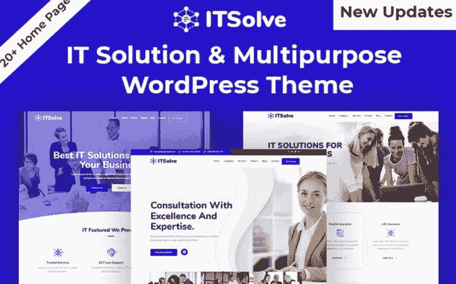
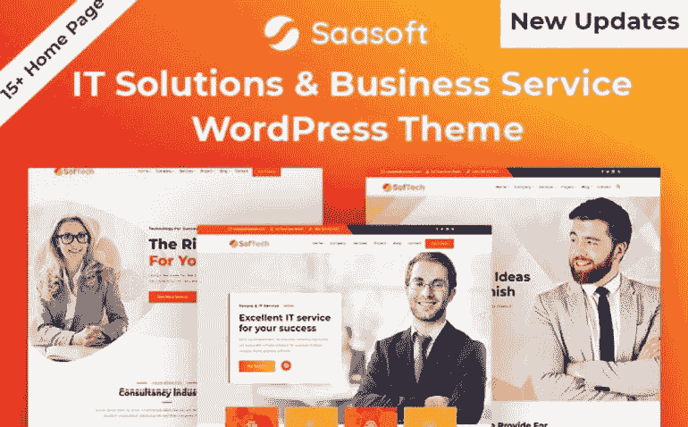
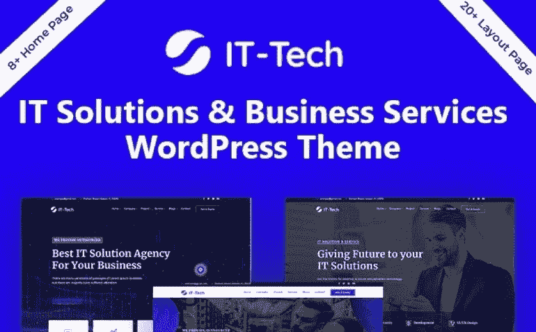
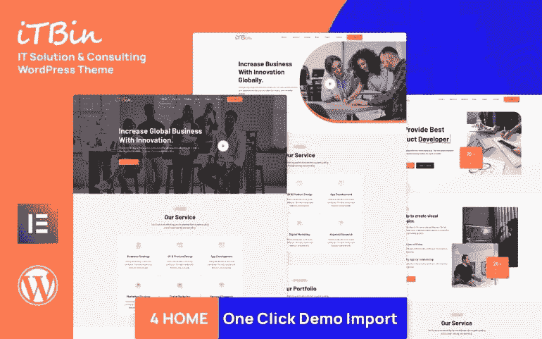
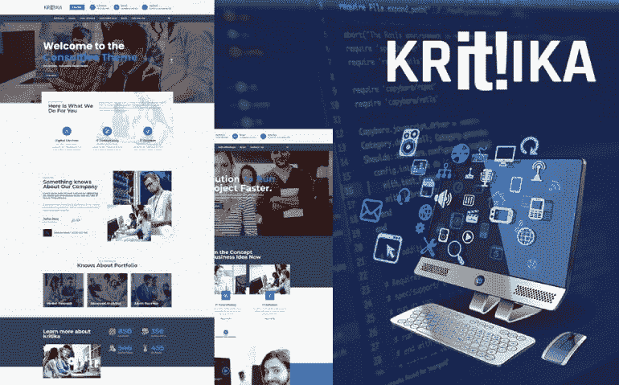
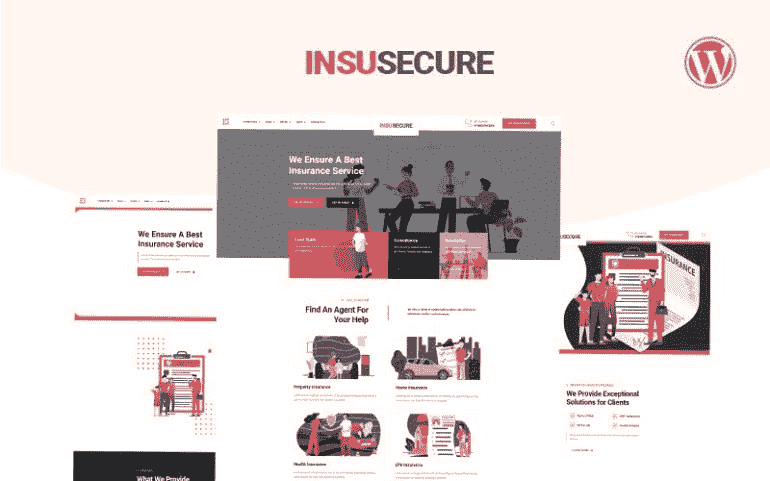

# 真实有效:十大信息安全主题

> 原文：<https://medium.com/javarevisited/authentic-and-effective-top-10-information-security-wordpress-themes-baf8e2ca261b?source=collection_archive---------4----------------------->

大多数当前的公司数据以电子方式存储在服务器、个人电脑、笔记本电脑或互联网上。我们已经忘记了十年前存放在柜子里的文件。人们习惯于在网上传递他们的私人信息。因此，我们不可能忘记信息安全。今天你将熟悉 10+ [信息安全 WordPress 主题](https://www.templatemonster.com/category/information-security-wordpress-themes/?aff=javarevisited&utm_campaign=tmwordpressthemes&utm_source=mediumjavarevisited&utm_medium=referral)。

WordPress 总是一个开始的好地方。它为每个愿意建立网站的人提供了一个极好的机会，不管他们的业务类型如何。来自世界各地的人们决定推出网站和博客，希望能引起注意。只要出现在互联网上，你就有机会推广你的服务和产品。

作为一个拥有众多竞争对手的庞大群体中的一员，也有不利的一面。换句话说，压力会让你过于专注于被关注。如果你不能完成这项任务，将会有很多其他公司渴望取代你的位置。

幸运的是， [WordPress](/javarevisited/5-best-wordpress-courses-for-beginners-and-experienced-website-developers-b45f7976ee40) 有大量的特性来帮助你实现这个目标。它适用于所有的网站类型，不需要任何成本，并且支持不同的媒体类型。更重要的是，它有许多定制选项。

现在是时候看看*最佳信息安全主题*了。如果您准备购买其中一些，请确保使用特殊的促销代码(**javarestived**)。它给 WordPress 主题 5%的折扣。

[最好的 MonsterONE 黑色星期五交易！](https://www.templatemonster.com/monsterone/?aff=javarevisited&utm_campaign=blackfriday2021&utm_source=javarevisited&utm_medium=referral)

# 10+信息安全专家主题

## 网络信息技术解决方案&多用途 WordPress 主题

首先，让我们熟悉一个来自*最佳信息安全主题*的看起来很专业的例子。它也适合展示其他最新的技术和软件。

该软件包有广泛的功能和工具，将使其他人认真对待你的网站。你可以从 20 多个原始演示和 70 多个精心设计的内页中自由选择，用于各种目的。

它还包括一个多功能的国王作曲家。这个拖放构建器确保每个人都可以修改他们的内容并创建有吸引力的页面。

主要特点:

*   15+页眉和 10+页脚；
*   手机友好型设计；
*   联系方式；
*   增加了旋转木马；
*   谷歌字体。

[立即购买](https://www.templatemonster.com/wordpress-themes/cyber-it-solutions-it-startup-wordpress-theme-100700.html?aff=javarevisited&utm_campaign=tmwordpressthemes&utm_source=mediumjavarevisited&utm_medium=referral)

## IT-Soft——技术和 IT 解决方案服务

另一个奇妙的主题将成为信息技术领域专家的理想助手。对于那些需要推广他们的创业公司、应用程序和 It 服务的人来说，这也是一个完美的匹配。您有机会从用户友好的 Elementor 页面生成器和广受欢迎的 King Composer 中进行选择。这些构建器中的每一个都确保您可以根据自己的需要和偏好编辑所有组件。除此之外，对于这些编辑器，每个演示都有两个版本。总的来说，这个包提供了 20 多个独特的演示。

主要特点:

*   菜单定制；
*   不限颜色选择；
*   全响应设计；
*   背景视频；
*   联系方式。

[立即购买](https://www.templatemonster.com/wordpress-themes/itsoft-it-solution-business-services-wordpress-theme-103097.html?aff=javarevisited&utm_campaign=tmwordpressthemes&utm_source=mediumjavarevisited&utm_medium=referral)

## IT solve——商业 IT 解决方案和多用途 WordPress 主题

ITSolve 是一个多用途的选项，你可以在最好的信息技术 WordPress 主题中找到。连同这个有价值的包，它将花费你什么来宣传你的服务。什么是最重要的选择，将使该网站成为一个体面的努力？首先，有 20 多个演示版本和 70 多个内页来展示所有重要的细节。要获得令人惊叹的设计，请确保使用 15+的页眉样式和 10+的页脚样式。还可以添加一个联系表单，让人们与您的团队进行交流。

主要特点:

*   增加了旋转木马；
*   画廊；
*   博客和投资组合功能；
*   谷歌地图；
*   WPML 支持。

[立即购买](https://www.templatemonster.com/wordpress-themes/it-solve-it-solution-multipurpose-wordpress-theme-108080.html?aff=javarevisited&utm_campaign=tmwordpressthemes&utm_source=mediumjavarevisited&utm_medium=referral)

[**TemplateMonster 的黑色星期五交易**](https://www.templatemonster.com/sale/?sort=bestsellers/?aff=javarevisited&utm_campaign=blackfriday2021&utm_source=javarevisited&utm_medium=referral)

## softech——IT 解决方案和商业服务

Softech 是一个灵活而强大的主题，它允许为不同的网络机构建立网站。它有几乎无限的可能性，确保您的网站将是美丽和非凡的。要忘记势不可挡的竞争，你可以有多种选择。例如，您可以自由编辑背景视频并添加下拉菜单。此外，它具有完全响应的设计。换句话说，访问者可以通过所有的小工具查看你的内容。

主要特点:

*   15 个以上独特的演示；
*   谷歌字体；
*   联系方式；
*   添加了视频；
*   拖放页面生成器。

[立即购买](https://www.templatemonster.com/wordpress-themes/softech-it-solution-amp-business-service-wordpress-theme-112219.html?aff=javarevisited&utm_campaign=tmwordpressthemes&utm_source=mediumjavarevisited&utm_medium=referral)

## IT-Tech — IT 解决方案和商业服务 WordPress 主题

你是否梦想过拥有一个设计精美、引人注目、鹤立鸡群的网站？再加上一些非同寻常的[信息安全](/javarevisited/7-best-cyber-security-courses-for-programmers-and-developers-50afafae050b) WordPress 主题，这将成为可能。它的功能范围将提供一个完美的在线项目，给你的客户留下持久的印象。

完全的[响应设计](/javarevisited/8-best-responsive-design-courses-for-web-developers-e507f7952774)适用于所有类型的设备。还有多个定制选项，允许编辑页眉、页脚、按钮、菜单和其他元素。不要忘记联系表格的可用性，以建立与目标受众的紧密联系。

主要特点:

*   15+页眉样式和 10+页脚样式；
*   WPML 支持；
*   拖放页面生成器；
*   增加了旋转木马；
*   无限的颜色选择。

[立即购买](https://www.templatemonster.com/wordpress-themes/it-tech-it-solution-business-service-wordpress-theme-98853.html?aff=javarevisited&utm_campaign=tmwordpressthemes&utm_source=mediumjavarevisited&utm_medium=referral)

## Petech — IT 解决方案和商业服务主题

一些专业人士要求有一个可靠的助手，在没有任何编程知识的情况下建立一个网站。幸运的是，一堆信息安全主题可以让你比你的对手有明显的优势。该软件包提供了 5 个以上令人印象深刻的演示选项。之后，一个全功能的 King Composer 将能够添加内容并管理它。还有 WPML 支持，允许将您的网站翻译成多种语言。

主要特点:

*   图库功能；
*   下拉菜单；
*   博客；
*   背景视频；
*   谷歌地图。

[立即购买](https://www.templatemonster.com/wordpress-themes/petech-it-solution-amp-business-service-wordpress-theme-124753.html?aff=javarevisited&utm_campaign=tmwordpressthemes&utm_source=mediumjavarevisited&utm_medium=referral)

## App wave——创新时尚的应用登陆页面

毫无疑问，每家公司都想扩大客户群，并尽可能以最好的方式展现服务。使用这一革命性的主题，可以轻松获得与众不同的外观。首先，你可以自由地构建你的内容，不需要任何编码技能。这是可能的，感谢一个强大的 Elementor 页面生成器，它提供了一个快速的定制过程。一键安装过程将节省您的时间和精力。

主要特点:

*   奖励图像；
*   全响应设计；
*   WPML-准备好了；
*   社交媒体整合；
*   订阅时事通讯。

[立即购买](https://www.templatemonster.com/wordpress-themes/appwave-innovative-and-stylish-app-landing-page-wordpress-theme-88618.html?aff=javarevisited&utm_campaign=tmwordpressthemes&utm_source=mediumjavarevisited&utm_medium=referral) | [在 MonsterONE](https://www.templatemonster.com/wordpress-themes/appwave-innovative-and-stylish-app-landing-page-wordpress-theme-88618.html?aff=javarevisited&utm_campaign=tmwordpressthemes&utm_source=mediumjavarevisited&utm_medium=referral) 免费下载

## 前缀——创意响应 WordPress 主题

当涉及到展示信息安全时，您需要将您的公司与其他公司区分开来。你不能有一些错误和失误。正因如此，选择这个创意主题会很惊艳。该软件包有各种各样的主页布局、自定义元素和预制页面。使用一个不可思议的元素或页面生成器，你可以通过拖放来修改它们。还有 18 个以上的标题选项，确保你的网站吸引眼球。

主要特点:

*   跨浏览器兼容设计；
*   翻译就绪；
*   WooCommerce 兼容性；
*   联系表单支持；
*   投资组合功能。

[立即购买](https://www.templatemonster.com/wordpress-themes/prefix-creative-elementor-responsive-wordpress-theme-98744.html?aff=javarevisited&utm_campaign=tmwordpressthemes&utm_source=mediumjavarevisited&utm_medium=referral) | [在 MonsterONE](https://monsterone.com/wordpress-themes/prefix-creative-responsive-wordpress-theme-o25649/?aff=javarevisited&utm_campaign=tmwordpressthemes&utm_source=mediumjavarevisited&utm_medium=referral) 免费下载

## 技术和商业解决方案服务

你需要为不同的目标提供一系列复杂功能的东西吗？这个有效的工具包允许轻松快捷的定制过程。它提供了满足各种口味的所有基本页面和布局。该包有 8+独特和经典的演示，可以打动你的潜在客户的想象力。还有一种联系方式，会让别人依赖你值得信赖的服务。

主要特点:

*   WPML 支持；
*   15 种以上的标题样式；
*   谷歌字体；
*   下拉菜单；
*   WooCommerce 功能。

[立即购买](https://www.templatemonster.com/wordpress-themes/webx-technology-amp-business-solution-service-wordpress-theme-124517.html?aff=javarevisited&utm_campaign=tmwordpressthemes&utm_source=mediumjavarevisited&utm_medium=referral)

## IT 专家— IT 解决方案和技术主题

你正在寻找一些现代优雅的信息安全主题吗？与这个令人难以置信的主题一起，获得一个让你感到自豪的在线项目是毫不费力的。设置和组织你的布局和内容将不费吹灰之力，这要感谢一个出色的国王作曲家。此外，它提供了一个[完全响应设计](https://www.java67.com/2020/08/top-5-courses-to-learn-responsive-web-design-best.html)。无论你的访问者决定选择什么设备，他们都可以浏览你的内容。

主要特点:

*   一键演示安装；
*   联系方式；
*   谷歌字体；
*   8 个以上的演示选择；
*   旋转木马已添加。

[立即购买](https://www.templatemonster.com/wordpress-themes/itexpert-it-solution-technology-wordpress-theme-108528.html?aff=javarevisited&utm_campaign=tmwordpressthemes&utm_source=mediumjavarevisited&utm_medium=referral)

## IT 解决方案和商业服务主题

为您的信息安全机构打造杀手级在线形象需要什么？时不时的选择合适的现成方案就够了。该软件包有大量的选择，允许脱颖而出。例如，可以使用四个不同的主页，并使用 Elementor 或 Page Builder 编辑它们。要装饰你的网站，一定要注意一些平滑过渡的效果。

主要特点:

*   一键演示安装；
*   背景视频；
*   团队成员；
*   下拉菜单；
*   联系方式。

[立即购买](https://www.templatemonster.com/wordpress-themes/itbin-it-solution-and-business-service-wordpress-theme-143358.html?aff=javarevisited&utm_campaign=tmwordpressthemes&utm_source=mediumjavarevisited&utm_medium=referral) | [在 MonsterONE 免费下载](https://monsterone.com/wordpress-themes/itbin-it-solution-and-business-service-wordpress-theme-o60424/?aff=javarevisited&utm_campaign=tmwordpressthemes&utm_source=mediumjavarevisited&utm_medium=referral)

## krit ika——IT 解决方案 WordPress 主题

Kritika 是一个值得注意的多功能主题，它可以以最佳状态呈现各种 it 相关主题。您不需要从头构建任何东西，因为这个包提供了所有必需的组件。首先，它有四个主页变体，可以给你的核心受众留下很好的第一印象。还有一个完全响应的设计，为您的访客创造一个完美的环境。不要忘记额外功能的可用性，包括视差效果。

主要特点:

*   下拉菜单；
*   谷歌地图；
*   团队成员；
*   博客功能；
*   WPML 支持。

[立即购买](https://www.templatemonster.com/wordpress-themes/kritika-it-solution-wordpress-theme-111925.html?aff=javarevisited&utm_campaign=tmwordpressthemes&utm_source=mediumjavarevisited&utm_medium=referral) | [在 MonsterONE](https://monsterone.com/wordpress-themes/kritika-it-solution-wordpress-theme-o34162/?aff=javarevisited&utm_campaign=tmwordpressthemes&utm_source=mediumjavarevisited&utm_medium=referral) 免费下载

## Insurance 多用途保险 WordPress 主题

你需要一个当代的主题和一堆可以增强你的网站功能的专业吗？在这种情况下，您可能会对这个奇妙的主题感到满意。它有一个点击式安装过程，不会浪费你的时间。

除此之外，你可以自由利用旋转滑块。它可以吸引更多的注意力到你的报价和更新。也有机会添加联系方式，和你的受众交流。

主要特点:

*   Twitter Feed
*   背景视频；
*   全响应设计；
*   WooCommerce 功能；
*   谷歌地图。

[立即购买](https://www.templatemonster.com/wordpress-themes/insusecure-multipurpose-insurance-wordpress-theme-163444.html?aff=javarevisited&utm_campaign=tmwordpressthemes&utm_source=mediumjavarevisited&utm_medium=referral) | [在 MonsterONE 免费下载](https://monsterone.com/wordpress-themes/insusecure-multipurpose-insurance-wordpress-theme-o78541/?aff=javarevisited&utm_campaign=tmwordpressthemes&utm_source=mediumjavarevisited&utm_medium=referral)

# 几句话作为结论

由于信息技术和科技的扩展和发展，许多事情变成了可能。

因此，许多企业专注于提供最佳解决方案，为全球增长做出贡献。如你所知，信息安全机构也不例外。

许多公司保证您的应用程序、商品和基础设施得到全面保护，免受网络攻击、数据泄露、盗窃和其他事故的影响。

因此，他们的网站应该有一个完美的外观和功能。多亏了上面提到的现成解决方案，获得一个有价值的网站不再是一件复杂的事情。记住，你也可以搜索[免费 WordPress 主题来下载](https://www.templatemonster.com/free-wordpress-themes.php?aff=javarevisited&utm_campaign=tmwordpressthemes&utm_source=mediumjavarevisited&utm_medium=referral)。感谢阅读！