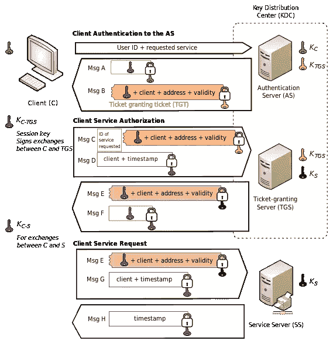
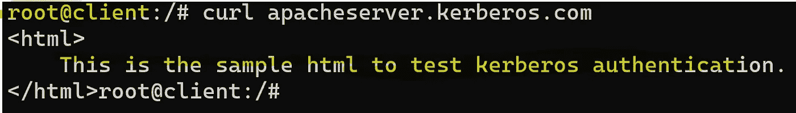
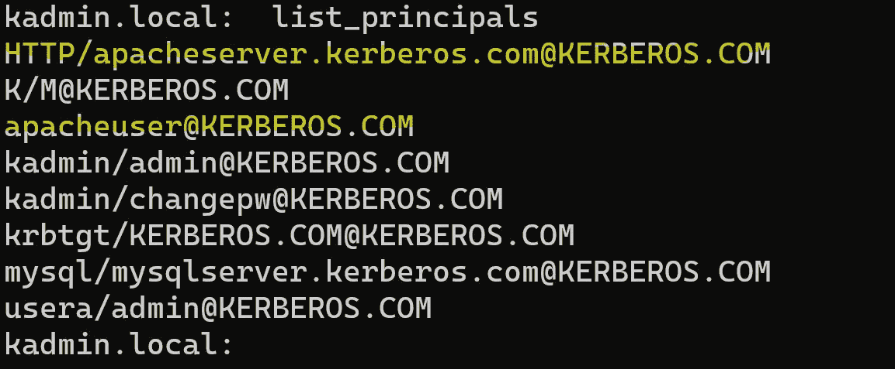
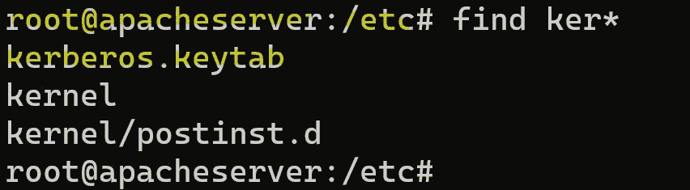
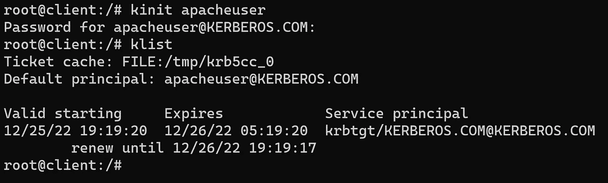
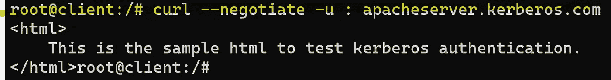

# 是否可以不交换密码或令牌进行身份验证？

> 原文：<https://medium.com/javarevisited/authenticate-without-passwords-or-tokens-cf68eeb4deef?source=collection_archive---------3----------------------->

Kerberos 本地主机

我们总是习惯于使用一个**用户名—密码**或者某种**令牌** *交换*机制发生在被授权方之间*建立* [***认证***](https://javarevisited.blogspot.com/2018/01/how-to-enable-http-basic-authentication-spring-security-java-xml-configuration.html) 。但是，如果我们不用明确地交换它们也能达到同样的效果呢？

让我们来探索一下 Kerberos。


由[布鲁克·卡吉尔](https://unsplash.com/@brookecagle?utm_source=medium&utm_medium=referral)在 [Unsplash](https://unsplash.com?utm_source=medium&utm_medium=referral) 拍摄的照片

如果你*只对**技术演示**部分*感兴趣，*如何跳过*至[？](##547b)

## 内容

*   [什么？](#237e)
*   [为什么？](#c841)
*   [行话](#e229)
*   [涉及的工具和实体](#1a0b)
*   如何？
    -[-](#5d65)
    -[实现](#47e4)
    a .[Kerberos 前](#2239)
    b. [添加 Kerberos 配置](#f551)
    c .[Kerberos 后](#7366)
*   [问&答](#b630)

> 什么？

它是一种网络[认证](/javarevisited/oauth-and-misconceptions-fe2005fecd72#f5f6)协议，使用[对称密钥密文](/@suriyaprakhash/cryptography-algorithms-e86ce7e2bb9b#0584) y 将客户端登录到**系统**或**服务。**

> 为什么？

它有助于*认证* **，而无需在两个相关**客户端**和**服务器**之间传递任何密码**。

在[回答之前如何](#547b)？，我们需要从理论的角度来理解它。

> 行话

在开始之前，我们可能需要了解一些[术语](https://web.mit.edu/kerberos/kfw-4.1/kfw-4.1/kfw-4.1-help/html/kerberos_terminology.htm)。


照片由[米卡·鲍梅斯特](https://unsplash.com/@mbaumi?utm_source=medium&utm_medium=referral)在 [Unsplash](https://unsplash.com?utm_source=medium&utm_medium=referral) 上拍摄

## 领域

**组资源**和**标识**，通常用**域**表示。*如* *庄家*。M*TB.COM 代表银行家*内 *M & T 银行。*

## 校长

代表**用户**或**服务**的唯一身份。

*   根据访问分组，用户主要名称*如 suriya@MTB.COM*或*suriya@BANKER.MTB.COM*。
*   SPN—服务主体名称，例如 host/machine1.mtb.com@MTB。计算机输出缩微胶片

## 认证服务器

顾名思义，它根据数据库对[请求的主体](#9c44)进行身份验证，并向客户端提供 [TGT](#6d57)

## **赠票票**

这就像我们在入口处售票柜台得到的游乐园票带。从技术上讲，这是一个加密的数据块。

## 票据授予服务器

这是服务器使用客户端之前获得的 [TGT](#6d57) 向请求访问服务的客户端发出[服务票](#f57e)。

## **服务票**

这就像一张我们需要在乘车柜台购买的票，我们可能想要在不同的乘车柜台购买不同的票。从技术上讲，这也是一个加密的数据块。

[](https://javarevisited.blogspot.com/2021/02/spring-security-interview-questions-answers-java.html)

图片来自[维基百科](https://en.wikipedia.org/wiki/Kerberos_(protocol))

> 涉及的工具和实体

## KDC

[密钥分发中心](https://www.oreilly.com/library/view/kerberos-the-definitive/0596004036/ch02s04s03.html#:~:text=The%20Kerberos%20Key%20Distribution%20Center,and%20the%20Ticket%20Granting%20Server.#test-content-id)由配置的[域](#970a)内的[三个逻辑组件](https://www.oreilly.com/library/view/kerberos-the-definitive/0596004036/ch02s04s03.html#:~:text=The%20Kerberos%20Key%20Distribution%20Center,and%20the%20Ticket%20Granting%20Server.#test-content-id)组成，

*   所有[主体](#9c44)及其[加密密钥](/javarevisited/exploring-java-keystore-keys-9eb4805fa4ec#a198)的[数据库](#5882)
*   [认证服务器](#755d)
*   [票证授予服务器](#e164)

## 卡德明

[**Kadmin**](https://web.mit.edu/kerberos/krb5-1.12/doc/admin/admin_commands/kadmin_local.html) 是一个[命令行接口](https://web.mit.edu/kerberos/krb5-1.12/doc/admin/admin_commands/kadmin_local.html)，允许远程管理[数据库](https://web.mit.edu/Kerberos/krb5-1.12/doc/admin/database.html)，其中 [**kadmin.local**](https://web.mit.edu/kerberos/krb5-1.12/doc/admin/admin_commands/kadmin_local.html) 将用于在 KDC 服务器内管理数据库。

## Kinit & Klist

[Kinit](https://web.mit.edu/kerberos/krb5-1.12/doc/user/user_commands/kinit.html) 通常被 Kerberos 客户端用来**获取**和**缓存**请求 [***票***](#6d57) 给被请求 [*主体*](#9c44) *。*

[Klist](https://web.mit.edu/kerberos/krb5-1.12/doc/user/user_commands/klist.html) 是用于从本地凭证缓存中列出 [*主体*](#9c44) 的工具。

## 键盘

它是一个**密钥表文件**，包含一对 Kerberos 主体和名为密钥的加密密码。

> 怎么会？

我们将使用 [MIT Kerberos](https://web.mit.edu/kerberos/) 来演示认证过程。

让我们开始行动吧。

# 先决条件

可能需要了解以下内容，

*   [码头工人](https://www.docker.com/)
*   [Ubuntu](https://ubuntu.com/)
*   [阿帕奇 httpd](https://httpd.apache.org/)

# 履行

我们将使用**KERBEROS.COM**作为[领域](#970a)。

我们将旋转下表中的 3 个容器/服务器/节点，


亚历山大·杜默在 [Unsplash](https://unsplash.com?utm_source=medium&utm_medium=referral) 上拍摄的照片

## 在 Kerberos 之前

*   **阿帕奇服务器:**旋转**阿帕奇服务器**

```
docker run --name apache-server --hostname apacheserver.kerberos.com -it ubuntu
```

*   **apache-server:** 安装 apache2 httpd

```
apt install apache2
```

*   [**Apache-serve**](https://javarevisited.blogspot.com/2017/01/12-essential-apache-web-server-interview-questions-answers-java-linux.html)**r:**启动服务器

```
service apache2 start
```

*   **apache-server:** 检查本地

```
curl localhost:80
```

*   **Kerberos-客户端:**旋转客户端机器，

```
docker run --name kerberos-client --hostname client.kerberos.com -it ubuntu
```

*   **Kerberos-客户端:**curl**apacheserver.kerberos.com**检查连接



检查 **kerberos 客户端**和 **apache 服务器**之间的连接

## 添加 Kerberos 配置

因此，从**客户端**到**服务器**的*实际连接*是成功的。下面是我们将在 **kdc 服务器**中做的事情，

*   安装 **kdc** 和**管理服务器**
*   创建一个[用户主体](#9c44)、*apacheuser@KERBEROS.COM—*用于 **kerberos 客户端**。
*   创建一个[服务主体](#9c44)、*HTTP/apacheserver.kerberos.com@KERBEROS.COM—*，用于 **apache-server** 。
*   为 [SPN](#9c44) *创建一个 [**keytab**](#e5b4) 文件，复制到*Apache-server。
*   在 **kerberos 客户端中创建一个[票据授予票据](#6d57)。**

在 [KDC 数据库](#b01c)中。


约书亚·科尔曼在 [Unsplash](https://unsplash.com?utm_source=medium&utm_medium=referral) 上拍摄的照片

现在，让我们继续做吧，

*   **kdc-server:** 旋转 **kdc-server**

```
docker run --name kdc-server --hostname kdc.kerberos.com -it ubuntu
```

*   **KDC-服务器:**安装 **kdc** 和**管理服务器**

```
apt install krb5-kdc krb5-admin-server
```

出现提示时，提供以下信息，

```
Default Kerberos version 5 ***realm***: **KERBEROS.COM**
***Kerberos servers*** for your realm: **kdc.kerberos.com**
***Administrative server*** for your Kerberos realm: **kdc.kerberos.com**
```

确保***/etc/krb5 . conf****符合以下要点，*

*   ***kdc-server:** 创建一个[新领域](#970a)，确保 **krb5.conf** 的设置正常，*

```
*krb5_newrealm*
```

*当提示输入 **kdc 主密钥**时，输入 ***kdc*** ，这是 [KDC 数据库](#b01c)的*密码*。*

*   ***kdc-server:** 运行 **kadmin.local** 添加[用户&服务主体](#9c44)，*

```
*addprinc apacheuser*
```

*当提示输入上述用户的密码时，*例如 apacheuser**

```
*addprinc -randkey HTTP/apacheserver.kerberos.com*
```

*上面没有提示输入密码，因为我们对 [SPN](#9c44) 使用的是**随机密钥**。*

*   ***kdc-server:** 列出要验证的数据库，*

```
*list_principals*
```

**

*[kadmin.local](#b5e2) 列出来自 [KDC 数据库](#b01c)的[主体](#9c44)*

*   *kdc-server: 为 HTTP/apacheserver.kerberos.com 创建一个 [keytab](#e5b4)*

```
*ktadd HTTP/apacheserver.kerberos.com*
```

*这将在 **kdc-server** 中创建一个 [keytab](#e5b4) 文件，命名为***/etc/krb5 . keytab****

*   ***apache-server:** 将 **kdc-server** 中的 [keytab](#e5b4) 文件复制并重命名为***/etc/Kerberos . keytab****

**

*重命名 [keytab](#e5b4) 文件 **apache-server***

*   ***apache-server:** 安装[libapache 2-mod-auth-kerb](https://modauthkerb.sourceforge.net/)包*

```
*apt-get install libapache2-mod-auth-kerb*
```

*出现提示时，提供以下信息，*

```
*Default Kerberos version 5 ***realm***: **KERBEROS.COM**
***Kerberos servers*** for your realm: **kdc.kerberos.com**
***Administrative server*** for your Kerberos realm: **kdc.kerberos.com***
```

*   ***apache-server:** 更新 apache 配置，如下所示，以反映 KDC 配置，*

*检查**位置标签**的 krb 变化*

*   ***apache-server:** 重启 apache2 服务器以选择更改，*

```
*service apache2 restart*
```

*   ***kerberos-client:** 现在尝试从客户端访问**apacheserver.kerberos.com**，*

**

*我们得到 401 未经授权*

*因此， **apache-server** 中的配置看起来正常，导致 **401 未经授权。***

*   ***kerberos-client:** 在客户端安装 [krb5-user](https://packages.debian.org/stretch/krb5-user)*

```
*apt-get install krb5-user*
```

*出现提示时，提供以下信息，*

```
*Default Kerberos version 5 ***realm***: **KERBEROS.COM**
***Kerberos servers*** for your realm: **kdc.kerberos.com**
***Administrative server*** for your Kerberos realm: **kdc.kerberos.com***
```

*我们差不多完成了，现在让我们在 **kerberos 客户端中创建并生成一个[票据授予票据](#6d57)。***

*   ***kerberos-client:** 使用 [kinit](#62e6) 生成[票授予票](#6d57)*

```
*kinit apacheuser*
```

*上面已经创建了一个临时的[TGT](#6d57)***/tmp/krb5 cc _ 0***按照 **kdc-server 中的默认配置设置为过期。***

*使用 [klist](#62e6) 验证，*

```
*klist*
```

**

*[kinit](#62e6) 和 [klist](#62e6)*

*   ***kerberos-client:** 通过将***/tmp/krb5 cc _ 0***设置为 **KRB5CCNAME** 使其对 kerberos 可见*

```
*export KRB5CCNAME=/tmp/krb5cc_0*
```

## *Kerberos 之后*

*   ***kerberos-client:** 现在试试 **curl** ing 与*[*—negotiate*](https://curl.se/mail/archive-2019-02/0001.html)，**

```
**curl --negotiate -u : apacheserver.kerberos.com**
```

****

****答对了**现在**通过了认证**，我们可以看到 html 文件了**

****

**本杰明·戴维斯在 [Unsplash](https://unsplash.com?utm_source=medium&utm_medium=referral) 上拍摄的照片**

> **问答？**

## **看起来我们在这里使用密码，不是吗？**

**是的，我们是。但是它只是存储在 **kerberos 客户端**中，用于[加密](https://medium.suriyaprakhash.com/cryptography-algorithms-e86ce7e2bb9b#720a)和[解密](https://medium.suriyaprakhash.com/cryptography-algorithms-e86ce7e2bb9b#720a)，并且在认证过程中不会通过网络传输。**

**检查 [curl 命令](#7366)，我们没有传递任何类似于**令牌**或**密码**的东西，不像 [oauth](/javarevisited/oauth-and-misconceptions-fe2005fecd72) 或其他授权机制。我们只是使用一个[协商](https://curl.se/docs/manpage.html#--negotiate)标志来启用 [SPNEGO](https://en.wikipedia.org/wiki/SPNEGO) 认证机制，该机制又使用 [MIT Kerberos 库的](https://web.mit.edu/kerberos/krb5-1.14/doc/index.html) [GSS-API ***客户端*** 应用程序](https://web.mit.edu/kerberos/krb5-1.14/doc/appdev/gssapi.html#initiator-credentials)与 [MIT Kerberos 库的](https://web.mit.edu/kerberos/krb5-1.14/doc/index.html) [GSS-API ***服务器*** 应用程序](https://web.mit.edu/kerberos/krb5-1.14/doc/appdev/gssapi.html#acceptor-names)进行安全通信**

## **如何避免到期时手动输入密码？**

**实现它有不同的方法。一种方法是使用 [ktutil](https://web.mit.edu/kerberos/krb5-1.12/doc/admin/admin_commands/ktutil.html) 工具。我在这里有一个单独的帖子来解释它，**

**<https://medium.suriyaprakhash.com/avoid-entering-passwords-to-fetch-ticket-granting-ticket-d37704248503>  

## 为什么是 Keytabs？

它们克服了脚本中没有*明文密码*的安全需求。

## 这里的票是什么？

票证是加密的数据块。他们有两把钥匙，

*   票证密钥—在 **Kerberos 基础架构**和**服务**之间共享
*   会话密钥—在**用户**和**服务**之间共享

我们使用 [kinit](#62e6) 或 [ktadd](https://web.mit.edu/kerberos/krb5-1.4/krb5-1.4.1/doc/krb5-admin/Adding-Principals-to-Keytabs.html) 获取它们，并使用 [klist](#62e6) 查看它们。

## 这里的交流是怎么发生的？

[MIT Kerberos](https://web.mit.edu/kerberos/) 使用 [krb5-user](https://packages.debian.org/stretch/krb5-user) 检测环境变量，对其进行检查，并通过 [keytab](#755d) 获得一个 [TGT](#6d57) ，请求一个服务票并传递给 [curl](https://curl.se/) 。

## 这里 Active directory 是如何关联的？

开源实现，包括 [MIT](https://kerberos.org/dist/) 和 [Heimdal](https://github.com/heimdal/) ，将这个数据库保存在 [KDC 的](#b01c)文件系统上的一个专门的轻量级数据库文件中。然而， [Windows](https://learn.microsoft.com/en-us/windows-server/security/windows-authentication/windows-authentication-overview) 将该数据库保存在[活动目录](https://en.wikipedia.org/wiki/Active_Directory)中，即其 [LDAP](https://en.wikipedia.org/wiki/Lightweight_Directory_Access_Protocol) 存储中。

## 它可以用于单点登录吗？

是的。它正在我们的日常生活中使用，我们甚至没有注意到它。查看[苹果](https://support.apple.com/guide/deployment/kerberos-single-sign-on-extension-depe6a1cda64/web#:~:text=The%20Kerberos%20Single%20Sign-on,%2C%20apps%2C%20and%20file%20servers)、[微软](https://learn.microsoft.com/en-us/azure/active-directory/app-proxy/application-proxy-configure-single-sign-on-with-kcd)、[甲骨文](https://docs.oracle.com/cd/E57185_01/OPUSC/kerberos_single_sign-on.htm#OPUSC-hss_auth_setup_56)使用 Kerberos 的实现。我们也可以基于 [MIT Kerberos](https://web.mit.edu/kerberos/) 实现我们自己的 SSO。

## 它与其他服务一起工作吗？

是的。比如说 [nginx](https://github.com/stnoonan/spnego-http-auth-nginx-module) ， [mysql](https://dev.mysql.com/doc/mysql-security-excerpt/8.0/en/kerberos-pluggable-authentication.html) ， [mssql](https://learn.microsoft.com/en-us/sql/connect/jdbc/using-kerberos-integrated-authentication-to-connect-to-sql-server?view=sql-server-ver16) ， [spring](https://docs.spring.io/spring-security-kerberos/docs/current/reference/htmlsingle/#introduction) 等等。但是配置会根据服务而变化。查看他们各自的文档以获取更多信息。

我在这里上传了同样的实现视频，

在评论区发表任何问题。我会试着把它们和答案一起放在这里。

祝本地主机运行愉快！**