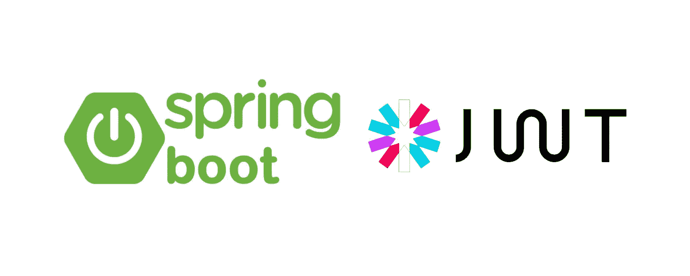
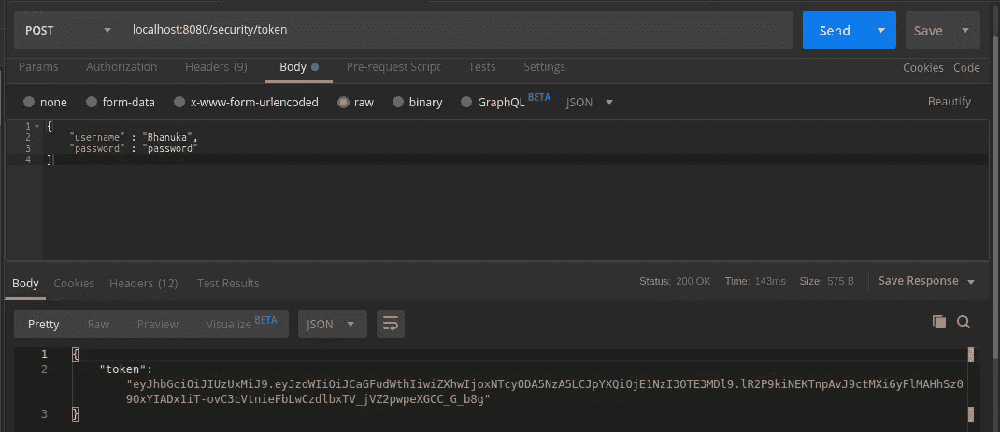
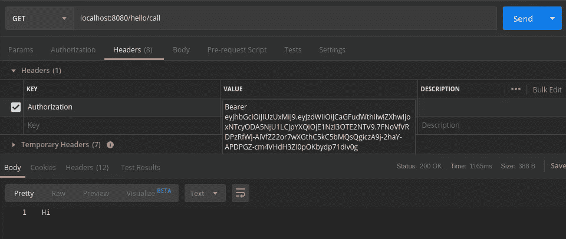

# 使用 JSON Web 令牌进行身份验证(第二部分)

> 原文：<https://medium.com/javarevisited/authentication-using-json-web-tokens-part-ii-b21455692a0b?source=collection_archive---------0----------------------->

## Spring Boot 应用程序的一个实现，它利用 JWT 身份验证来保护公开的 REST API

照片由[阿里夫·里扬托](https://unsplash.com/@arifriyanto?utm_source=medium&utm_medium=referral)在 [Unsplash](https://unsplash.com?utm_source=medium&utm_medium=referral) 拍摄

作者图片

在上一篇文章中，我介绍了 JSON web 令牌以及如何使用它进行身份验证。在您阅读本文之前，我更愿意先看一下。

 [## 使用 JSON Web 令牌进行身份验证(第一部分)

### 在这篇文章中，我将解释 JSON web 令牌以及如何在认证中使用它。

medium.com](/@bhanuka.16/authentication-using-json-web-tokens-part-i-4f2eeaca22d7) 

在本文中，我将向您展示如何实现一个 [Spring Boot 应用程序](/javarevisited/10-free-spring-boot-tutorials-and-courses-for-java-developers-53dfe084587e?source=collection_home---4------7-----------------------)，它利用 JWT 认证来保护一个公开的 REST API。对于演示，将有一个硬编码的用户名和密码。

该项目将如下。

作者图片

您可以使用下面的链接获得该演示的源代码。

 [## bhanukad610/JwtAuthentication

### 此时您不能执行该操作。您已使用另一个标签页或窗口登录。您已在另一个选项卡中注销，或者…

github.com](https://github.com/bhanukad610/JwtAuthentication) 

我将在演示中解释它是如何发生的。让我们从`WebsecurityConfig` 文件开始。

# **WebsecurityConfig**

它是定义所有安全配置的地方。这个类是由 [Spring Security 的](/javarevisited/top-10-courses-to-learn-spring-security-and-oauth2-with-spring-boot-for-java-developers-8f0222d6066d?source=---------5-----------------------)web Security configure 接口实现的。它提供默认的安全配置，并允许其他类通过重写它的方法来扩展它和自定义安全配置。

**用户详细信息服务**

`UserDetailsService` 是一个接口，它有一个基于用户名加载用户的方法。

**JwtAuthenticationEntryPoint**

`JwtAuthenticationEntryPoint` 用于将 401 未授权错误返回给试图在没有正确身份验证的情况下访问受保护资源的客户端。

只定义令牌返回的允许请求，所有其他请求都经过身份验证。使用了不会用于存储用户状态的无状态会话。然后添加`JwtRequestFilter` 来验证请求头中的令牌。

# **JwtRequestFilter**

JwtRequestFilter 是负责从所有请求的授权头中读取 JWT 身份验证令牌的类。它使用`JwtUserDetailsService`加载与令牌相关联的用户详细信息。令牌生成和验证是使用`JwtTokenService` 类完成的。

**JwtTokenService**

在这里定义令牌的声明，如颁发者、过期、主题和 ID，并使用 HS512 算法和 application.properties 文件中定义的密钥对 JWT 进行签名。令牌的验证也在这里完成。

# **AuthController**

AuthController 是公开用于身份验证的 POST API 的控制器。POST API 获取主体中的用户名和密码，并通过 **AuthService** 验证用户名和密码。如果凭证有效，使用 **JWTTokenService** 创建一个 JWT 令牌并提供给客户端。

**HelloController** 是用于公开 [GET REST API](https://www.java67.com/2018/02/3-books-and-courses-to-learn-restful-web-services-with-spring.html) 的控制器类，如果请求具有有效的令牌，客户端可以访问该 API。

现在启动 [Spring Boot 应用](https://www.java67.com/2018/06/top-15-spring-boot-interview-questions-answers-java-jee-programmers.html)。

1.  创建对“/security/token”的 POST 请求。

作者图片

2.使用上面在授权头中生成的令牌访问 localhost:8080/hello/call。

作者图片

我希望您了解如何实现一个 [Spring Boot 应用程序](/hackernoon/top-5-spring-boot-and-spring-cloud-books-for-java-developers-75df155dcedc)，它利用 JWT 认证来保护一个公开的 [REST API](/javarevisited/top-5-books-and-courses-to-learn-restful-web-services-in-java-using-spring-mvc-and-spring-boot-79ec4b351d12?source=---------17------------------) 。感谢您的阅读！