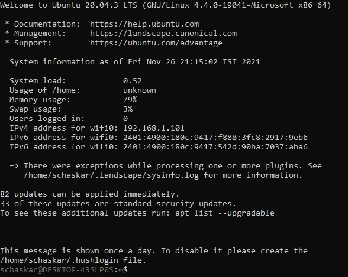
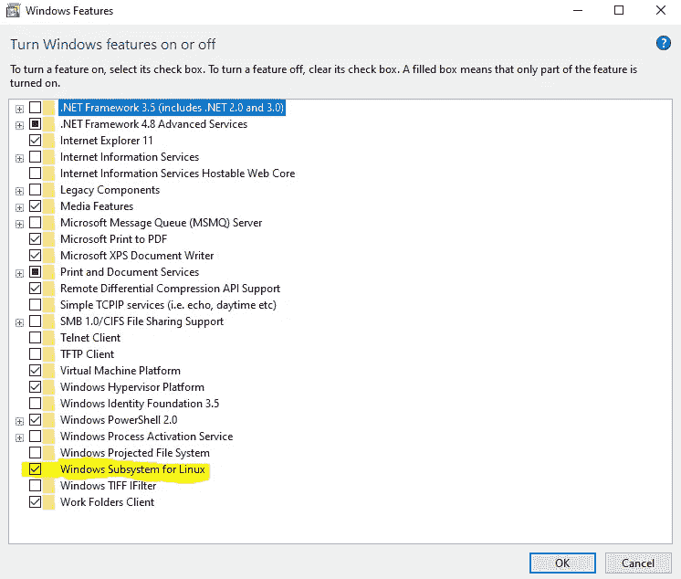
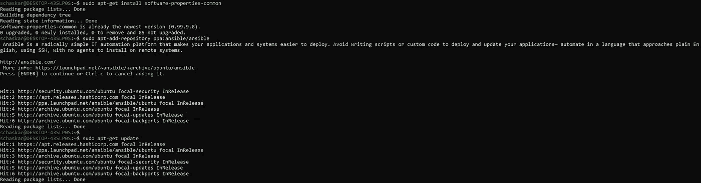
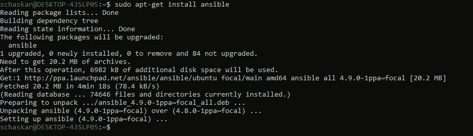
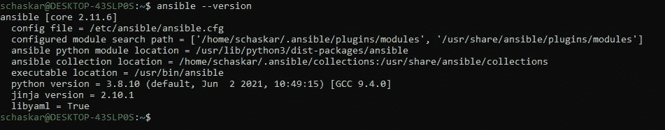
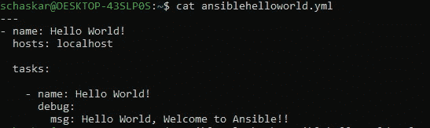
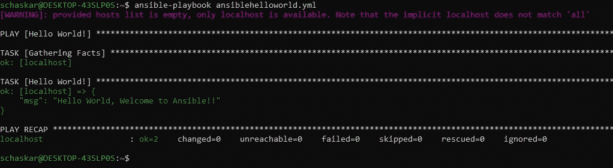

# Windows 10 Automation 上的 Ansible Hello World 让我们一起航行。

> 原文：<https://medium.com/javarevisited/automation-lets-sail-together-ansible-hello-world-on-windows-10-226c6afbfde3?source=collection_archive---------2----------------------->


IAC:基础设施即代码——ansi ble 是一款开源软件供应、配置管理和应用部署工具，支持基础设施即代码。

[Ansible](/javarevisited/5-best-ansible-courses-for-devops-engineers-cc87692fdf52) 使用剧本描述自动化工作，剧本使用非常简单的语言，即 [**YAML**](https://javarevisited.blogspot.com/2021/11/top-5-courses-to-learn-yaml-in-2022.html#axzz7DhisOz1u)

在您继续之前，

我强烈推荐下面这个来自“ **TechWorld with Nana** ”的教程

[什么是 Ansible](https://www.youtube.com/watch?v=1id6ERvfozo) 和 [Yaml 教程](https://www.youtube.com/watch?v=1uFVr15xDGg)

> **让我们从在 windows 10 上运行第一个可翻译的“Hello World”剧本的 8 个简单步骤开始我们的旅程**

[](https://javarevisited.blogspot.com/2019/11/top-5-course-to-learn-ansible-for-devops.html)

**步骤 1:** 转到 Windows 功能，选择“Linux 的 Windows 子系统”将其激活。

[](https://www.java67.com/2020/06/top-5-courses-to-learn-devops-in-2020.html)

**第二步:**去微软应用商店搜索 Linux。我选择了“Ubuntu 20.04”

[](https://javarevisited.blogspot.com/2021/06/5-websites-to-learn-linux-command-line.html)

**步骤 3:** 一旦安装了 Ubuntu，你就可以选择 Ubuntu，这将带你进入 bash shell。设置您的用户名/密码。

一旦你的操作系统准备好了，让我们开始享受 Ansible 的乐趣吧

第四步:确保系统是最新的

和

安装所需的软件-属性-通用

```
sudo apt-get update
sudo apt-get install software-properties-common
```

[](https://www.java67.com/2020/10/5-free-courses-to-pass-google-cloud-professional-cloud-devops-engineer-certificaiton.html)

**第五步:**

添加官方的 ansible Linux 库。

添加存储库后再次更新

安装 Ansible。

```
sudo apt-add-repository ppa:ansible/ansible
sudo apt-get update
sudo apt-get install ansible
```

[](https://javarevisited.blogspot.com/2019/05/top-5-courses-to-learn-docker-and-kubernetes-for-devops.html)

步骤 6: 确认 Ansible 已安装



让我们继续……和安西贝尔一起玩吧..还有 5 步要走…

**第七步:**让我们制作第一本 ansiblehelloworld 剧本。

```
nano ansiblehelloworld.yml
---
- name: Hello World!
  hosts: localhosttasks:- name: Hello World!
      debug:
        msg: Hello World, Welcome to Ansible!!
```

ctrl+x 然后 y 保存到当前工作目录



**步骤 8:** 要进行测试，使用下面的命令运行您的第一个 ansible 剧本

```
ansible-playbook ansiblehelloworld.yml
```



我将继续这一旅程，添加更多可行的用例…..继续航行…..！！