# Windows 10 上的 Terraform Hello World 自动化——让我们一起远航。

> 原文：<https://medium.com/javarevisited/automation-lets-sail-together-terraform-hello-world-on-windows-10-27ae3be1f869?source=collection_archive---------1----------------------->

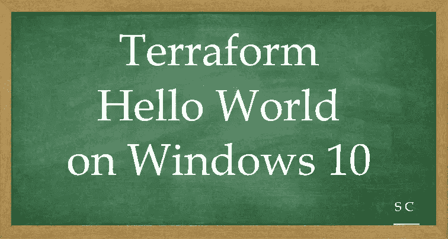

基础设施代码(IaC)工具允许您使用配置文件而不是通过图形用户界面来管理基础设施。IaC 允许您通过定义可版本化、重复使用和共享的资源配置，以安全、一致和可重复的方式构建、更改和管理您的基础设施。

Terraform 是 HashiCorp 作为代码工具的基础设施。它让你在**可读的声明性配置文件**中定义资源和基础设施，并管理你的基础设施的生命周期。

在您继续之前，

我强烈推荐下面来自“ **TechWorld with Nana** ”的教程

[15 分钟讲解 terra form | terra form 初学者教程— YouTube](https://www.youtube.com/watch?v=l5k1ai_GBDE)

> **让我们从 windows 10 上的第一个 terraform“Hello World”模块的 12 个简单步骤开始我们的旅程**

[](https://javarevisited.blogspot.com/2020/08/top-5-courses-to-learn-terraform-in.html)

**步骤 1:** 转到 Windows 功能，选择“Linux 的 Windows 子系统”将其激活。

[](https://javarevisited.blogspot.com/2019/05/top-5-courses-to-learn-docker-and-kubernetes-for-devops.html)

**第二步:**去微软应用商店搜索 Linux。我选择了“Ubuntu 20.04”

[](https://www.java67.com/2020/06/top-5-courses-to-learn-devops-in-2020.html)

**第三步:**一旦安装了 Ubuntu，你可以选择 Ubuntu，这将带你到 bash shell。设置您的用户名/密码。

## 一旦你的操作系统准备好了，让我们开始体验 Terraform 的乐趣吧

**步骤 4:** 确保系统是最新的

和

安装所需的 gnupg、software-properties-common 和 [curl 包](https://javarevisited.blogspot.com/2017/03/10-examples-of-curl-command-in-unix-and-Linux.html#axzz6iYmMFnsA)

```
sudo apt-get update 
sudo apt-get install -y gnupg software-properties-common curl
```

[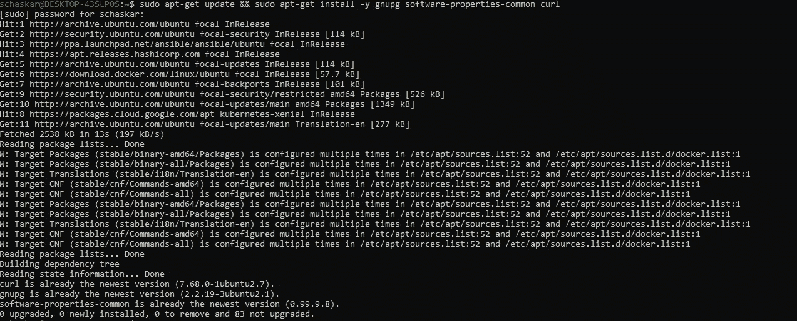](https://www.java67.com/2018/02/5-free-docker-courses-for-java-and-DevOps-engineers.html)

**第五步:**添加 HashiCorp [GPG 键](https://apt.releases.hashicorp.com/gpg)。

```
Download key and copy in a file gpg under current working directory curl -fsSL [https://apt.releases.hashicorp.com/gpg](https://apt.releases.hashicorp.com/gpg) | sudo apt-key add gpg
```

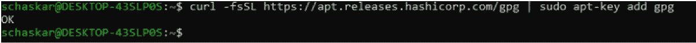

**第六步:**

添加官方的 HashiCorp Linux 库。

添加存储库后再次更新

安装 Terraform CLI。

```
sudo apt-add-repository "deb [arch=amd64] [https://apt.releases.hashicorp.com](https://apt.releases.hashicorp.com) $(lsb_release -cs) main"sudo apt-get updatesudo apt-get install terraform
```

[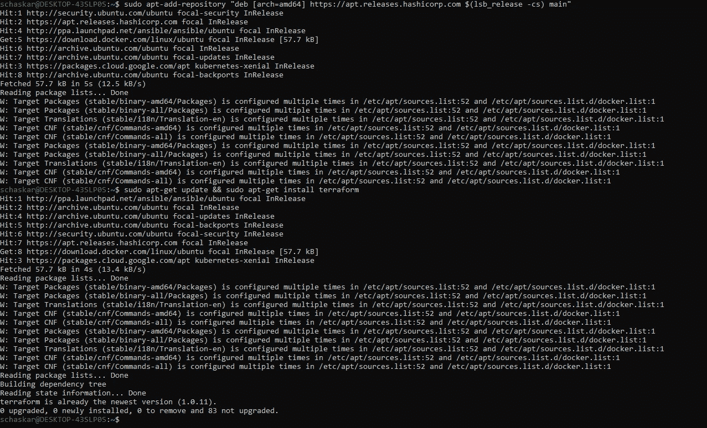](https://www.java67.com/2020/07/5-free-courses-to-learn-google-cloud-platform-and-concepts.html)

**步骤 7:** 确认安装了 Terraform

```
terraform --version
```

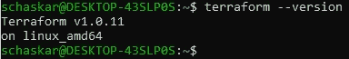

让我们继续……现在来玩玩地形..还有 5 步要走…

**步骤 8:** 在 helloworldterraform 目录下创建一个简单的 hello world main.tf 文件

```
terraform {
  required_version = ">= 0.12.26"
}# website::tag::1:: The simplest possible Terraform module: it just outputs "Hello, World!"
output "hello_world" {
  value = "Hello, World!"
}
```

[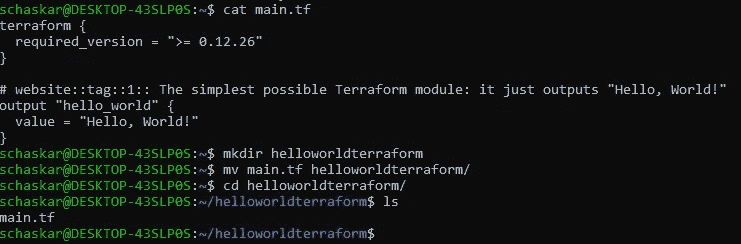](https://www.java67.com/2020/07/top-5-courses-to-learn-linux-in-depth.html)

## 地形生命周期包括:- **初始化→计划→应用→销毁**


*   Terraform **init** 初始化包含所有配置文件的工作目录
*   地形**计划**用于创建执行计划，以达到基础设施的期望状态。
*   Terraform **apply** 然后按照计划中的定义对基础架构进行更改，基础架构将进入所需状态。
*   地形**摧毁**用来删除所有旧的基础设施资源。

**第九步:**初始化地形

[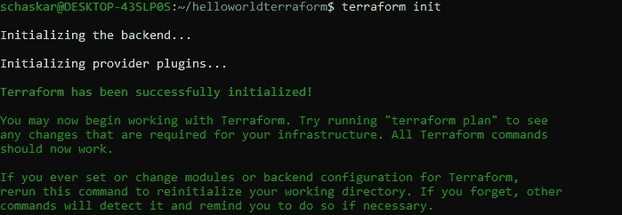](https://javarevisited.blogspot.com/2020/06/top-5-courses-to-learn-kubernetes-for-devops-and-certification.html)

**第十步:**验证地形

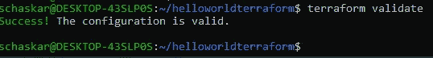

**步骤 11:** 应用地形


需要首次批准。

如果不进行进一步的更改，那么将应用相同的计划，而无需批准。

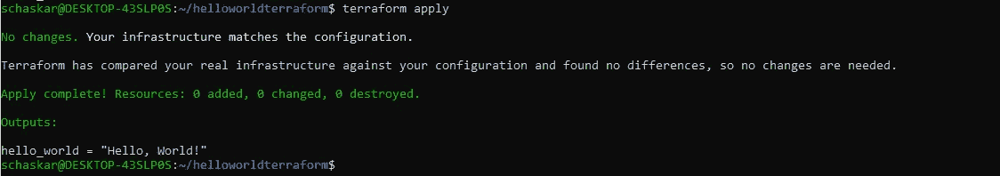

一旦应用计划，它将显示基础设施的当前状态—参见 **terraform.tfstate**

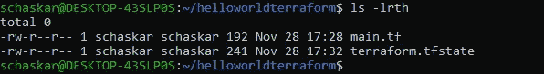

**第十二步:**摧毁地形

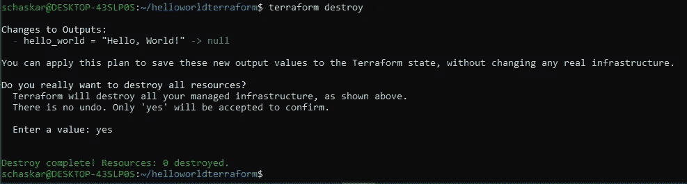

观察破坏前后的状态。

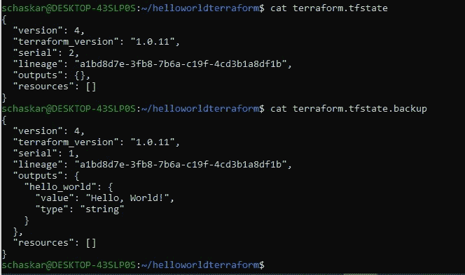

将继续这一旅程，添加更多的 Terraform Docker、Terraform Kubertnetes 和 Terraform GCP 用例…..继续航行…..！！