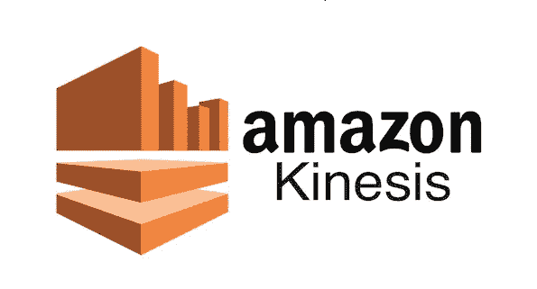
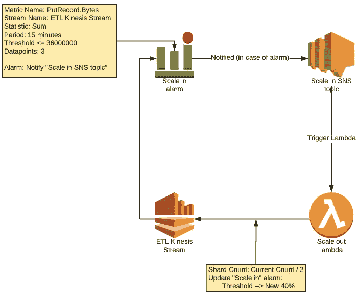

# 使用 Kinesis 流自动缩放

> 原文：<https://medium.com/javarevisited/autoscaling-with-kinesis-stream-cogs-reduction-dfd87848ce9a?source=collection_archive---------1----------------------->

# 问题陈述

由于 [AWS](/javarevisited/top-10-courses-to-learn-amazon-web-services-aws-cloud-in-2020-best-and-free-317f10d7c21d) 不支持 kinesis 流的自动缩放，大多数时候我们要么过度供应碎片并支付更多费用，要么供应不足并影响性能。

# 解决方案:

使用云观察警报、SNS 主题和 Lambda 的组合，我们可以实现 kinesis 流的自动缩放，通过它我们可以管理碎片数量，并在成本和性能之间达到正确的平衡。

# 解决方案概述:

通过监控“腐败记录”来实现放大和缩小。流的“字节”度量:

*   在给定的 2 分钟滚动窗口内，一旦流的利用率超过其容量的 80%,就会自动扩大(碎片加倍)。
*   在给定的 5 分钟滚动窗口内，一旦流的利用率不超过其容量的 40%至少 3 次，就会自动缩减(将碎片减半)

**注:**

我们也可以使用“IncomingBytes”或“IncomingRecords”来实现同样的功能。

我们的纵向扩展速度非常快，因此不会影响性能，而横向扩展速度很慢，因此我们可以避免太多的纵向扩展和横向扩展操作。

# 实施细节:

# 确定 kinesis 流的利用率百分比:

假设:

有效负载大小= 100 KB

总记录数(每秒)= 500

AWS 建议碎片计数= 49

为了确定其 80%的利用率，我们执行以下操作:

2 分钟内可写入的最大总字节数= (((100 * 500)*60)*2) = 6，000，000 KB

其中的 80%将= 4，800，000 KB

同样，其中的 40%将是 2，400，000 KB

# 超过尺寸范围

下图显示了我们执行横向扩展操作时的流程

“横向扩展警报”的配置为:

*   公制名称:腐败线。字节
*   流名:ETL Kinesis 流
*   时长:2 分钟
*   阈值> = 4800000
*   数据点:1
*   统计:总和
*   操作:通知主题“缩放 SNS 主题”

因此，当我们达到 80%的流容量时，会发生以下情况:

*   将触发云监控警报“向外扩展警报”
*   通知被发送到 SNS 主题“扩展 SNS 主题”,这触发了“扩展 lambda”
*   Lambda 将缩放碎片数量=当前碎片* 2，并根据新的碎片计数将阈值更新为。那么，假设新的碎片计数是“98”
*   2 分钟内可写入的最大字节数(100 KB * 1000 条记录)= 12，000，000 KB
*   其中 80%是 960 万 KB
*   其中的 40%将是 4，800，000 KB
*   将“横向扩展警报”从“警报”状态重置回“正常”状态

# 放大

下图显示了我们在操作中进行称重时的流程

**注:**

计算 15 分钟间隔的 40%值= (100*1000*15*60)*40/100 = 36，000，000

“报警秤”的配置为:

*   公制名称:腐败线。字节
*   流名:ETL Kinesis 流
*   时间:15 分钟
*   阈值< = 36000000
*   数据点:3
*   统计:总和
*   操作:通知主题“在 SNS 主题中缩放”

因此，当我们仅利用 40%的流容量时，会发生以下情况:

*   将触发云监控警报“秤入警报”
*   通知被发送到 SNS 主题“在 SNS 主题中缩放”,这触发了“在 lambda 中缩放”
*   Lambda 将缩放碎片数=当前碎片数/ 2，并根据新的碎片计数将阈值更新为。
*   将“警报中的秤”从“警报”状态重置回“正常”状态

# Lambda(横向扩展)

附加的代码“Lambda.js”是用 nodeJs 编写的，只是为了演示，所以不是动态计算阈值，而是硬编码的，但相同的代码可以得到增强，以确定本文中提到的所有事情

## 环境变量:

*   ALARM_NAME = "横向扩展警报"
*   MAX_SHARDS = 100
*   MIN_SHARDS = 10
*   STREAM_NAME = "ETL Kinesis stream "

## 伪代码:

*   描述流，并且仅当流没有“更新”时才继续(如果先前的放大/缩小动作没有完成)
*   计算新的 shardCount
*   使用“putMetricAlarm()”更新 cloudwatch 警报阈值
*   使用“updateShardCount()”更新碎片计数
*   使用“describeStream()”等待碎片放大或缩小操作完成(当前代码中未实现)，然后使用“setAlarmState()”将警报状态重置为“正常”状态

# COGS 减少:

为了获得 1000 TPS 的记录大小为 100KB 的有效载荷，我们需要支付 1223.62 美元，通过这种方法，我们可以控制规模的扩大和缩小，这直接降低了这些 AWS 资源的成本

我很乐意接受对这种方法的任何反馈或改进，感谢您的阅读。