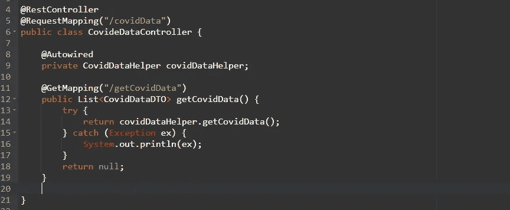
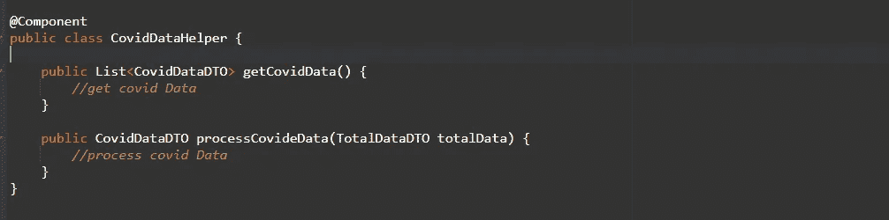
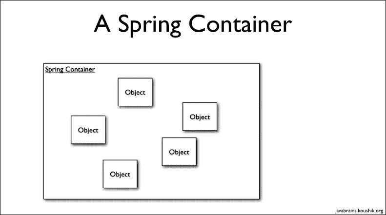

# @ Spring Boot 的 Autowired

> 原文：<https://medium.com/javarevisited/autowired-in-spring-boot-58fc8a598449?source=collection_archive---------1----------------------->

程序员们好，

没有哪个 java 开发者是从来不听 Spring 这个词的，Spring 是一个框架、开源平台，提供全面的编程和配置模型。每当我去参加我的拼贴画中的模拟面试时，我最喜欢的问题是*什么是 spring 中的 Autowired Annotation，它是如何工作的？*

我总是得到一个常见的答案，即 Autowired 使用依赖注入，但每当我问你能详细说明你的答案时，然后就沉默了，因为我简单地说 [Autowired](https://www.java67.com/2019/04/top-10-spring-mvc-and-rest-annotations-examples-java.html) 为我们提供了对象初始化。让我们更多地讨论自动连接的注释。

Spring 告诉我们，“嘿，开发人员不要考虑创建对象，我将向您提供对象，因此您可以更专注于核心逻辑”。所以这里我们想到一个问题，spring 如何知道开发者需要哪个类的对象，以及在哪个类中。所以这里图片中出现了另一个注释，即@ [组件](https://medium.com/u/10d5315e4bc5?source=post_page-----58fc8a598449--------------------------------)。所以让我们讨论一下它是如何工作的

假设我有一个控制器类`CovidDataController` 和一个助手类，在那里我可以编写所有的逻辑来调用第三方 API 以获取数据并对其进行某种计算。

因此，我将创建一个助手类作为 CovidDataHelper，并用 [@Component](https://javarevisited.blogspot.com/2017/11/difference-between-component-service.html) 对其进行注释，在该类中创建一个方法作为 getCovidData()和 processCovideData()，在 getCovideData 中，我将调用第三方 API 来获取数据，在 processCovideData()中，我将处理该数据。

控制器类别

助手类

一切都设置好了，现在让我们接触一下它内部是如何工作的，

所以有一个包含对象的 spring 容器，Spring 容器类中的对象被称为 bean，所以当我们用@component 注释一个类时，它将为该类创建一个对象(bean)

因此，在我们的示例中，当我们在助手类上编写@component 时，在应用程序处于运行模式时，它将在 spring 容器中为助手类创建一个 bean。在我们的控制器类中，存在对助手类的依赖，所以我们的控制器类 bean 如何知道容器中存在助手类 bean，我们需要告诉控制器类 bean 找到助手类 bean 并使用它，所以这里的 [@Autowired](https://www.java67.com/2018/11/top-10-spring-framework-annotations-for-java-developers.html) 出现在图片中，当我们在助手类类型的变量上方写@Autowired 时，它将开始找到助手类的 bean 并将其注入该变量，这样您的变量就被初始化并准备好使用。

感谢阅读。