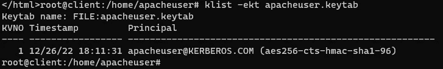
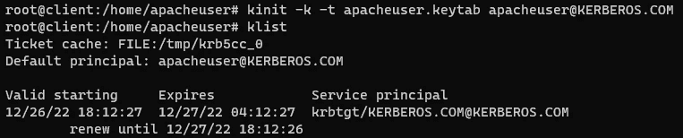
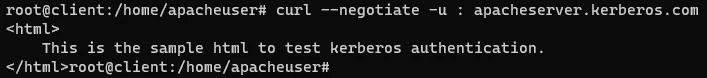

# 避免输入密码来获取票证授予票证

> 原文：<https://medium.com/javarevisited/avoid-entering-passwords-to-fetch-ticket-granting-ticket-d37704248503?source=collection_archive---------5----------------------->

Kerberos 本地主机

这篇文章讲述了在用户不输入 ***密码*** 的情况下，获取[用户主体名称](/@suriyaprakhash/authenticate-without-passwords-or-tokens-cf68eeb4deef#9c44) *的[票授予票](/@suriyaprakhash/authenticate-without-passwords-or-tokens-cf68eeb4deef#6d57)。*


[Leohoho](https://unsplash.com/@leohoho?utm_source=medium&utm_medium=referral) 在 [Unsplash](https://unsplash.com?utm_source=medium&utm_medium=referral) 上拍照

## 内容

*   [为什么？](#94bf)
*   [假设](#2fcd)
*   [如何？](#eb66)
*   [最后的想法](#43c3)

## 为什么？

每当 [TGT](https://medium.suriyaprakhash.com/authenticate-without-passwords-or-tokens-cf68eeb4deef#6d57) 到期或用户每次登录计算机时，用户/系统需要执行 kinit 并**传递密码**以生成 [TGT](https://medium.suriyaprakhash.com/authenticate-without-passwords-or-tokens-cf68eeb4deef#6d57) 来访问资源。

以下方法将避免用户干预，因此用户不需要担心手动生成 [TGT](https://medium.suriyaprakhash.com/authenticate-without-passwords-or-tokens-cf68eeb4deef#6d57) 。

## 假设

这篇文章假设我们已经有了 [Kerberos 设置](https://medium.suriyaprakhash.com/authenticate-without-passwords-or-tokens-cf68eeb4deef#547b)，并且我们正在使用 Kinit 工具来获取[票据授予票据](https://medium.suriyaprakhash.com/authenticate-without-passwords-or-tokens-cf68eeb4deef#6d57)。

*   我们知道 [KDC](https://medium.suriyaprakhash.com/authenticate-without-passwords-or-tokens-cf68eeb4deef#b01c) 支持的加密类型
*   我们知道在 [KDC](https://medium.suriyaprakhash.com/authenticate-without-passwords-or-tokens-cf68eeb4deef#b01c) 数据库中注册的[用户主体名称](https://medium.suriyaprakhash.com/authenticate-without-passwords-or-tokens-cf68eeb4deef#9c44)及其密码
*   安装 krb5-user 软件包

## 怎么会？

*   使用支持的加密类型更新客户端机器中的 */etc/krb5.conf* 文件。

下面是一个例子，

```
 default_tgs_enctypes = aes256-cts-hmac-sha1-96
 default_tkt_enctypes = aes256-cts-hmac-sha1-96
 permitted_enctypes = aes256-cts-hmac-sha1-96
```

*   使用 [Ktutil](https://web.mit.edu/kerberos/krb5-1.12/doc/admin/admin_commands/ktutil.html) 生成一个 keytab 文件

```
ktutil
ktutil:  addent -password -p apacheuser@KERBEROS.COM -k 1 -e aes256-cts-hmac-sha1-96
Password for apacheuser@KERBEROS.COM:
ktutil:  wkt apacheuser.keytab
ktutil:  q
```

这里，

*   **添加**是*添加条目*
*   **-密码**提示输入密码
*   **-p** 是委托人
*   **-k** 是[密钥版本号](https://web.mit.edu/kerberos/krb5-latest/doc/user/user_commands/kvno.html)
*   **-e** 是支持的加密类型之一
*   **wkt** 是写键标签文件名

[](https://www.java67.com/2012/09/keytool-command-examples-java-add-view-certificate-ssl.html)

为了检查密钥表，我们将使用 klist，

```
klist -ekt apacheuser.keytab
```



现在我们将使用这个 **apacheuser.keytab** 来生成 TGT

```
kinit -k -t apacheuser.keytab apacheuser@KERBEROS.COM
```



现在让我们尝试访问我们正在尝试访问的服务，



## 最后的想法

我们可以设置一些核心任务，或者在启动时运行脚本，或者做一些对我们来说最有效的事情，以避免用户实际传递密码的干预。


Johannes Plenio 在 [Unsplash](https://unsplash.com?utm_source=medium&utm_medium=referral) 上拍摄的照片

万一密码改变*，该脚本可以以这样的方式制作，即它将在用户下一次尝试登录或访问服务时提示输入密码*，并使用新密码重新生成 [keytab](https://medium.suriyaprakhash.com/authenticate-without-passwords-or-tokens-cf68eeb4deef#e5b4) 。