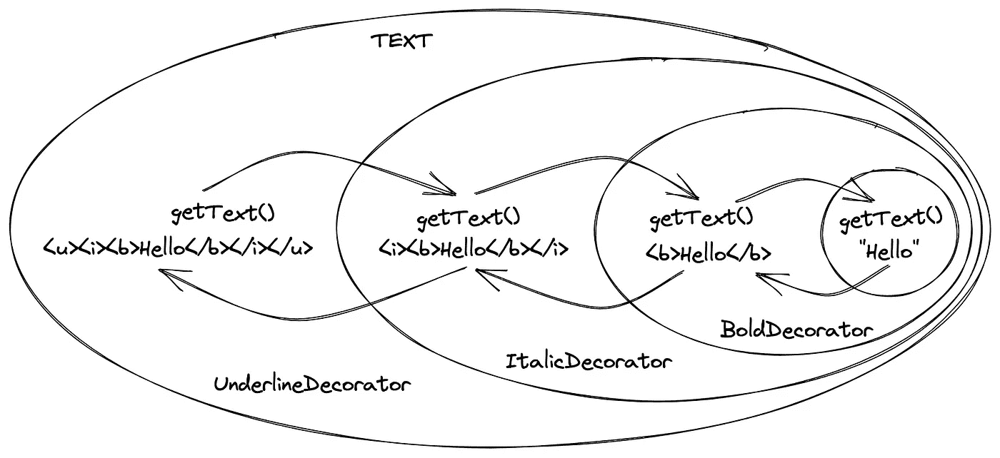
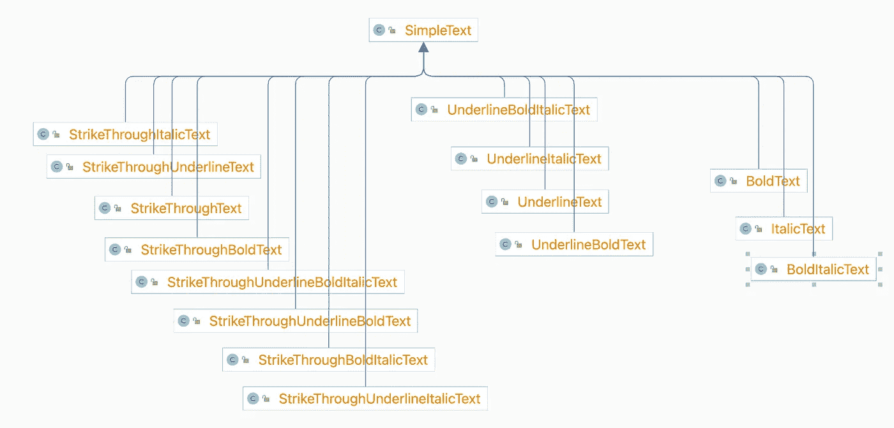
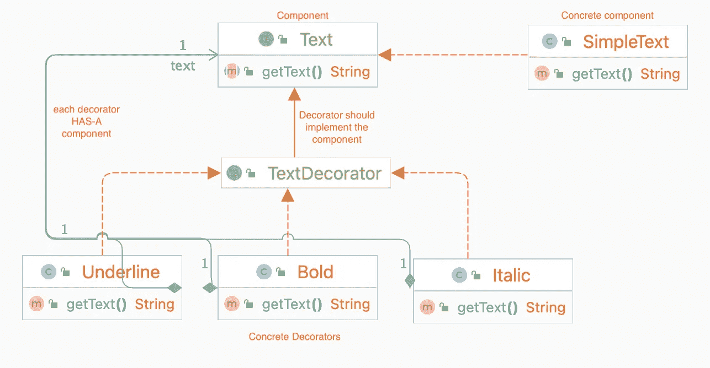
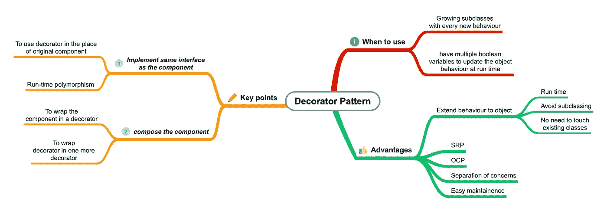

# 避免使用装饰模式的子类化

> 原文：<https://medium.com/javarevisited/avoid-subclassing-using-decorator-pattern-841ad66be817?source=collection_archive---------1----------------------->

## 如何使用 decorator 模式避免子类化，用一个文本格式化的例子来解释

[](https://www.java67.com/2013/07/decorator-design-pattern-in-java-real-life-example-tutorial.html)

> 装饰模式允许动态地将行为添加到一个单独的对象中，而不会影响同一类中其他对象的行为。

装饰模式经常被用来替代子类化。子类化在编译时添加行为，而在修饰时，行为可以在运行时添加。

在[装饰器模式](https://javarevisited.blogspot.com/2015/01/adapter-vs-decorator-vs-facade-vs-proxy-pattern-java.html)中，创建了一个包装原始对象的装饰器对象。装饰对象提供了与原始对象相同的接口，但是它也添加了自己的行为。

## **这里有一些例子**

1.  **Java 中的流类:**[*file inputstream*](https://javarevisited.blogspot.com/2014/04/difference-between-fileinputstream-and-filereader-in-java.html)可以包装在[*BufferedInputStream*](https://www.java67.com/2016/06/5-difference-between-bufferedreader-and-scanner-in-java.html)中，为文件输入流添加缓冲行为。它可以再次包装在 *LineNumberInputStream* 中，以增加在读取数据时跟踪当前行号的能力。
2.  **日志**:装饰对象可能会给现有对象添加日志功能。当在装饰对象上调用方法时，装饰对象将首先记录方法调用，然后在原始对象上调用相同的方法。
3.  **文件处理**:文件可以直接写入磁盘，也可以先加密或压缩再写入磁盘。可以通过 decorators 添加加密和压缩功能。
4.  **文本格式**:我们可以添加粗体、斜体、下划线和删除线等。通过装饰器格式化。它们可以按照我们想要的任何组合来应用。

让我们通过一个基本文本编辑器的[文本格式化](https://www.java67.com/2016/12/7-examples-of-stringformat-and-printf.html)用例来理解这个概念。
假设我们在后端有一个类 *SimpleText* 来支持简单文本功能。

```
public class SimpleText {
   protected final String text;

   public SimpleText(String text) {
      this.text = text;
   }

   public String getText() {
      return text;
   }
}
```

现在，随着应用程序越来越受欢迎，我们希望添加对不同文本格式样式的支持，如粗体和斜体。

所以一种方法是使用继承/子类化来扩展简单文本的行为。我们将创建新的类来扩展 *SimpleText* 类来添加额外的行为。

因此，为了支持粗体和斜体格式，我们需要 3 个新类:

*   *粗体文本*(用于支持粗体格式)
*   *斜体文本*(用于支持斜体格式)
*   *BoldItalicText* (用于处理粗体和斜体的组合)。

```
public class BoldText extends SimpleText {
   public BoldText(String text) {
      super(text);
   }

   public String getText() {
      return "<b>" + this.text + "</b>";
   }
}
```

```
public class ItalicText extends SimpleText {
   public ItalicText(String text) {
      super(text);
   }

   public String getText() {
      return "<i>" + this.text + "</i>";
   }
}
```

```
public class BoldItalicText extends SimpleText {
   public BoldItalicText(String text) {
      super(text);
   }

   public String getText() {
      return "<b><i>" + this.text + "</i></b>";
   }
}
```

现在，假设我们还想添加“下划线格式”。

这意味着我们必须添加另外 4 个类来支持所有现有的粗体和斜体组合的下划线格式: *UnderlineText* 、 *UnderlineBoldText* 、*underlinealictext*和*UnderlineBoldItalicText*。所以现在我们总共有 7 节课。

现在，假设我们还想添加删除线格式。现在我们需要再添加 8 个类来涵盖所有的可能性。

[](https://javarevisited.blogspot.com/2020/02/23-object-oriented-design-patterns-gof-Java-programmers-developers.html)

班级爆炸

如果我们将来会有更多的格式类型出现呢？我们需要为每一种新的格式类型添加越来越多的类。那是一场维护的噩梦！

**上述方法的问题:**

*   对于每一种新的格式类型，类都呈指数级增长。
*   如果我们想改变我们维护格式的方式，我们必须更新所有的类。

我们可以清楚地看到，子类化并不是真正的出路。我们需要偏爱组合而不是继承。我们将使用 composition 把对象(我们想要添加新行为的对象)包装在 decorators 内部。

让我们看看如何重构文本格式化用例来使用装饰模式。

1.  我们将为我们的文本类定义一个接口，并为简单文本类实现接口。姑且称之为‘组件’吧。

```
// Component
public interface Text {
   String getText();
}
```

```
// Concrete component
public class SimpleText implements Text {
   private final String text;

   public SimpleText(String text) {
    this.text = text;
   }

   @Override
   public String getText() {
    return text;
   }
}
```

2.现在我们将为所有的装饰者定义一个接口。这个接口应该扩展原始对象的接口，也就是说，它应该扩展组件。

*   这将允许我们重用装饰器来代替原始对象。

> Decorator 应该实现与原始对象相同的接口。

```
/*
Common interface for all decorators.
This should extend the component interface.
*/
public interface TextDecorator extends Text {
}
```

3.我们将实现我们希望作为具体装饰类的附加行为。在我们的例子中，我们将实现粗体、斜体和下划线格式作为装饰。

装饰者应该持有对组件的引用，并且应该使用该引用来扩展功能

> 装饰者应该组合组件并使用它来扩展行为

这将允许我们将原始对象包装到一个装饰器中，并将一个装饰器包装到另一个装饰器中。

```
/* 
Concrete decorator implements the decorator interface, which in
turn extends the component.
*/
public class Bold implements TextDecorator {
   private final Text text;

   //Decorator should hold a reference to the component
   public Bold(Text text) {
      this.text = text;
   }

   //implement the methods using the component
   @Override
   public String getText() {
      return "<b>" + this.text.getText() + "</b>";
   }
}
```

```
public class Italic implements TextDecorator {
   private final Text text;

   public Italic(Text text) {
      this.text = text;
   }

   @Override
   public String getText() {
      return "<i>" + this.text.getText() + "</i>";
   }
}
```

```
public class Underline implements TextDecorator {
   private final Text text;

   public Underline(Text text) {
      this.text = text;
   }

   @Override
   public String getText() {
      return "<u>" + this.text.getText() + "</u>";
   }
}
```

现在，在未来，如果我们想添加新的格式类型，如删除线或链接等，我们只需添加一个新的装饰类。不需要接触任何现有的对象(打开用于扩展，关闭用于修改)。

我们可以在运行时用任意多的装饰器包装原始对象。

```
public class Main {
   public static void main(String[] args) {
      Text formattedText = new Underline(new Italic(new Bold(new SimpleText("decorator pattern"))));
      System.out.println(formattedText.getText()); 
      // Output: <u><i><b>decorator pattern</b></i></u>
   }
}
```

下面是同一个例子的类图:

[](https://javarevisited.blogspot.com/2018/02/top-5-java-design-pattern-courses-for-developers.html)

装饰模式的类图

## **点注意事项**

*   装饰者应该扩展/实现组件。这是在代码中使用装饰器代替原始对象所需要的。
*   装饰者也应该组成组件。这是在装饰器中包装原始对象以及在另一个装饰器中包装一个装饰器所需要的。

## **优势**

*   **维护** -这是子类化的一种灵活的替代方式。该模式允许在不改变原始代码的情况下将新行为添加到现有的类中。
*   **遵循 SRP-** 功能被封装在不同的装饰器类中。
*   **跟随 OCP-** 新的行为可以添加到新的装饰器中。不需要更新现有的类。
*   关注点分离。

[](https://www.java67.com/2022/03/top-5-free-courses-to-learn-design.html)

总结装饰模式的思维导图

## 参考

*   [头先设计图案](/javarevisited/7-best-books-to-learn-design-patterns-for-java-programmers-5627b93eefdb)

目前就这些。欢迎对这篇文章提出任何问题或分享任何意见。下一篇文章再见。

编码快乐！