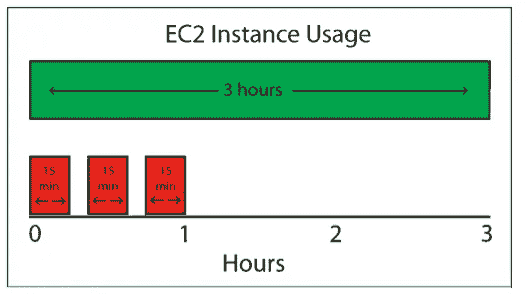

# AWS 自由层—盲点

> 原文：<https://medium.com/javarevisited/aws-free-tier-blindspots-70c174487d73?source=collection_archive---------0----------------------->

## 我们在使用 AWS 自由层帐户时忽略的关键盲点

# 亚马逊 EC2

我们尝试的第一个也是最明显的 AWS 服务是亚马逊 EC2。而且自带很多盲点；让我们逐一展开。

## 750 小时

这是 AWS 能够为计算引擎/虚拟机提供的最大金额。亚马逊 EC2 免费层[页面](https://aws.amazon.com/ec2/?did=ft_card&trk=ft_card)写着“AWS 免费层包括一年内每月 750 小时的 Linux 和 Windows t2.micro 实例。要保持在空闲层，请仅使用 EC2 微实例”。隐藏的盲点是 EC2 上的[自由层限制](https://docs.aws.amazon.com/awsaccountbilling/latest/aboutv2/free-tier-limits.html)。在第[页](https://docs.aws.amazon.com/awsaccountbilling/latest/aboutv2/free-tier-limits.html#hourly-limits)中，AWS 清楚地提到了小时使用在免费层中是如何工作的—

> 在某些情况下，让您的资源保持运行可以最大化您的自由层优势。例如，如果一个 Amazon EC2 实例只运行了一个小时的一部分，AWS 会把它算作一个小时。因此，**如果您在一个小时内停止并启动一个 Amazon EC2 实例三次，** **您将用完三个小时的月配额。**

来源:[https://docs.aws.amazon.com](https://docs.aws.amazon.com/)

我曾经在我的免费层帐户中停止/终止很多次，假设我将节省一些额外的使用时间；显然， [AWS](https://www.java67.com/2018/05/top-5-amazon-web-services-or-aws-courses-to-learn-online.html) 并不是这样计算使用量的。因此，让它运行一个小时或更短时间是安全的，不要在每次实例空闲时匆忙终止实例。

# 亚马逊 S3

S3 可能是 AWS 历史上使用最多的服务。耐用性、可扩展性和存储选项是其他[云提供商](https://javarevisited.blogspot.com/2019/07/top-5-online-courses-to-learn-cloud-computing-aws.html)或存储供应商提供的其他存储服务无法比拟的。

## 放下并忘记

显然，我们在这里也容易犯错误。最常见的错误是假设如果没有 EC2 实例正在运行，那么在免费层结束后我们将不会被收费。然而，我们可能忘记了删除我们很久以前使用的 S3 桶中的对象。同样适用于**亚马逊 EBS/EFS、亚马逊弹性容器注册、亚马逊 DynamoDB、亚马逊 RDS 等。，**即使用存储空间。

# 弹性负载平衡

ELB 用于跨多个 Amazon EC2 实例分发传入的应用程序流量。在非云环境中，通常不会考虑这一点。因此，我们大多数人可能甚至没有意识到这样的成本和它们的存在。自由层帐户提供—

*   每月 750 小时在传统和应用程序负载平衡器之间共享
*   经典负载平衡器的 15 GB 数据处理能力
*   15 个 lcu 用于应用程序负载平衡器

这意味着，如果您传输更多的数据，那么您会损失更多的 ELB 使用率。因此，在某个时间点，您可能属于这样一个类别——即使您有 EC2 实例信用，您也可能没有 ELB 信用，无法在您的免费限额内继续。要获得限额用尽的通知，请使用我在上一节中解释的计费和成本管理选项。

# 自动气象站λ

免费层中我最喜欢的服务——AWS Lambda 是一种计算服务，它运行您的代码以响应事件，并自动管理计算资源。文件上写着—

*   每月 100 万次免费请求
*   每月高达 320 万秒的计算时间

我们大多忽略了第二部分，即 320 万秒的计算时间。大多数时候，当你尝试 lambda 时，我们最终会创建一个运行几秒钟的单片 lambda。

如果我们每个月需要 100 万个免费请求，那么对于 lambda 调用来说，免费使用限制大约是平均 3 秒。虽然我们可能不会用尽全部的 300 万秒，但还是值得一提。如果你想在无服务器空间探索更多，那么这是你应该注意的。

# AWS 组织

如果您是自由层，您仍然可以利用 [**AWS 组织**](https://docs.aws.amazon.com/en_pv/awsaccountbilling/latest/aboutv2/useconsolidatedbilling-discounts.html) 在根帐户下创建多个帐户，但是，使用情况将在您的主帐户和子帐户之间共享。

> 对于像 Amazon EC2 这样支持免费等级的服务，AWS 将免费等级应用于 AWS 组织中所有帐户的总使用量。AWS 不会对每个帐户单独应用免费层。AWS 提供的预算可以跟踪您是否超出了自由层限制，或者预测您将超出自由层限制。**组织默认不启用自由层预算**。付款人帐户可以通过计费和成本管理控制台选择加入免费层使用警报。免费层使用提醒不适用于个人关联帐户。

# 计费和成本管理

您可以在 [**计费和成本管理仪表板**](https://console.aws.amazon.com/billing/home) 中查看所有符合自由层条件的 AWS 服务及其使用情况，如顶层自由层服务表[中所述【此处为](https://docs.aws.amazon.com/awsaccountbilling/latest/aboutv2/tracking-free-tier-usage.html#free-tier-table)。

## **跟踪预算**

可以使用 [**AWS Budgets**](https://docs.aws.amazon.com/en_pv/awsaccountbilling/latest/aboutv2/tracking-free-tier-usage.html#free-budget) 跟踪您的自由层帐户的预算，它可以在您的使用量达到一定限制时提醒您，从而帮助您跟踪您的自由层使用量。您还可以配置个别服务特定的警报。例如，*亚马逊 S3 桶超过你的每月存储限制。*

## 在电子邮件中收到您的发票

你不应该错过的最重要的部分是发票。虽然您有免费层帐户，但有更多的变化消费更多的服务使用超过您的期望使用，这可能会导致额外的计费成本。如“ ***通过电子邮件将发票发送给您*** ”部分[此处](https://docs.aws.amazon.com/en_pv/awsaccountbilling/latest/aboutv2/emailed-invoice.html)所述，配置一份包含月度发票 PDF 副本的电子邮件报告。

# *结论*

简而言之，免费层对于学习 AWS 中的新服务来说是惊人的。如果您知道这些服务中涉及的成本和计算的细节，您就可以成为云英雄。

快乐学习！

面向 IT 专业人员和 Java 程序员的其他认证资源

*   [如何破解 2019 年 AWS 解决方案架构师认证](https://javarevisited.blogspot.com/2019/08/how-to-crack-aws-certified-solution-architect-exam.html)
*   [通过 AWS 解决方案架构师助理考试的 5 次免费模拟测试](https://javarevisited.blogspot.com/2019/08/top-5-free-aws-solution-architect-Associate-certification-dumps-practice-questions.html)
*   [如何破解甲骨文 2019 年 Java 认证](https://medium.freecodecamp.org/how-to-pass-oracles-java-certifications-a-practical-guide-for-developers-e9b607ba6173)
*   【Pivotal 的春季认证对工作和职业生涯有帮助吗？
*   [如何通过 Spring Core Professional 5.0 认证](https://javarevisited.blogspot.com/2018/08/how-to-crack-spring-core-professional-certification-exam-java-latest.html)
*   [学习数据结构和算法的 10 门免费课程](http://www.java67.com/2019/02/top-10-free-algorithms-and-data.html)
*   [2019 年网络开发者路线图](https://hackernoon.com/the-2019-web-developer-roadmap-ab89ac3c380e)
*   [如何成为 2019 年 DevOps 工程师](https://javarevisited.blogspot.com/2018/09/the-2018-devops-roadmap-your-guide-to-become-DevOps-Engineer.html)
*   [每个软件开发人员都应该学习的 10 件事](https://dev.to/javinpaul/10-things-every-software-developer-should-know-39pe)
*   [学习 Linux 命令行的 5 门免费课程](https://hackernoon.com/top-5-free-linux-courses-for-programmers-4a433b4edade)
*   [程序员学习 Git 的五大免费课程](https://javarevisited.blogspot.com/2018/01/5-free-git-courses-for-programmers-to-learn-online.html)
*   [通过 AWS 认证解决方案架构师的前 5 门课程](https://javarevisited.blogspot.com/2019/05/top-5-courses-to-crack-aws-solutions-architect-associate-certification-exam-SAA-C01.html#axzz5rHwAwycj)

感谢您阅读本文。如果你喜欢这篇文章，请与你的朋友和同事分享。如果您有任何问题或反馈，请留言。

**P. S.** —如果你是云计算和 AWS 的新手，正在寻找一些学习亚马逊 Web 服务的免费课程，那么你也可以在 HackerNoon 上查看这个针对初学者的免费 AWS 课程列表<https://hackernoon.com/top-5-amazon-web-services-or-aws-courses-to-learn-online-free-and-best-of-lot-d94e192054b7>**。**

**<https://javarevisited.blogspot.com/2019/05/top-5-courses-to-crack-aws-solutions-architect-associate-certification-exam-SAA-C01.html#axzz5rHwAwycj> **