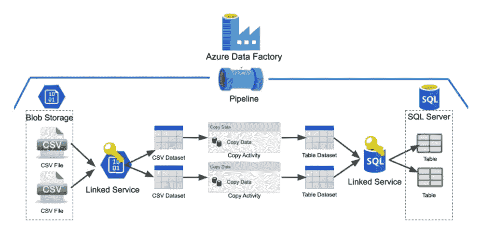
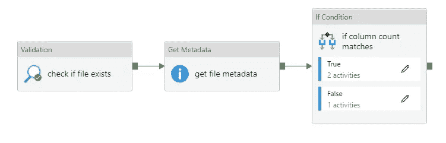
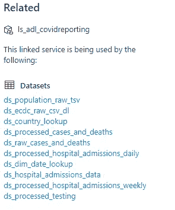
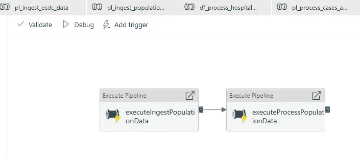
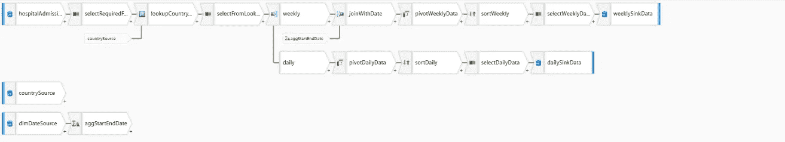

# 作为 ETL 工具的 Azure 数据工厂及其用例

> 原文：<https://medium.com/javarevisited/azure-data-factory-as-an-etl-tool-and-its-use-cases-f36a7a421cee?source=collection_archive---------0----------------------->

Azure 数据工厂

## **1.1。简介**

如今，我们看到大多数开发人员都对[数据工程](https://javarevisited.blogspot.com/2020/06/top-5-course-to-crack-google-cloud-professional-data-engineer-certification.html)或[数据科学](/javarevisited/my-favorite-data-science-and-machine-learning-courses-from-coursera-udemy-and-pluralsight-eafc73acc73f)感兴趣，尽管软件开发人员的时代不会很快结束，但是！毫无疑问，由于对一致的电子内容创建、事务性数据生成和数据流日志的需求不断增加，数据科学和数据工程将成为需求。

很多公司知道他们有充足的数据，但不知道如何使用它们！虽然市场上有很多 ETL 工具，但是如何知道哪一个是最好的呢？哪一个能以更少的成本为我们提供最佳的结果？哪一个将帮助我们管理我们内部的所有数据，并从我们的数据中提供准确的信息？
一家公司在决定使用何种工具来处理数据之前，会遇到许多这样的问题！

一个非常著名的 ETL 工具是 Azure 数据工厂

Azure Data Factory 允许我们:
**从许多受支持的来源(内部和云来源)复制**数据
**转换**数据(参见以下段落)
**发布**复制和转换的数据，将其发送到目标数据存储或分析引擎
**使用丰富的图形界面监控**数据流

## 2.2 什么是 Azure 数据工厂？

Azure Data Factory 是基于云的 ETL 和数据集成服务，允许我们创建数据驱动的工作流，以支持数据移动和大规模转换数据。它可能有点类似于 **Talend** ，但是，它比 **Talend** 拥有更多的功能，也更强大

我们先来了解一下 **Azure 数据工厂的基本组件:-**

图 1.1 显示三种不同活动的图

*   **活动:**活动就像一个逻辑操作或我们对数据执行的操作。 **Azure 数据工厂**中的一些主要重要活动有:
    - **复制活动:**该活动涉及从不同的数据集中复制数据以供进一步处理
    - **查找活动:**该活动涉及从由 **Azure 数据工厂**-
    -**验证活动支持的数据源中添加数据集:**该活动旨在确保管道只有在通过了来自 附加的数据集引用，或者已经达到超时
    - **获取元数据活动:**此活动从 **Azure 数据工厂**-
    -**中检索任何数据的元数据条件活动:**此活动检查给定的条件，如果结果为**真**则当条件评估为**假**时，它执行一组特定的活动和另一组活动

图 2.2 显示链接服务的图

*   **链接服务:**链接服务是将您的数据存储链接到 **Azure 数据工厂**或 **Synapse 工作区**的一个非常重要的组件。它们很像连接字符串，它定义了服务连接到外部资源所需的连接信息

图 3.3 显示管道的图形

*   管道:它是执行特定工作的活动的逻辑组。管道基本上是可以由单个活动执行的作业的完整执行。当您谈到触发从复制数据到数据转换的整个过程，而无需单独触发不同的活动时，管道非常有用

图 4.4 显示其中一个数据集的图

*   **数据集:**数据集是数据的命名视图，它简单地指向或引用您希望在活动中用作输入和输出的数据

图 5.5 显示其中一个数据流的图形

*   **映射数据流:**映射数据流是 **Azure Data Factory** 中可视化设计的数据转换。它有助于设计数据转换逻辑，而无需实际编码和编写脚本
*   **触发器:**ADF 中的触发器是执行管道运行的另一种方式。触发器代表一个处理单元，用于确定何时需要启动管道执行

## 3.3 Azure 数据工厂与其他 ETL 工具有何不同？

有一些特性将 **Azure Data Factory** 与其他工具区分开来。
它还能够运行 SSIS 软件包
它能够根据给定的工作负载自动扩展(完全托管的 PaaS 产品)。
它允许每分钟运行一次
它通过网关无缝连接内部& [Azure 云](/javarevisited/10-best-microsoft-azure-cloud-certification-it-professionals-can-aim-b7b6765d8ef1)它可以处理大数据量
它可以连接&与其他计算服务(Azure Batch、HDInsights)一起工作，甚至在 ETL 期间运行真正的大数据计算
它支持预加载和后加载转换
它集成了大约 80 个数据源，包括 SaaS 平台、 [SQL](/javarevisited/top-5-sql-and-database-courses-to-learn-online-48424533ac61) 和 [通用协议和各种文件类型
它支持大约 20 个云和本地数据仓库和数据库目的地
Azure Data Factory 的**数据管道的定价是根据管道编排运行的数量计算的； 流程执行和调试的计算时间；和数据工厂操作的数量，如管道监控，所以我们只需要根据我们使用的资源付费，不多也不少！**](/javarevisited/5-best-nosql-database-programmers-and-developers-can-learn-42a0bdfa9a12?source=rss------programming-5)

## 4.4 Azure 数据工厂的各种用例

**Azure 数据工厂**的各种用例如下:
用于支持高级分析项目的数据迁移。
可用于改革从 [SQL server](/javarevisited/top-10-free-courses-to-learn-microsoft-sql-server-and-oracle-database-in-2020-6708afcf4ad7) 集成服务到额外数据的 EEL 流程
可用作从客户端服务器获取数据或在线数据到 Azure 数据湖的解决方案。我们创建管道来编排从源到目标的数据流
它可以用于执行各种数据集成流程，也是最著名的 **ETL** 工具之一
它可以用于集成来自不同 ERP 系统的数据，并将其加载到 Azure Synapse 中进行报告，它还支持通过 [**power BI**](/javarevisited/7-best-courses-to-learn-microsoft-power-bi-for-beginners-and-experienced-developers-83695c9428dc) 以及
进行分析和报告。ADF 工具集成得非常好， 允许快速开发 **ETL** 、[大数据](/javarevisited/top-10-courses-to-learn-big-data-and-hadoop-best-of-lot-23ef8691633f)、数据仓库和[机器学习解决方案](/javarevisited/10-free-machine-learning-courses-for-beginners-181f83b4c816)，能够灵活增长并适应不断变化或增强的需求

## 5.5 结论

数据工厂为我们提供了将云数据与本地数据轻松集成的可能性。它的独特之处在于其易用性以及转换和丰富复杂数据的能力。它提供可扩展、可用且低成本的数据集成。今天，这项服务是任何数据平台和机器学习任务的重要组成部分。

继续学习，继续成长，继续探索！

祝一切顺利！

更多有趣和信息丰富的文章和提示请关注我的 [**Medium**](https://swapnilkant11.medium.com/) **和**[**Linkedin**](https://www.linkedin.com/in/swapnil-kant-279a3b148/)