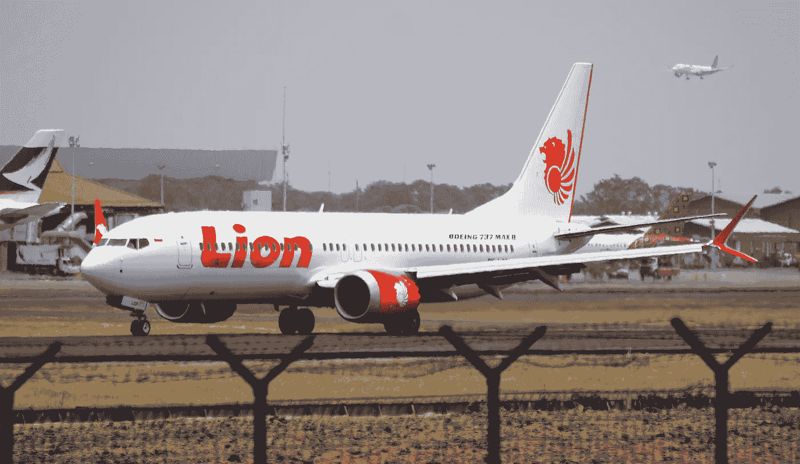
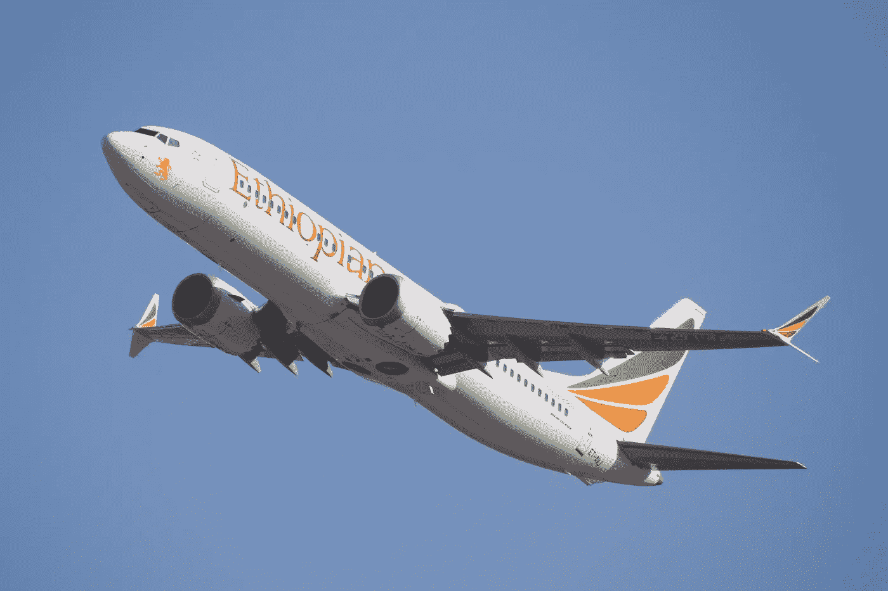
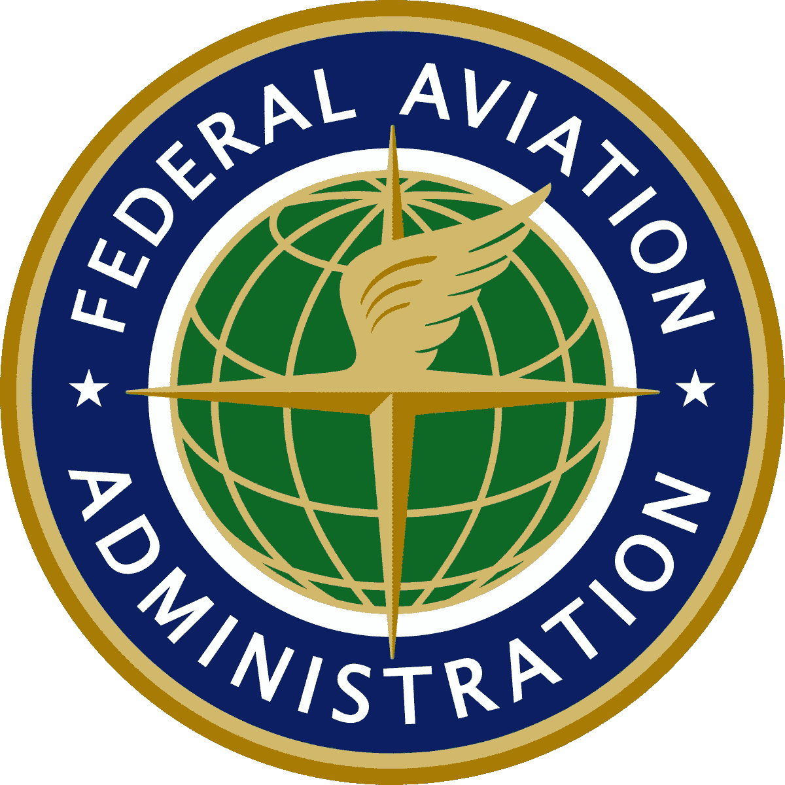
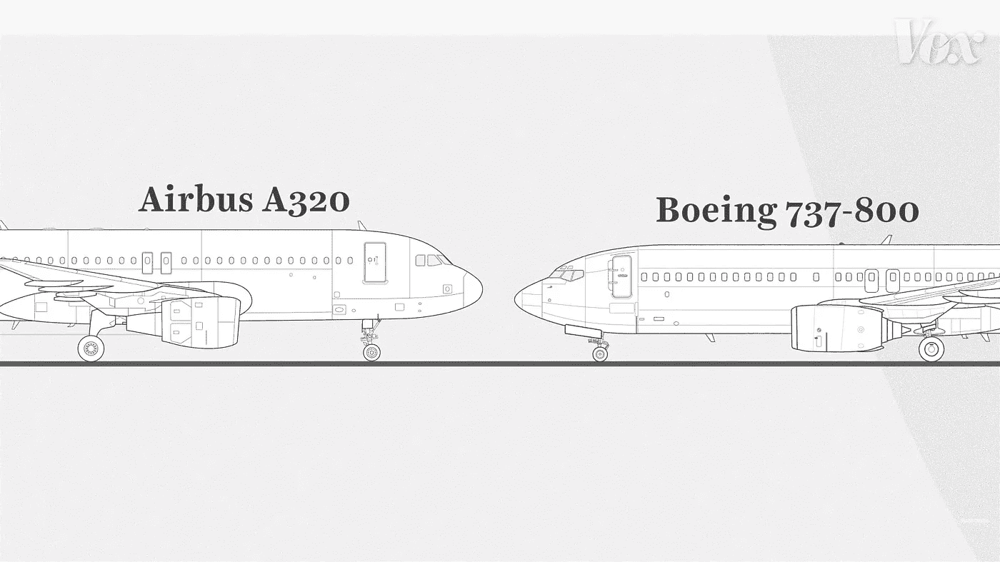

# 糟糕的代码质量案例研究:波音 737 MAX 飞机

> 原文：<https://medium.com/javarevisited/bad-code-quality-case-study-boeing-737-max-aircraft-4089984cafa0?source=collection_archive---------0----------------------->

2018 年 10 月 29 日，狮航 610 航班是从印度尼西亚雅加达飞往 Pangkal Pinang 的国内定期航班。起飞 13 分钟后，飞机坠入爪哇海，189 名乘客和机组人员全部遇难。这是第一起涉及新波音 737 MAX 飞机的重大事故。

2019 年 3 月 10 日，埃塞俄比亚航空公司 302 航班是一架从埃塞俄比亚飞往肯尼亚内罗毕的国内定期航班。起飞 6 分钟后，飞机在 Bishoftu 镇附近坠毁，机上 157 人全部遇难。

2019 年 3 月 13 日，美国联邦航空管理局(FAA)停飞了所有波音 737 MAX 飞机，当时它收到了事故相似性的证据。所有 387 架飞机都被禁止服役。

但是是什么导致了这两起事故呢？

一点历史:排名靠前的飞机制造商是波音公司，占 38%，空客公司占 28%。2010 年 11 月 30 日，空客计划更新他们最受欢迎的机型 A320。对于这次更新，他们计划有一个更大的引擎，效率将提高 15%。那会为航空公司节省很多钱。与此同时，飞机本身与旧版本没有太大的不同，这意味着飞行员不需要太多的额外训练。这是一件大事。

这对波音来说是个问题。为了与他们竞争，他们想做同样的事情:安装更大的发动机。问题是——波音 737 离地面更低。

这意味着放一个更大的引擎会很危险，因为引擎会离地面很近。

几个月后他们想通了:

他们会把引擎放得高一点，这样就能给更大的引擎留出空间。然而，这样做也意味着发动机推力的中心线发生了变化。这意味着当飞行员给引擎加电时，飞机会抬起机头——比预期的要高。

这个问题有两种解决方案:

第一个解决方案是重新设计飞机。这将大大推迟飞机发布的最后期限，他们的竞争对手空中客车公司可能会遥遥领先。这也意味着这将是一架与波音 747 明显不同的飞机，飞行员需要接受额外的训练来驾驶飞机。这意味着为波音公司和购买它们的客户都要花费数百万美元。

第二个解决方案是软件解决方案。当传感器检测到飞机以过高的角度飞行时，它会自动将飞机向下推。

不用说，他们实现了第二种解决方案。

这些崩溃与一家外包公司有关，该公司雇佣临时工开发和测试软件，时薪仅为 9 美元。坠机后，他们在控制下推动作的软件中发现了几个 bug。

前波音公司软件工程师马克·拉宾告诉彭博，编码人员按照波音公司制定的规范工作，但是“因为编码不正确，所以来回跑了很多圈”

事故发生后，该公司报告净亏损 29 亿美元。

确切的软件问题是不公开的，因为代码没有外包，但事实仍然是——你需要学习如何编写高质量的代码，并每天改进你的软件工艺，因为我们编写的代码影响人们的生活。

**出发前—我们惊人的干净代码课程目前以 87%的折扣提供**

如果你喜欢这篇文章，你会喜欢我们的课程:

*   46 场讲座
*   3 小时的内容
*   做一个真实的项目来测试你的知识
*   27 个可下载资源
*   30 天退款保证

你可以在这里报名参加课程— [干净代码:7 天内暴涨你的编程生涯](https://rebrand.ly/spcc-737)

