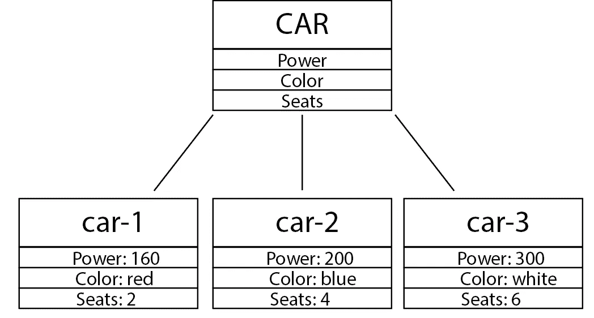
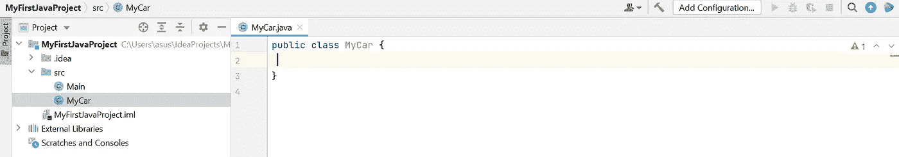
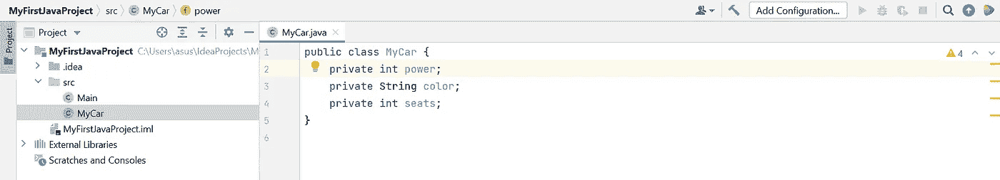
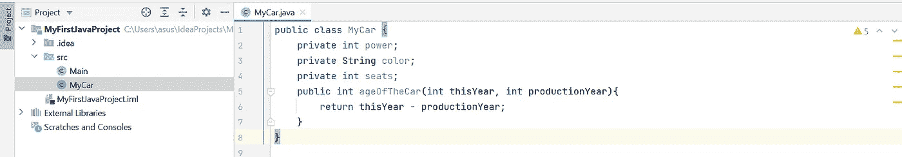
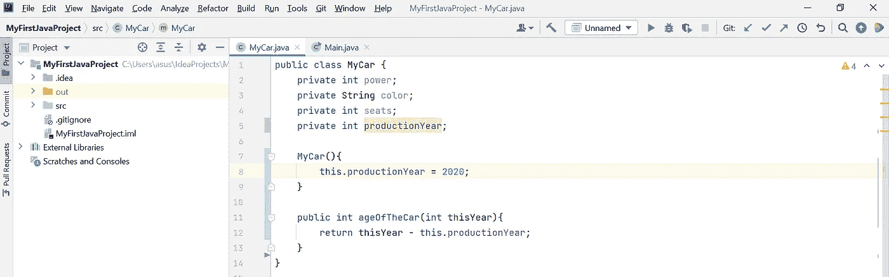
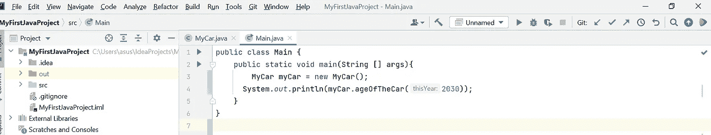

# 面向对象的基本概念

> 原文：<https://medium.com/javarevisited/basic-concepts-of-oop-77cdaecda561?source=collection_archive---------1----------------------->

> 现在，几乎每一种现代编程语言都是面向对象的。在这篇文章中，我将谈论面向对象的基本和重要的概念，这是项目和大多数工作面试所需要的。


我将使用 JAVA 作为编程语言，使用 T2 的 IntelliJ IDEA 作为 IDE。

我将描述的概念；

*   面向对象的程序设计(Object Oriented Programming)
*   目标
*   班级
*   访问修饰符
*   田
*   方法
*   构造器
*   “新建”关键字
*   “这个”关键字
*   getter/setter 方法

## 面向对象编程

[OOP](/javarevisited/6-best-object-oriented-programming-books-and-courses-for-beginners-d46235cbda49) 是一种编程类型，它通过围绕称为**对象**的构建单元对代码建模来驱动。每个*对象*代表世界上的一个现实生活中的对象。

技术上来说**对象**是一种变量。但不是*整型*、*双精度型*等原语变量。因此**对象**与其他对象相比是更强的变量。

比如说；让我们定义一个变量，它对应于现实世界中的一辆汽车。

如你所见，上面的盒子是我们的模型(变量)。我们可以创建多个实例。

[](https://javarevisited.blogspot.com/2013/06/5-must-read-books-to-learn-object.html)

图片-1

## **类**

**类**和**对象**是两个不同的术语，不应该互换使用，它们有时看起来是指同一个东西，但却有不同的含义。

**一类**；

*   是一种数据类型
*   有自己的文件，扩展名为“”。java "
*   定义结构
*   从大写字母开始

**一个物体**；

*   是一个变量
*   没有文件，可以在项目中使用
*   用于实现逻辑
*   从小写字母开始

现在让我们来谈谈如何在代码世界中设计我们的对象。首先，我们创建一个名为 MyCar 的类:



图片-2

## 田

现在，让我们为我们的汽车添加一些功能:



图片-3

这些特性在 [Java](/javarevisited/10-free-courses-to-learn-java-in-2019-22d1f33a3915) 中被命名为**字段**。在其他语言中，它们可以被命名为“**属性**或“**成员变量**”。

在我们的例子中；电源、颜色和座位是模型(类)的字段。

**访问修饰符**

我们看到关键字“**公有**”和“ [**私有**](https://www.java67.com/2019/02/can-you-add-non-abstract-method-on-interface-in-java.html) ”开始的字段也是类。这些是**访问修饰符**。

对于哪些字段是公共的还是私有的，您总是有最终决定权，这总是取决于字段的用途以及代码的整体设计。

我们也可以向类中添加函数。我们称这些函数为**方法**。



图片-4

## 构造器

[构造函数](https://javarevisited.blogspot.com/2012/12/what-is-constructor-in-java-example-chainning-overloading.html)是特殊类型的方法，负责创建和初始化该类的对象。

当你创建一个构造函数时，要注意两件事:

***i)*** 构造函数没有任何返回类型

***ii)*** 构造函数与类本身同名

构造函数可以有参数，并且可以为一个对象创建多个参数。

说到我们的例子，让我们为这个类定义一个名为 MyCar 的构造函数。我们希望确保任何 Mycar 类型的对象都将从设置为 *2020 的*生产年份*开始。因此我改变了方法。*

[](https://medium.com/javarevisited/7-best-online-courses-to-learn-object-oriented-design-pattern-in-java-749b6399af59)

图片-5

现在让我们创建一个类为`MyCar`的对象。为此，在`Main`类(Java 中的一个特殊类)中，我首先创建一个对象样本，并调用计算汽车年龄的方法。

[](https://javarevisited.blogspot.com/2018/07/top-5-websites-to-learn-coding-in-java.html)

图片-6

## “新建”关键字

如你所见，我们不使用`.`(点)来创建对象，而是使用`new`关键字。

```
Mycar myCar = new MyCar()
```

这将使用默认构造函数[创建一个名为`myCar`的对象。通过这个对象，你可以调用类中的方法。](https://javarevisited.blogspot.com/2014/01/why-default-or-no-argument-constructor-java-class.html)

## “这个”关键字

当我们需要在一个对象的方法或构造函数中引用该对象时，我们使用关键字`[this](http://www.java67.com/2013/06/difference-between-this-and-super-keyword-java.html)`。

`this`是对当前对象(其方法或构造函数被调用的对象)的引用。我们可以通过使用`this`从方法或构造函数中引用当前对象的任何字段。

在*图-5* 中，我们通过在方法*车龄*和构造器中使用`this`来引用字段*生产年份*。

```
MyCar(){
    this.productionYear = 2020;
}

public int ageOfTheCar(int thisYear){
    return thisYear - this.productionYear;
}
```

## getter/setter 方法

我们已经在上面提到了[访问修饰符](https://javarevisited.blogspot.com/2012/10/difference-between-private-protected-public-package-access-java.html#axzz6j8KhisSX)。给一个类的字段加标签的建议方式是使它成为私有的，而不是公共的。相反，创建提供获取其值的方法的公共方法更好。这些方法被称为**访问器方法**或**获取器**。

同样，最好创建[公共方法](http://www.java67.com/2012/12/what-is-public-private-protected-package-default-private-access-modifier-java.html)，提供设置或更新字段值的方法。我们称它们为**变异方法**或**设置器**。

按照惯例，getters 以单词" **get** 开始，setters 以单词" **set** 开始。然后是方法名。

这样，您可以确保敏感字段在项目中的任何其他地方都是不可访问和不可更改的。并且只能通过使用[getter 和 setter](http://javarevisited.blogspot.sg/2012/12/getter-and-setter-method-vs-public-modifier-field-java.html#axzz55oDxm8vv)来获取或设置/更改它们。风险更小，也更明确。

它看起来像下面这样: