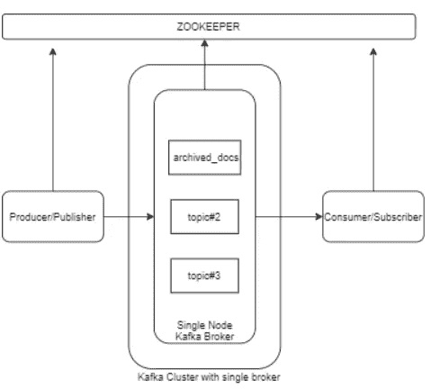
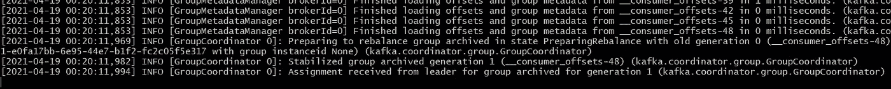
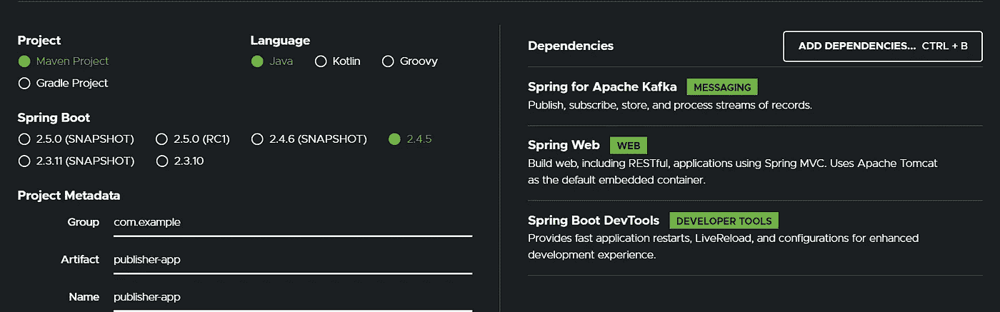
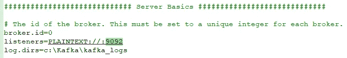
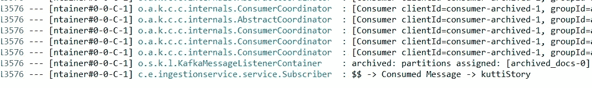

# 使用 Apache Kafka 作为微服务间通信的基本示例。

> 原文：<https://medium.com/javarevisited/basic-example-to-use-apache-kafka-as-communication-between-mircoservices-a097b4005a50?source=collection_archive---------0----------------------->

我们将把 apache Kafka 与 [spring-boot 微服务](/javarevisited/10-best-java-microservices-courses-with-spring-boot-and-spring-cloud-6d04556bdfed)整合为一种沟通模式。



我们将有两个微服务—

1.  发布者(将发送消息的服务)
2.  订户(将使用消息的服务)

**先决条件&设置:**

> 步骤 1 — **下载并运行** [**Zookeeper**](https://zookeeper.apache.org/releases.html#download) 。(用于跟踪 kafka 节点的状态，并存储基本元数据，如关于主题、经纪人、消费者补偿的信息)
> 
> 注意—如果您在运行 zookeeper 服务时遇到有关配置文件的错误，请尝试将配置文件名更改为“**zoo . CFG”**。

```
Bash from zookeeper root — **sh bin/zkServer.sh start**
```


> 步骤 2 —下载并运行 kafka 服务器/代理。

```
Bash from kafka root — **bin/kafka-server-start.sh config/server.properties**
```



# 现在我们准备使用我们的微服务，它将作为使用这个 Kafka broker 的发布者和订阅者。

# Publisher Springboot 应用程序:

我已经创建了一个 rest 端点，我们将使用它向 [Kafka](/javarevisited/top-10-apache-kafka-online-training-courses-and-certifications-621f3c13b38c) 代理发布消息。

**依赖关系**:

[](https://javarevisited.blogspot.com/2018/04/top-5-apache-kafka-course-to-learn.html#axzz6kZHuJeAZ)

**应用程序.属性:**

```
server.port=9041spring.kafka.producer.key-serializer = org.apache.kafka.common.serialization.StringSerializerspring.kafka.producer.value-serializer = org.apache.kafka.common.serialization.StringSerializerspring.kafka.producer.bootstrap-servers=localhost:9092
```

我们的 pub 应用程序将在 9041 上运行，这里需要注意的一个属性是“**spring . Kafka . producer . bootstrap-servers**”，这是我们的代理运行的服务器主机&端口。

您可以在 **server.properties** 文件的 kafka directory config 文件夹中检查您的代理配置。



[**控制器**](https://javarevisited.blogspot.com/2017/08/difference-between-restcontroller-and-controller-annotations-spring-mvc-rest.html#ixzz6OYNB9oii) **:**

```
@RestController
@RequestMapping(value = "/archive")
public class Controller {private final Publisher producer;@Autowired
public Controller(Publisher producer) {
this.producer = producer;
  }@GetMapping
public void sendMessageToKafkaTopic(@RequestParam("message") String message){
     this.producer.sendMessage(message);
  }
}
```

**发布者服务:**

```
@Service
public class Publisher { private static final Logger logger = LoggerFactory.getLogger(Publisher.class);
   private static final String TOPIC = "archived_docs"; @Autowired
   private KafkaTemplate<String,String> kafkaTemplate;public void sendMessage(String message){ logger.info(String.format("$$ -> Producing message --> %s",message)); this.kafkaTemplate.send(TOPIC,message);
  }
}
```

我们可以看到，消息将要发布到的主题是**“archived _ docs”**。

# 订户 Springboot 应用程序:

**依赖关系**:与发布者相同。

**应用程序.属性:**

```
server.port = 9042
```

我们可以直接创建一个服务来监听来自 Kafka broker 的消息。

```
@Service
public class Subscriber {private final Logger logger = LoggerFactory.getLogger(Subscriber.class);@KafkaListener(topics = "archived_docs", groupId = "archived")
public void consume(String message){
   logger.info(String.format("$$ -> Consumed Message -> %s",message)); }
}
```

此处，该服务正在监听主题为“ **archived_docs** ”的传入消息。一旦该服务使用了消息，我们就将其记录在控制台中。

现在公布一些消息吧:

我们的发布器运行在 9041 上，我们调用 API 来发布吧。

```
[http://localhost:9041/archive?message=kuttiStory](http://localhost:9041/archive?message=kuttiStory)
```


现在，如果我们检查订阅者日志，我们应该会看到使用的消息。



> PS——Kafka 的主要优点之一是它使微服务松散耦合。一个微服务可以只发布消息，而不关心另一个服务何时/是否得到它，它的工作(发布消息)就完成了。假设消费者应用程序宕机。没问题。当它再次运行时，消费者应用程序将在它启动运行时收到该消息。

你自己试试，停止消费者 app，打生产者 API，当你再次启动消费者 app 的时候，它就会消费消息。

这就是基本的 kafka 工作流程。

参考资料:

[https://www.youtube.com/watch?v=NjHYWEV_E_o](https://www.youtube.com/watch?v=NjHYWEV_E_o)