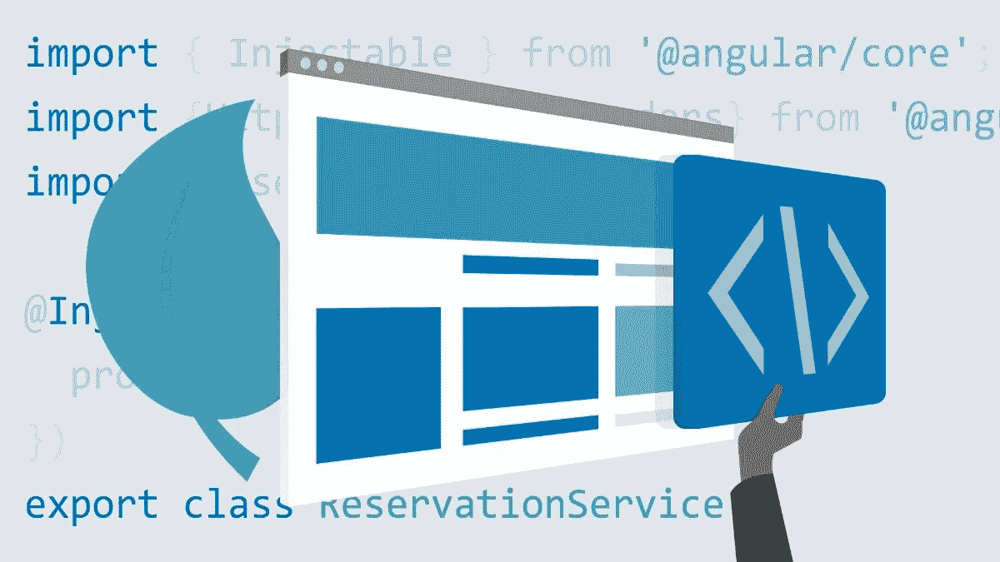
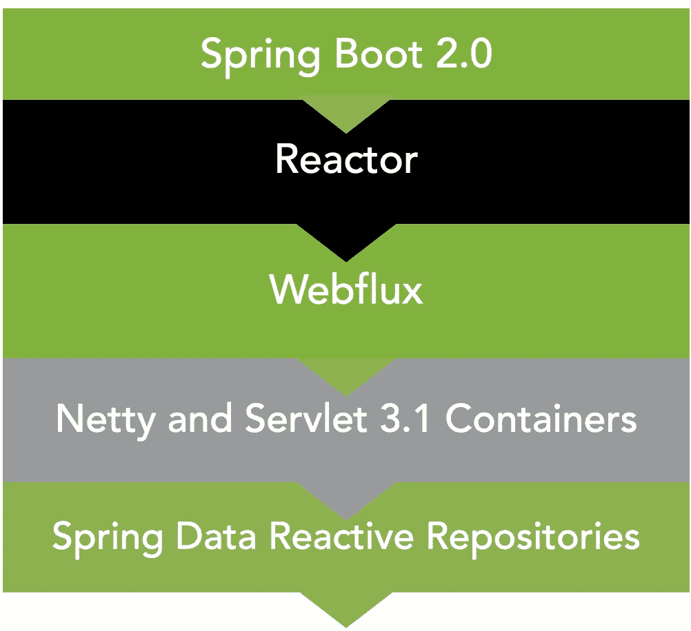
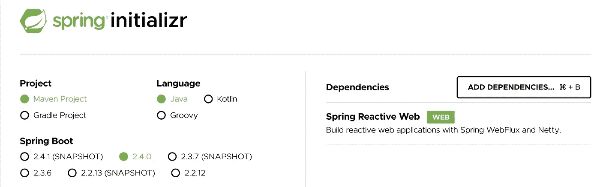
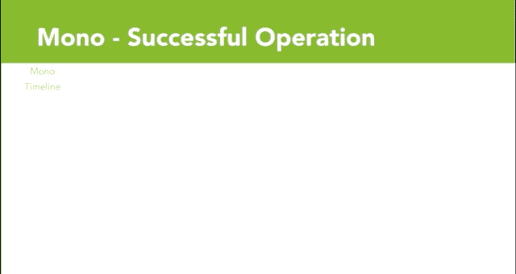

# Spring WebFlux 的基本介绍

> 原文：<https://medium.com/javarevisited/basic-introduction-to-spring-webflux-eb155f501b17?source=collection_archive---------0----------------------->



图片来自我的 LinkedIn 学习课程:[https://LinkedIn-Learning . pxf . io/full-stack-reactive-app-Java-spring-angular](https://linkedin-learning.pxf.io/full-stack-reactive-app-java-spring-angular)

[Spring WebFlux](https://docs.spring.io/spring-framework/docs/current/reference/html/web-reactive.html) 以类似于 SpringMVC 的带注释的控制器格式为 web 应用程序提供反应式、异步、非阻塞的编程支持。

这种方法类似于 [Node.js](/javarevisited/top-10-online-courses-to-learn-node-js-in-depth-8ef0e31ca139) 使用异步、非阻塞模型，这有助于提高其可扩展性。Spring WebFlux 使用了一个类似的模型，但是有多个事件循环。

**Spring WebFlux** 脱离了传统 [SpringMVC](https://javarevisited.blogspot.com/2020/08/top-5-courses-to-learn-spring-mvc-for.html) (默认情况下使用 Tomcat)中的每请求线程阻塞模型，转向多事件循环、异步、非阻塞(默认情况下使用 [Netty](https://netty.io/) )范式，这种范式比传统阻塞代码更具可伸缩性和效率。

*关于用 Java 进行反应式函数编程的更一般的介绍，请查阅:*[*https://medium . com/javarestived/intro-to-Reactive-Functional-programming-d49e 00365847*](/javarevisited/intro-to-reactive-functional-programming-d49e00365847)

对反作用力弹簧的完整课程感兴趣吗？在 LinkedIn Learning 上查看这些课程:

*   [反作用弹簧](https://linkedin-learning.pxf.io/19QKz)
*   [用 Angular 和 SpringBoot 构建一个反应式 App 2](https://linkedin-learning.pxf.io/full-stack-reactive-app-java-spring-angular)

# 弹簧反应堆

[](https://medium.com/javarevisited/10-free-spring-boot-tutorials-and-courses-for-java-developers-53dfe084587e?source=collection_home---4------7-----------------------)

弹簧反应堆

弹簧反应堆包括:

*   [Spring Boot 2+](/javarevisited/10-advanced-spring-boot-courses-for-experienced-java-developers-5e57606816bd?source=collection_home---4------0-----------------------)
*   项目反应堆
*   弹簧网流量
*   Netty(作为默认的 web 服务器，而不是 Tomcat)
*   Spring 数据反应库

# 为什么要用 Spring WebFlux？

Spring WebFlux 将允许您更有效地利用 CPU 和网络资源，提供更具可伸缩性的体系结构和更灵敏的用户体验。

**来自 Spring WebFlux 文档**

> 为什么要创建 Spring WebFlux？
> 
> 部分答案是需要一个非阻塞的 web 堆栈来处理少量线程的并发性，并使用更少的硬件资源进行扩展。
> 
> …
> 
> 这一点很重要，因为 Netty 等服务器已经在异步、非阻塞领域得到了很好的应用。
> 
> …
> 
> 答案的另一部分是函数式编程。
> 
> Java 8 中 lambda 表达式的加入为 Java 中的函数式 API 创造了机会。这对于允许异步逻辑的声明式组合的非阻塞应用程序和延续风格的 API 来说是一个福音。

# Spring WebFlux 框架

Spring WebFlux 建立在实现了[反应流](https://www.reactive-streams.org/)规范的[项目反应器](http://projectreactor.io/)之上。

**从无功流文档:**

> Reactive Streams 是一个为非阻塞反压异步流处理提供标准的倡议。
> 
> 这包括针对运行时环境( [JVM](/javarevisited/7-best-courses-to-learn-jvm-garbage-collection-and-performance-tuning-for-experienced-java-331705180686) 和 [JavaScript](/javarevisited/10-best-online-courses-to-learn-javascript-in-2020-af5ed0801645) )以及网络协议的努力。

WebFlux 支持两种范例:

*   基于注释的弹簧控制器(类似于 [SpringMVC](/javarevisited/21-spring-mvc-rest-interview-questions-answers-for-beginners-and-experienced-developers-21ad3d4c9b82)
*   允许功能性的、流畅的 API 风格的路由和处理程序功能的功能端点

## Spring WebFlux 在运行


Spring WebFlux 在运行

# Spring Boot 首发

Spring Boot 公开了 Spring WebFlux 反应式 web 应用的 Spring Boot 启动器:[**Spring-boot-starter-web flux**](https://mvnrepository.com/artifact/org.springframework.boot/spring-boot-starter-webflux)

**美芬:**

```
<!-- [https://mvnrepository.com/artifact/org.springframework.boot/spring-boot-starter-webflux](https://mvnrepository.com/artifact/org.springframework.boot/spring-boot-starter-webflux) -->
<dependency>
    <groupId>org.springframework.boot</groupId>
    <artifactId>spring-boot-starter-webflux</artifactId>
</dependency>
```

**格雷尔:**

```
//[https://mvnrepository.com/artifact/org.springframework.boot/spring-boot-starter-webflux](https://mvnrepository.com/artifact/org.springframework.boot/spring-boot-starter-webflux)
compile('org.springframework.boot:spring-boot-starter-webflux')
```

您可能还想考虑为您的测试类引入这种依赖:[**io . project reactor:reactor-test**](https://mvnrepository.com/artifact/io.projectreactor/reactor-test)

从 [Spring Initializr](https://start.spring.io/) 引导应用程序时，确保选择 **Spring Reactive Web** 作为依赖项。



带弹簧腹板通量的弹簧初始 zr

您还会希望利用 Spring 数据反应依赖来获得反应式、异步、非阻塞架构的全部好处。

**Spring 数据反应库示例:**

*   Apache Cassandra 的 Spring 数据反应
*   Spring 数据反应 MongoDB
*   弹簧数据反应速度

# 带注释的 Spring WebFlux RestController

下面是一个带注释的 Spring WebFlux 控制器的示例:

## Spring WebFlux 控制器示例

```
@RestController
@RequestMapping("api/v1/room/reservation/")
public class ReservationResource {@GetMapping(path = "/{roomId}")    
   public Mono<Reservation> getReservationById(@PathVariable                       Mono<String> roomId) { return //Call your service layer here
   }
}
```

*在使用 Spring WebFlux 和 Angular* 的 [*全反应式应用程序环境中查看该控制器的源代码*](https://github.com/anataliocs/reactiveapp2019/blob/master/src/main/java/com/linkedinlearning/reactiveapp/controller/ReservationResource.java)

正如你所看到的，这段代码非常类似于 [**Spring MVC**](https://www.java67.com/2017/11/top-5-free-core-spring-mvc-courses-learn-online.html) ，除了返回类型是一个被动发布者，在这里是一个 [**Mono**](https://projectreactor.io/docs/core/release/api/reactor/core/publisher/Mono.html) ，它发出一个 **Reservation** 对象(来自这个[示例项目](https://github.com/anataliocs/reactiveapp2019)的一个 DTO)。

**Mono:** 一个反应式发布者，发出 1 或 0 个元素，然后终止。

换句话说，一个单声道就像一个异步，承诺或未来，将发出一个元素。

**来自 Spring 的单声道类型 JavaDocs:**

> 带有基本 rx 操作符的反应流`[Publisher](https://www.reactive-streams.org/reactive-streams-1.0.3-javadoc/org/reactivestreams/Publisher.html?is-external=true)`通过发出最多一个项目*`onNext`信号，然后以`onComplete`信号终止(单声道成功，有或没有值)，或仅发出一个`onError`信号(单声道失败)。*

## 单声道在行动



spring responsive Publisher Mono 正在运行

*单声道的订户将接收到单个发射元素(或错误信号)，然后是完成信号。*

# 使用 Spring 数据反应库

现在，您已经有了一个反应式控制器，接下来您将希望挂钩到一个利用 Spring 数据反应式存储库的服务层。

## **弹簧无功库示例**

```
public interface ReactiveReservationRepository
  extends ReactiveCrudRepository<Reservation, String> {

  Mono<Reservation> findById(Mono<String> roomId);
}
```

有关如何配置 Spring 反应数据的更多详细信息，请查看本文:[https://Spring . io/blog/2016/11/28/going-Reactive-with-Spring-Data](https://spring.io/blog/2016/11/28/going-reactive-with-spring-data)

## **从 WebFlux 控制器调用反应库**

```
@RestController
@RequestMapping("api/v1/room/reservation/")
public class ReservationResource {... @GetMapping(path = "/{roomId}")    
   public Mono<Reservation> getReservationById(@PathVariable                       Mono<String> roomId) { // It is implied this @Bean is @Autowired into this class
      return reactiveReservationRepository.findById(roomId);
   }...}
```

如果您使用服务层，请确保您的服务方法的返回类型是反应式发布者，如 Mono 或 Flux。

## 示例项目

查看 Github repo，了解反应式应用的完整示例。

[全栈 Spring Boot 和 Angular App](https://github.com/anataliocs/reactiveapp2019)

# 对反作用力弹簧的完整课程感兴趣吗？在 LinkedIn Learning 上查看这些课程:

[无功弹簧](https://linkedin-learning.pxf.io/19QKz)


[https://linkedin-learning.pxf.io/19QKz](https://linkedin-learning.pxf.io/19QKz)

[用 Angular 和 SpringBoot 构建一个反应式 App with】](https://linkedin-learning.pxf.io/full-stack-reactive-app-java-spring-angular)


[https://LinkedIn-learning . pxf . io/full-stack-reactive-app-Java-spring-angular](https://linkedin-learning.pxf.io/full-stack-reactive-app-java-spring-angular)

查看我所有平台和视频的网站:[https://chris-anatalio.dev/](https://chris-anatalio.dev/)