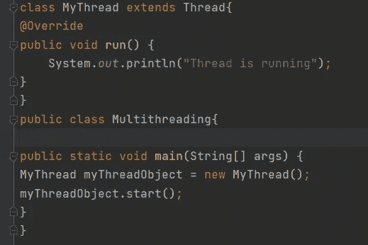
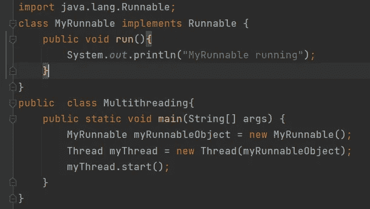

# Java 多线程基础

> 原文：<https://medium.com/javarevisited/basics-of-multithreading-in-java-1f3c2f3b6d31?source=collection_archive---------2----------------------->

卢卡·布拉沃在 [Unsplash](https://unsplash.com/) 上的照片

# 用 Java 创建线程的基础知识

什么是多线程？简单来说，多线程是并行执行程序的两个或多个部分的过程，目的是最大限度地利用 CPU。

如今，一台计算机可以同时执行多项任务，这要归功于多线程的概念。有两种方法可以由计算机处理这个过程，一种是使用单个处理器，其中使用时间偏移，另一种是使用多个处理器，其中运行多个任务。

多重任务有两种类型，

基于流程

基于线程

基于进程的多任务处理就像你可以用你的音乐播放器听音乐，用 VS 代码做一个项目，同时用你的浏览器上网。

基于线程的多任务处理就像你可以在网上冲浪的同时从网上下载一些文件。在这里，冲浪和下载是在两个不同的线程上同时完成的。

# 螺纹类型

众所周知，Java 虚拟机由许多线程组成。主要由应用线程和系统线程组成。

系统线程可以分为垃圾收集器线程、虚拟机线程和编译器线程。

然而，开发者可以在应用程序中随意创建许多线程，但这也取决于所使用的 JVM 的类型。

# 创建线程

有两种创建线程的方法。

1.通过扩展线程类

2.通过实现 Runnable 接口

## 通过扩展线程类

这里我们做的是创建一个类，它扩展了 Thread 类，Thread 类中的 run()方法被创建的类覆盖。接下来，我们创建一个我们创建的类的新对象，并调用 start()方法来开始线程的执行。run()方法是在调用 start()方法时执行的。

扩展线程类

从上面的代码片段中可以清楚地看到，一个名为“MyThread”的类扩展了 Thread 类并覆盖了 run()方法。然后创建一个名为“myThreadObject”的新对象，并在该对象上调用 start()方法，导致在线程对象上调用 run()方法

## 通过实现 runnable 接口

在这种方法中，我们创建了一个实现 Runnable 接口的类。该类覆盖了 run()方法，我们创建了一个新的 thread 对象，并在该对象上调用 start()方法。

值得注意的是，Runnable 接口只有一个名为 run()的方法。

实现可运行的接口

如上面的代码所示，类“MyRunnable”实现了 Runnable 类，并覆盖了 run()方法。然后创建 MyRunnable 类的一个新实例，并将其传递给 Thread 构造函数，如上所示。最后，start()方法在线程对象上被分类。

当线程通过调用 start()方法启动时，MyRunnable run()方法将被执行，因为它覆盖了 Runnable 接口中的 run()方法。

# 当选择一种实现线程的方式时，我们需要考虑什么。

使用 Runnable 接口来启动一个新线程总是一个好主意。否则，线程类将失去继承特性。

如果我们在项目中扩展 Thread 类，我们就不能扩展任何其他类，因为我们都知道 java 不支持多重继承。因此，我们可以实现 Runnable 接口，这将允许我们扩展其他类。

# 重要事项:

在创建和启动线程时，一个常见的错误是调用 run()方法而不是 start()方法。然而，这将执行 run()方法中给出的代码，但不会创建新的线程，它将在当前线程上继续执行前面的代码行。因为当一个程序调用 start()方法时，它会创建一个新的线程，然后调用 run()方法。

但是，如果我们直接调用 run()方法，则不会创建新的线程，run()方法将作为普通方法在当前线程上执行，没有多线程。

我希望这篇关于多线程基础知识简介的短文能帮助您更好、更清晰地理解所讨论的主题。请随时对以上内容提供反馈，并关注与此相关的更多文章。