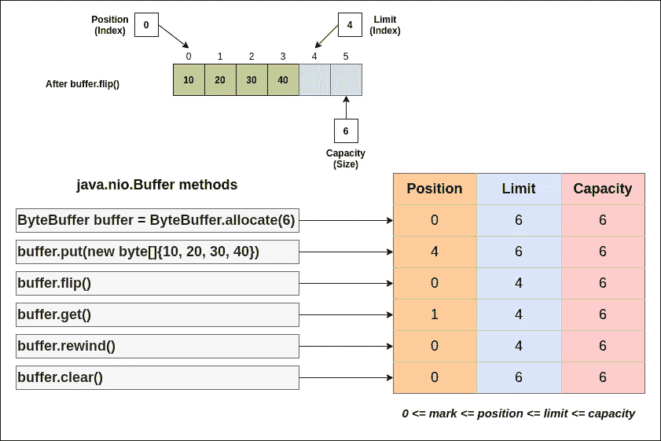
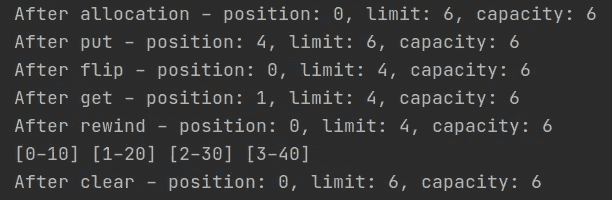
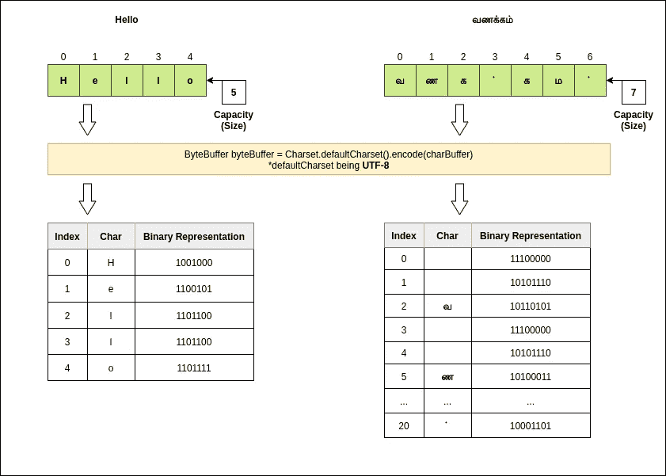
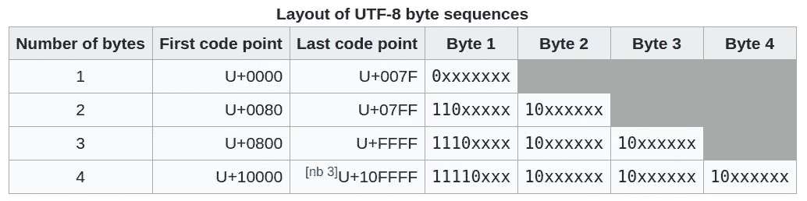
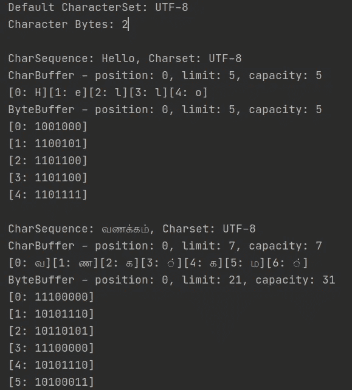

# 非阻塞 IO 基础知识—缓冲区

> 原文：<https://medium.com/javarevisited/basics-of-non-blocking-io-buffers-c65c1aecd781?source=collection_archive---------1----------------------->

帕特里克·林登伯格在 [Unsplash](https://unsplash.com/s/photos/hard-disk?utm_source=unsplash&utm_medium=referral&utm_content=creditCopyText) 上的照片

> 执行 I/O 通常比在内存中对数据执行处理任务需要更长的时间。许多编码者专注于他们的对象对数据做了什么，而**很少关注获取和存储数据所涉及的环境问题。**
> 
> I/O 通常是应用程序性能的限制因素，而不是处理速度
> **——Ron Hitchens 在《Java NIO》一书中写道**

Java NIO(非阻塞 I/O)是一个用于可伸缩 I/O 的 API 集合

*   [缓冲器](https://javarevisited.blogspot.com/2012/01/memorymapped-file-and-io-in-java.html)
*   通道— [文件通道](https://javarevisited.blogspot.com/2016/01/reading-writing-files-using-filechannel-bytebuffer-example.html#axzz6g8q23kRW)和套接字通道
*   选择器
*   字符集

**NIO Buffers** 是非阻塞 I/O 整体实现的基本构建块。在这篇博客中，我将介绍缓冲区的行为。在后续的博客中，我将介绍如何有效地处理文件和网络 I/O。

*   缓冲区是特定原始类型的线性有限元素序列。除了它的内容，缓冲区的基本属性是它的**容量、限制和位置。**
*   一个缓冲区的容量是它包含的元素的数量。缓冲区的容量永远不会为负，也永远不会改变。
*   缓冲区的限制是不应该被读取或写入的第**个元素的索引。缓冲区的限制永远不会是负的，也永远不会大于其容量。**
*   缓冲器的位置是下一个要被读取或写入的元素的**的索引。缓冲区的位置永远不会是负的，也永远不会大于它的限制。**

缓冲等级

ByteBuffer 基本示例

ByteBuffer 基本示例输出

每个非布尔原始类型都有一个 Buffer 类的子类。

缓冲类层次结构

[ByteBuffer](https://www.java67.com/2015/06/how-to-convert-bytebuffer-to-string-in-java-example.html) 是所有可用的图元缓冲区中最直接、最有用的缓冲区。为了更好地理解，让我们考虑 CharBuffer 和 CharBuffer 到 ByteBuffer 的转换。

我们将使用以下字符序列

*   ASCII 字符。例如，你好
*   Unicode 字符。例如，வணக்கம்(泰米尔语中的 Vaṇakkam 是你好的意思)

**需要注意的要点是**

1.  字符序列在 CharBuffer 中每个字符占用 1 个元素。对于给定的例子，这些是 5 和 7 个字符
2.  只有当我们指定编码的字符集时，CharBuffer 中的内容才能转换为 ByteArray。默认编码取决于底层操作系统的区域设置和字符集。我们可以通过使用 [JVM 选项](https://www.java67.com/2016/08/10-jvm-options-for-java-production-application.html) flag -Dfile.encoding=UTF-8 来显式设置字符集。
3.  提供了编码集的完整列表[此处](https://docs.oracle.com/en/java/javase/11/intl/supported-encodings.html#GUID-E20951E6-C420-4D2F-A6BE-1470B4D55B3B)
4.  [UTF-8](https://javarevisited.blogspot.com/2015/02/difference-between-utf-8-utf-16-and-utf.html#axzz6g8q23kRW) 被定义为编码一至四个字节的码点

CharBuffer 到 ByteBuffer

[https://en.wikipedia.org/wiki/UTF-8](https://en.wikipedia.org/wiki/UTF-8)

对于泰米尔文字வ，详情如下

*   UTF-8(二进制)1110**0000**:10**101110**:10**110101**
*   Unicode 00001011 10110101(以上行中所有粗体二进制数字)产生 Unicode 字符\u0BB5

关于 Unicode 的更多细节，请点击查看

CharBuffer 到 ByteBuffer

CharBuffer 基本示例

**参考文献:**

1.  [堆栈溢出](https://stackoverflow.com/questions/24481238/bytebuffer-charbuffer-string-and-charset)
2.  罗恩·希钦斯的《Java NIO》