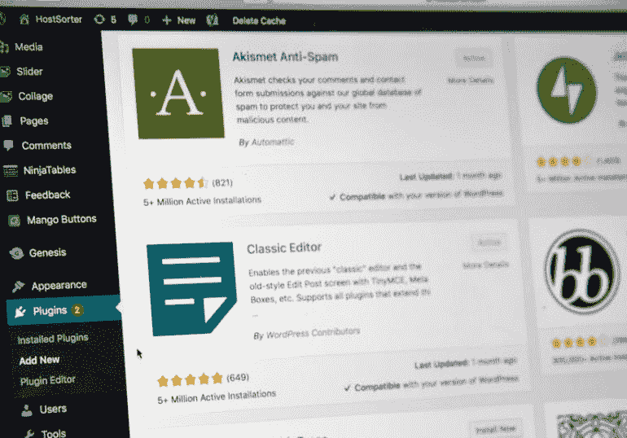
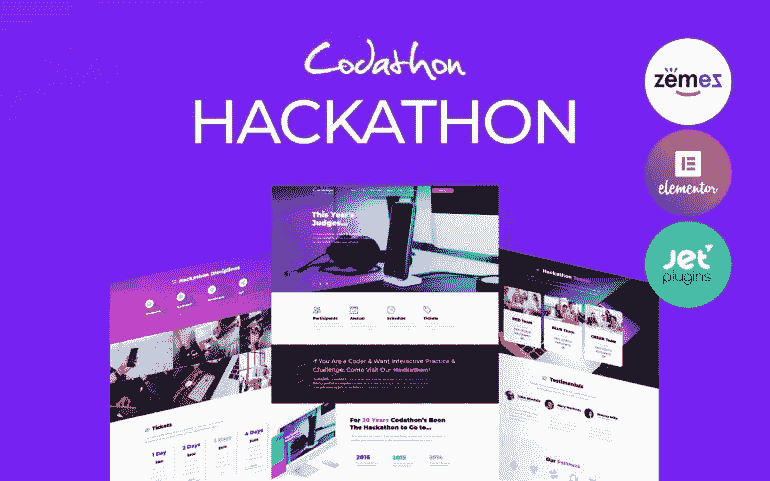
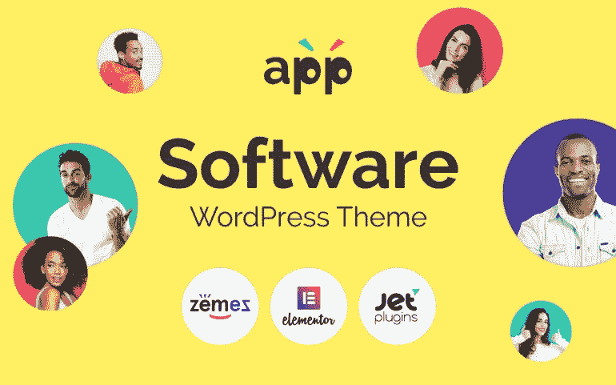
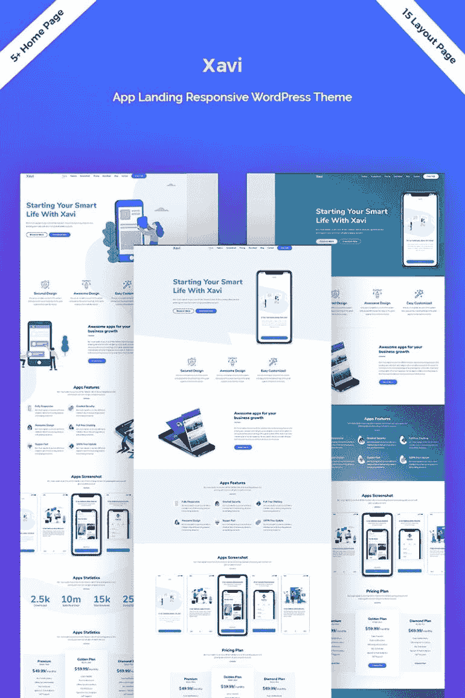
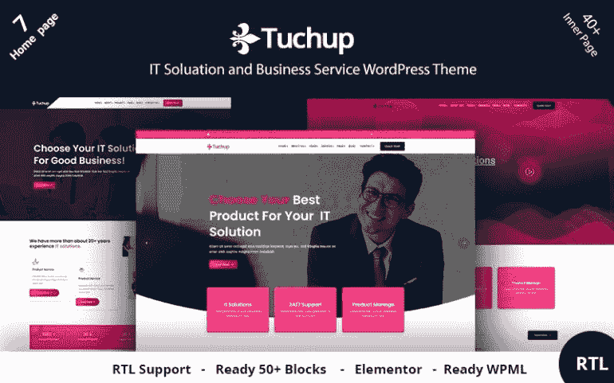
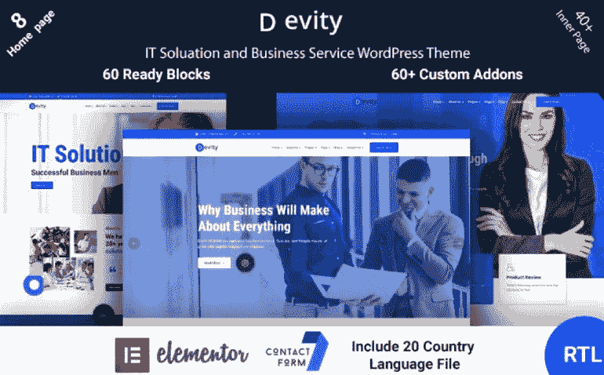
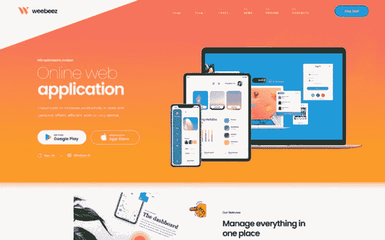
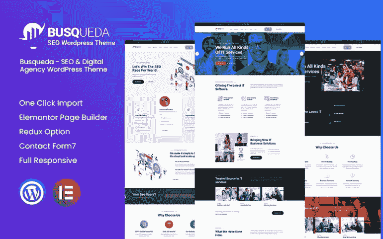
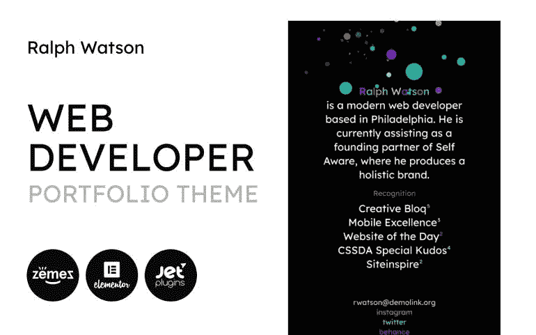

# 富有成效:2021 年十大网络开发主题

> 原文：<https://medium.com/javarevisited/be-productive-and-effective-top-10-web-development-wordpress-themes-in-2021-b94b1764a97a?source=collection_archive---------2----------------------->

如今，在工作和事业上蒸蒸日上不像以前那么复杂了。多亏了互联网和其他技术，推销你的产品和服务变得更加容易。毫无疑问，每个 web 开发者都想拥有一个令人印象深刻、引人入胜的网站。

这些人总是确保其他在线项目快速工作，提供无缝的用户体验，并具有理想的外观。他们的服务需求很高，但将自己与竞争对手区分开来是至关重要的。

[**所有 MonsterONE 黑色星期五和网络星期一交易等着你！**](https://www.templatemonster.com/monsterone/?aff=javarevisited&utm_campaign=blackfriday2021&utm_source=javarevisited&utm_medium=referral)

准备好浏览网络开发公司的 10 个主题。顺便问一下，为什么选择 WordPress 而不是其他平台是正确的？

1.  使用 WordPress 不用花钱。
2.  WordPress 是一个开源平台，可以让它的源代码变得更好。
3.  它为全球大部分网站提供动力。
4.  该平台可以适应各种网站类型。由于插件、扩展和现成的主题的可用性，它可以满足不同的需求。
5.  该团队还采取了一系列安全措施来保护所有网站免受不同的攻击。
6.  它有一个完全可定制的性质，所以你不会失去一个机会获得一个独特的网站。
7.  WordPress 也支持不同的多媒体类型。

# 实现你无限想法的十大网络开发主题

## Coders 登陆 WordPress 主题的黑客马拉松

让我们从一个生动的主题开始，这个主题是为那些有兴趣为程序员组织一次广泛的黑客马拉松的人准备的。在这种情况下，有一个特殊的地方来展示即将到来的事件的信息是至关重要的。该包装由多个预制部分组成。这些是纪律，奖状，门票，团队，等等。你可以从七种文章类型和四种博客布局中进行选择。不要忘记利用 15+动态元素。例如，可以使用社交共享、视频滑块、循环计数器等。

主要特点:

*   七种标题变化；
*   三个页脚变体；
*   谷歌地图；
*   全响应设计；
*   联系方式。

[立即购买](https://www.templatemonster.com/wordpress-themes/63940.html?aff=javarevisited&utm_campaign=tmwordpressthemes&utm_source=mediumjavarevisited&utm_medium=referral) | [在 MonsterONE 免费下载](https://monsterone.com/wordpress-themes/codathon-hackathon-for-coders-landing-wordpress-theme-o6031/?aff=javarevisited&utm_campaign=tmwordpressthemes&utm_source=mediumjavarevisited&utm_medium=referral)

## app——带有 Elementor Builder WordPress 主题的软件模板

你想把你的网络开发服务引入一个巨大的市场吗？转向这个时尚且组织良好的主题将是明智的。这个来自[网站开发](/javarevisited/top-10-free-courses-to-learn-html-5-css-3-and-web-development-872d62d97a97) WordPress 主题的选择有一个简单明了的结构。没有令人分心的页面或组件会让人忘记主要优势。您可以添加导航按钮，显示专家的评论，以及使用订阅表单。除此之外，使用不同的小部件来组织重要的信息并不需要什么。

主要特点:

*   全响应设计；
*   Elementor 页面生成器；
*   一键安装；
*   下拉菜单；
*   额外的图片。

[立即购买](https://www.templatemonster.com/wordpress-themes/app-software-template-with-elementor-builder-wordpress-theme-89590.html?aff=javarevisited&utm_campaign=tmwordpressthemes&utm_source=mediumjavarevisited&utm_medium=referral) | [在 MonsterONE](https://monsterone.com/wordpress-themes/app-software-template-with-elementor-builder-wordpress-theme-o19233/?aff=javarevisited&utm_campaign=tmwordpressthemes&utm_source=mediumjavarevisited&utm_medium=referral) 免费下载

## Xavi —应用登陆 WordPress 主题

这种现代和令人印象深刻的变体发现最好的 web 开发 WordPress 主题适合登陆页面。它具有完全响应的设计，适应所有现有设备及其屏幕。使用标题样式和颜色定制可以轻松地进行所需的编辑。还有多种菜单样式，包括粘性、透明和其他。此外，你可以自由添加联系表格、Instagram Feed 和其他有用的选项。可以自定义菜单和按钮等元素。

主要特点:

*   独特的主页布局；
*   颜色不限；
*   谷歌字体；
*   King Composer 页面生成器；
*   旋转木马已添加。

[立即购买](https://www.templatemonster.com/wordpress-themes/xavi-app-landing-wordpress-theme-83234.html?aff=javarevisited&utm_campaign=tmwordpressthemes&utm_source=mediumjavarevisited&utm_medium=referral) | [在 MonsterONE 免费下载](https://monsterone.com/wordpress-themes/xavi-app-landing-wordpress-theme-o88873/?aff=javarevisited&utm_campaign=tmwordpressthemes&utm_source=mediumjavarevisited&utm_medium=referral)

## tuchup——It 解决方案服务和商业 WordPress 主题

说实话，这个吸引眼球的主题适合不同的创业公司和机构。与数字机构有关系意味着你可以选择这种原始的变体。长话短说，你可以使用 7 个主页变体和 40 多个内页。还有 52+个现成的块和 40+个 Elementor 小部件。顺便说一下，管理和编辑您的内容将是无缝的，这要归功于一个用户友好的元素或页面生成器。不要忘记 7+页眉和 4+页脚的可用性。

主要特点:

*   一键演示导入；
*   流畅的动画效果；
*   跨浏览器兼容设计；
*   联系方式；
*   WooCommerce 支持；

[立即购买](https://www.templatemonster.com/wordpress-themes/tuchup-it-solution-service-and-business-wordpress-theme-121043.html?aff=javarevisited&utm_campaign=tmwordpressthemes&utm_source=mediumjavarevisited&utm_medium=referral) | [在 MonsterONE](https://monsterone.com/wordpress-themes/tuchup-it-solution-service-and-business-wordpress-theme-o39164/?aff=javarevisited&utm_campaign=tmwordpressthemes&utm_source=mediumjavarevisited&utm_medium=referral) 免费下载

## techno-IT 解决方案&多用途 WordPress 主题

一个来自最好的 web 开发 WordPress 的灵活而强大的变体，值得你关注。该软件包将为您提供 Elementor 页面生成器和 King Composer 生成器两个版本。它们都具有拖放功能，不需要任何专业的编码知识。还有 30+独特的演示，15+页眉，10+页脚。为了使您的网站更加可靠，请确保添加联系表单并使用 WPML 功能。也有可能转向 WooCommerce 功能来销售你的服务。

主要特点:

*   不限颜色定制；
*   谷歌字体；
*   图库和作品集功能；
*   团队成员；
*   下拉菜单。

[立即购买](https://www.templatemonster.com/wordpress-themes/techno-it-solution-service-wordpress-theme-94212.html?aff=javarevisited&utm_campaign=tmwordpressthemes&utm_source=mediumjavarevisited&utm_medium=referral)

## Devity — IT 解决方案业务服务 WordPress 主题

这是另一个有价值的主题，将成为那些需要展示他们的 It 解决方案的人的完美匹配。这个套装将会用广泛的功能打动你的想象力。首先，这些是 8+首页，40+内页。此外，它有一个巨大的菜单生成器，允许将你的内容分成类别和子类别。你可以添加一个漂亮的视差效果来获得一个更吸引人的网站。由于下拉菜单和背景视频，更好的用户体验也是可能的。

主要特点:

*   Ajax 功能；
*   博客；
*   拖放内容；
*   旋转滑块；
*   WooCommerce 支持。

[立即购买](https://www.templatemonster.com/wordpress-themes/devity-it-solutions-business-service-wordpress-theme-118995.html?aff=javarevisited&utm_campaign=tmwordpressthemes&utm_source=mediumjavarevisited&utm_medium=referral)

## 英达—信息技术解决方案和技术服务

你在寻找一些可以满足一堆目标的 web 开发 WordPress 主题吗？有了这一卓越的现成解决方案，您可以自由实现您的所有想法。它有一个众所周知的元素或页面生成器，可以组织你的内容和布局。还有 13+主页风格，只需一键安装。使用令人难以置信的旋转滑块，您可以展示最壮观的图像。还有机会添加一个联系表单，这样别人就可以和你的团队取得联系了。

主要特点:

*   5+独特的页眉样式；
*   背景视频；
*   视差效应；
*   投资组合功能；
*   全响应设计。

[立即购买](https://www.templatemonster.com/wordpress-themes/intech-it-solution-and-technology-services-wordpress-theme-122125.html?aff=javarevisited&utm_campaign=tmwordpressthemes&utm_source=mediumjavarevisited&utm_medium=referral)

## Web 应用 WordPress 主题

Weebeez 是一个惊人的主题，致力于各种类型的网络开发机构。它允许使用已经出名的 Elementor 页面生成器。这个构建器可以成为编码新手和专家的理想助手。还有一个点击演示安装，你会发现很有价值。它支持设置演示页面、帖子、滑块、小部件和其他元素。完全响应的设计是另一个重要特征。它会毫不费力地响应不同的小工具和屏幕宽度。

主要特点:

*   WPML 支持；
*   旋转滑块；
*   13+独特的演示；
*   70+内页；
*   博客功能。

[立即购买](https://www.templatemonster.com/wordpress-themes/weebeez-web-application-wordpress-theme-187468.html?aff=javarevisited&utm_campaign=tmwordpressthemes&utm_source=mediumjavarevisited&utm_medium=referral)

## busqueda——SEO 和数字机构

一个良好的编码和创新的主题，将有助于你促进数字或搜索引擎优化机构。它也是精心准备的，适用于与信息技术有关的各种主题。你可以一键安装所有的页面和元素。之后，Elementor Page Builder 将帮助您更改站点外观、添加内容和管理所有元素。还有机会添加联系方式，让别人和你交流。完全响应的设计确保每个人都能熟悉所有想要的信息。

主要特点:

*   下拉菜单；
*   团队成员；
*   定价页面；
*   博客功能；
*   高级搜索。

[立即购买](https://www.templatemonster.com/wordpress-themes/busqueda-seo-amp-digital-agency-wordpress-theme-wordpress-theme-165532.html?aff=javarevisited&utm_campaign=tmwordpressthemes&utm_source=mediumjavarevisited&utm_medium=referral) | [在 MonsterONE 免费下载](https://monsterone.com/wordpress-themes/busqueda-seo-digital-agency-o92258/?aff=javarevisited&utm_campaign=tmwordpressthemes&utm_source=mediumjavarevisited&utm_medium=referral)

## Web Portfolio——来自 Web 开发者 WordPress Themes 的极简作品集模板

每个人都努力表现自我。再加上这个看起来极简的主题，就有可能开始你的职业生涯了。有多种功能可以让你脱颖而出。

一个神奇的页面生成器让一切都变得灵活和可定制。你可以添加一堆模块，包括一个动画框，奖状，智能计数器，等等。还可以添加音频和视频播放器。

主要特点:

*   投资组合功能；
*   全响应设计；
*   下拉菜单；
*   奖励图像；
*   全响应设计。

[立即购买](https://www.templatemonster.com/wordpress-themes/web-portfolio-minimalistic-web-developer-portfolio-template-wordpress-theme-90669.html?aff=javarevisited&utm_campaign=tmwordpressthemes&utm_source=mediumjavarevisited&utm_medium=referral) | [在 MonsterONE](https://monsterone.com/wordpress-themes/web-portfolio-minimalistic-web-developer-portfolio-template-wordpress-theme-o20097/?aff=javarevisited&utm_campaign=tmwordpressthemes&utm_source=mediumjavarevisited&utm_medium=referral) 免费下载

# 几句话作为结论

你可以理解，每个专业人士在他或她的领域都需要一个专业网站。Web 开发人员也不例外。许多人认为这个领域是复杂和具有挑战性的。所以，给那些让我们的用户体验更好的人一点掌声是很重要的。

你认为你不能生活在一个没有网站的世界里吗？在这种情况下，确保使用我们的推广代码“**javarestived**”，它适用于所有 WordPress 主题。如果你对这个类别感兴趣，还有[免费的 WordPress 主题可以下载](https://www.templatemonster.com/free-wordpress-themes.php?aff=javarevisited&utm_campaign=tmwordpressthemes&utm_source=mediumjavarevisited&utm_medium=referral)。感谢阅读！