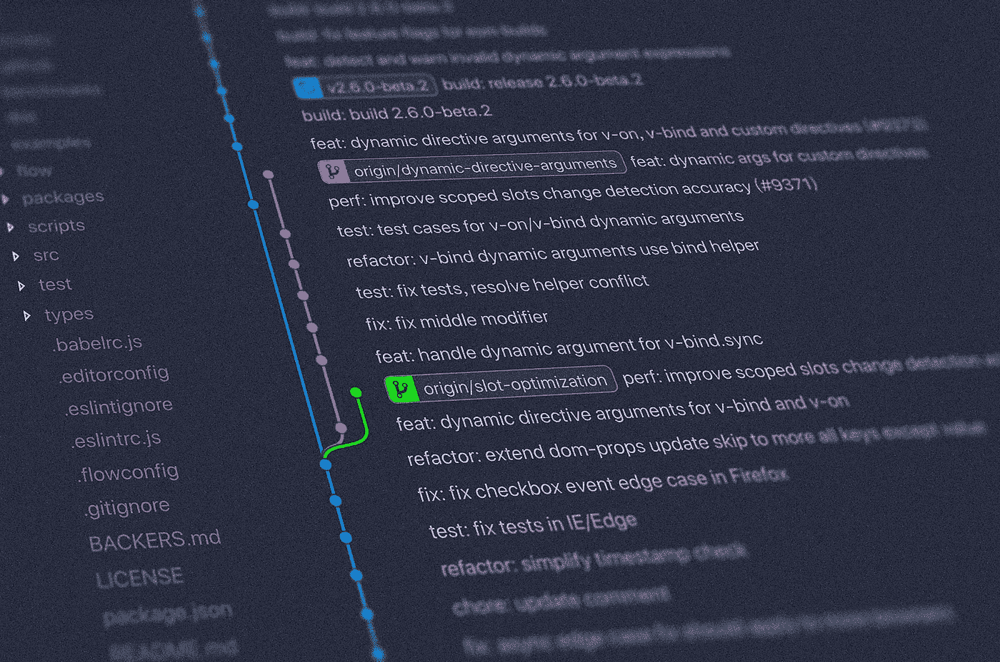
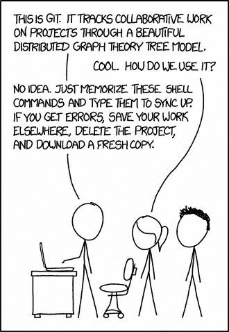

# Git 新手到专业与这些可怕的免费资源。

> 原文：<https://medium.com/javarevisited/become-a-git-pro-with-these-awesome-free-resources-9bf3e87cd2ae?source=collection_archive---------3----------------------->

## 你每天都用 git。

[扬西·敏](https://unsplash.com/@yancymin?utm_source=unsplash&utm_medium=referral&utm_content=creditCopyText)在 [Unsplash](https://unsplash.com/s/photos/git?utm_source=unsplash&utm_medium=referral&utm_content=creditCopyText) 上的照片

版本控制是你必须掌握的最高技能之一。无论你是 web 开发人员、移动开发人员、数据科学家还是其他什么人，都没有关系。你每天都会用到 git。如果你不明白它是如何工作的，你会有一段不好的时间。

来源:[https://xkcd.com/1597/](https://xkcd.com/1597/)

很多人只是学习基本的命令。其他人从来不使用命令行。在我看来，这就像使用计算器而不理解什么是乘法一样。

这里有很好的资源，可以帮助你达到 git 的下一个水平。

<https://verbosemode.dev/membership>  

## 一般资源

*   📺 [Git 初学者教程:1 小时学会 Git。](https://www.youtube.com/watch?v=8JJ101D3knE)如果你想*温习基础*，投资一个小时，看这个视频。但是不要忘记打开一个终端并跟随它！
*   📄 📺[用 git (Udacity)进行版本控制。如果你是一个完全的初学者，这个四小时的课程可能是最好的开始方式。这是一个混合(部分俗气)视频和书面教程。](https://www.udacity.com/course/version-control-with-git--ud123)
*   📄[git-scm.com](https://git-scm.com)T21 大概是**最全面的来源。它能让你接触到“Pro Git”这本书。这本书的印刷版有 440 页。好消息是:你可以在网上阅读。免费的。git 命令参考甚至更好。如果你认为你理解了`git rebase`，读读这篇[https://git-scm.com/docs/git-rebase](https://git-scm.com/docs/git-rebase)然后再想想！**

## 技巧和最佳实践

*   📄哦，妈的，饭桶！？！用 git 很容易搞乱。有时你甚至不知道哪里出了问题。哦，妈的，饭桶！？！为那些病例提供食谱。
*   📄 [Git 提交消息风格指南。](https://udacity.github.io/git-styleguide/index.html)这份风格指南是为 Udacity 的纳米学位项目编写的，但它普遍适用。如果你喜欢这种方法，可以看看 [commitizen](https://github.com/commitizen/cz-cli) ，这是一个命令行工具，可以帮助你编写更好的提交消息。
*   📄[在 git 中撤销、修复或删除提交。如果你需要在 git 中撤销某些东西，可以参考这个网站。他们把它设计成一本你自己选择的冒险书籍，引导你找到正确的解决方案。](https://sethrobertson.github.io/GitFixUm/fixup.html)
*   📄git-tips。该存储库包含带有简短描述的片段。如果你又忘记了如何删除所有已经合并到`main`的分支，那就太好了。
*   📄 [GitLab 的小窍门](https://about.gitlab.com/blog/2016/12/08/git-tips-and-tricks/)。最佳实践的极好集合。例如，它向您展示了 git 别名的威力。

## Git 内部

*   📺[知识就是力量:通过理解史蒂夫·史密斯的 git 摆脱困境](https://www.youtube.com/watch?v=sevc6668cQ0)是一篇关于 Git 如何在引擎盖下工作的精彩演讲。如果你只是想看一场演讲，看看这个。演讲解释了 git 的内部模型。例如，您将了解硬盘上的提交是什么样子的。

[技术演讲:Linus Torvalds 谈 git](https://www.youtube.com/watch?v=4XpnKHJAok8) 。

*   📺[技术演讲:Linus Torvalds 谈 git](https://www.youtube.com/watch?v=4XpnKHJAok8) 。Linus 讲述了他开发 git 的两年时间。如果你想知道为什么 git 首先“发生”,看看这篇演讲。
*   📄[解构 git 提交。一篇很棒的博客文章，探讨了提交到底是什么。](https://krishnabiradar.com/blogs/deconstructing-a-git-commit/)

**对 git 的扎实理解会对你每天都有帮助。去吧，去学吧！**