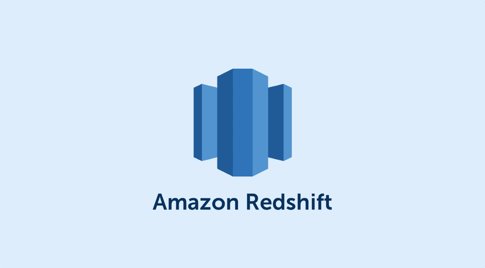

# 增强红移性能

> 原文：<https://medium.com/javarevisited/beefing-up-redshift-performance-aa6970af0af4?source=collection_archive---------1----------------------->

MPP 是任何数据仓库和大数据用例的必备工具。由于其易用性、性能和可扩展性，亚马逊红移超越了其领域内的所有同行。优化很容易被称为数据仓库和大数据世界中的关键步骤。

附带的红移原语优化技术将有助于解决不均衡的查询性能。

# 优先压缩

压缩会在顶层影响红移集群的性能。挤压的重要影响是:

1.  **降低存储利用率**。

对列的压缩显著降低了数据的大小。即..红移群集使用较少的磁盘

**2。提高查询性能**。

数据扫描和连接将是高效，因为涉及较少的 I/O 操作。

**选择压缩编码**

为列类型选择正确的编码对于表的性能至关重要。如果列有许多不重复的值或者列字符数较少，建议跳过编码，因为解压缩开销的影响会大于优化带来的好处。

如果连续的列值变化或相差一个
字节，就像唯一的连续整数一样，Delta 编码会做得更好。

**AZ64** 是一种 AWS 属性编码算法，在存储和输出中对数字、日期和时间数据类型都很有效，因为它使用 SIMD 进行并行处理。

跟随这个[文档](https://docs.aws.amazon.com/redshift/latest/dg/Examples__compression_encodings_in_CREATE_TABLE_statements.html)可以对编码有一个清晰的了解

**测试压力**

使用**“分析压缩”**语句分析现有表的压缩效果

> 将数据加载到 redshift 时，始终建议使用 Copy 命令并将 COMPUPDATE 设置为 on，因为它会应用自动压缩。

# **物化列**

对于可以预见的查询模式或经常重复的查询，最好使用 [**物化视图**](https://www.java67.com/2012/11/what-is-difference-between-view-vs-materialized-view-database-sql.html) 。下游应用程序可以查询/读取预先计算的物化视图中可用的数据，而不是对大型表运行资源密集型查询。

基本可以肯定的是，基表中的数据会随着时间发生变化，运行**“刷新物化视图”**来刷新物化视图。

物化视图的好处是红移表和外部
表都能够存储[选择查询](https://javarevisited.blogspot.com/2011/10/selct-command-sql-query-example.html)的结果集。
引用物化视图会更有效，因为它们
更喜欢使用预先计算的结果，而不是访问外部表。

**水绿色**

AWS 红移的新功能目前处于预览阶段，但承诺运行红移查询的速度将比同类产品快 10 倍。Aqua 拥有 [AWS](/javarevisited/5-best-aws-courses-for-beginners-and-experienced-developers-to-learn-in-2021-563212409fbd?source=rss-bb36d8439904------2&utm_source=dlvr.it&utm_medium=linkedin) 专门设计的数据处理器，它还充当缓存缓冲和子查询卸载系统，减少红移集群的工作负载，使其更加高效。AQUA 运行某些重复查询，并预先对数据集进行预处理，将其交付给 Redshift。

# **警惕 DistKey 的使用**

当在基于“均匀”和“键”的分布之间进行选择时需要小心，因为基于键的分布可能会导致特定查询上的数据偏斜和不均匀的查询性能，这些查询可能需要与另一个不在同一位置的键进行联接。

# **复制压缩数据**

将数据复制到 Amazon Redshift 的首选方式是 copy 命令，因为它利用了 Redshift 的 MPP 架构来传输数据。复制命令可用于各种来源的文件，如 EMR、 [DynamoDB、](/javarevisited/7-best-aws-s3-and-dynamodb-courses-for-beginners-in-2021-a8a44b6066da)和 [S3](https://www.java67.com/2020/08/top-5-courses-to-learn-aws-s3-and-dynamoDB-in-depth.html) 。

加载大量数据时在 S3 压缩文件将实现三个目标:

1.  更快地将文件上传到 S3
2.  降低 S3 存储利用率(成本)
3.  更快的加载过程，因为压缩解压缩可以在读取文件时发生。

# **红移光谱**

随着数据量的增长，维护数据仓库系统将变得复杂。Redshift 提供了一个全面的服务来减少集群中不常使用的数据，并根据需要从 AWS S3 加载这些数据。这有助于用户控制成本，并允许以最小的负载保持红移集群。

# 统计的重要性

Redshift 有自己的查询执行引擎，它使用关于表的统计信息来构建查询执行计划。基于这些统计数据，查询执行引擎从它生成的许多执行计划中挑选出优化的计划。因此，总是建议经常分析该表。然而，运行分析的频率应该仅在进行基于成本的分析之后才算出来，因为这是一项成本高昂的操作。

# 创建定制工作量管理器(WLM)队列

很容易，红移查询性能最重要的组成部分是高效管理 Amazon 红移工作负载管理器。Redshift 中的查询将在排队模型中运行。默认的 WLM 配置在大多数情况下都派不上用场。定制这些 WLM 工作负载有其优势:

1.  能够横向扩展工作负载，提供足够的资源(例如并发性和内存)
2.  针对不同类型的工作负载分离查询和工作负载

Amazon Redshift 允许用户定义多达 8 个队列，总共有多达 50 个插槽来分隔工作负载。通过设置队列分配规则，可以将查询路由到某些队列中。

对于 WLM 配置，建议遵循以下流程:

1.  独立用户
2.  定义工作负载
3.  将用户分组到工作负载中
4.  选择每个队列的插槽计数和内存百分比

# 使用短查询加速(SQA)

数据分析师/科学家总是需要混合使用大大小小的查询，这是很常见的。在这些场景中，执行这些小查询比等待密集查询更有意义。利用机器学习[的短查询加速](https://becominghuman.ai/top-10-courses-to-learn-tensorflow-for-machine-learning-in-2020-39a31e7cd84b)加速这些短查询的执行。

## **区域地图&分类键**

区域映射马克斯红移通过快速包含或排除数据来更快地执行查询，而无需实际查看数据。这还会减少节点的 I/O。但是，如果数据没有排序，这不会产生任何影响，因为区域图对每个块的最小-最大范围起作用，如果数据没有排序，这些范围将会重叠。

## 高效查询

另一件要看的事情是你的查询效率。例如，如果您使用查询来扫描整个数据集，您可能无法充分利用您的计算资源。

编写性能查询的一些技巧:

*   如果可能，请远离`[UNION](https://www.java67.com/2014/09/difference-between-union-vs-union-all-in-SQL.html)` 。
*   尽可能指定多级条件句。
*   利用`[EXPLAIN](https://www.periscopedata.com/blog/explain-and-other-tools-for-query-optimization.html)`了解查询执行计划和成本。

## 杂项优化

*   **纵向扩展集群。**在高峰时期，如果发现查询性能较慢，就向集群中添加更多的节点。
*   **调度真空。**如果在红移集群上有频繁的更新和删除操作，为了回收被标记为删除的行所占用的磁盘空间，为你的红移集群安排一次定期的清空。
*   **使用红移顾问:**总是建议从红移顾问那里获得一些帮助，因为它的建议将有助于提高集群的效率，因为这些建议是从对运行数据的统计和观察中得出的。

**结论**

尽管这篇文章有助于您了解红移的大多数原始调优操作，但仍然像任何其他 AWS 产品一样，通过密切观察 AWS 博客来了解 AWS 红移的所有最新变化和新功能总是好的，并重新发明以实现红移的最大化。