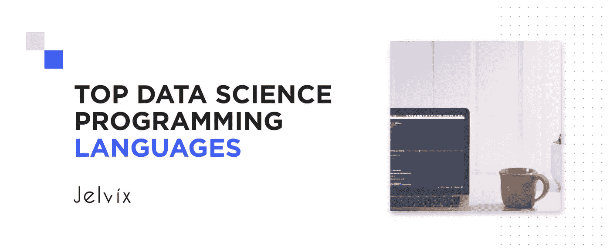
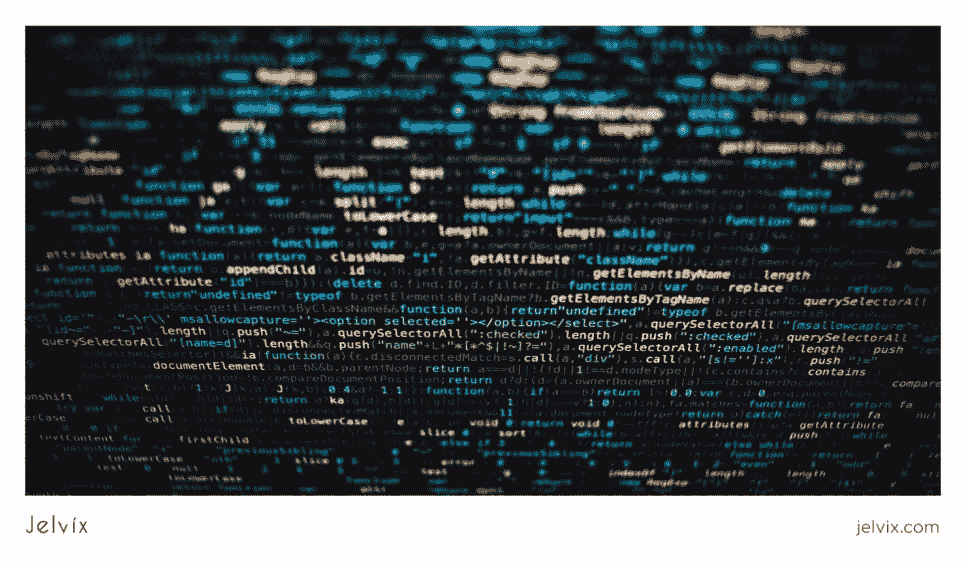
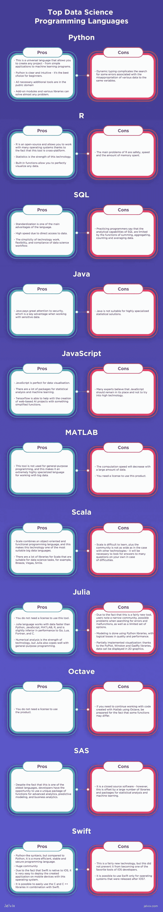

# 2021 年最佳的 11 种数据科学编程语言

> 原文：<https://medium.com/javarevisited/best-11-data-science-programming-languages-in-2020-122a7ea2bb63?source=collection_archive---------0----------------------->

数据科学不是近几年的炒作。这是为了个人、公司和全人类的利益，对处理数据的方法和原则的彻底反思。对庞大数据集的分析提供了可用于任何目的的非显而易见的见解——从提高公司人力资源部门的效率到战胜全球性问题。

出于这个原因，数据科学专家被认为是未来十年最受欢迎的职业，最优秀的技术头脑将继续提出新的工具来更有效地处理数据。在本文中，我们决定列出一份数据科学编程语言的清单，并展示每种语言的实际能力。

# **可供选择的 11 种数据科学语言**

数据科学有很多编程语言。这里是由 Kdnuggets 进行的[研究，显示了最受欢迎和最常用的方法。Python 一如既往地保持领先地位。然而，还有许多其他有用的工具可以适用于数据科学任务，下面也将对它们进行讨论。](https://www.kdnuggets.com/2019/05/poll-top-data-science-machine-learning-platforms.html)

# 1.计算机编程语言

[Python](/javarevisited/top-10-courses-to-learn-python-for-web-development-in-2020-best-of-lot-efe11fb6d212) 是开始钻研数据科学的理想语言。此外，它的应用范围不仅限于处理数据。Python 的功能允许你从头开始编写一个机器学习任务的程序，并使用各种库和工具。多年来，这种语言在全世界程序员的使用频率和它允许解决的任务数量方面一直处于领先地位。

**事实与统计:**

*   [66%](https://towardsdatascience.com/a-beginners-guide-to-python-for-data-science-60ef022b7b67) 的数据科学家每天都在使用 Python
*   84%的人以英语为主要语言；
*   预计 [Python](https://becominghuman.ai/5-best-courses-to-learn-pythons-pandas-libary-for-data-analysis-and-data-science-34b62abb0e96) 将保持领先地位。

**优点:**

*   它是一种通用语言，允许你创建任何项目——从简单的应用程序到机器学习程序；
*   [Python](/better-programming/top-5-courses-to-learn-python-in-2018-best-of-lot-26644a99e7ec) 清晰直观——是初学者的最佳选择；
*   所有必要的附加工具都在公共领域；
*   附加模块和各种库几乎可以解决任何问题。

**缺点:**

*   动态类型化使得对一些错误的搜索变得复杂，这些错误与将各种数据挪用到相同的变量相关联。

**适合的任务和项目:**

Python 对于分析和定量计算应该是强项的项目是理想的，例如在金融领域。更重要的是，Python 被用于人工智能开发，这是金融领域最有前途的创新之一。此外，这种语言被谷歌和 YouTube 用来改善内部基础设施。ForecastWatch analytics 使用这种语言处理天气数据。

# 2.稀有

[R](https://www.r-project.org/about.html) 也是数据科学的顶级编程语言之一。此外，它还是对现有工具进行统计分析的最有力工具。R 不仅仅是一种语言，而是一个完整的统计计算环境。它允许您执行数据处理、数学建模等操作，还可以处理图形。

**事实和统计:**

*   2014 年，研发是收入最高的技术；
*   70%的数据挖掘者使用它；
*   r 在全球拥有 200 多万用户。

**优点:**

*   T21 是开源的，允许你在许多操作系统上工作，这要感谢这个工具是跨平台的；
*   [统计](/javarevisited/5-best-mathematics-and-statistics-courses-for-data-science-and-machine-learning-programmers-bf4c4f34e288)就是这个技术的实力。内置函数允许您完美地可视化任何数据。

**缺点:**

*   R 的主要问题是安全性、速度和内存消耗。

**适合的任务和项目:**

例如，可以使用 R 或情绪分析模型来创建信用卡欺诈检测系统，以了解用户对产品或服务的真实想法。

大多数情况下，程序员都是这种或那种编程语言的热情支持者。然而，值得认识到的是，它们中的每一种都有其长处，也有其弱点。例如，R 用户有时渴望内置在 [Python 语言](https://javarevisited.blogspot.com/2019/09/5-websites-to-learn-python-for-free.html)中的面向对象特性。

类似地，一些 Python 用户梦想在 r 中获得大范围的统计分布。这意味着很有可能在一个项目中结合这两种领先的技术来获得一组独特的互补函数。

那么在实践中如何做到这一点呢？有两种基本方式:

*   Python 中的 r
*   带 R 的 Python

简单地说，这些语言中的每一种都有一个特殊的包目录，其中一些使得在另一种语言中使用包变得很容易。因此，当需要使用一种语言解决另一种语言的非典型问题时，项目获得了更大的灵活性和更容易的互换性。

# 3.结构化查询语言

结构化查询语言是处理大数据的[关键工具之一](https://jelvix.com/blog/top-5-big-data-frameworks)，因为它结合了分析能力和事务能力。此外， [SQL](https://en.wikipedia.org/wiki/SQL) 技能是数据科学专家的关键要求之一。

**优点:**

*   标准化是这种语言的主要优势之一；
*   由于直接访问数据，速度很快；
*   技术的简单性和灵活性；
*   数据科学工作流程的合规性。

**缺点:**

*   有经验的程序员说 [SQL](/hackernoon/top-5-sql-and-database-courses-to-learn-online-48424533ac61) 的分析能力受限于数据的求和、聚合、计数和平均功能。

**适合的任务和项目:**

基本上， [SQL](https://javarevisited.blogspot.com/2015/06/5-websites-to-learn-sql-online-for-free.html) 用于线上和线下 app 中的数据管理。因此，选择这个工具作为数据科学的最佳语言之一将取决于项目细节。

# 4.Java 语言(一种计算机语言，尤用于创建网站)

作为一种高性能语言， [Java](https://www.java.com/en/) 可能是编写[机器学习算法](https://jelvix.com/blog/machine-learning-algorithms-how-this-technology-can-be-used)的正确选择。另外，将 Java 代码与专门的数据科学工具结合起来是完全可能的。

**事实与统计:**

*   由于其广泛的适用性， [Java](/javarevisited/top-5-java-online-courses-for-beginners-best-of-lot-1e1e240a758) 是全球使用最频繁的编程语言之一，根据 2019 年的[统计。对了，上面提到的 SQL 和 Python 也在这个列表上；](https://www.statista.com/statistics/793628/worldwide-developer-survey-most-used-languages/)
*   Java 被认为有利于大数据和物联网；
*   95%的公司使用 Java 进行 web 和移动应用程序开发。然而，由于这些概念相对较新，没有关于数据科学和大数据的 Java 使用的统计数据。

**优点:**

*   [Java](https://www.java67.com/2018/08/top-10-free-java-courses-for-beginners-experienced-developers.html) 非常注重安全性，这是处理敏感数据时的一个关键优势。

**缺点:**

*   Java 不适合高度专业化的统计解决方案。

**适合的任务和项目:**

当最初打算将创建的产品与现有解决方案集成时，这种技术是合适的。

# 5.Java Script 语言

看到最流行的通用编程语言成为大数据的最佳编程语言，这是相当出乎意料的，不是吗？是的，一些专家认为，这种语言在数据科学专家的军火库中占据尊贵的位置还需要很长时间，但现在有足够多的[原生库](https://towardsdatascience.com/top-javascript-machine-learning-libraries-in-2019-cb63b95bdd10)来帮助解决大数据和机器学习工作中的各种问题。而热门 [Tensorflow.js](https://www.tensorflow.org/js) 就是其中之一。

**优点:**

*   [JavaScript](https://www.javascript.com/) 非常适合数据可视化；
*   有很多统计分析和机器学习的包；
*   Tensorflow 能够帮助创建功能简化的基于网络的人工智能项目。

**缺点:**

*   许多专家认为, [JavaScript](/javarevisited/10-best-online-courses-to-learn-javascript-in-2020-af5ed0801645) 应该留在它的位置上，不要去窥探高科技。

**适合的任务和项目:**

当在 web 和大数据技术的交叉点上创建项目时，这个工具非常合适。

# 6.矩阵实验室

顾名思义，当需要最深奥的数学运算时， [Matlab](https://www.mathworks.com/help/matlab/index.html?s_tid=CRUX_lftnav) 是数据科学的最佳编程语言。这项技术在数据分析、图像处理和数学建模方面非常强大。

**优点:**

*   该工具不用于通用编程，这使得它成为一种高度专业化的语言，用于处理[大数据](/javarevisited/top-10-courses-to-learn-big-data-and-hadoop-best-of-lot-23ef8691633f)。

**缺点:**

*   数据量大计算速度会下降；
*   您需要许可证才能使用该产品。

**适合的任务和项目:**

Matlab 适合需要强大算术支持的应用——例如信号处理。它也可以用于教育和工业部门的解决方案。

# 7.斯卡拉

Scala 最好的特性是在处理大型数据数组时能够运行并行进程。由于 Scala 致力于 JWM，它提供了对 Java 生态系统的访问。更重要的是， [Scala](/javarevisited/why-java-developer-should-learn-scala-programming-in-2020-3ca01a47eb0d) 是以这样一种方式创建的，数据科学可以使用几种不同的方法来执行某种操作。这为开发过程提供了更大的灵活性。

赞成者:

*   Scala 结合了面向对象和函数式编程语言，这使它成为最适合大数据的语言之一；
*   Scala 有很多适合数据科学任务的库，比如 Breeze，Vegas，Smile。

**缺点:**

*   [Scala](https://javarevisited.blogspot.com/2020/09/top-5-courses-to-learn-scala.html) 难学，加上社团没那么广。因此，在遇到困难时，有必要自己寻找许多问题的答案。

**适合的任务和项目:**

当数据量足以实现技术的全部潜力时，Scala 对于项目来说是非常棒的。数据少得多的情况下， [Python](https://www.java67.com/2018/02/5-free-python-online-courses-for-beginners.html) 或者 R 可能会更有效率。

# 8.朱莉娅

在用于数据分析的编程语言中，它是一个相当新的、动态的、高效的工具。最初， [Julia](https://julialang.org/) 被设计为一种科学编程语言，其速度足以满足交互式语言建模的需求，随后是编译语言(如 [C](/javarevisited/10-best-c-programming-courses-for-beginners-2c2c1f6bcb12) 或 Fortran)中不可避免的代码处理。这就是为什么使用这种语言的结果是与 Python 和 C 语言库完美结合的原因。

**优点:**

*   使用此工具不需要许可证；
*   [Julia 语言](/javarevisited/top-5-julia-programming-books-courses-and-tutorials-for-beginners-e5b4bd7067ec)处理数据的速度比 [Python](https://javarevisited.blogspot.com/2018/03/top-5-courses-to-learn-python-in-2018.html) 、 [JavaScript](https://javarevisited.blogspot.com/2018/06/top-10-courses-to-learn-javascript-in.html) 、Matlab、R 快，性能上略逊于 [Go](/javarevisited/7-online-courses-to-learn-golang-or-go-programming-languages-in-2020-f599a25cf14a) 、Lua、Fortran、[C](https://www.java67.com/2020/07/5-free-courses-to-learn-c-programming.html)；
*   数值分析是技术的强项，但 Julia 也能很好地应对通用编程。

**缺点:**

*   由于这是一个相当新的工具，用户注意到一个狭窄的社区，在搜索错误和故障时可能出现的问题，以及有限的选项集；
*   建模是使用 [Python 库、](https://javarevisited.blogspot.com/2018/10/top-8-python-libraries-for-data-science-machine-learning.html)完成的，在质量和性能上有逻辑损失；
*   部分实现的可视化:由于 PyPlot、Winston 和牛虻库，数据可以用 2D 图形显示。

**适合的任务和项目:**

这项技术非常适合金融领域的项目，而且当它变得更加成熟时，Julia 很有希望能够与 [Python](https://javarevisited.blogspot.com/2019/07/top-5-books-to-learn-python-in-2019.html) 和 [R](https://dev.to/javinpaul/5-free-courses-to-learn-r-programming-for-data-science-1gn8) 展开全面竞争。

# 9.斯堪的纳维亚航空公司

SAS，就像 R 一样，是一种数据分析编程语言，它处理统计数据的灵活可能性是它的主要优势。 [SAS](https://www.sas.com/en_us/software/base-sas.html) 和 R 唯一的区别就是第一个不是开源的。

## 优点:

*   尽管这是最古老的语言之一，但开发人员有机会使用一个独特的功能包来进行高级分析、预测建模和业务分析。

**缺点:**

*   它是一个闭源软件——然而，它被大量用于统计分析和机器学习的库和包所抵消。

**适合的任务和项目:**

SAS 适用于对稳定性和安全性要求较高的项目。

# 10.八度音阶

它是我们上面提到的 Matlab 的主要替代品。总的来说，这两种技术并没有极其根本的区别，只是有一些例外。

**优点:**

*   使用该产品不需要许可证。

**缺点:**

*   如果您需要继续使用 Matlab 使用 [Octave](https://www.gnu.org/software/octave/) 创建的代码，请准备好一些函数可能不同的事实。

**适合的任务和项目:**

和 Matlab 一样，如果需要强大的算术计算，Octave 可以用在数据量相对较小的项目中。

# 11.迅速发生的

[Swift](https://swift.org/) 是为 [iOS](/javarevisited/top-5-online-courses-to-learn-ios-12-swift-in-2019-a35ae1be7b2b?source=---------56------------------) 、macOS、watchOS、tvOS 等操作系统开发应用的主要语言。然而，今天这种技术的能力大大扩展了。[大数据](/swlh/5-free-online-courses-to-learn-big-data-hadoop-and-spark-in-2019-a553e6ccfe30)不一定存在于云中——它可以存在于用户的智能手机中。因此，当需要连接大数据和人工智能时，可以使用 Swift 为前述操作系统创建移动应用程序。

**优点:**

*   类似 Python 的 syntaxis，但相比 [Python](https://www.java67.com/2020/05/top-5-courses-to-learn-python-in-depth.html) ，它是一种更高效、更稳定、更安全的编程语言；
*   庞大的社区；
*   由于 [Swift](/javarevisited/7-free-courses-to-learn-swift-programming-language-in-2020-f40ac9d3ee53) 是 iOS 原生的，所以在有这个操作系统的移动设备上部署创建的应用是非常容易的；
*   开源的 Swift 内部编译器和静态类型允许你在构建时创建定制的 AI 芯片组；
*   结合 Swift 有效使用 C 和 C ++库是可能的。

**缺点:**

*   它是一项相当新的技术，但这并不妨碍它成为 iOS 开发者最喜爱的工具之一；
*   只有在 iOS7 之后发布的操作系统才可以使用 [Swift](https://www.java67.com/2019/03/5-free-courses-to-learn-swift.html) 。

**适合的任务和项目:**

改善内存操作意味着减少未经授权访问数据的机会。在 Swift 中实施的更高效的错误处理大大减少了崩溃的数量和紧急情况的出现。不可预测的行为被最小化。这意味着这项技术非常适合创建使用敏感用户数据的移动应用程序，并且是基于人工智能的。

# 结论

现代数据科学专家有大量的技术可供选择来实现各种各样的任务。开发项目的效率和成本都将取决于所选择的[编程语言](/hackernoon/10-best-programming-languages-to-learn-in-2019-e5b05af4a972)或[框架](/javarevisited/5-essential-frameworks-every-java-developer-should-learn-6ed83315f1fb)。因此，这是你应该注意的一点。例如:

*   如果你要分析一个庞大的数据数组，进行大量的统计计算，那么 R 是最好的选择(有时结合 Python)；
*   Python 非常适合 [NLP](https://en.wikipedia.org/wiki/Neuro-linguistic_programming) 和借助神经网络的密集型数据处理；
*   Java 和 Scala 适合需要最高性能的解决方案，并进一步集成到现有的应用程序中。

我们的数据科学专家团队在解决各种问题方面拥有丰富的经验。因此，如果您想以数据的形式为您的业务提供更多动力，请考虑创建一个合适的解决方案，并[立即联系我们](https://jelvix.com/contact-us)寻求建议！

【https://jelvix.com】最初发表于<https://jelvix.com/blog/top-data-science-programming-languages>**。**