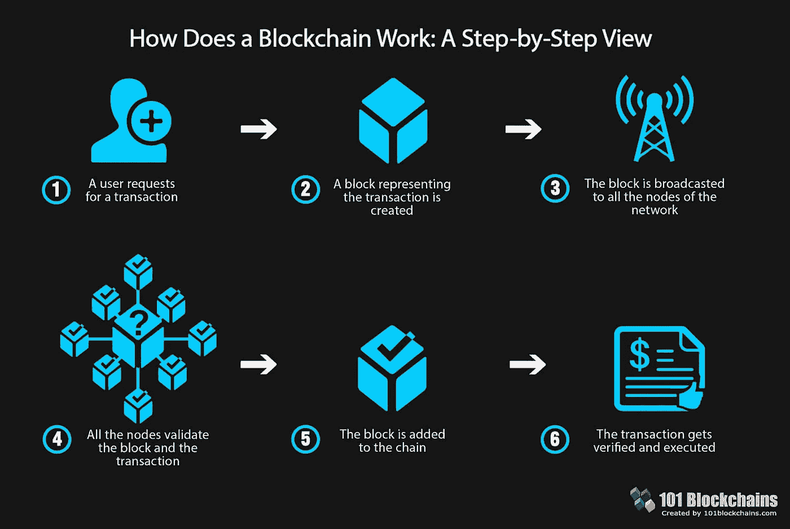
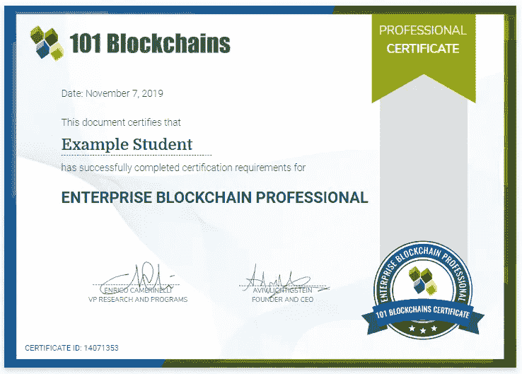
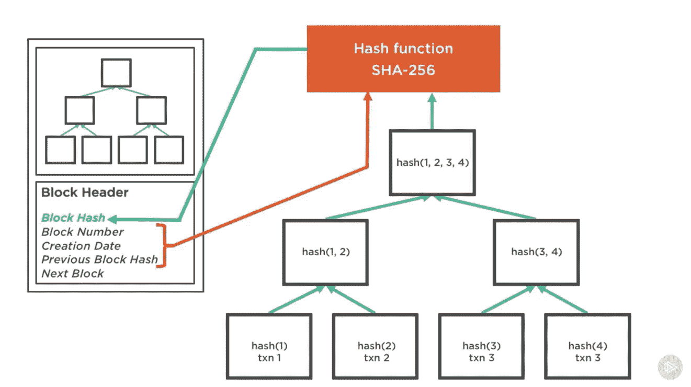
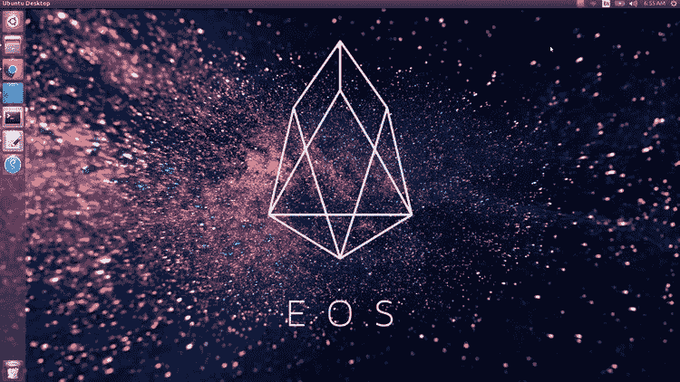
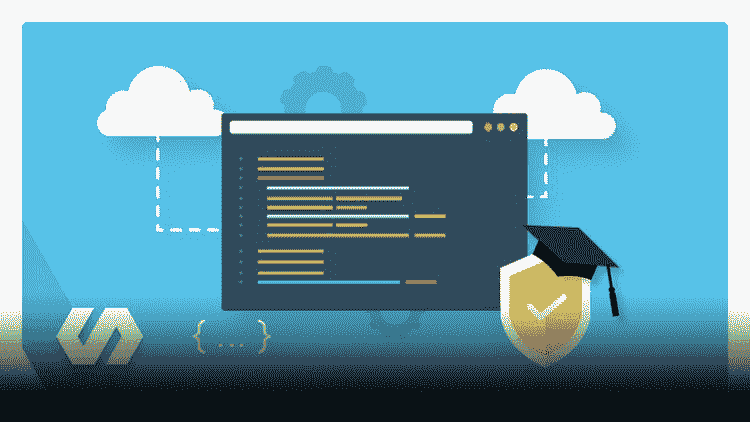
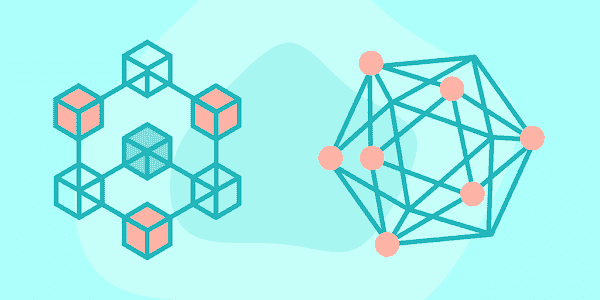
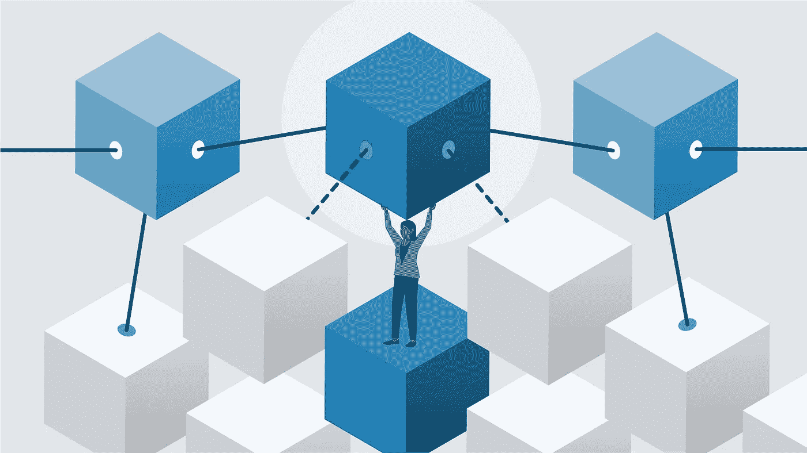
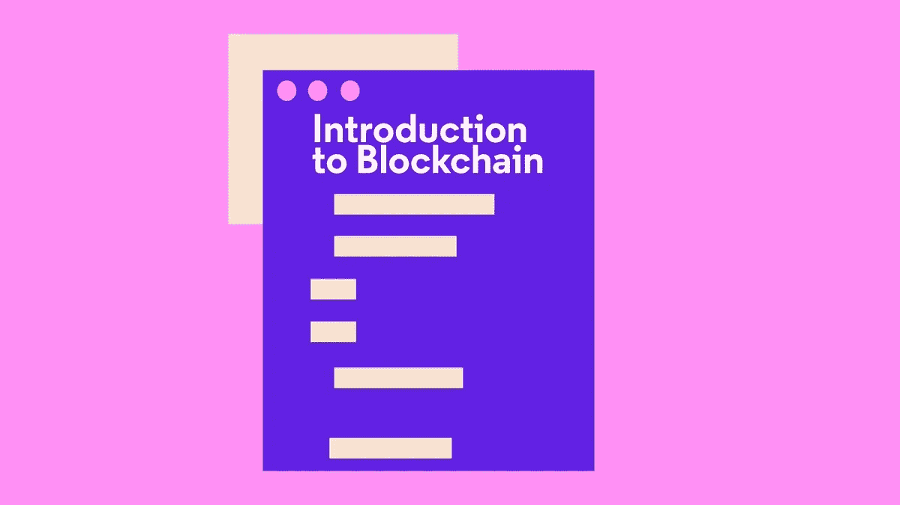
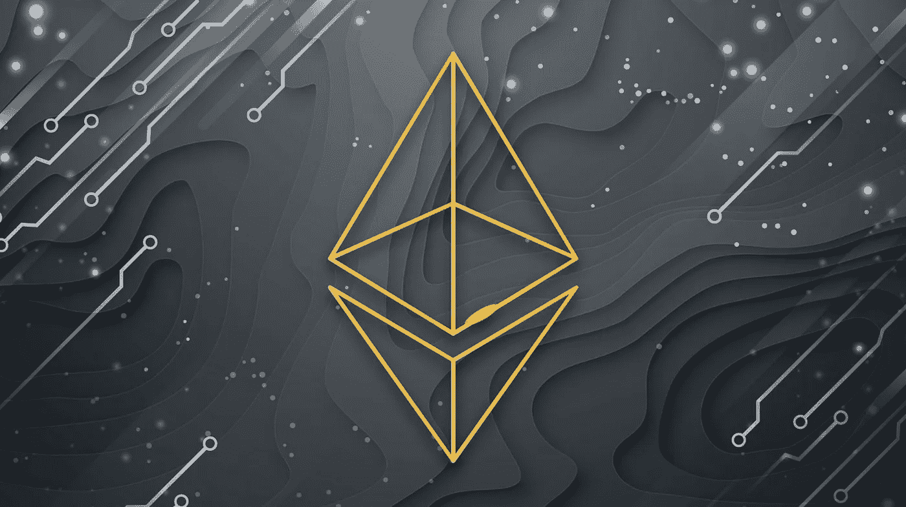

# 2023 年 10 大最佳区块链认证和课程

> 原文：<https://medium.com/javarevisited/best-blockchain-courses-and-certification-in-2020-63729f8f04d0?source=collection_archive---------0----------------------->

## 从 Udemy、Pluralsight、Coursera、100 区块链、edX、CodeCademy、Educative 和 LinkedIn Learning 等网站学习区块链编程的最佳在线课程。

Blockchains.com 101 号

你好伙计们，如果你不是在岩石下离开，那么你肯定听说过区块链和加密货币。如果你正在寻找区块链培训课程和认证，那么你来对地方了。

*披露——顺便说一句，其中一些链接是附属链接，如果你使用我的链接加入这些课程，我可能会得到报酬。*

以前我分享过学习区块链的[免费课程，今天在这篇文章里，我将分享来自](/javarevisited/7-free-courses-to-learn-blockchain-in-2020-764e66b47ebe) [Udemy](https://javarevisited.blogspot.com/2019/08/top-10-udemy-courses-and-certifications-for-programmers.html) 、 [Coursera](https://javarevisited.blogspot.com/2019/10/top-5-coursera-professional-certificates-for-programmers-IT-professionals.html) 、 [Pluralsight](https://javarevisited.blogspot.com/2017/12/top-10-pluralsight-courses-java-and-web-developers.html) 等网站的学习区块链编程的最佳区块链认证和在线课程。

但是，在此之前，让我们快速了解一下什么是区块链，为什么它会受欢迎，以及为什么你应该在 2023 年学习区块链。

区块链不过是一组对任何人开放的区块，包含信息和区块的哈希以及其他一些信息。每个块将根据其工作存储信息，例如，如果该块用于货币交易，它将存储发送者和接收者的信息以及所转移的货币量。

这里有一张来自 Blockchains.com[101](https://www.shareasale.com/r.cfm?b=1713885&u=880419&m=105464&urllink=&afftrack=)的漂亮图表，很好地解释了区块链是如何工作的:

区块链有很多用途，不仅仅是转账，比如在线投票，因为这是一种更安全的方式，还有股票交易、食品生产等等。

许多公司现在看到区块链是未来的技术，他们应该采用更安全的方式与用户进行交易，而[区块链开发人员](https://www.java67.com/2018/02/5-free-blockchain-technology-courses.html)的年薪可以达到 6.8 万美元，专业开发人员的年薪可以达到 15 万美元。

现在，读完这个关于区块链的小介绍后，你会看到 b *est 区块链在线课程和认证*建议，它们将帮助你成为一名区块链开发者，使工作更好、更安全。

# 2023 年成为区块链开发者的 10 门最佳课程和认证

在不浪费你更多时间的情况下，这里列出了你可以参加的最好的在线课程和认证，以便在 2023 年成为一名区块链开发者。

这些是[学习区块链的最佳在线培训课程](https://javarevisited.blogspot.com/2020/07/top-5-online-courses-to-learn-blockchain.html)，它不仅涵盖了理论部分，还向您展示了如何使用真实世界的代码一步一步地创建区块链项目。

## 2023 年新手最佳区块链认证 2 项

我们将首先看到 2023 年加入的最佳区块链认证计划，之后，我们将看到从 Udemy、Pluralsight 和其他在线门户网站学习区块链的在线课程和教程。

## 1.[101 区块链认证企业区块链专业人士](https://www.shareasale.com/r.cfm?b=1713885&u=880419&m=105464&urllink=&afftrack=)

这是一门全面的在线课程，也是区块链成为企业级区块链专家的培训项目。这是一个为期 4 周的计划，每周有 3 到 4 节课，以工作证明深入学习区块链，并成为一名认证的区块链开发者。

是的，这个课程提供了一个被称为 CEBP 或认证企业区块链专业人员

的行业认可的区块链证书，以下是你在这个项目中将学到的关键东西:

*   了解区块链技术及其生态系统的核心概念
*   了解如何实施区块链协议
*   学习最新的工具，成为有效的区块链专家
*   公立和私立区块链
*   如何创建智能合同

**这里是加入本次区块链认证的链接**——[认证企业区块链专业人士](https://www.shareasale.com/r.cfm?b=1713885&u=880419&m=105464&urllink=&afftrack=)

你们中的一些人可能会觉得 397 美元的课程有点贵，但它受到许多组织的信任，如 IBM、凯捷、思科、Cognizant 和其他行业参与者，这使得它值得加入。

由于目前的全球形势，他们现在也提供 30%的折扣。您可以使用代码 **BCHAIN30** 在企业区块链专业认证课程上获得**七折优惠。**

你还将获得如下所示的证书，用于添加到你的 LinkedIn 个人资料简历中，以展示你的区块链技能和经验。

当谈到加入该认证时，您可以单独加入，或者您可以获得一个 [**101 区块链会员资格**](https://shareasale.com/r.cfm?b=1696402&u=880419&m=105464&urllink=https%3A%2F%2F101blockchains%2Ecom%2Fmembership%2F&afftrack=) ，它不仅可以让您获得该认证，还可以获得其他几个强大且受欢迎的区块链和 Web3 认证和课程，只需每月**25 美元**的年度计划(现在有 50%的折扣)。

## 2.[区块链专业化——Coursera](https://coursera.pxf.io/c/3294490/1164545/14726?u=https%3A%2F%2Fwww.coursera.org%2Fspecializations%2Fblockchain)

这是 Coursera 的另一个受欢迎的区块链认证，它将教你从初学者到区块链的高级水平，以及如何创建智能合同和安全渠道开发去中心化应用程序。你可以在 Coursera 中学习这一专业。

如果你喜欢 Coursera 学习平台，那么这就是 [*最好的 Coursera 专业化学习区块链*](https://coursera.pxf.io/c/3294490/1164545/14726?u=https%3A%2F%2Fwww.coursera.org%2Fspecializations%2Fblockchain) 。如果你没有，Coursera Specialization 是一个课程和项目的集合，完成这些课程和项目后，你将获得区块链认证。

像往常一样，从区块链加密的概念开始，然后发展到创建智能合同，让用户定义一些规则，当满足这些规则时，它将执行一些代码，然后开发一个分散的应用程序，还有更多事情要做。

您将在本课程中学习到:

*   区块链基础知识。
*   创建智能合同。
*   开发分散的应用程序。

在 Coursera 上完成这个区块链专业之后，你还将学习一个可以添加到你的简历或 LinkedIn 个人资料中的认证。

**这里是加入本次区块链专精**——[区块链专精](https://coursera.pxf.io/c/3294490/1164545/14726?u=https%3A%2F%2Fwww.coursera.org%2Fspecializations%2Fblockchain)的链接

顺便说一下，如果你觉得 Coursera 专业化和认证有用，那么你也应该加入 Coursera 的 [**Coursera Plus** ，](https://coursera.pxf.io/c/3294490/1164545/14726?u=https%3A%2F%2Fwww.coursera.org%2Fcourseraplus)订阅计划，该计划为你提供**无限制的**他们最受欢迎的课程、专业化、专业证书和指导项目。它每年花费大约 399 美元，但是它完全值得你的钱，因为你得到了无限的证书

<https://coursera.pxf.io/c/3294490/1164545/14726?u=https%3A%2F%2Fwww.coursera.org%2Fcourseraplus>  

# 2023 年十大区块链新手在线课程

现在，让我们跳进 2023 年学习区块链最好的在线课程。这个列表既包含初级区块链课程，也包含为有经验的开发人员学习区块链、团结和以太坊的高级课程。该列表包含 Udemy、Pluralsight、LinkedIn Learning、Educative、edX 和 CodeCademy 的最佳区块链课程。这些也是最受欢迎的技术技能在线学习门户。

## 1.[区块链 A-Z:了解如何构建您的第一个区块链](https://click.linksynergy.com/deeplink?id=JVFxdTr9V80&mid=39197&murl=https%3A%2F%2Fwww.udemy.com%2Fcourse%2Fbuild-your-blockchain-az%2F)

这是从 Udemy 学习区块链的又一门综合实践课程。在完成开发安全区块链技术的同时，还有另一门课程将教你如何区块链和理解加密货币交易背后的理论。

在本课程中，您将学到:

*   区块链的理论课。
*   开发自己的智能合约和区块链。
*   创建您自己的加密货币

**这里是加入这个区块链课程的链接**——[区块链 A-Z](https://click.linksynergy.com/deeplink?id=JVFxdTr9V80&mid=39197&murl=https%3A%2F%2Fwww.udemy.com%2Fcourse%2Fbuild-your-blockchain-az%2F)

简而言之，了解什么是区块链以及整个加密货币如何工作的最佳课程之一。这门课程是由基里尔·叶列缅科和他的超级数据科学团队创建的，他们是许多伟大的[机器学习](/javarevisited/top-10-machine-learning-and-data-science-certifications-and-training-courses-for-beginners-and-a6308497b764)、[数据科学](https://becominghuman.ai/9-data-science-and-machine-learning-courses-by-harvard-ibm-udemy-and-others-12a0c7c23ec1)和[人工智能](/javarevisited/7-best-courses-to-learn-artificial-intelligence-in-2020-26d59d62f6fe)课程的幕后推手。

## 2.[区块链——原理与实践](https://pluralsight.pxf.io/c/1193463/424552/7490?u=https%3A%2F%2Fwww.pluralsight.com%2Fcourses%2Fblockchain-principles-practices)【plural sight 课程】

这是学习区块链最好的 Pluralsight 课程之一。对 C#编程语言[有扎实理解并希望开发区块链技术的开发人员，我强烈建议作为初学者从这个 Pluralsight 课程开始，然后转到更高级的课程。](https://javarevisited.blogspot.com/2019/11/top-5-courses-to-learn-c-sharp-in.html) 

*   了解区块链使用的加密技术。
*   将多个事务添加到一个块中。
*   将积木连接在一起，创建区块链。

您还将学习如何将块放在一起，以及如何避免块篡改等等。

**这里是加入本课程的链接** — [区块链——原理与实践](https://pluralsight.pxf.io/c/1193463/424552/7490?u=https%3A%2F%2Fwww.pluralsight.com%2Fcourses%2Fblockchain-principles-practices)

顺便说一句，你需要一个 [Pluralsight 会员](https://pluralsight.pxf.io/c/1193463/424552/7490?u=https%3A%2F%2Fwww.pluralsight.com%2Flearn)才能观看这个课程，费用大约是每月 29 美元或每年 299 美元。如果您没有 Pluralsight 订阅，那么我强烈建议您购买一个，因为它非常适合学习，并提供超过 7000 门最新技术的在线课程。

或者，你也可以带着他们的 [**10 天免费试用**](https://pluralsight.pxf.io/c/1193463/424552/7490?u=https%3A%2F%2Fwww.pluralsight.com%2Flearn) 免费上这门课。

## 3.[用 EOS 和 C++学习区块链开发](https://click.linksynergy.com/deeplink?id=JVFxdTr9V80&mid=39197&murl=https%3A%2F%2Fwww.udemy.com%2Fcourse%2Flearning-blockchain-development-with-eos-and-cpp%2F) (Udemy)

本文的最后一个目标是 C++开发人员创建一个可靠的区块链技术，设计和部署智能合约，并学习 dApp 生态系统。

通过在代码中使用不同的库，你将开始重温 C++编程语言的基础知识，然后构建区块链[以太坊技术](https://javarevisited.blogspot.com/2021/11/top-5-courses-to-learn-ethereum-for.html)和分散式应用程序等等。

在本课程中，您将学到:

*   学习区块链的基本知识。
*   学习如何使用 [C++](/javarevisited/top-10-courses-to-learn-c-for-beginners-best-and-free-4afc262a544e) 语言编码。
*   构建去中心化的应用。

**以下是加入本课程的链接**——[用 EOS 和 C++学习区块链开发](https://click.linksynergy.com/deeplink?id=JVFxdTr9V80&mid=39197&murl=https%3A%2F%2Fwww.udemy.com%2Fcourse%2Flearning-blockchain-development-with-eos-and-cpp%2F)

## 4.以太坊和稳固:完全开发者指南

如果你喜欢 Udemy 课程 hen 这是 2023 年学习区块链最好的 Udemy 课程。这门课程是为对 JavaScript 和 npm 有扎实理解的程序员设计的，因为你将一步一步地探索如何创建代码和每一点语法，以确保你完全理解你在做什么。

你将在本课程中学到:

*   学习关于区块链和以太坊的概念。
*   构建设计并部署您的应用程序。
*   创建安全的智能合同。

您将从探索什么是以太坊加密货币和一些概念开始，然后进入代码阶段，开始实施 JavaScript 来创建智能合同，构建项目的交互式前端基础设施，部署您的应用程序等等。

**这里是加入本课程的链接** — [以太坊和坚固性:完整的开发者指南](https://click.linksynergy.com/deeplink?id=JVFxdTr9V80&mid=39197&murl=https%3A%2F%2Fwww.udemy.com%2Fcourse%2Fethereum-and-solidity-the-complete-developers-guide%2F)

这个课程最好的一点是它是由 Stephen Grider 创建的，他是 Udemy 上最好的讲师之一，也是像 Udemy 上的 [Modern React with Redux](https://click.linksynergy.com/deeplink?id=JVFxdTr9V80&mid=39197&murl=https%3A%2F%2Fwww.udemy.com%2Fcourse%2Freact-redux%2F) 这样的课程的作者，Udemy 上有超过 20 万开发人员加入。

## 5.[edX 上的区块链技术](https://www.awin1.com/cread.php?awinmid=6798&awinaffid=631878&clickref=&p=%5B%5Bhttps%3A%2F%2Fwww.edx.org%2Fcourse%2Fblockchain-technology)

这是学习区块链并成为区块链开发者的又一个非常棒的在线课程。本课程由 BerkeleyX 提供，也是专业认证的一部分。

该课程由伯克利的区块链和加州大学伯克利分校首要计算机科学系的教职员工开发，提供了与比特币和区块链技术基础相关的许多主题的广泛概述。

这也是学习各种企业级区块链实现的好课程，例如 JP Morgan 的 Quorum、Ripple、Tendermint 和 HyperLedger，包括区块链、ico 的行业用例，以及围绕区块链的不断增加的法规。

**这里是加入本课程的链接**——[区块链技术](https://www.awin1.com/cread.php?awinmid=6798&awinaffid=631878&clickref=&p=%5B%5Bhttps%3A%2F%2Fwww.edx.org%2Fcourse%2Fblockchain-technology)

这门课程实际上是免费的，但你需要付费才能获得证书。

## 6.[成为区块链开发者](https://www.educative.io/courses/hands-on-blockchain-hyperledger-fabric?affiliate_id=5073518643380224)(教育性)

这是 2023 年学习区块链的另一个伟大课程，与其他课程不同的是，这是一个基于文本的课程，来自 [Educative](https://www.educative.io/subscription?affiliate_id=5073518643380224) ，这是一个在线学习平台，允许你在浏览器中运行代码，并在途中学习。

在本课程中，我们将从头开始构建区块链概念。我们将从基本的加密构造开始，如散列函数和 PKI 加密，首先为理解区块链和理解它的价值打下坚实的基础。

然后，我们将在您的浏览器中使用动手开发环境探索 IBM 的 Hyperledger Fabric 技术。对于希望通过 Hyperledger Fabric specialty 发展区块链技术专业知识的工程师来说，这一在线区块链课程是一个很好的起点。

**以下是加入本课程**——[成为区块链开发者](https://www.educative.io/courses/hands-on-blockchain-hyperledger-fabric?affiliate_id=5073518643380224)的链接

你可以单独购买这门课程，也可以通过每月 18 美元的 [**教育订阅**](https://www.educative.io/subscription?affiliate_id=5073518643380224) 加入教育平台。Educative 现在还为他们的年度订阅提供高达 47%的折扣。

作为一名程序员，有很多东西要学，有时你想简单地学习多门课程，而不用为每门课付费。有了这种订阅模式，你现在只需支付一次费用，就可以获得 Educative 上的所有课程。我向程序员和开发人员强烈推荐这一点。

<https://www.educative.io/subscription?affiliate_id=5073518643380224>  

## 7.[提升你在区块链领域的技能(LinkedIn Learning)](http://linkedin-learning.pxf.io/c/1193463/449670/8005?u=https%3A%2F%2Fwww.linkedin.com%2Flearning%2Fpaths%2Fadvance-your-skills-in-the-blockchain)

你可能不知道，LinkedIn Learning 为初学者和中级开发者提供了一些最好的区块链课程。

这条学习路径包含许多有用的课程，可以从头开始学习区块链，也可以掌握技术，真正有所作为。通过学习这些课程，您将

1.  **掌握**基本的区块链和加密货币概念。
2.  **学习**固体和以太坊技能的发展。
3.  **掌握**iOS 版区块链编程。

**这里是加入这条区块链学习之路的链接** — [提升你在区块链中的技能](http://linkedin-learning.pxf.io/c/1193463/449670/8005?u=https%3A%2F%2Fwww.linkedin.com%2Flearning%2Fpaths%2Fadvance-your-skills-in-the-blockchain)

## 8.[用 Python 学习区块链的基础知识](https://click.linksynergy.com/deeplink?id=JVFxdTr9V80&mid=44188&murl=https%3A%2F%2Fwww.codecademy.com%2Flearn%2Fintroduction-to-blockchain&LSNSUBSITE=TEST) (Codecademy)

如果你想用 Python 学习区块链并寻找实践课程，那么没有比 Codecademy 的用 Python 学习区块链基础知识更好的课程了。

我真的很喜欢 Codecademy 的互动学习平台，过去曾用它来学习 JavaScript、Python 和 Java。真的很棒，不需要设置任何东西，只需要登录后跟着导师在浏览器里执行代码，就可以在线练习了。

在本课程中，您将学习区块链本身的结构和属性以及组成它的各个模块。您将了解在不同区块链参与者之间提供安全性的区块链功能。您将可视化区块链的不同方面，并通过交互式模拟创建和篡改您自己的块。

**这里是加入本课程的链接**——[用 Python 学习区块链的基础知识](https://click.linksynergy.com/deeplink?id=JVFxdTr9V80&mid=44188&murl=https%3A%2F%2Fwww.codecademy.com%2Flearn%2Fintroduction-to-blockchain&LSNSUBSITE=TEST)

本课程的大部分内容不需要任何先验知识。但是，如果您有一些 Python 经验，您将能够用 Python 构建一个小型区块链库，包括一个区块链类和一个区块类。添加功能以添加块、创建散列和验证链。

顺便说一句，你需要一个 [**CodeCademy PRO**](https://click.linksynergy.com/deeplink?id=JVFxdTr9V80&mid=44188&murl=https%3A%2F%2Fwww.codecademy.com%2Fpro%2Fmembership&LSNSUBSITE=TEST) 才能加入这个课程。它的年费大约是每月 15.99 美元，提供所有 Codecademy 的内容、课程、测验和项目。你可以用这个来赚取、练习&
应用现成的技能。

<https://click.linksynergy.com/deeplink?id=JVFxdTr9V80&mid=44188&murl=https%3A%2F%2Fwww.codecademy.com%2Fpro%2Fmembership&LSNSUBSITE=TEST>  

## 9.ZTM 学院的[可靠性、以太坊和区块链:完整的开发者指南](https://academy.zerotomastery.io/a/aff_bt7chn53/external?affcode==441520_zytgk2dn)

如果你想成为一名区块链开发者，并且正在寻找在一门课程中学习可靠性、以太坊和区块链基础知识的最佳课程，那么这门课程就是为你准备的。这个课程也是为那些想作为一个完全的初学者来开发智能合同的人准备的。

本课程由 ZTM 学院 10 年经验丰富的区块链开发人员和培训师创建，该学院是我最喜欢的 Udemy 讲师之一 Andrei 的在线学习门户。

在这个 ZTM 区块链课程中，你将学习 Solidity 的基础知识，直到先进的区块链技术，这样你就能够从初学者到构建自己的 web3 项目，并被聘为区块链开发人员。

这门课程声称让你成为排名前 10%的区块链开发者，这样你就可以在这个需求极高但没有足够技术工人的领域找到一份工作，从他们的课程、讲师经验和整体课程质量来看，这看起来很有可能。

如果你真的想在 2023 年成为一名区块链开发者，我强烈推荐你参加这个课程。

**这里是加入本课程的链接** — [实体、以太坊和区块链:完整的开发者指南](https://academy.zerotomastery.io/a/aff_bt7chn53/external?affcode==441520_zytgk2dn)

顺便说一句，你需要一个 [**ZTM 会员**](https://academy.zerotomastery.io/a/aff_c0gnlvf7/external?affcode=441520_zytgk2dn) 才能观看这个课程，这个课程每月花费大约 39 美元，但也提供了许多超级吸引人和有用的课程，比如这个 Python 课程。您还可以使用我的代码朋友 10 获得您选择的任何订阅的 10%的折扣。

<https://academy.zerotomastery.io/a/aff_c0gnlvf7/external?affcode=441520_zytgk2dn>  

## 3.区块链认证和课程常见问题

现在，让我们看看一些关于区块链认证和课程的常见问题，这些问题来自初学者和有兴趣进入区块链领域的人:

1.  **区块链有认证吗？**
    虽然没有像 Java 和 Spring 认证或 AWS 或 Azure 认证这样的官方区块链认证，但有许多独立组织提供区块链认证，如 Coursera 和 101 区块链。
2.  **区块链认证哪个最好？**
    这是一个主观题，但是如果你想得到认可那么 Coursera 的区块链认证是最好的，在我看来，这个榜单中的第 3 名但是如果你想深入学习区块链那么 101 区块链 [**认证企业区块链专业(CEBP)**](https://www.shareasale.com/r.cfm?b=1713885&u=880419&m=105464&urllink=&afftrack=) 是最好的认证。
3.  **认证区块链专家值得吗？**
    肯定是因为区块链开发者需求大，市场上不多。区块链认证可以让你在竞争中脱颖而出，也为你提供了在职业生涯中脱颖而出所需的所有知识。
4.  **一个区块链认证要多少钱？**
    费用视您参加的认证而定。Coursera 的区块链认证每月 39 美元，需要几个月才能完成认证程序。
5.  **成为区块链开发者需要多长时间？**从 [**学习区块链**](https://dev.to/javinpaul/5-best-courses-to-learn-blockchain-for-beginners-in-2022-2me4) 到[成为一名熟练的区块链开发者](https://www.java67.com/2021/12/top-5-courses-to-learn-blockchain.html)可能需要 3 个月到 3 年的时间。

<https://coursera.pxf.io/c/3294490/1164545/14726?u=https%3A%2F%2Fwww.coursera.org%2Fspecializations%2Fblockchain>  

以上就是你可以加入的**最佳区块链课程和认证**深入学习区块链。区块链不仅仅是一种发送安全货币的方式，它还用于其他事情，例如监控供应链或用于那些希望控制自己数字身份的人，这意味着他们可以在世界上贫困地区获得金融服务。

其他**技术文章**你可能喜欢:

*   [初学者学习数据科学的 10 门课程](https://hackernoon.com/10-machine-learning-data-science-and-deep-learning-courses-for-programmers-7edc56078cde)
*   [学习 QlikView 和 Qlik Sense 的五大课程](https://javarevisited.blogspot.com/2020/07/top-5-courses-to-learn-qlikview-and-qlik-sense.html)
*   [2023 年学习 Python 的 5 大课程](https://hackernoon.com/top-5-courses-to-learn-python-in-2018-best-of-lot-26644a99e7ec)
*   [2023 年学习 Power BI 的前 5 门课程](https://www.java67.com/2020/06/top-5-courses-to-learn-microsoft-power-BI.html)
*   [5 大基本机器学习算法](https://www.java67.com/2020/07/top-5-machine-learning-algorithms-for-beginners.html)
*   [学习数据科学表格的前 5 门课程](https://javarevisited.blogspot.com/2019/07/top-5-tableau-online-courses-and-certifications-for-data-science-engineers.html)
*   [面向数据科学和机器学习的 8 大 Python 库](https://javarevisited.blogspot.com/2018/10/top-8-python-libraries-for-data-science-machine-learning.html)
*   [2023 年学习区块链的 5 个最佳网站](https://dev.to/javinpaul/6-best-websites-to-become-a-blockchain-developer-in-2022-3han)
*   [面向数据科学家的 10 大 TensorFlow 课程](https://dev.to/javinpaul/10-of-the-best-tensorflow-courses-to-learn-machine-learning-from-coursera-and-udemy-37bf)
*   [学习机器学习的 5 大免费课程](https://www.java67.com/2019/01/5-free-courses-to-learn-machine-and-deep-learning-in-2019.html)
*   [面向程序员的 10 门机器学习和深度学习课程](https://hackernoon.com/top-5-courses-to-learn-python-in-2018-best-of-lot-26644a99e7ec)
*   [2023 年学习 Python 的 10 个理由](https://hackernoon.com/10-reasons-to-learn-python-in-2018-f473dc35e2ee)
*   [初学者学习 Python 的 10 门免费课程](https://hackernoon.com/10-free-python-programming-courses-for-beginners-to-learn-online-38312f3b9912)
*   [学习数据科学 Python 的 5 本书](https://javarevisited.blogspot.com/2019/08/top-5-python-books-for-data-science-and-machine-learning.html)
*   [学习高级数据科学的前 5 门课程](https://hackernoon.com/top-5-data-science-and-machine-learning-course-for-programmers-e724cfb9940a)
*   [初学者学习 TensorFlow 的 5 大课程](https://hackernoon.com/top-5-tensorflow-and-ml-courses-for-programmers-8b30111cad2c)

感谢您阅读本文。如果你发现这些区块链在线课程和认证有用，请与你的朋友和同事分享。如果您有任何问题或反馈，请留言。

**P.S. —** 如果你渴望了解区块链以及如何创建自己的区块链和智能合约，但你正在寻找免费的在线培训课程，那么你也可以在 Udemy 上查看这个 [**加密货币和区块链简介**](https://click.linksynergy.com/deeplink?id=JVFxdTr9V80&mid=39197&murl=https%3A%2F%2Fwww.udemy.com%2Fcourse%2Fintroduction-to-cryptocurrencies%2F) 课程。它是完全免费的，你只需要一个 Udemy 账号就可以观看这个课程，也是免费的。

<https://click.linksynergy.com/deeplink?id=JVFxdTr9V80&mid=39197&murl=https%3A%2F%2Fwww.udemy.com%2Fcourse%2Fintroduction-to-cryptocurrencies%2F> 