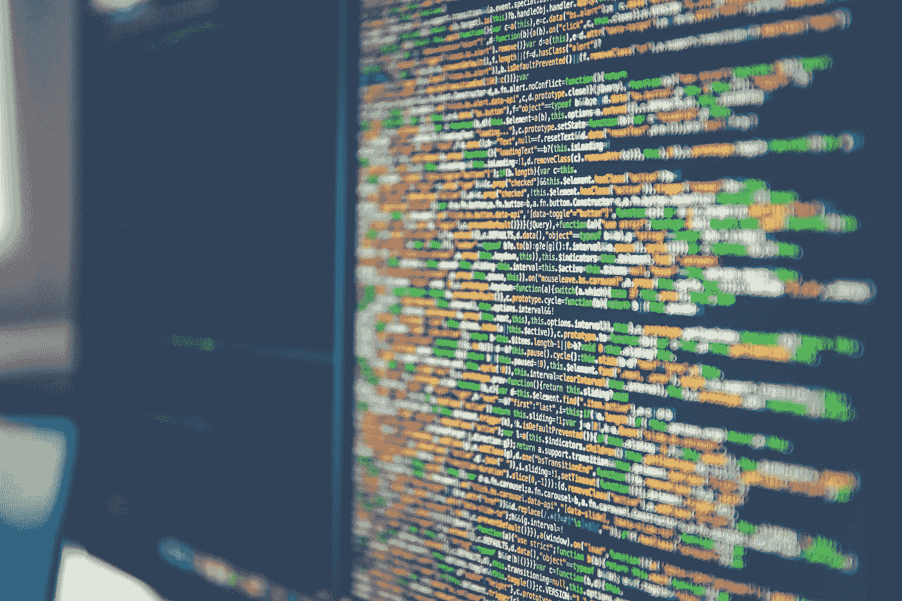

# 关于计算机算法和数据结构的最佳书籍

> 原文：<https://medium.com/javarevisited/best-books-about-computer-algorithms-and-data-structures-fa6aef15ea?source=collection_archive---------0----------------------->

数据结构和算法的知识对于计算机工程和程序员来说是必不可少的。为了达到编程语言的下一个层次，你需要阅读关于数据结构和算法的最好的书籍。这个列表旨在列出并向您介绍算法和数据结构方面的最佳书籍

# 算法解锁