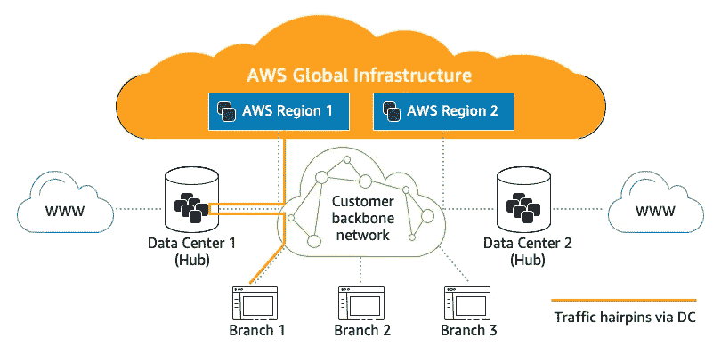
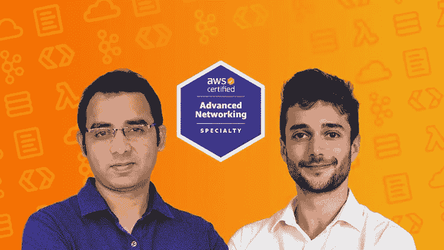
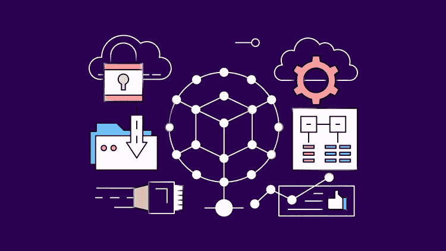
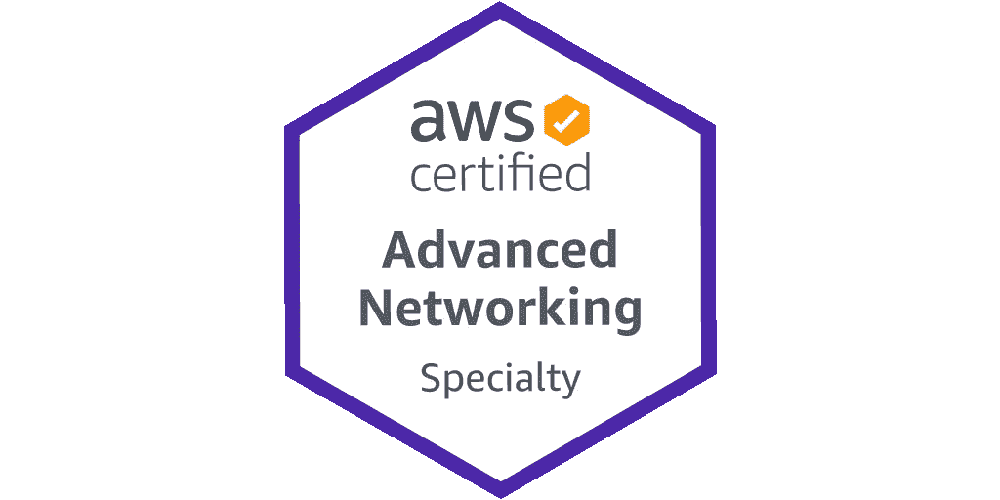
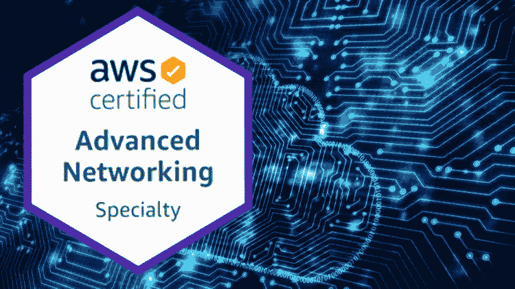
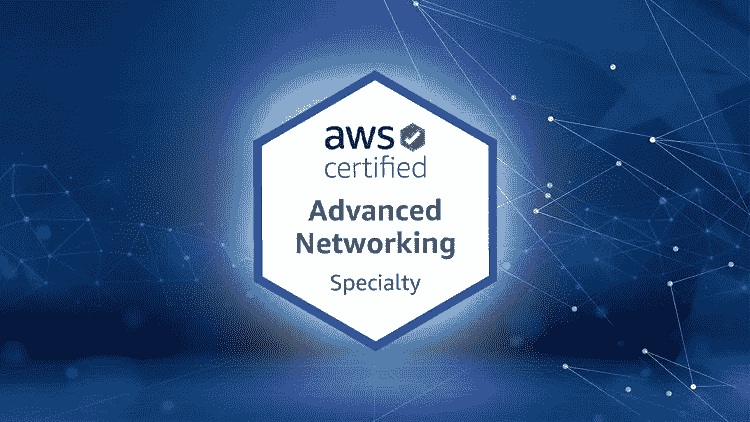

# 2022 年 5 门最佳 AWS 高级网络专业认证考试课程和实践测试

> 原文：<https://medium.com/javarevisited/best-courses-for-aws-advanced-networking-specialty-certification-exam-15a282130b21?source=collection_archive---------1----------------------->

## 准备 AWS 高级网络专业考试？以下是来自 Udemy、Pluralsight 和 LinkedIn Learning 的最好的 AWS 网络在线课程，以便更好地准备。

在我告诉你可以用来通过 **AWS 高级网络专业考试**的最佳课程之前，让我告诉你它到底是什么，对吗？它基本上是一种认证，允许组织识别和培养具有实施云计划的关键技能的人才。

如果您获得了 AWS 高级网络专业认证，这意味着您是为各种 AWS 服务设计和维护网络架构的专家。

AWS 认证高级网络专业考试面向具有五年设计和实施网络解决方案实践经验、执行复杂网络任务的个人。

作为该考试的候选人，您应该具有使用 AWS 技术、AWS 安全实践、AWS 存储选项、底层一致性模型和 AWS 网络细微差别的专业经验，以及它们与 AWS 服务集成的关系。

理想情况下，您应该了解一些高级网络架构和互连选项，如 IP VPN、MPLS 和 VPLS。您还应该熟悉自动化脚本和工具的开发。

这与路由架构的设计、实施和优化、全球企业的多区域解决方案以及高可用性连接解决方案等流程相关。

# 2022 年 AWS 高级网络专业考试的 5 门最佳课程

在这里，我们为 AWS 高级网络专业考试编制了一个 5 门最佳课程的列表。请继续阅读，了解更多信息。

## 1. [AWS 认证高级网络专业 2022](https://click.linksynergy.com/deeplink?id=CuIbQrBnhiw&mid=39197&murl=https%3A%2F%2Fwww.udemy.com%2Fcourse%2Faws-certified-advanced-networking-specialty-ans%2F)【Udemy】

这门精彩的课程将帮助您通过 AWS 认证高级网络专业认证 ANS-C00。这里需要注意的重要一点是，你将会被一位 AWS 网络和 VPC 专家教授。

课程内容根据最新的教学大纲进行了全面更新，这将有助于您通过 AWS 认证高级网络专业考试。您将学习如何在 AWS 中建立网络，同时通过几个实践教程进行练习。

这个课程最好的一点是，它是由 AWS 英雄夏羽·马雷克创建的，他在 Udemy 上有许多很棒的 AWS 认证课程。此外，本课程包含的所有 700 张幻灯片也可以下载以供将来参考。

**以下是参加本课程的链接**——[AWS 认证高级网络专业 2022](https://click.linksynergy.com/deeplink?id=CuIbQrBnhiw&mid=39197&murl=https%3A%2F%2Fwww.udemy.com%2Fcourse%2Faws-certified-advanced-networking-specialty-ans%2F)

为了更好地准备，您还可以将本课程与他的 [**实践考试——AWS 认证高级网络专业**](https://click.linksynergy.com/deeplink?id=JVFxdTr9V80&mid=39197&murl=https%3A%2F%2Fwww.udemy.com%2Fcourse%2Fpractice-exam-aws-certified-advanced-networking-specialty%2F) 课程相结合，该课程包含 2 个测试和 75 个高级问题，以检查您的准备水平。我也相信他们将来会增加更多的问题，免费提供给所有参加课程的人。

## 2. [AWS 认证高级网络—专业 2022](https://click.linksynergy.com/deeplink?id=JVFxdTr9V80&mid=39197&murl=https%3A%2F%2Fwww.udemy.com%2Fcourse%2Faws-certified-advanced-networking-specialty%2F)【Udemy】

当您完成这个精彩的课程时，您将为参加 AWS 认证高级网络专业考试做好充分准备。购买本课程后，您将终身获得超过 25 小时的点播视频讲座、24 篇文章和 1 次模拟测试。

这门课程是由 Zeal Vora 创建的，他是另一位出色的 Udemy 讲师，开设了许多出色的云计算和 AWS 认证课程。

本课程还将帮助你理解和实施各种复杂的 AWS 网络技术。您还可以将 IPSec 隧道作为混合基础设施的一部分来实现。

**以下是参加本课程的链接—** [AWS 认证高级网络—专业 2022](https://click.linksynergy.com/deeplink?id=JVFxdTr9V80&mid=39197&murl=https%3A%2F%2Fwww.udemy.com%2Fcourse%2Faws-certified-advanced-networking-specialty%2F)

## 3. [AWS:人脉](https://linkedin-learning.pxf.io/c/1193463/449670/8005?u=https%3A%2F%2Fwww.linkedin.com%2Flearning%2Faws-networking-14125632)【领英学习】

这是 LinkedIn 学习平台上最受欢迎、评价最高的中级课程之一。这门课的授课老师是谢里夫·尼吉姆(Sharif Nijim)，他是圣母大学的助教。

在本课程中，您将了解 AWS 如何成为一种降低成本的解决方案，为您提供不同的工具，以便您能够利用安全的云网络技术构建数据中心。该课程非常适合技术经理、系统管理员和全栈工程师。

您还将学习如何建立私有连接、设置虚拟私有云、创建安全组、使用访问控制列表以及配置中转网关。

**这是加入本课程的链接**——[AWS:网络](https://linkedin-learning.pxf.io/c/1193463/449670/8005?u=https%3A%2F%2Fwww.linkedin.com%2Flearning%2Faws-networking-14125632)

顺便说一下，你需要一个 LinkedIn Learning 会员才能观看这个课程，费用大约为每月*29.99 美元*，但你也可以通过参加他们的 [**1 个月免费试用**](http://linkedin-learning.pxf.io/c/1193463/449670/8005?u=https%3A%2F%2Fwww.linkedin.com%2Flearning%2Fsubscription%2Fproducts) 来免费观看这个课程，这是探索他们 17000 多门最新技术在线课程的一个好方法。

  

## 4.[AWS 上的高级网络](https://pluralsight.pxf.io/c/1193463/424552/7490?u=https%3A%2F%2Fwww.pluralsight.com%2Fcourses%2Fadvanced-networking-aws)【plural sight】

通过本课程，您将了解 AWS 中的高级网络概念，为参加 AWS 认证高级网络专业考试做好准备。您将了解路由和网关、混合连接选项和网络安全等内容。

课程开始时，您将学习 VPC 中的高级概念，包括路由表、私有 DNS 和弹性网络接口。

您还将学习如何使用安全组、NACLs 和流日志来实现网络安全。本课程结束时，您将学习如何使用对等技术连接多个 VPC、本地网络和远程客户端。

**这是参加本课程**—[AWS 高级网络](https://pluralsight.pxf.io/c/1193463/424552/7490?u=https%3A%2F%2Fwww.pluralsight.com%2Fcourses%2Fadvanced-networking-aws)的链接

不过，你需要一个 [Pluralsight 会员](https://pluralsight.pxf.io/c/1193463/424552/7490?u=https%3A%2F%2Fwww.pluralsight.com%2Fpricing%2Fskills)才能加入这个课程，费用大约是每月 29 美元或每年 299 美元(14%的折扣)。我向所有程序员强烈推荐这个订阅，因为它提供了超过 7000 个在线课程的即时访问，以学习任何技术技能。或者，你也可以使用他们的 [**10 天免费通行证**](https://pluralsight.pxf.io/c/1193463/424552/7490?u=https%3A%2F%2Fwww.pluralsight.com%2Fpricing%2Ffree-trial) 免费观看这个课程。

<https://pluralsight.pxf.io/c/1193463/424552/7490?u=https%3A%2F%2Fwww.pluralsight.com%2Fpricing%2Ffree-trial>  

## 5.[清晰简单的 AWS 高级网络专业 2022](https://click.linksynergy.com/deeplink?id=JVFxdTr9V80&mid=39197&murl=https%3A%2F%2Fwww.udemy.com%2Fcourse%2Fawsnetworking%2F)

在本课程中，您将了解通过 AWS 认证高级网络专业所需的一切。购买本课程后，您将终身获得超过 13 小时的点播视频讲座、4 种可下载的教育资源和 1 次模拟测试。

您将了解如何配置和区分 NAT 网关和 NAT 实例。您还将深入了解 VPC 安全，包括安全组、网络 ACLS、web 应用程序防火墙和 VPC 端点。

**以下是参加本课程的链接—** [清晰简单的 AWS 高级网络专业 2022](https://click.linksynergy.com/deeplink?id=JVFxdTr9V80&mid=39197&murl=https%3A%2F%2Fwww.udemy.com%2Fcourse%2Fawsnetworking%2F)

# AWS 高级网络专业考试练习题

练习题也是好好准备这次考试的重要工具。一旦你完成了上述课程，并对所有考试题目有了足够的了解，你就可以通过这些模拟题或练习题来测试你的准备水平。

1.  [**实践考试— AWS 认证高级网络专业**](https://click.linksynergy.com/deeplink?id=JVFxdTr9V80&mid=39197&murl=https%3A%2F%2Fwww.udemy.com%2Fcourse%2Fpractice-exam-aws-certified-advanced-networking-specialty%2F)**【75 题】**
2.  [**考试| AWS 认证高级网络专业 ANS-C00**](https://click.linksynergy.com/deeplink?id=JVFxdTr9V80&mid=39197&murl=https%3A%2F%2Fwww.udemy.com%2Fcourse%2Fexams-aws-certified-advance-networking-specialty-ans-c00%2F)**【400 题】**
3.  [**实践考试| AWS 认证高级网络专业**](https://click.linksynergy.com/deeplink?id=JVFxdTr9V80&mid=39197&murl=https%3A%2F%2Fwww.udemy.com%2Fcourse%2Fpractice-exams-aws-certified-advanced-networking-specialty%2F)【120 题】

# AWS 高级网络专业考试常见问题

以下是一些关于这项 AWS 著名网络认证的常见问题

**1。什么是 AWS 高级网络专业？**

它基本上是一种认证，允许组织识别和培养具有实施云计划的关键技能的人才。如果您获得了 AWS 高级网络专业认证，这意味着您是为各种 AWS 服务设计和维护网络架构的专家。

**2。我可以尝试 AWS 高级网络专业吗？**

理想情况下，您应该了解一些高级网络架构和互连选项，如 IP VPN、MPLS 和 VPLS。您还应该熟悉自动化脚本和工具的开发。这与路由架构的设计、实施和优化、全球企业的多区域解决方案以及高可用性连接解决方案等流程相关。

**3。AWS 联网认证值得吗？**

是的。根据一项调查，超过 80%的人认为更高的工资是云认证的直接结果。

这就是了。这些是您可以用来准备 AWS 认证高级网络专业考试的最佳课程。

以上就是 2022 年破解 AWS 高级网络专业考试的*最佳在线课程*。如果你喜欢这个 AWS 高级网络专业考试的 th **e 5 最佳课程列表，请随意与你的朋友和家人分享。如果您有任何疑问或问题，您也可以发表评论，我们会立即回复您。**