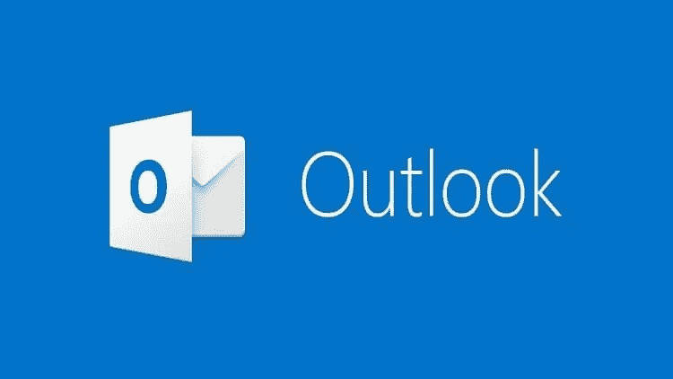
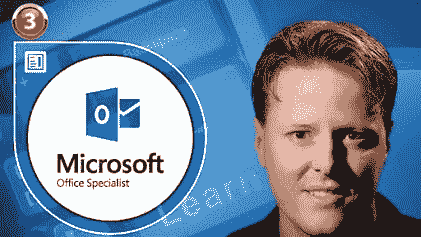
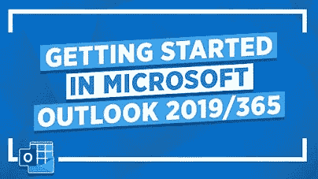
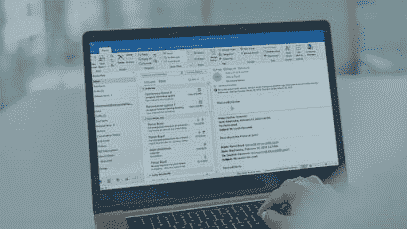

# 2022 年 IT 专业人员学习 Microsoft Outlook 的 5 门最佳课程

> 原文：<https://medium.com/javarevisited/best-courses-to-learn-microsoft-outlook-for-technical-and-non-tech-professionals-faea31d29083?source=collection_archive---------2----------------------->

## Microsoft Outlook 是 IT 专业人员的必备工具，这里有一些最好的在线课程，可以让你了解一些你还不知道的关于 Outlook 的知识

你们大多数人可能会有这样的问题:微软 Outlook 到底是什么？别担心，我会掩护你的。MS Outlook 基本上是一个个人信息管理器，是更大的 MS Office 生产力应用程序套件的一部分。

Outlook 的第一个版本是由微软在 1997 年推出的。Outlook 的最大优势在于，它既可以作为独立软件购买，也可以作为 MS Office 生态系统的一部分。

另一件值得注意的事情是，它也可以用作电子邮件客户端服务器，或者如果您需要日历、约会或邮箱等共享功能。

Outlook 的第一个版本只与个人电脑兼容。但现在，它可用于许多设备，如手机、笔记本电脑，甚至 Mac 设备。

Outlook 目前的版本是 Outlook 2019，发布于 2018 年 9 月。在最新版本中，用户可以轻松过滤和分类电子邮件，还可以选择添加多个时区。它还允许用户发送电子邮件、安排会议和预约。它可以由组织或个人使用。

# 2022 年学习微软 Outlook 的 5 门最佳在线课程

在这里，我们收集了学习 Microsoft Outlook 的 5 门最佳课程。请继续阅读，了解更多信息。

## 1.[掌握 Microsoft Outlook —从初级到高级的 Outlook](https://click.linksynergy.com/deeplink?id=JVFxdTr9V80&mid=39197&murl=https%3A%2F%2Fwww.udemy.com%2Fcourse%2Fmaster-microsoft-outlook-2016-from-beginner-to-advanced%2F)

您可以通过这门精彩的课程了解 Microsoft Outlook 如何让您的生活更有条理、更有效率。您将学习如何创建和发送电子邮件，以及安排和组织活动和约会。整个课程内容分为 28 节，145 讲。

您将学习如何创建、分类和组织您的联系人。课程结束时，您将能够安排会议、跟踪回复和发送更新。

以下是参加本课程的链接— [掌握 Microsoft Outlook —从初级到高级的 Outlook](https://click.linksynergy.com/deeplink?id=JVFxdTr9V80&mid=39197&murl=https%3A%2F%2Fwww.udemy.com%2Fcourse%2Fmaster-microsoft-outlook-2016-from-beginner-to-advanced%2F)

## 2. [Outlook 基础培训(Office 365/微软 365)](https://linkedin-learning.pxf.io/c/1193463/449670/8005?u=https%3A%2F%2Fwww.linkedin.com%2Flearning%2Foutlook-essential-training-microsoft-365%3FreplacementOf%3Doutlook-essential-training-office-365-microsoft-365-2020)

在这门备受好评的课程中，您将学习如何在最新版本的 Microsoft Outlook 中设置电子邮件、日历和联系人。这门课程的讲师是杰斯·斯特拉顿(Jess Stratton)，她是 LinkedIn Learning Staff 的作者，也是一名技术顾问。

本课程首先向您介绍界面，向您展示如何将各种电子邮件帐户连接到 Outlook。您还将学习如何快速创建、发送和阅读电子邮件，并减少收件箱中的混乱。

以下是参加本课程的链接— [Outlook 基础培训(Office 365/ Microsoft 365)](https://linkedin-learning.pxf.io/c/1193463/449670/8005?u=https%3A%2F%2Fwww.linkedin.com%2Flearning%2Foutlook-essential-training-microsoft-365%3FreplacementOf%3Doutlook-essential-training-office-365-microsoft-365-2020)

顺便说一下，你需要一个 LinkedIn Learning 会员才能观看这个课程，费用大约为每月*29.99 美元*，但你也可以通过参加他们的 [**1 个月免费试用**](http://linkedin-learning.pxf.io/c/1193463/449670/8005?u=https%3A%2F%2Fwww.linkedin.com%2Flearning%2Fsubscription%2Fproducts) 来免费观看这个课程，这是一个探索他们 17000 多门最新技术在线课程的好方法。

 [## Outlook 基础培训(微软 365)在线课程| LinkedIn Learning，原名 Lynda.com

### 微软 Outlook-世界上最广泛使用的电子邮件和日历应用程序之一-拥有可以帮助你…

linkedin-learning.pxf.io](https://linkedin-learning.pxf.io/c/1193463/449670/8005?u=https%3A%2F%2Fwww.linkedin.com%2Flearning%2Foutlook-essential-training-microsoft-365%3FreplacementOf%3Doutlook-essential-training-office-365-microsoft-365-2020) 

## 3.[展望要领](https://pluralsight.pxf.io/c/1193463/424552/7490?u=https%3A%2F%2Fwww.pluralsight.com%2Fcourses%2Foutlook-2019-essentials)【复数视线】

这个令人兴奋的课程将教你在 Microsoft Outlook 2019 中使用电子邮件所需知道的一切。您还将学习如何在 Outlook 2019 中创建和格式化消息，以及设置会议和约会。

您将从学习如何导航 Outlook 2019 的界面开始课程。您还将学习如何创建、格式化、组织和管理信息。通过本课程，您将能够获得 Outlook 2019 的技能和知识，使您能够开始在商业环境中使用电子邮件。

以下是参加本课程的链接— [Outlook 基础知识](https://pluralsight.pxf.io/c/1193463/424552/7490?u=https%3A%2F%2Fwww.pluralsight.com%2Fcourses%2Foutlook-2019-essentials)

不过，你需要一个 [Pluralsight 会员](https://pluralsight.pxf.io/c/1193463/424552/7490?u=https%3A%2F%2Fwww.pluralsight.com%2Fpricing%2Fskills)才能加入这个课程，费用大约是每月 29 美元或每年 299 美元(14%的折扣)。我向所有程序员强烈推荐这个订阅，因为它提供了超过 7000 个在线课程的即时访问，以学习任何技术技能。或者，你也可以使用他们的 [**10 天免费通行证**](https://pluralsight.pxf.io/c/1193463/424552/7490?u=https%3A%2F%2Fwww.pluralsight.com%2Fpricing%2Ffree-trial) 免费观看这个课程。

 [## Pluralsight |个人免费试用

### 立即开始免费试用 Pluralsight！查看我们为个人和团队提供的服务，如果您不确定…

pluralsight.pxf.io](https://pluralsight.pxf.io/c/1193463/424552/7490?u=https%3A%2F%2Fwww.pluralsight.com%2Fpricing%2Ffree-trial) 

## 4.[微软 Outlook 2019/365:掌握你的电子邮件](https://click.linksynergy.com/deeplink?id=JVFxdTr9V80&mid=39197&murl=https%3A%2F%2Fwww.udemy.com%2Fcourse%2Fmicrosoft-outlook-2019-master-email%2F) [Udemy]

通过本课程，您将学习如何正确使用 Microsoft Outlook，这也将极大地提高您的工作效率。购买本课程后，您将终身获得超过 6 小时的点播视频讲座、2 篇文章和 1 个可下载的教育资源。

本课程将教你如何组织和管理你的电子邮件，包括标记、忽略和条件格式。您还可以创建和管理任务和提醒。整个课程内容分为 12 节 61 讲。

**以下是加入本课程的链接**——[微软 Outlook 2019/365:掌握你的电子邮件](https://click.linksynergy.com/deeplink?id=JVFxdTr9V80&mid=39197&murl=https%3A%2F%2Fwww.udemy.com%2Fcourse%2Fmicrosoft-outlook-2019-master-email%2F)

## 5. [Outlook Pro](https://pluralsight.pxf.io/c/1193463/424552/7490?u=https%3A%2F%2Fwww.pluralsight.com%2Fcourses%2Foutlook-2019-pro) 【复数视线】

本课程将教你所有你需要知道的关于 Microsoft Outlook 2019 的高级功能。您将学习如何在 Outlook 2019 中管理多个电子邮件帐户，执行高级邮件管理，以及处理高级搜索操作。

您还将学习如何处理垃圾邮件、使用规则以及委派邮箱访问权限。当您完成本课程时，您将具备在 Outlook 2019 中获得商业环境成功的必要技能。

这个奇妙课程的讲师是希瑟·阿克曼，她是一位有几十年教学经验的优秀培训师。

**这是加入本课程的链接**——[Outlook Pro](https://pluralsight.pxf.io/c/1193463/424552/7490?u=https%3A%2F%2Fwww.pluralsight.com%2Fcourses%2Foutlook-2019-pro)

## Microsoft Outlook 常见问题

**1。什么是 Microsoft Outlook？**

MS Outlook 基本上是一个个人信息管理器，是更大的 MS Office 生产力应用程序套件的一部分。Outlook 的最大优势在于，它既可以作为独立软件购买，也可以作为 MS Office 生态系统的一部分。另一件值得注意的事情是，它也可以用作电子邮件客户端服务器，或者如果您需要日历、约会或邮箱等共享功能。

**2。Outlook 的第一个版本是什么时候发布的？**

Outlook 的第一个版本是由微软在 1997 年推出的。Outlook 的第一个版本只与个人电脑兼容。但现在，它可用于许多设备，如手机、笔记本电脑，甚至 Mac 设备。

**2。哪个是 Outlook 的最新版本？**

Outlook 目前的版本是 Outlook 2019，发布于 2018 年 9 月。在最新版本中，用户可以轻松过滤和分类电子邮件，还可以选择添加多个时区。它还允许用户发送电子邮件、安排会议和预约。它可以由组织或个人使用。

## 结论

这就是深入学习 Microsoft Outlook 的最佳在线课程。如你所见，我遵守了我的诺言。你唯一的工作就是从列表中选择一门课程并开始学习。我毫不怀疑这些课程会在几周内让你从一个完全的初学者变成 Outlook 专家。

如果你喜欢这份学习微软 Outlook 的 *5 门最佳课程列表，请随意与你的朋友和家人分享。如果您有任何疑问或问题，也可以发表评论，我们会尽快回复您。*