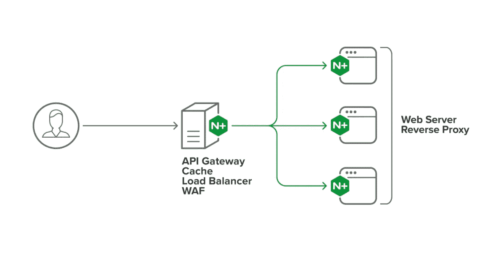
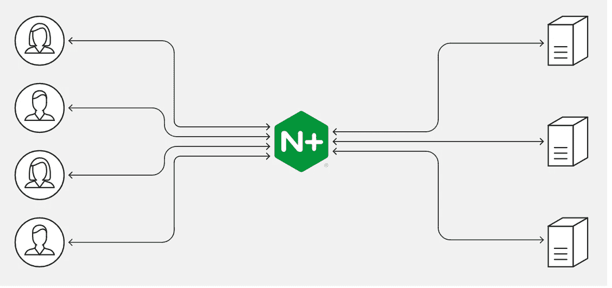
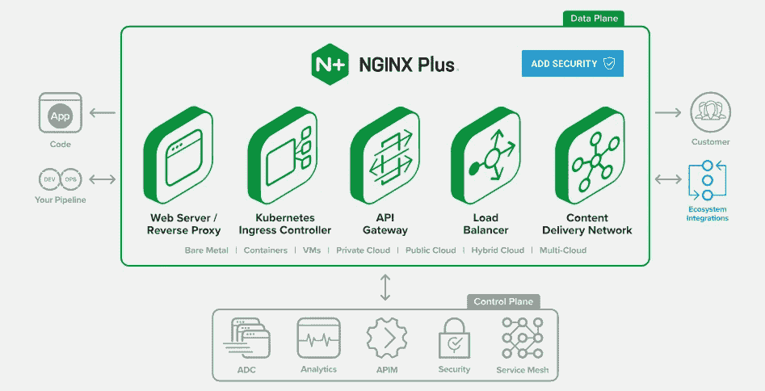
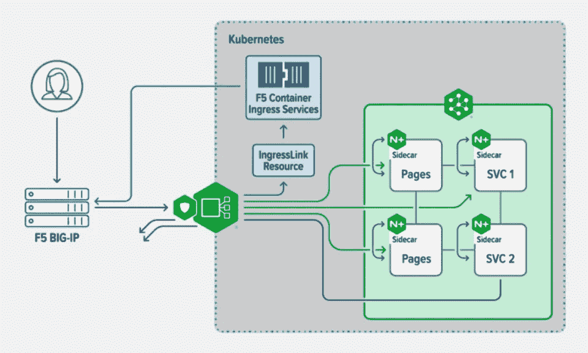

# 2023 年学习 Nginx 的 6 门最佳课程

> 原文：<https://medium.com/javarevisited/best-courses-to-learn-nginx-in-36ed9ccca804?source=collection_archive---------1----------------------->

## 我最喜欢的 2023 年学习 Nginx 的在线课程来自 Udemy，Pluralsight，LinkedIn Learning，以及其他流行的在线平台。

大家好，如果你想学习 Nginx 并寻找最好的在线课程，那么你来对地方了。在这篇文章中，我将分享从 Udemy 和 Pluralsight 学习 Nginx 的最佳在线课程。

对于那些不知道的人来说，Nginx 是一个开源的 web 服务器，也可以用作反向代理、负载平衡器和 HTTP 缓存。领先的科技公司如 Autodesk、GitLab、DuckDuckGo、微软、IBM、谷歌、Adobe、施乐、LinkedIn、思科、Twitter、苹果和 Intl 都使用 Nginx。

> Nginx，实际发音为' **engine-ex '，**由 Igor Syosev 创建，于 2004 年 10 月首次发布。

Nginx 是作为 C10K 问题的解决方案而创建的，C10K 问题是一个关于处理 10，000 个并发连接和可能出现的性能问题的著名问题。

Nginx 的主要优势在于规模下的性能优化，正因为如此，它经常在基准测试中胜过其他 web 服务器。它在静态内容和高并发请求的情况下也特别有用。

Nginx 通过使用异步和事件驱动的方法来工作，以便在单线程中处理请求。它还提供了高并发性和低内存使用。这意味着您只需要一个主进程来控制多个工作进程。每个请求都可以由工作线程执行，而不会阻塞其他请求。

# 2023 年针对初学者和有经验开发者的 6 大 Nginx 课程

我们已经为你做了艰苦的工作，并编制了 5 个最佳 Nginx 课程的列表。这些课程会让你很快成为 Nginx 专家。看看下面的列表。

## 1. [NGINX 基础:从零开始的高性能服务器](https://click.linksynergy.com/deeplink?id=JVFxdTr9V80&mid=39197&murl=https%3A%2F%2Fwww.udemy.com%2Fcourse%2Fnginx-fundamentals%2F)

在本课程中，您将从头开始学习如何配置和安装 NGINX web 服务器。一旦您购买了本课程，您将终身获得超过 4 小时的点播视频讲座和 21 种可下载的教育资源。

您还将能够创建定制的 Nginx web 服务器，并学习如何保护和优化您的 web 服务器。

本课程还将教你如何定制你的 Nginx 安装。通过这个，你将获得一个结业证书，并在你的简历上增加一个无价的技能。

**这里是加入本 Nginx 课程** — [NGINX 基础](https://click.linksynergy.com/deeplink?id=JVFxdTr9V80&mid=39197&murl=https%3A%2F%2Fwww.udemy.com%2Fcourse%2Fnginx-fundamentals%2F)的链接

## 2. [NGINX Web 服务器从零开始](https://click.linksynergy.com/deeplink?id=JVFxdTr9V80&mid=39197&murl=https%3A%2F%2Fwww.udemy.com%2Fcourse%2Fnginx-web-server%2F)【Udemy 课程】

人们学习 NGINX 的一个主要原因是为了平衡他们的 web 服务器负载，如果你也因为同样的原因学习 NGINX，那么这是 2023 年加入的完美 Udemy 课程。在本课程中，您将快速学习和掌握 NGINX web server。

NGINX 实际上被认为是最强大、最高效、最安全的 web 服务器，用于托管各种规模和复杂性的 web 应用程序。此外，您会惊讶地发现，它帮助超过 40%的世界上最繁忙的网站更快地向用户提供内容。

以下是您将在本课程中学到的重要内容:

*   如何托管多个网站
*   如何将 Nginx 配置为负载均衡器
*   如何限制 HTTP 带宽
*   如何使用 WP-CLI 安装和管理 WordPress
*   如何使用 SSL 证书配置 HTTPS
*   如何用密码保护目录
*   如何使用 Ngrok 将本地 Web 服务器暴露给 Internet
*   如何设置自定义错误页面和日志格式
*   如何用 Fail2Ban 防止暴力登录

说到社交证明，这大概是 2023 年学习 NGINX web server 评价最高的 Udemy 课程了。超过 30，000 人参加了这个课程，它的平均评分为 4.7，这是惊人的。

**这里是加入本课程的链接**——[NGINX Web 服务器从头开始](https://click.linksynergy.com/deeplink?id=JVFxdTr9V80&mid=39197&murl=https%3A%2F%2Fwww.udemy.com%2Fcourse%2Fnginx-web-server%2F)

## 3.[学习 NGINX](http://linkedin-learning.pxf.io/c/1193463/449670/8005?u=https%3A%2F%2Fwww.linkedin.com%2Flearning%2Flearning-nginx)【LinkedIn 学习】

这是 LinkedIn 学习平台上评分最高的初级课程之一。通过本课程，您将能够在 Nginx 的帮助下建立一个高性能的架构，Nginx 是一个行业标准的开源 web 服务器。

课程开始时，您将学习如何在 Linux 机器上安装和配置 Nginx，并建立一个完整的 LEMP web 开发栈。

本课程的讲师是迈克尔·詹金斯，他是一名高级系统工程师。通过本课程，您将探索 Nginx 的安全特性，如密码认证、HTTPS 和 SSL 证书。

**这里是加入本课程** — [学习 NGINX](http://linkedin-learning.pxf.io/c/1193463/449670/8005?u=https%3A%2F%2Fwww.linkedin.com%2Flearning%2Flearning-nginx) 的链接

顺便说一下，你需要 LinkedIn Learning 会员才能观看这门课程，每月费用约为 29.99 美元，但你也可以通过参加他们的 [**1 个月免费试用**](http://linkedin-learning.pxf.io/c/1193463/449670/8005?u=https%3A%2F%2Fwww.linkedin.com%2Flearning%2Fsubscription%2Fproducts) 来免费观看这门课程，这是探索他们 17000 多门最新技术在线课程的好方法。

  

## 4.[Nginx 简介](https://click.linksynergy.com/deeplink?id=CuIbQrBnhiw&mid=39197&murl=https%3A%2F%2Fwww.udemy.com%2Fcourse%2Fnginx-crash-course%2F)【Udemy】

通过本课程，您将能够理解和部署第 4 层或第 7 层负载平衡、HTTPS、HTTP/2、TLS 1.3，以及使用 Nginx 扩展 WebSockets。您还将学习如何将 Nginx 设置为 web 服务器。

一旦您购买了本课程，您将终身获得超过 4 小时的点播视频讲座、1 篇文章和 14 种可下载的教育资源。

您将了解更多关于 Nginx 超时以及如何使用 Nginx 启用 HTTP/2 的信息。您还可以使用 letsEncrypt 启用 HTTPS，使用 Nginx 启用 TLS 1.3。

**这里是加入本课程**—[Nginx 简介](https://click.linksynergy.com/deeplink?id=CuIbQrBnhiw&mid=39197&murl=https%3A%2F%2Fwww.udemy.com%2Fcourse%2Fnginx-crash-course%2F)的链接

## 5.[完美的 Nginx 服务器— Ubuntu 版](https://click.linksynergy.com/deeplink?id=JVFxdTr9V80&mid=39197&murl=https%3A%2F%2Fwww.udemy.com%2Fcourse%2Fthe-perfect-nginx-server-ubuntu-edition%2F)【Udemy】

这是 Udemy 平台上最受欢迎的初级课程之一。顾名思义，本课程将帮助你使用 Nginx 和 Ubuntu 20.04 建立多个高性能的 WordPress 站点。您将了解如何设置安全和优化的虚拟普里瓦服务器。

一旦您购买了本课程，您将终身获得超过 10 小时的点播视频讲座和 35 种可下载的教育资源。整个课程内容分为 25 节，105 讲。

**这里是加入本课程的链接** — [完美的 Nginx 服务器— Ubuntu 版](https://click.linksynergy.com/deeplink?id=JVFxdTr9V80&mid=39197&murl=https%3A%2F%2Fwww.udemy.com%2Fcourse%2Fthe-perfect-nginx-server-ubuntu-edition%2F)

## 6. [Nginx 2023 —从初级到高级](https://click.linksynergy.com/deeplink?id=JVFxdTr9V80&mid=39197&murl=https%3A%2F%2Fwww.udemy.com%2Fcourse%2Fnginx-beginner-to-advanced%2F) [Udemy]

通过学习本课程，您将深入了解 HTTP 协议，并为负载平衡器打下坚实的基础。您还将学习如何实际实现负载平衡器。本课程是 HTTP 协议和 Nginx 的完美初学者指南。

您将学习如何配置 Web 应用程序防火墙，在本课程结束时，您将能够使用反向代理建立自己的网站。

这门课程的讲师是 Zeal Vora，他是 Udemy 的高级讲师，也是一名云安全顾问。

**这里是加入本课程的链接**——[Nginx 2023——初级到高级](https://click.linksynergy.com/deeplink?id=JVFxdTr9V80&mid=39197&murl=https%3A%2F%2Fwww.udemy.com%2Fcourse%2Fnginx-beginner-to-advanced%2F)

## Nginx 常见问题

**1。Nginx 是用来做什么的？**

Nginx 是一个开源 web 服务器，也可以用作反向代理、负载平衡器和 HTTP 缓存。Nginx 的主要优势在于规模下的性能优化，正因为如此，它经常在基准测试中胜过其他 web 服务器。它在静态内容和高并发请求的情况下也特别有用。

**2。Nginx 是如何工作的？**

Nginx 通过使用异步和事件驱动的方法来工作，以便在单线程中处理请求。它还提供了高并发性和低内存使用。这意味着您只需要一个主进程来控制多个工作进程。每个请求都可以由工作线程执行，而不会阻塞其他请求。

**3。Nginx 是谁创造的？**

Nginx 由 Igor Syosev 创建，于 2004 年 10 月首次发布。Nginx 是作为 C10K 问题的解决方案而创建的，C10K 问题是一个关于处理 10，000 个并发连接和可能出现的性能问题的著名问题。

就是这样。如你所见，我遵守了我的承诺。这些是目前为止你可以用来学习更多 Nginx 知识的最好的课程。我毫不怀疑这些课程会在几周内让你从一个完全的新手变成 Nginx 专家。

如果你喜欢这份 **5 个最佳 Nginx 课程的列表**，请随意与你的朋友和家人分享。如果您有任何疑问或问题，您也可以发表评论，我们会立即回复您。

面向程序员的其他 **Linux 和 DevOps 文章**

*   [深入学习 Docker 的 10 门免费课程](https://javarevisited.blogspot.com/2018/02/10-free-docker-container-courses-for-Java-Developers.html)
*   [**2023 年 DevOps 工程师与 SRE 路线图**](/javarevisited/the-2018-devops-roadmap-31588d8670cb)
*   [5 门免费学习区块链技术的课程](http://www.java67.com/2018/02/5-free-blockchain-technology-courses.html)
*   [2023 年学习 Kubernetes 的 7 门免费课程](/javarevisited/7-free-online-courses-to-learn-kubernetes-in-2020-3b8a68ec7abc)
*   [学习 Linux 命令的 5 门免费课程](https://hackernoon.com/top-5-free-linux-courses-for-programmers-4a433b4edade)
*   [2023 年面向初学者的 10 门免费 DevOps 在线课程](/javarevisited/10-free-online-courses-to-learn-devops-for-beginners-9feadb644f50)
*   [面向 Java 和 DevOps 工程师的 5 门免费 Docker 课程](http://www.java67.com/2018/02/5-free-docker-courses-for-java-and-DevOps-engineers.html)
*   [学习数据科学和机器学习的 10 门免费课程](http://www.java67.com/2018/10/top-10-data-science-and-machine-learning-courses.html)
*   [2023 年学习 Linux 命令的 10 门免费课程](/javarevisited/top-10-courses-to-learn-linux-command-line-in-2020-best-and-free-f3ee4a78d0c0)
*   [我最喜欢的 2023 年学 AWS 的课程](/javarevisited/top-10-courses-to-learn-amazon-web-services-aws-cloud-in-2020-best-and-free-317f10d7c21d)
*   [成为全栈 Java 开发者的 10 门课程](/javarevisited/10-best-java-full-stack-web-development-courses-to-join-in-2020-6cd6cd2e5868)
*   [Java 开发人员学习 Maven 和 Jenkins 的 5 门课程](http://www.java67.com/2018/02/6-free-maven-and-jenkins-online-courses-for-java-developers.html)
*   [学习 Learn RESTful Web 服务的 3 本书和课程](http://www.java67.com/2018/02/3-books-and-courses-to-learn-restful-web-services-with-spring.html)
*   [初学者学习 Java 的 10 门免费课程](http://www.java67.com/2018/08/top-10-free-java-courses-for-beginners-experienced-developers.html)
*   [2023 年十大云认证目标](https://www.java67.com/2020/09/top-10-cloud-certification-you-can-aim.html)
*   [提高生产力和速度的 9 个 Linux 技巧](/javarevisited/top-10-unix-and-linux-productivity-tips-for-programmers-and-developers-c748129cf3e8)
*   [学习 Oracle 和微软 SQL Server 数据库的 5 门课程](http://www.java67.com/2018/02/5-free-oracle-and-microsoft-sql-server-online-courses.html)

感谢您阅读本文。如果你喜欢这些来自 Udemy、LinkedIn Learning 和 Coursera 的**最佳 NGINX 在线培训课程**，请分享给你的朋友和同事。如果您有任何问题或反馈，请留言。

**附言——**如果你正在寻找免费的 NGINX 课程开始学习，那么你也可以在 Udemy 上的 Linux 免费课程 中查看这个 [**Web 服务器负载平衡。在本课程中，您将学习 Nginx 负载平衡，并在 Linux (CentOS)中为您的 web 服务器和应用程序配置 HTTP 负载平衡。这个课程是完全免费的，你只需要一个免费的 Udemy 帐户就可以参加这个课程。**](https://click.linksynergy.com/deeplink?id=JVFxdTr9V80&mid=39197&murl=https%3A%2F%2Fwww.udemy.com%2Fcourse%2Ffree-web-server-load-balance-in-linux%2F)

<https://javarevisited.blogspot.com/2022/02/top-5-courses-to-learn-nginx-in-depth.html> 