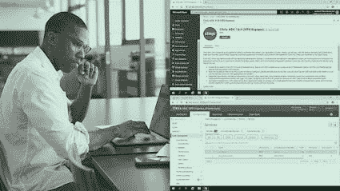
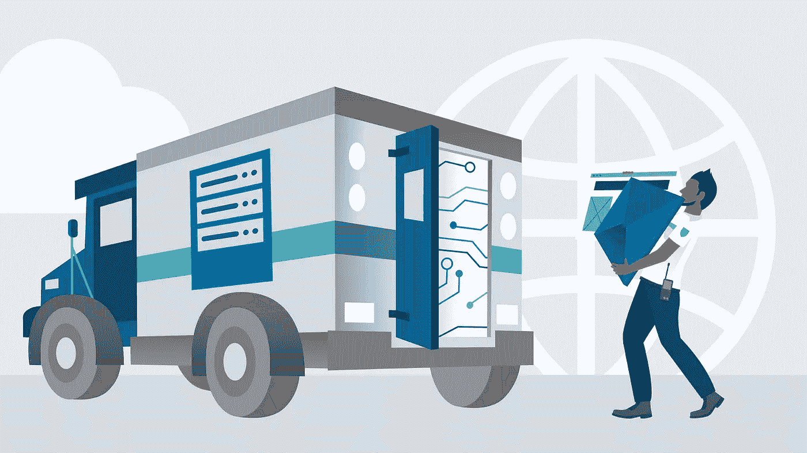
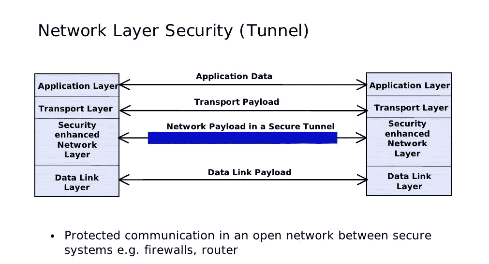
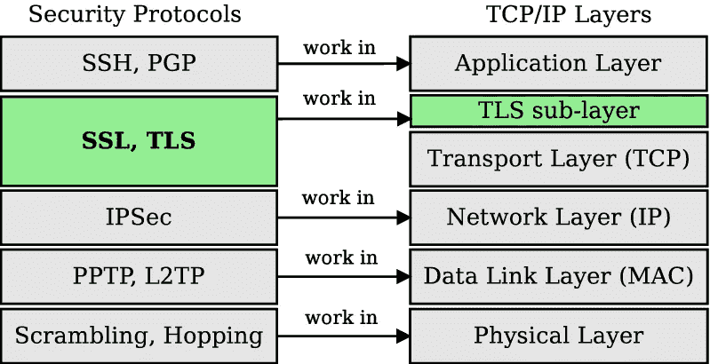

# 2023 年 5 门最佳 HTTPS、SSL 和 TLS 初学者课程

> 原文：<https://medium.com/javarevisited/best-https-ssl-and-tls-courses-for-beginners-4437661250b3?source=collection_archive---------1----------------------->

## 这些是 2023 年程序员和开发人员学习 HTTPS、SSL 和 TLS 的最佳在线课程

image_credit — ByteByteGo

大家好，如果你想了解 HTTPS，SSL，TLS 和安全，并寻找最好的在线课程，那么你来对地方了。在上一篇文章中，我谈到了 [**最佳 NGINX 课程**](/javarevisited/best-courses-to-learn-nginx-in-36ed9ccca804) ，在这篇文章中，我将为程序员分享最佳 SSL 和 TLS 课程。

对于那些对此不熟悉的人来说，SSL 和 TLS 是加密互联网流量并确保所有通过互联网的通信安全可靠的协议。

TLS 实际上可以被看作是 SSL 的后代，它提供加密并使互联网商务成为可能。这两种协议都会不断更新，以便随时应对来自恶意黑客的复杂攻击。

SSL 代表安全套接字层，是由 Netscape 公司在 20 世纪 90 年代中期开发的，它也是当时最流行的网络浏览器。SSL 的主要版本是 1996 年发布的 SSL 3.0，它提供了强大的加密级别。

该协议的下一个版本于 1999 年发布，被称为传输层安全性，简称 TLS。同年，互联网工程任务组对其进行了标准化。这两种协议都会收到持续更新，并且通常一起称为 SSL/TLS。

TLS 最常用于加密 web 流量，以及其他形式的 internet 流量。检查你的浏览器是否受 TLS 保护最简单的方法就是看你地址栏里的网址是否以“https”开头。您还会在网站地址旁边看到一个挂锁指示器。

# 2023 年学习 SSL 和 TLS 的 5 个最佳在线课程

在这里，我们列出了学习 SSL 和 TLS 的 5 个最佳课程。看看下面的列表。

## 1.[完整的 SSL 和 TLS 指南 2023: HTTP 和 HTTPS](https://click.linksynergy.com/deeplink?id=JVFxdTr9V80&mid=39197&murl=https%3A%2F%2Fwww.udemy.com%2Fcourse%2Fssl-complete-guide%2F)【Udemy】

顾名思义，这个课程是一个完整的包。课程开始时，您将学习如何在 web 服务器上安装 SSL/TLS 证书。一旦您从 Udemy 购买了本课程，您将终身获得超过 11 小时的点播视频讲座和两篇文章。

本课程还将教您 HTTP 和 HTTPS 之间的各种不同之处。您还将了解更多关于 TLS 证书的结构。本课程结束时，您将能够为 SSL/TLS 加密安装和配置 Nginx web 服务器。

**以下是参加本课程的链接**——[2023 年 SSL 和 TLS 完整指南:HTTP 和 HTTPS](https://click.linksynergy.com/deeplink?id=JVFxdTr9V80&mid=39197&murl=https%3A%2F%2Fwww.udemy.com%2Fcourse%2Fssl-complete-guide%2F)

## 4.[为 Citrix ADC 实施 SSL 卸载](https://pluralsight.pxf.io/c/1193463/424552/7490?u=https%3A%2F%2Fwww.pluralsight.com%2Fcourses%2Fimplement-ssl-offload-citrix-adc)【plural sight】

在本课程中，您将学习如何在 Citrix ADC 上使用 SSL 的强大功能，以便借助 SSL 卸载功能安全地交付您的应用。

这是一个非常有用的功能，它将帮助您保护您的环境，同时利用后端服务器上的工作负载。

通过本课程，您还将学习如何使用 Microsoft Azure 部署 Citric ADC 应用程序。您将从学习如何将您的应用程序从头构建成一个功能完整的 SSL 虚拟服务器开始。

**这是参加本课程的链接** — [为 Citrix ADC 实施 SSL 卸载](https://pluralsight.pxf.io/c/1193463/424552/7490?u=https%3A%2F%2Fwww.pluralsight.com%2Fcourses%2Fimplement-ssl-offload-citrix-adc)

不过，你需要一个 [Pluralsight 会员](https://pluralsight.pxf.io/c/1193463/424552/7490?u=https%3A%2F%2Fwww.pluralsight.com%2Fpricing%2Fskills)才能加入这个课程，费用约为每月 29 美元或每年 299 美元(14%的折扣)。我向所有程序员强烈推荐这个订阅，因为它提供了超过 7000 个在线课程的即时访问，以学习任何技术技能。或者，你也可以使用他们的 [**10 天免费通行证**](https://pluralsight.pxf.io/c/1193463/424552/7490?u=https%3A%2F%2Fwww.pluralsight.com%2Fpricing%2Ffree-trial) 免费观看本课程。

<https://pluralsight.pxf.io/c/1193463/424552/7490?u=https%3A%2F%2Fwww.pluralsight.com%2Fpricing%2Ffree-trial>  

## 3.[学习 SSL/TLS](https://linkedin-learning.pxf.io/c/1193463/449670/8005?u=https%3A%2F%2Fwww.linkedin.com%2Flearning%2Flearning-ssl-tls)【LinkedIn 学习】

这是 LinkedIn 学习平台上评分最高的初级课程之一，这意味着如果你是 SSL/TLS 的新手，它是完美的。

您将能够通过本课程学习规划、实施和维护支持 SSL/TLS 安全证书的公钥基础设施生态系统所需的技能。

本课程的讲师是 Daniel Lachance，他是 Lachance IT Consulting 的顾问、培训师、作者和编辑。在本课程中，您还将学习如何在 Windows 和 Linux 中安装和配置 PKI 解决方案。

**以下是加入本课程**——[学习 SSL/TLS](https://linkedin-learning.pxf.io/c/1193463/449670/8005?u=https%3A%2F%2Fwww.linkedin.com%2Flearning%2Flearning-ssl-tls) 的链接

顺便说一下，你需要一个 LinkedIn Learning 会员才能观看这个课程，费用大约为每月*29.99 美元*，但你也可以通过参加他们的 [**1 个月免费试用**](http://linkedin-learning.pxf.io/c/1193463/449670/8005?u=https%3A%2F%2Fwww.linkedin.com%2Flearning%2Fsubscription%2Fproducts) 来免费观看这个课程，这是探索他们 17000 多门最新技术在线课程的一个好方法。

  

## 4.[网络安全—协议](https://www.awin1.com/cread.php?awinmid=6798&awinaffid=631878&clickref=&p=%5B%5Bhttps%3A%2F%2Fwww.edx.org%2Fcourse%2Fnetwork-security-protocols)【edX】

这门课与单子上的其他课程略有不同。本课程具有更广阔的视野，重点关注现有的所有不同的网络协议。您将从学习网络安全的基础知识开始。

然后，您将继续学习更高级的主题，包括 TLS/SSL、IPSec 第 2 层安全性和无线安全性等网络协议中使用的加密算法。

该课程是纽约大学提供的网络安全基础微型学士课程的一部分。

**以下是参加本课程** — [网络安全—协议](https://www.awin1.com/cread.php?awinmid=6798&awinaffid=631878&clickref=&p=%5B%5Bhttps%3A%2F%2Fwww.edx.org%2Fcourse%2Fnetwork-security-protocols)的链接

## 5. [SSL/TLS 基础](https://click.linksynergy.com/deeplink?id=JVFxdTr9V80&mid=39197&murl=https%3A%2F%2Fwww.udemy.com%2Fcourse%2Fssl-tls-intro%2F) s [Udemy]

在本课程中，您将学习如何颁发和管理证书，以及如何使用

证书。本课程还将教授您对称和非对称加密。

通过使用本课程，您还将了解如何获取 web 证书和代码签名证书。您还将学习如何配置 TLS VPN，以及如何使用 EFS 保护文件和文件夹。

**这是参加本课程的链接** — [SSL/TLS 基础](https://click.linksynergy.com/deeplink?id=JVFxdTr9V80&mid=39197&murl=https%3A%2F%2Fwww.udemy.com%2Fcourse%2Fssl-tls-intro%2F) s

# SSL 和 TLS 常见问题

**1。什么是 SSL 和 TLS？**

SSL 和 TLS 是加密互联网流量的协议，可确保互联网上的所有通信安全可靠。TLS 实际上可以被看作是 SSL 的后代，它提供加密并使互联网商务成为可能。这两种协议都会不断更新，以便随时应对来自恶意黑客的复杂攻击。

**2。SSL 安全吗？**

SSL 代表安全套接字层，是由 Netscape 公司在 20 世纪 90 年代中期开发的，它也是当时最流行的网络浏览器。SSL 的主要版本是 1996 年发布的 SSL 3.0，它提供了强大的加密级别。

**3。我如何知道我是否有 TLS？**

检查你的浏览器是否受 TLS 保护最简单的方法就是看你地址栏里的网址是否以“https”开头。您还会在网站地址旁边看到一个挂锁指示器。

如你所见，我遵守了我的承诺。现在球在你的球场上。你唯一需要做的就是从这个列表中选择一门课程，然后开始学习。别担心，你可以以后再感谢我。你还在等什么？开始学习。

以上是关于深入学习 HTTPS、SSL 和 TLS 的最佳在线课程**。如果您喜欢这份学习 SSL 和 TLS 的 5 门最佳课程列表，请随意与您的朋友和家人分享。如果您有任何疑问或问题，也可以发表评论，我们会尽快回复您。**