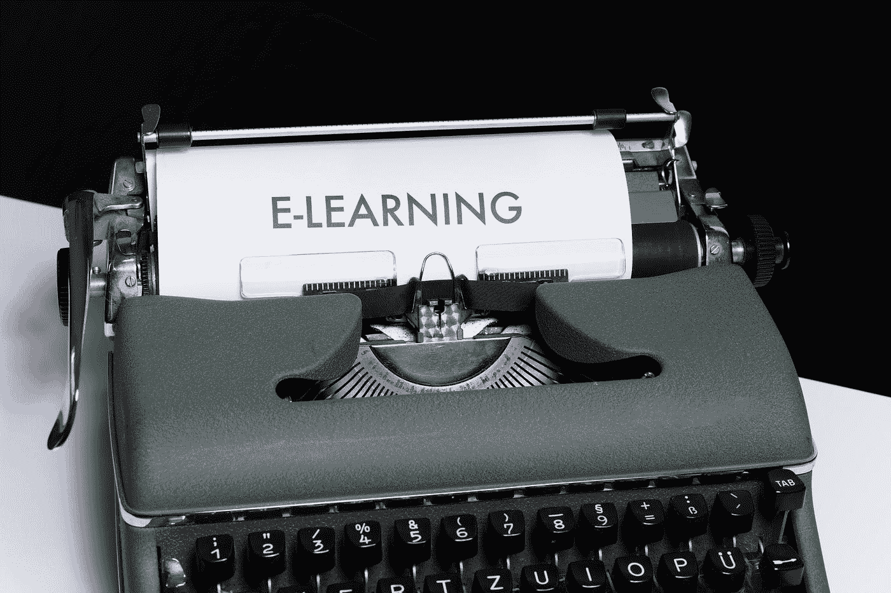

# Coursera 上最好的机器学习课程

> 原文：<https://medium.com/javarevisited/best-machine-learning-courses-on-coursera-c09ab32c7e1a?source=collection_archive---------1----------------------->

马库斯·温克勒在 [Unsplash](https://unsplash.com?utm_source=medium&utm_medium=referral) 上的照片

嗯，在新冠肺炎疫情期间，大家都不好过。每个人都在家里度过他们的时间。这是学习新技能的好时机。机器学习现在正处于高峰期。 [Google Trends](https://trends.google.com/trends/explore?date=all&q=machine%20learning,Artificial%20intelligence,deep%20learning) 显示，在全球范围内，搜索机器学习术语的远不止人工智能和深度学习。[机器学习](/javarevisited/my-favorite-data-science-and-machine-learning-courses-from-coursera-udemy-and-pluralsight-eafc73acc73f)是一个广阔的领域，而现在的教育不仅仅局限于看书。

最近，电子学习在学习者中变得非常流行。Coursera 是一个在线学习平台，由斯坦福大学的成员创建。Coursera 有大量不同科目的课程。2020 年 6 月 1 日， [Coursera](https://blog.coursera.org/helping-college-and-university-students-regain-control-of-their-learning-amid-the-pandemic-with-free-access-to-coursera/) 为学生免费提供大部分课程。

因此，在这篇文章中，我展示了 Coursera 上可能最好的机器学习课程，你可以在这个锁定中提高你的机器学习技能。

让我们开始吧。TL；这是 Coursera 上五大课程的帖子。

1.  [吴恩达的机器学习](https://www.coursera.org/learn/machine-learning)
2.  [用 Python 进行机器学习](https://www.coursera.org/learn/machine-learning-with-python)
3.  [高级机器学习专业化](https://www.coursera.org/specializations/aml)
4.  [用于机器学习的数学](https://www.coursera.org/specializations/mathematics-machine-learning)
5.  [深度学习专业化](https://www.coursera.org/specializations/deep-learning)

# 吴恩达的机器学习

提供者:斯坦福大学

费用:免费，证书 79 美元

课程评分:4.9 分(共 142，479 分)

这是机器学习最好的入门课程。这门课由斯坦福大学教授、Coursera 联合创始人吴恩达教授主讲。

本课程提供了机器学习、数据挖掘和统计模式识别的广泛介绍。主题包括:(一)监督学习(参数/非参数算法，支持向量机，核，神经网络)。㈡无监督学习(聚类、降维、推荐系统、深度学习)。㈢机器学习的最佳做法(偏差/差异理论；机器学习和 [AI](/javarevisited/7-best-courses-to-learn-artificial-intelligence-in-2020-26d59d62f6fe) 中的创新过程。该课程还将借鉴大量的案例研究和应用，以便您也将学习如何应用学习算法来构建智能机器人(感知、控制)、文本理解(网络搜索、反垃圾邮件)、计算机视觉、医疗信息学、音频、数据库挖掘和其他领域。

课程结构:

第一周:简介

第二周:多元线性回归

第三周:逻辑回归

第四周:神经网络:表现

第五周:神经网络:学习

第六周:应用机器学习的建议

第 7 周:支持向量机

第八周:无监督学习

第 9 周:异常检测和推荐系统

第十周:大规模机器学习

第 11 周:应用示例:照片 OCR

# 用 Python 进行机器学习

提供者:IBM

费用:免费审核，认证费 39 美元

课程评分:4.7 分(共 9，137 分)

本课程深入机器学习的基础知识，使用一种平易近人、众所周知的编程语言 [Python](/better-programming/top-5-courses-to-learn-python-in-2018-best-of-lot-26644a99e7ec) 。

本课程将回顾两个主要部分:

1.  您将了解机器学习的目的以及它在现实世界中的应用。
2.  您将对机器学习主题有一个大致的了解，如监督与非监督学习、模型评估和[机器学习算法](https://www.java67.com/2020/07/top-5-machine-learning-algorithms-for-beginners.html)。

在本课程中，您将使用机器学习的真实例子进行实践，并了解它如何以您可能猜不到的方式影响社会！

在接下来的几周里，每周花几个小时，这就是你将得到的。

1.  添加到简历中的新技能，如回归、分类、聚类、sci-kit learn 和 SciPy
2.  您可以添加到投资组合中的新项目，包括癌症检测、预测经济趋势、预测客户流失、推荐引擎等等。
3.  证明你能力的机器学习证书，并在线或离线分享到你喜欢的任何地方，如 LinkedIn 个人资料和社交媒体。

如果您选择参加本课程并获得 [Coursera 课程证书](/javarevisited/top-10-coursera-certificates-to-start-your-career-in-cloud-data-science-ai-mainframe-and-it-558690c83587)，在成功完成课程后，您还将获得一枚 IBM 数字徽章。

课程结构，

第一周:机器学习简介

第二周:回归

第三周:分类

第 4 周:聚类

第五周:推荐系统

第六周:期末专题

# 高级机器学习专业化

提供者:国立研究大学高等经济学院

费用:49 美元/月，7 天免费试用后

课程评级:总体评级不可用

这个专业介绍了深度学习，强化学习，自然语言理解，计算机视觉和贝叶斯方法。顶级 Kaggle 机器学习实践者和 CERN 科学家将分享他们解决现实世界问题的经验，并帮助您填补理论和实践之间的差距。完成 7 门课程后，您将能够在企业中应用现代机器学习方法，并理解现实世界数据和设置的注意事项。

课程 1:深度学习入门(满分 5 分，4.6 分，共 1521 分)

课程 2:如何赢得数据科学竞赛:向顶级 Kagglers 学习(满分 5 分，共 926 分)

课程 3:[机器学习的贝叶斯方法](/javarevisited/top-10-resources-to-learn-data-science-and-machine-learning-best-of-lot-f153e1f44e89)(满分 5 分，共 559 分)

课程 4:实用强化学习(5 分中的 4.2 分，共 361 个等级)

课程 5:计算机视觉中的深度学习(5 分中的 3.7 分，共 237 个评分)

课程 6:自然语言处理(满分 5 分，4.5 分，共 675 分)

课程 7:通过机器学习应对大型强子对撞机的挑战(满分 5 分，共 72 分)

# 机器学习专业化的数学

提供者:伦敦帝国理工学院

费用:49 美元/月，7 天免费试用后

课程评分:4.5 分(共 12，536 分)

对于机器学习和数据科学中的许多高级课程，你需要更新数学基础知识——这些东西你可能以前在学校或大学里学过，但在另一种背景下教授，或者不是很直观，以至于你很难将它与它在计算机科学中的应用联系起来。这个专业旨在弥合这一差距，让你跟上基础数学的速度，建立直观的理解，并将其与机器学习和[数据科学](/javarevisited/my-favorite-data-science-and-machine-learning-courses-from-coursera-udemy-and-pluralsight-eafc73acc73f)联系起来。

在关于线性代数的第一门课程中，我们将了解什么是线性代数，以及它与数据的关系。然后，我们看看什么是向量和矩阵，以及如何使用它们。

第二门课程，多元微积分，以此为基础，着眼于如何优化拟合函数，以获得良好的数据拟合。它从微积分入门开始，然后使用第一课中的矩阵和向量来研究数据拟合。

第三个课程，使用主成分分析的维度减少，使用来自前两个课程的数学来压缩高维数据。这个课程难度中等，需要 [Python](/swlh/5-free-python-courses-for-beginners-to-learn-online-e1ca90687caf) 和 NumPy 知识。

在本专业结束时，您将获得继续您的旅程和学习机器学习方面更高级课程的必备数学知识。

课程 1:机器学习的数学:线性代数

课程 2:机器学习的数学:多元微积分

课程 3:机器学习的数学:PCA

*   数据集的统计
*   内部产品
*   正交投影
*   主成分分析

# 深度学习专业化

提供者:Deeplearning.ai

费用:49 美元/月，7 天免费试用后

课程评分:4.8 分(共 239，290 分)

如果你想打入 AI，这个专精会帮你做到。深度学习是科技领域最受追捧的技能之一。我们会帮助你变得擅长深度学习。

在五门课程中，你将学习深度学习的基础，了解如何构建神经网络，并学习如何领导成功的机器学习项目。您将了解卷积网络、RNNs、LSTM、Adam、Dropout、BatchNorm、Xavier/He 初始化等等。你将从事医疗保健、自动驾驶、手语阅读、音乐生成和自然语言处理的案例研究。你不仅会掌握理论，还会看到它是如何应用于工业的。你将在 [Python](/javarevisited/10-free-python-tutorials-and-courses-from-google-microsoft-and-coursera-for-beginners-96b9ad20b4e6) 和 [TensorFlow](https://becominghuman.ai/top-10-courses-to-learn-tensorflow-for-machine-learning-in-2020-39a31e7cd84b) 中实践所有这些想法，我们将教授它们。

你还会听到很多[深度学习](https://javarevisited.blogspot.com/2019/08/top-5-courses-to-learn-deep-learning.html)的高层领导，他们会和你分享他们的个人故事，给你职业建议。

AI 正在改变多个行业。完成这一专业后，你可能会找到创造性的方法将其应用到你的工作中。

我们将帮助您掌握深度学习，了解如何应用它，并在人工智能领域建立职业生涯。

课程 1:神经网络和深度学习

*   深度学习简介
*   神经网络基础
*   浅层神经网络
*   深度神经网络

课程 2:改进深度神经网络:超参数调整、正则化和优化

*   深度学习的实践方面
*   优化算法
*   超参数调优、批量标准化和编程框架

课程 3:构建机器学习项目

*   ML 战略(1)
*   ML 战略(2)

课程 4:卷积神经网络

*   卷积神经网络的基础
*   深度卷积模型:案例研究
*   目标检测
*   特殊应用:人脸识别和神经类型转移

课程 5:序列模型

*   递归神经网络
*   自然语言处理和单词嵌入
*   序列模型和注意机制

感谢阅读这篇文章。如果你喜欢这些机器学习课程，那么请分享给你的朋友。

如果您有任何问题或反馈，或者如果您认为有任何课程需要添加到此列表中，请在评论部分告诉我。

呆在家里，注意安全。