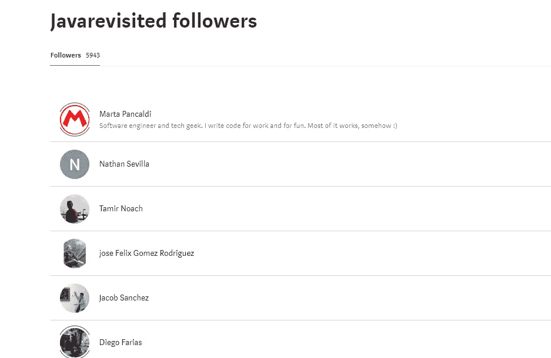

# 上个月最佳 last 访问文章

> 原文：<https://medium.com/javarevisited/best-of-javarevisited-july-2020-939bbb9b03e4?source=collection_archive---------2----------------------->

大家好，是时候重温一下上个月 Javarevisited publication 的最佳故事和最受欢迎的文章了。7 月是一份出版物的浏览量和读者人数最多的一个月，从上面的统计页面可以看出，浏览量和读者人数都超过了 40 万。

越来越多的人加入我们，我们现在也有了另一位编辑来帮助你，请欢迎我们自己的作者之一达里奥·德·森蒂斯峰，他同意帮助出版物发展。

追随者的数量现在非常接近**的 6K** 这很好，这是最新的统计数据:

# 上个月最佳 last 访问文章

现在，让我们来看看上个月基于读者群、观点和普遍受欢迎程度的 10 篇最佳文章。

## [每个程序员和软件开发人员都应该读的 6 本编码书](/javarevisited/6-coding-books-every-programmers-and-software-developers-should-read-620124886c8f) by [javinpaul](https://medium.com/u/bb36d8439904?source=post_page-----939bbb9b03e4--------------------------------)

这是本月阅读量最大的一篇文章，浏览量超过 14.7 万，有点像病毒一样。你可以看到两座塔，那是因为这篇文章。我认为这篇文章的成功之处在于，在发表之后，我把它提交给了 Reddit、HackerNews、Flipboard 和一些脸书的团体，从那里开始，它开始腾飞。也许你也可以在你的下一篇文章中尝试这种方法，看看是否有效。

 [## 每个程序员和软件开发人员都应该阅读的 6 本编码书

### 编码是编程不可或缺的一部分，我们都以某种方式通过到处学习例子来学习编码…

medium.com](/javarevisited/6-coding-books-every-programmers-and-software-developers-should-read-620124886c8f) 

## [Java 中的微优化。String.equals()](/javarevisited/micro-optimizations-in-java-string-equals-22be19fd8416)

这是一篇由我们的新作者 [Dmytro Dumanskiy](https://medium.com/u/acd4d4d667cc?source=post_page-----939bbb9b03e4--------------------------------) 写的文章，点击量真的超过了 5000 次，祝贺他。

 [## Java 中的微优化。字符串.等于()

### 大家好，

medium.com](/javarevisited/micro-optimizations-in-java-string-equals-22be19fd8416) 

## [干净的架构——开发者必读的软件设计书籍](/javarevisited/clean-architecture-a-must-read-software-design-book-for-developers-41189b8ca122)

这是我的文章的另一部分，在那里我评论了鲍勃叔叔的经典干净建筑书，超过 27k 的读者阅读了这篇文章。

 [## 干净的架构——开发者必读的软件设计书籍

### 大家好，今天，我非常兴奋地谈论另一本有用的软件架构书(干净的架构:A…

medium.com](/javarevisited/clean-architecture-a-must-read-software-design-book-for-developers-41189b8ca122) 

## [Java 15 有什么期待](/javarevisited/what-to-expect-in-java-15-a62d0033beb9)

简要介绍即将发布的 Java 版本的新特性。另一篇文章来自我们的新作者[蓝迪·萨钦塔·纳亚那吉斯](https://medium.com/u/f9701fa97155?source=post_page-----939bbb9b03e4--------------------------------)，恭喜他。超过 6K 人阅读

 [## Java 15 有什么值得期待的

### 简要介绍即将发布的 Java 版本中的新特性

medium.com](/javarevisited/what-to-expect-in-java-15-a62d0033beb9) 

## [Spring Boot 双因素认证](/javarevisited/spring-boot-two-factor-authentication-78e00aa10176)

这是 Amr Khaled 的另一篇关于 JWT 和认证应用的文章，他的春季文章在上个月和这个月都做得很好。这个有超过 25000 的浏览量。

 [## Spring Boot 双因素认证

### JWT 和认证器应用

medium.com](/javarevisited/spring-boot-two-factor-authentication-78e00aa10176) 

## [2020 年成为 FullStack Web 开发者的 10 大在线课程](/javarevisited/top-10-online-courses-to-become-a-fullstack-web-developer-in-2020-d608a6b63232)

这是我的另一篇文章，分享了成为全栈 web 开发人员的有用课程。超过 15K 人阅读。

 [## 2020 年成为全栈网络开发者的 10 大在线课程

### 大家好，如果你想学习 Web 开发或在 2020 年成为一名全栈 Web 开发人员，那么你已经来到了…

medium.com](/javarevisited/top-10-online-courses-to-become-a-fullstack-web-developer-in-2020-d608a6b63232) 

## [JWT 和使用 Spring Boot 的社会认证](/javarevisited/jwt-and-social-authentication-using-spring-boot-90e4faaa9204)

这是另一篇由 Amr Khaled[撰写的精彩文章，获得了大约 75000 的浏览量。](https://medium.com/u/a0e9fafab843?source=post_page-----939bbb9b03e4--------------------------------)

 [## JWT 和使用 Spring Boot 的社会认证

### 本文是关于如何实现 JSON Web 令牌(JWT)认证并将其与脸书集成的指南…

medium.com](/javarevisited/jwt-and-social-authentication-using-spring-boot-90e4faaa9204) 

## [使用服务器发送的事件和 Redis 构建可伸缩的类似脸书的通知](/javarevisited/building-scalable-facebook-like-notification-using-server-sent-event-and-redis-9d0944dee618)

 [## 使用服务器发送的事件和 Redis 构建可伸缩的类似脸书的通知

### 有时，我们希望服务器通知客户端发生的变化。这在传统的……

medium.com](/javarevisited/building-scalable-facebook-like-notification-using-server-sent-event-and-redis-9d0944dee618) 

## [如何在 Java 中创建不可变的列表、集合和映射？](/javarevisited/how-to-create-an-immutable-list-list-and-map-in-java-5ac1254c128)

每个 Java 开发人员都应该知道的 Java 9 特性

 [## 如何在 Java 中创建一个不可变的列表、列表和映射？

### 每个 Java 开发人员都应该知道的 Java 9 特性

medium.com](/javarevisited/how-to-create-an-immutable-list-list-and-map-in-java-5ac1254c128) 

## [2020 年学习 Spring 框架的 10 个最佳在线课程](/javarevisited/10-best-online-courses-to-learn-spring-framework-in-2020-f7f73599c2fd)

学习 Spring 框架、Spring Boot、Spring 安全和 RESTful Web 服务的最佳在线课程

 [## 2020 年学习 Spring 框架的 10 个最佳在线课程

### 学习 Spring 框架、Spring Boot、Spring 安全和 RESTful Web 服务的最佳在线课程

medium.com](/javarevisited/10-best-online-courses-to-learn-spring-framework-in-2020-f7f73599c2fd) 

## [生产力融合方法](/javarevisited/fusing-methods-for-productivity-c15c9eb2d666)

由[唐纳德·拉布](https://medium.com/u/df39b86e9f04?source=post_page-----939bbb9b03e4--------------------------------)撰写的一篇文章的精华，值得一读。

 [## 提高生产率的融合方法

### 当一个迭代模式如此普遍时，你给它一个名字。

medium.com](/javarevisited/fusing-methods-for-productivity-c15c9eb2d666) 

## [阿帕奇卡夫卡简介](/javarevisited/a-brief-introduction-to-apache-kafka-25a4ab386f4b)

我们的新编辑达里奥·德·森蒂斯峰[对阿帕奇·卡夫卡平台的一点概述](https://medium.com/u/16b3e1182e6b?source=post_page-----939bbb9b03e4--------------------------------)

 [## 阿帕奇卡夫卡简介

### Apache Kafka 平台概述

medium.com](/javarevisited/a-brief-introduction-to-apache-kafka-25a4ab386f4b) 

那都是男生。如果你喜欢这些文章，不要忘记分享。如果你想以作者或编辑的身份投稿 join，我们的目标是给故事更多的曝光，特别是来自 Java 开发者的。

祝贺所有的作者，欢迎所有新的作者和读者。