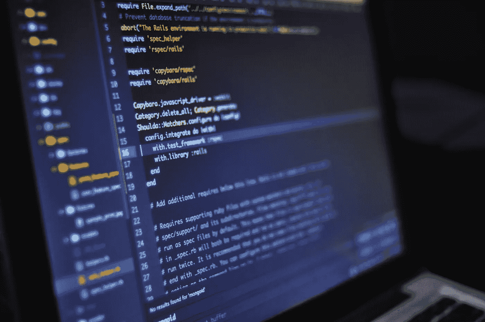

# 2021 年最值得学习的编程语言

> 原文：<https://medium.com/javarevisited/best-programming-languages-to-learn-in-2021-215244e8a1b3?source=collection_archive---------1----------------------->

路易斯·戈麦斯达[佩克斯](https://www.pexels.com/it-it/foto/computer-portatile-nero-e-grigio-546819/?utm_content=attributionCopyText&utm_medium=referral&utm_source=pexels)

如果你是软件开发领域的新手，学习编程最困难的部分是决定从哪里开始。广泛使用的编程语言有数百种，每一种都有自己的复杂性和特点。

好消息是，当你开始作为一名[软件开发人员](/javarevisited/6-coding-books-every-programmers-and-software-developers-should-read-620124886c8f)的旅程时，你将开始发现哪种编程语言最适合你…