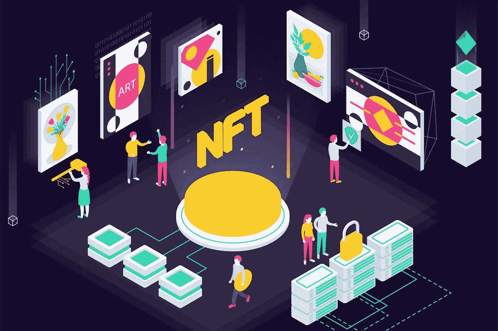

# 最好的 Udemy 课程，学习如何创建 NFT 和赚钱

> 原文：<https://medium.com/javarevisited/best-udemy-courses-to-learn-how-to-create-nft-and-make-money-cac5b6ab905a?source=collection_archive---------3----------------------->

## Udemy 上的最佳课程，学习关于 NFT 的一切:它们如何工作，如何创建它们，以及如何销售它们。

NFT 是一种数字资产，代表现实世界的对象，如艺术、音乐、游戏中的项目和视频。它们经常通过加密货币在网上买卖。