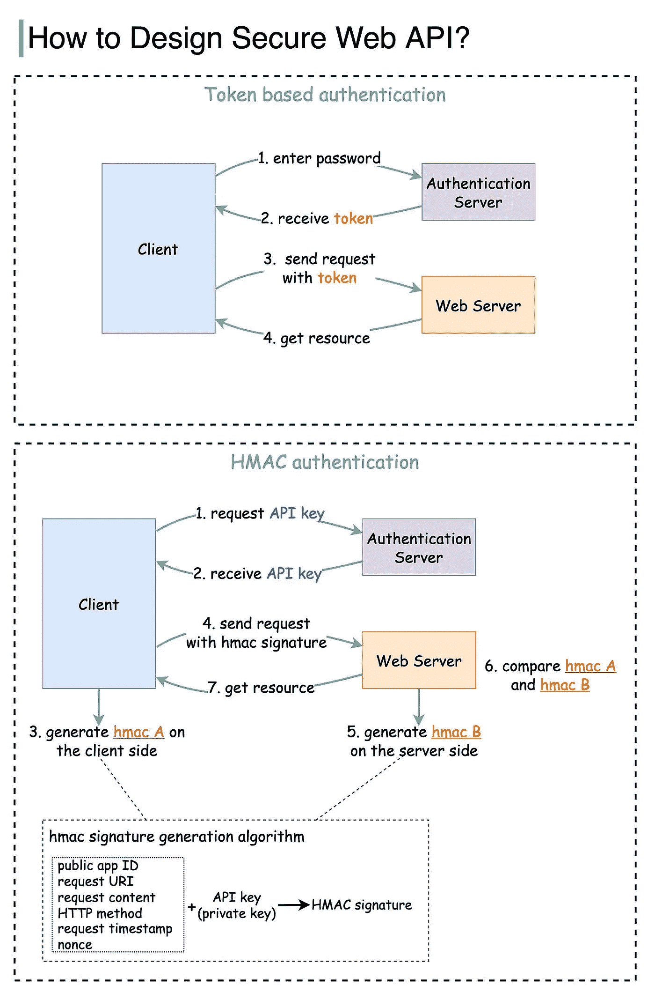
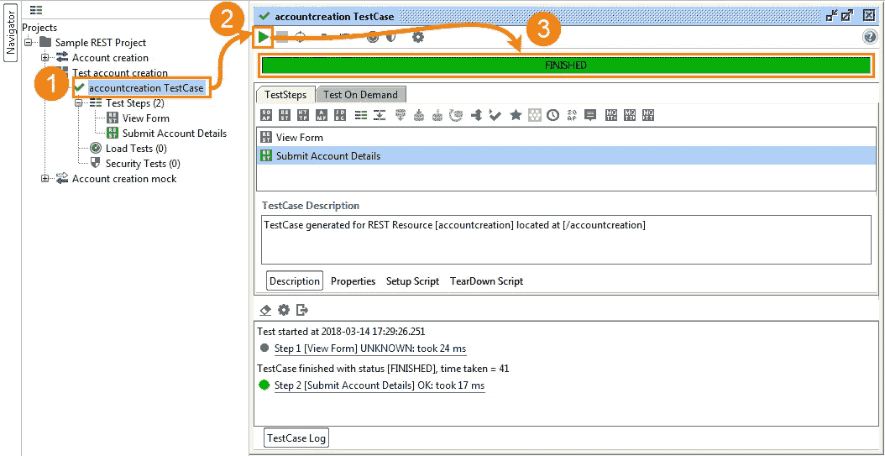
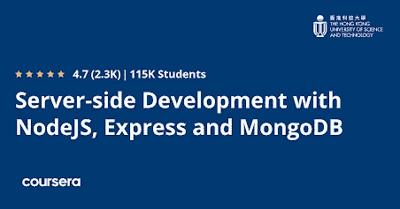
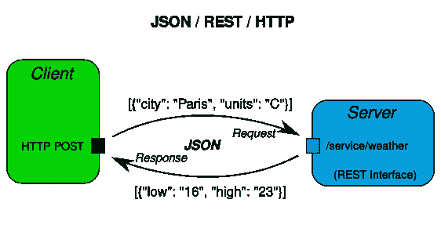

# 2023 年面向初学者的 5 门最佳 Web API 设计与开发课程

> 原文：<https://medium.com/javarevisited/best-web-api-design-and-development-courses-for-beginners-fb1c8dd83379?source=collection_archive---------0----------------------->

## 这是我最喜欢的在线课程，学习 web API 以及如何在 2023 年为初学者和有经验的开发者设计和开发 Web API。

image_credit — bytebytego

大家好，如果你想学习 web API 设计和开发，并寻找最好的资源，如在线课程、培训班和教程，那么你来对地方了。今天是 API 的世界，你需要连接许多 API，如支付、认证和存储来创建一个应用程序，因此 API 知识对成为一名 web 开发人员有很大帮助。

早些时候，我已经分享了学习 Spring 和[**RESTful web services**](/javarevisited/top-5-books-and-courses-to-learn-restful-web-services-in-java-using-spring-mvc-and-spring-boot-79ec4b351d12?source=---------17------------------)的 [**最佳课程，在这篇文章中，我将分享学习 API 开发的在线课程。应用程序编程接口，通常称为 API，用作应用程序之间的通信源。**](/javarevisited/10-best-online-courses-to-learn-spring-framework-in-2020-f7f73599c2fd)

通过使用 API，一个应用程序的功能或服务可以在另一个应用程序中使用。API 开发已经成为现代应用程序开发不可或缺的一部分。今天，没有 API，一个成熟的应用程序是不完整的。

对熟练的 API 开发者有巨大的需求。API 可以使用不同的语言开发，比如 JavaScript 和 Java。理解 API 及其工作有点复杂，尤其是对于初学者。有不同类型的 API，RESTful 和 [SOAP](/javarevisited/10-best-java-web-services-rest-soap-and-api-courses-for-beginners-724a8f51298d) 是最流行的。

本文将列出前五门课程，帮助你理解和学习不同类型的 API 和 API 开发。这些是来自像 Coursera、Udemy 和 Pluralsight 这样的网站的最好的课程，是由像 Bharat Thippireddy 这样的专家创建的。

我还加入了在线课程，学习使用 Python、JavaScript 和 Java 编程语言(应用程序开发编程语言的三巨头)进行 API 开发。你可以参加根据你的经验最适合你的课程。

# 2023 年学习 REST 和 SOAP 等 API 开发的 5 门最佳在线课程

在不浪费你更多时间的情况下，这里列出了 2023 年你可以加入学习 API 开发的最佳在线课程。这些是 Udemy、Coursera 和 Pluralsight 提供的学习 API 开发的最佳课程，如 REST API、SOAP APIs 以及 Web API。

## [1。REST APIs 与 Flask 和 Python — Udemy](https://click.linksynergy.com/deeplink?id=CuIbQrBnhiw&mid=39197&murl=https%3A%2F%2Fwww.udemy.com%2Fcourse%2Frest-api-flask-and-python%2F)

如果你想学习使用 python 进行 REST API 开发，那么这个课程是最好的选择。这是 Udemy 上最畅销的 API 开发课程。在本课程中，讲师将重点介绍如何使用流行的编程语言 Python 构建 REST APIs。

此外，除了 Python 之外，讲师还使用 Flask 框架，这是 Python 开发人员学习的一个很好的最小 web 开发框架。

需求
Python 的基础知识。

您将学习如何创建 REST APIS、将应用程序(web 和移动)与数据库和服务器连接、认证等。本课程的总视频内容为 17 个小时，这是一个初级课程。

**这里是加入本课程的链接** — [使用 Flask 和 Python 的 REST API—Udemy](https://click.linksynergy.com/deeplink?id=CuIbQrBnhiw&mid=39197&murl=https%3A%2F%2Fwww.udemy.com%2Fcourse%2Frest-api-flask-and-python%2F)

## 2.[使用 soap ui+实时项目进行 WebServices/Rest API 测试](https://click.linksynergy.com/deeplink?id=CuIbQrBnhiw&mid=39197&murl=https%3A%2F%2Fwww.udemy.com%2Fcourse%2Fwebservices-testing-with-soap-ui%2F)

本课程是 Udemy 最畅销的 API 自动化课程。讲师在本课程中很好地解释了 API、web 服务的含义以及它们之间的区别。本课程的重点是使用 SoapUI 测试 REST API。

要求
推荐 API 基础知识(可选)

在本课程中，讲师将解释可以在 REST API 上执行的不同类型的自动化。这是一个很长的课程，视频内容总计 19 个小时。这是一门初级课程。

**以下是加入本课程的链接—** [使用 soap ui+实时项目进行 WebServices/Rest API 测试](https://click.linksynergy.com/deeplink?id=CuIbQrBnhiw&mid=39197&murl=https%3A%2F%2Fwww.udemy.com%2Fcourse%2Fwebservices-testing-with-soap-ui%2F)

## 3.[使用 NodeJS、Express 和 MongoDB 进行服务器端开发](https://coursera.pxf.io/c/3294490/1164545/14726?u=https%3A%2F%2Fwww.coursera.org%2Fspecializations%2Ffull-stack-react)【Coursera】

这是 Coursera 上最畅销的 API 开发课程。它是全栈专业化的一部分。在本课程中，讲师将使用 Node.js、Express 和 MongoDB 进行服务器端开发。本课程的重点是使用 JavaScript 开发 REST APIs。

这是一门优秀的课程，因为这三项技术(Node.js、Express、MongoDB)是流行的 MEAN 和 MERN 堆栈的主要部分。这是一门中级课程。

要求
JavaScript 基础知识。

**这是加入本课程的链接** — [使用 NodeJS、Express 和 MongoDB 进行服务器端开发](https://coursera.pxf.io/c/3294490/1164545/14726?u=https%3A%2F%2Fwww.coursera.org%2Fspecializations%2Ffull-stack-react)

顺便说一下，除了单独加入这些课程和专业，你还可以加入 [**Coursera Plus**](https://coursera.pxf.io/c/3294490/1164545/14726?u=https%3A%2F%2Fwww.coursera.org%2Fcourseraplus) ，这是 Coursera 的一个订阅计划，让你可以无限制地访问他们最受欢迎的课程、专业、专业证书和指导项目，每月只需 59 美元。

 [## Coursera Plus |无限制访问 7，000 多门在线课程

### 用 Coursera Plus 投资你的职业目标。无限制访问 90%以上的课程、项目…

coursera.pxf.io](https://coursera.pxf.io/c/3294490/1164545/14726?u=https%3A%2F%2Fwww.coursera.org%2Fcourseraplus) 

## 4.[设计 RESTful Web API—plural sight](https://pluralsight.pxf.io/c/1193463/424552/7490?u=https%3A%2F%2Fwww.pluralsight.com%2Fcourses%2Fdesigning-restful-web-apis)

Pluralsight 有几门专门针对 API 开发的优秀课程。本课程是 Pluralsight 最受欢迎的 API 开发课程。在本课程中，您将学习如何为 web 和移动设备创建 RESTful APIs。讲师很好地解释了什么是 REST API 以及如何使用它们。

这是一个初学者级别的课程，视频内容总共两个小时，它将教你作为后端开发人员需要了解的关于 REST API 和 RESTful web 服务的一切。

要求
推荐 API 基础知识(可选)

**这是加入本课程的链接—** [设计 RESTful Web API—plural sight](https://pluralsight.pxf.io/c/1193463/424552/7490?u=https%3A%2F%2Fwww.pluralsight.com%2Fcourses%2Fdesigning-restful-web-apis)

顺便说一下，你需要一个 Pluralsight 会员才能参加这个课程，费用大约是每月 29 美元或每年 299 美元(14%的折扣)。我向所有程序员强烈推荐这个订阅，因为它提供了超过 7000 个在线课程的即时访问，以学习任何技术技能。或者，你也可以使用他们的 [**10 天免费试用**](https://pluralsight.pxf.io/c/1193463/424552/7490?u=https%3A%2F%2Fwww.pluralsight.com%2Fpricing%2Ffree-trial) 免费观看这个课程。

 [## Pluralsight |个人免费试用

### 立即开始免费试用 Pluralsight！查看我们为个人和团队提供的服务，如果您不确定…

pluralsight.pxf.io](https://pluralsight.pxf.io/c/1193463/424552/7490?u=https%3A%2F%2Fwww.pluralsight.com%2Fpricing%2Ffree-trial) 

## 5. [Java Web 服务— Udemy](https://click.linksynergy.com/deeplink?id=JVFxdTr9V80&mid=39197&murl=https%3A%2F%2Fwww.udemy.com%2Fcourse%2Fjava-web-services%2F)

udemy 上的另一个畅销书，这个课程是为那些想学习 web 服务和 Java API 开发的人准备的。在本课程中，讲师将解释如何从头开始设计和开发 SOAP 和 REST APIs。本课程中的所有内容都有详细介绍。

要求
Java 基础知识

这是一个很长的课程，总共有十七个小时的视频内容。这是一门初级课程，但同时也是学习 Java API 和 web 服务开发的最佳和最全面的课程。

如果你是一名 Java 开发人员，并且想了解 REST 和 SOAP web 服务以及如何用 Java 实现它们，那么这是一门非常适合你的课程，我强烈推荐这门课程。

**这是参加本课程** — [Java Web 服务](https://click.linksynergy.com/deeplink?id=JVFxdTr9V80&mid=39197&murl=https%3A%2F%2Fwww.udemy.com%2Fcourse%2Fjava-web-services%2F)的链接

以上就是 2023 年**最佳新手 API 开发课程**。如前所述，API 开发是现代应用程序开发的重要组成部分。在本文中，我们为那些想了解 API 开发的人列出了五门精选课程。

这些课程都是从 Udemy、Coursera 等顶级教育网站上精挑细选出来的。逐一过一遍，根据自己的要求选择。

您可能想探索的其他**编程资源文章**

*   [2023 年要学的 10 门高级 Java 课程](https://javarevisited.blogspot.com/2020/04/top-10-advanced-core-java-courses-for-experienced-developers.html)
*   [面向 Java 开发者的 5 门免费 Spring 框架课程](http://www.java67.com/2017/11/top-5-free-core-spring-mvc-courses-learn-online.html)
*   [与 Spring Boot 学习微服务的 5 大课程](https://javarevisited.blogspot.com/2018/02/top-5-spring-microservices-courses-with-spring-boot-and-spring-cloud.html#axzz6JJFPbsyP)
*   [编程/编码工作面试 10 门课程](http://javarevisited.blogspot.sg/2018/02/10-courses-to-prepare-for-programming-job-interviews.html)
*   [深入学习 Spring 的 5 大课程](https://javarevisited.blogspot.com/2018/06/top-6-spring-framework-online-courses-Java-programmers.html)
*   [5 门免费学习核心 Java 的在线课程](http://javarevisited.blogspot.sg/2017/11/top-5-free-java-courses-for-beginners.html#axzz4zuIICRs9)
*   [面向有经验的 Java 开发人员的 5 大 Java 设计模式课程](http://javarevisited.blogspot.sg/2018/02/top-5-java-design-pattern-courses-for-developers.html)
*   [面向 Java 开发人员的 10 门高级 Spring Boot 课程](/javarevisited/10-advanced-spring-boot-courses-for-experienced-java-developers-5e57606816bd)
*   [初学者学习 Spring Cloud 的 5 大课程](https://javarevisited.blogspot.com/2018/04/top-5-spring-cloud-courses-for-java.html)
*   [2023 年学习 Web 开发的 5 门课程](http://javarevisited.blogspot.sg/2018/02/top-5-online-courses-to-learn-web-development.html#axzz57wed1PWd)
*   [学习正则表达式的前 5 门课程](https://javarevisited.blogspot.com/2020/04/top-5-courses-to-learn-regular-expression-regex.html)
*   [学习 Java 微服务的 7 大课程](/javarevisited/top-5-courses-to-learn-microservices-in-java-and-spring-framework-e9fed1ba804d)
*   [学习 learn Shell 脚本的 5 门课程](http://javarevisited.blogspot.sg/2018/02/5-courses-to-learn-shell-scripting-in-linux.html)
*   为 Java 开发人员提供的 10 个免费 Spring Boot 教程和课程

感谢您阅读本文。如果你喜欢这些*高级 Java 课程，*那么请与你的朋友和同事分享。如果您有任何问题或反馈，请留言。

**P. S.** —如果你是 web 开发和 API 开发的新手，并且正在寻找一些免费的在线课程来开始学习用 Java 进行 REST API 开发，那么你也可以在 Udemy 上查看这个 [**Spring REST API for 初学者【免费】**](https://click.linksynergy.com/deeplink?id=CuIbQrBnhiw&mid=39197&murl=https%3A%2F%2Fwww.udemy.com%2Fcourse%2Fspring-rest-api-for-beginners%2F) 课程。

 [## 2023 年有经验的开发人员学习使用 Spring 的 Learn RESTful Web 服务的前 5 门课程

### 在上一篇文章中，我已经分享了一些用 Spring 框架学习微服务开发的课程，今天…

javarevisited.blogspot.com](https://javarevisited.blogspot.com/2018/02/top-5-restful-web-services-with-spring-courses-for-experienced-java-programmers.html)